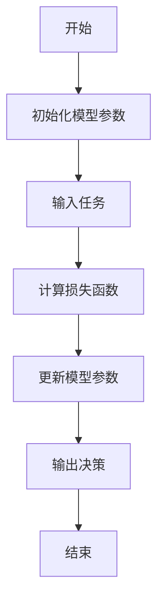
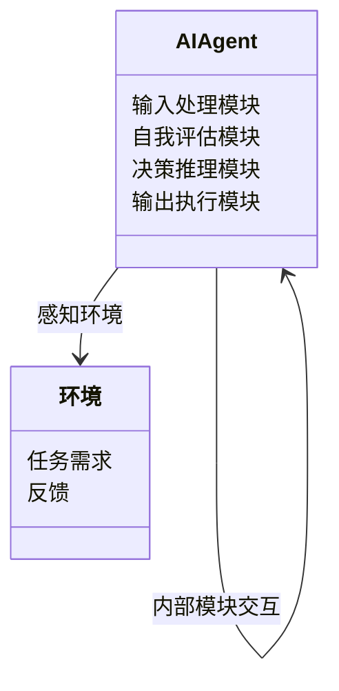
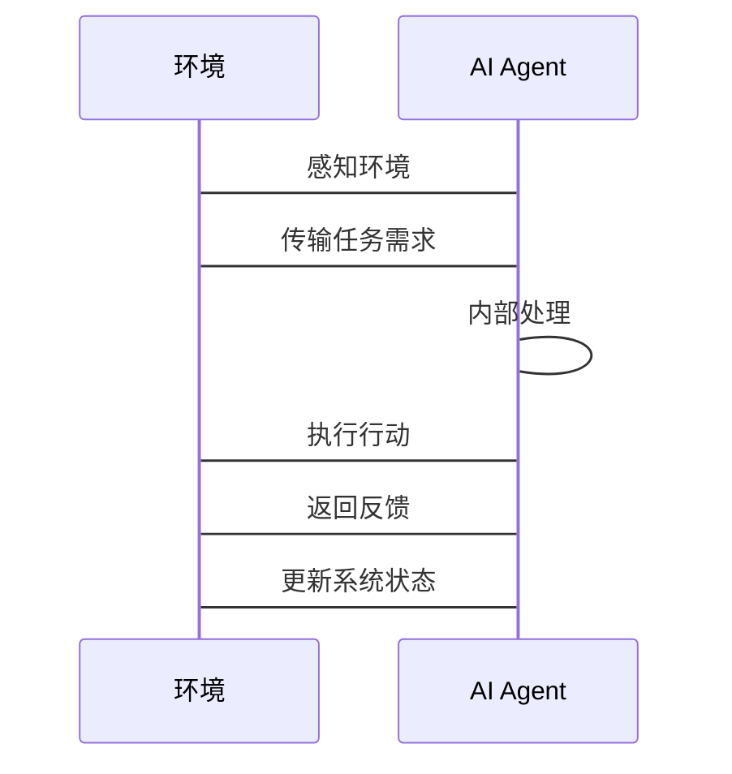

                 


# 元认知AI：具有自我评估能力的AI Agent

> 关键词：元认知AI，自我评估，AI Agent，元学习，自适应推理

> 摘要：元认知AI是一种能够自我评估和优化的AI Agent，通过元学习和自适应推理能力，能够在复杂环境中自主调整策略，提升任务执行效率和准确性。本文将深入探讨元认知AI的核心概念、算法原理、系统架构，并通过实际案例展示其应用场景和实现方法。

---

## 第一部分：元认知AI的背景与核心概念

### 第1章：元认知AI的定义与背景

#### 1.1 元认知AI的定义
- **元认知AI的基本概念**：元认知AI是一种具有自我评估能力的AI Agent，能够通过内部监控和分析自身的推理过程和结果，动态调整其行为策略。
- **与传统AI的区别**：传统AI依赖于外部反馈进行优化，而元认知AI能够主动评估自身的推理过程和结果，无需完全依赖外部反馈。
- **元认知AI的重要性**：在复杂和动态的环境中，元认知AI能够更高效地适应变化，减少对外部反馈的依赖，提升任务执行的效率和准确性。

#### 1.2 元认知AI的核心要素
- **自我评估机制**：元认知AI能够实时监控和评估自身的推理过程和结果，识别错误或不足，并进行相应的调整。
- **动态调整策略**：基于自我评估的结果，元认知AI能够动态调整其行为策略，优化任务执行过程。
- **元学习能力**：元认知AI能够通过元学习算法，快速适应新的任务和环境，提升自身的泛化能力和迁移能力。

#### 1.3 元认知AI的边界与外延
- **适用范围**：元认知AI适用于需要动态调整和自适应的复杂任务，如自动驾驶、智能客服、智能推荐系统等。
- **局限性**：元认知AI的自我评估能力依赖于算法的设计和数据的质量，目前在处理极端复杂和不确定的环境时仍存在一定的局限性。
- **与其他AI技术的关系**：元认知AI可以与其他AI技术（如强化学习、深度学习）结合，形成更强大的AI系统。

---

### 第2章：元认知AI的核心概念与联系

#### 2.1 元认知AI的核心原理
- **元学习机制**：元学习是元认知AI的核心原理之一，通过学习如何学习，元认知AI能够在不同任务之间共享知识和经验，快速适应新任务。
- **自适应推理过程**：元认知AI通过自适应推理，能够在动态环境中灵活调整推理策略，确保推理过程的有效性和准确性。
- **多层评估体系**：元认知AI采用多层评估体系，从低层次的推理结果评估到高层次的策略优化评估，确保评估的全面性和深度。

#### 2.2 元认知AI的核心概念对比表
| **核心概念** | **传统AI** | **元认知AI** |
|--------------|------------|--------------|
| 自我评估     | 无         | 有           |
| 动态调整     | 依赖外部反馈 | 主动调整      |
| 知识迁移     | 有限       | 强大          |

#### 2.3 元认知AI的ER实体关系图
```mermaid
erDiagram
    agent : AI Agent
    environment : 环境
    task : 任务
    self_assessment : 自我评估
    decision : 决策
    action : 行动
    feedback : 反馈

    agent --> environment: 感知环境
    environment --> task: 生成任务
    agent --> self_assessment: 自我评估
    self_assessment --> decision: 生成决策
    decision --> action: 执行行动
    action --> feedback: 获取反馈
```

---

## 第二部分：元认知AI的算法原理

### 第3章：元认知AI的算法原理

#### 3.1 元学习算法
- **元学习的基本概念**：元学习是一种通过学习如何学习的方法，能够在少量数据上快速适应新任务。
- **元学习的数学模型**：元学习的目标函数通常表示为：
  $$\text{元学习目标函数} = \argmin_{\theta} \sum_{i=1}^{N} \mathcal{L}_i(\theta)$$
  其中，$\theta$ 表示模型参数，$\mathcal{L}_i$ 表示第 $i$ 个任务的损失函数。
- **元学习算法的实现步骤**：
  1. 初始化模型参数 $\theta$。
  2. 对于每个任务 $i$，计算损失 $\mathcal{L}_i(\theta)$。
  3. 更新模型参数 $\theta$ 以最小化总体损失。

#### 3.2 自适应推理算法
- **自适应推理的基本原理**：自适应推理是一种动态调整推理过程的方法，能够根据环境变化和任务需求实时调整推理策略。
- **自适应推理的数学模型**：自适应推理的目标函数通常表示为：
  $$\text{自适应推理目标函数} = \argmin_{\theta} \sum_{i=1}^{N} \mathcal{L}_i(\theta) + \lambda \mathcal{R}(\theta)$$
  其中，$\mathcal{R}(\theta)$ 表示正则化项，$\lambda$ 表示正则化系数。
- **自适应推理算法的实现步骤**：
  1. 初始化模型参数 $\theta$。
  2. 计算损失函数 $\mathcal{L}_i(\theta)$。
  3. 根据环境反馈调整 $\theta$，以优化推理过程。

#### 3.3 元认知AI的算法实现


#### 3.4 元认知AI的Python实现示例
```python
import torch

def meta_learning_algorithm(model, optimizer, tasks):
    for task in tasks:
        optimizer.zero_grad()
        # 计算损失
        loss = model.compute_loss(task)
        # 反向传播
        loss.backward()
        optimizer.step()
    return model

# 示例用法
model = MetaLearningModel()
optimizer = torch.optim.Adam(model.parameters(), lr=0.001)
tasks = [task1, task2, task3]
meta_learning_algorithm(model, optimizer, tasks)
```

---

### 第4章：元认知AI的数学模型与公式

#### 4.1 元学习的数学模型
- 元学习的目标函数：
  $$\argmin_{\theta} \sum_{i=1}^{N} \mathcal{L}_i(\theta)$$
- 元学习的优化函数：
  $$\argmin_{\theta} \sum_{i=1}^{N} \mathcal{L}_i(\theta) + \lambda \mathcal{R}(\theta)$$

#### 4.2 自适应推理的数学公式
- 自适应推理的目标函数：
  $$\argmin_{\theta} \sum_{i=1}^{N} \mathcal{L}_i(\theta) + \lambda \mathcal{R}(\theta)$$
- 自适应推理的更新规则：
  $$\theta_{t+1} = \theta_t - \eta \nabla_{\theta} \left( \sum_{i=1}^{N} \mathcal{L}_i(\theta) + \lambda \mathcal{R}(\theta) \right)$$

---

## 第三部分：元认知AI的系统分析与架构设计

### 第5章：系统分析与架构设计

#### 5.1 问题场景介绍
- 元认知AI系统需要在复杂和动态的环境中运行，能够实时监控和评估自身的推理过程，并根据评估结果动态调整策略。

#### 5.2 系统功能设计
- **输入处理模块**：接收环境输入并解析任务需求。
- **自我评估模块**：监控和评估推理过程和结果。
- **决策推理模块**：基于评估结果生成决策。
- **输出执行模块**：根据决策执行行动并输出结果。

#### 5.3 系统架构设计


#### 5.4 系统接口设计
- **输入接口**：接收环境输入和任务需求。
- **输出接口**：输出决策和行动结果。
- **反馈接口**：接收环境反馈并更新系统状态。

#### 5.5 系统交互序列图


---

## 第四部分：项目实战

### 第6章：项目实战

#### 6.1 环境安装
- 安装必要的依赖库：
  ```bash
  pip install torch numpy matplotlib
  ```

#### 6.2 系统核心实现
```python
class MetaLearningAI:
    def __init__(self, model):
        self.model = model
        self.optimizer = torch.optim.Adam(model.parameters(), lr=0.001)
    
    def compute_loss(self, task):
        # 根据任务计算损失
        pass
    
    def update_model(self, task):
        self.optimizer.zero_grad()
        loss = self.compute_loss(task)
        loss.backward()
        self.optimizer.step()
    
    def evaluate(self, task):
        # 评估推理过程和结果
        pass
    
    def adapt(self, feedback):
        # 根据反馈调整模型参数
        pass
```

#### 6.3 代码应用解读与分析
- **代码实现**：上述代码展示了元认知AI的核心实现，包括模型的初始化、损失计算、模型更新以及评估和自适应调整过程。
- **代码分析**：通过代码实现可以看出，元认知AI能够根据任务需求动态调整模型参数，实现自适应推理。

#### 6.4 实际案例分析
- **案例描述**：在自动驾驶场景中，元认知AI能够实时评估自身的路径规划和决策过程，并根据环境反馈动态调整策略，确保行驶安全和效率。
- **案例分析**：通过具体案例分析，展示了元认知AI在复杂环境中的优势和实际应用价值。

#### 6.5 项目小结
- 本项目通过实际案例展示了元认知AI的实现和应用，验证了其在复杂环境中的自适应能力和优化效果。

---

## 第五部分：总结与展望

### 第7章：总结与展望

#### 7.1 最佳实践
- **算法选择**：根据具体任务需求选择合适的元学习和自适应推理算法。
- **系统设计**：在系统设计中充分考虑模块之间的交互和数据流，确保系统的高效性和可扩展性。

#### 7.2 小结
- 元认知AI通过自我评估和动态调整策略，能够在复杂环境中高效地执行任务，具有重要的研究和应用价值。

#### 7.3 注意事项
- 在实际应用中，需要注意元认知AI的自我评估能力的准确性和实时性，确保系统的稳定性和可靠性。

#### 7.4 拓展阅读
- 推荐阅读相关领域的经典论文和书籍，深入了解元学习和自适应推理的最新研究进展。

---

## 作者信息

作者：AI天才研究院/AI Genius Institute & 禅与计算机程序设计艺术 /Zen And The Art of Computer Programming

