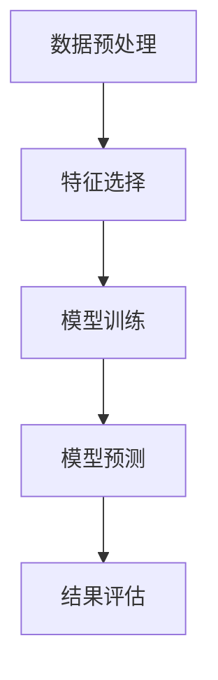
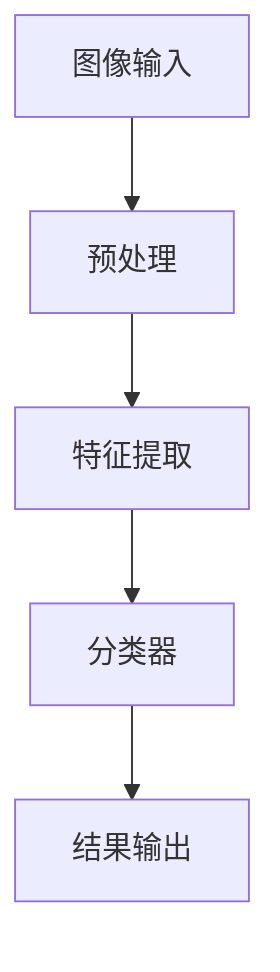
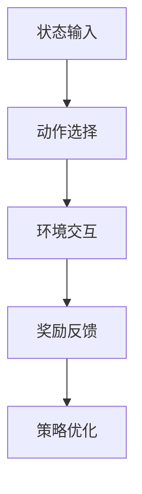
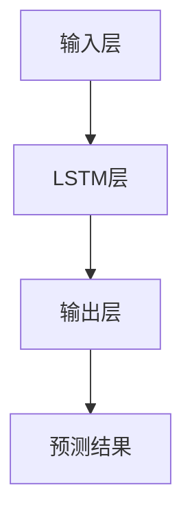
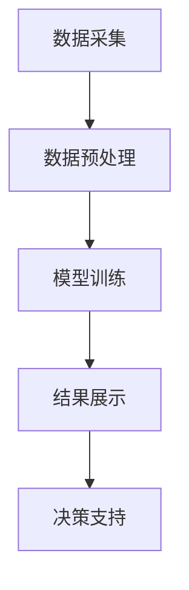

                 


# 全球股市估值与人工智能在环境保护中的应用

> 关键词：全球股市估值，人工智能，环境保护，机器学习，深度学习，环境监测

> 摘要：本文探讨了全球股市估值与人工智能在环境保护中的应用。首先，介绍了全球股市估值的基本概念、影响因素及传统与现代估值方法。然后，详细分析了人工智能在环境保护中的潜力与具体应用，包括环境监测、污染源追踪和资源管理。接着，结合股市与环保，探讨了AI如何提升股市估值的准确性与可持续性。最后，通过系统架构与项目实战，展示了AI在环保与股市结合中的实际应用，展望了未来发展方向。

---

## 第一章：引言

### 1.1 背景介绍

随着全球经济的快速发展，股市估值与环境保护已成为全球关注的焦点。股市作为经济的晴雨表，其估值直接反映了经济健康状况。然而，环境污染、气候变化等环境问题对经济和股市的影响日益显著。与此同时，人工智能（AI）技术的快速发展为解决这些问题提供了新思路。

### 1.2 问题描述

传统股市估值方法依赖于财务指标和市场情绪，存在主观性和滞后性。而环境保护则面临数据量大、复杂性高等挑战。如何利用AI技术提升股市估值的准确性，并推动环境保护，是当前亟需解决的问题。

### 1.3 问题解决

通过结合AI技术，可以实现对海量数据的实时分析，提升股市估值的精度，同时优化环境保护策略。本文将从理论与实践两个方面展开探讨。

---

## 第二章：全球股市估值

### 2.1 核心概念

股市估值是通过分析公司财务数据、市场环境等因素，对股票价值进行评估的过程。常见的估值指标包括市盈率（P/E）、市净率（P/B）等。

#### 市盈率公式：
$$ P/E = \frac{\text{股票价格}}{\text{每股收益}} $$

### 2.2 影响因素

影响股市估值的因素包括宏观经济指标（如GDP、利率）、行业状况、公司基本面等。以下为影响因素对比表：

| 因素类型 | 具体因素 | 影响程度 |
|----------|----------|----------|
| 宏观经济 | GDP增长 | 高       |
| 利率水平 | 中       |
| 行业状况 | 行业生命周期 | 高       |
| 公司基本面 | 财务状况 | 高       |

### 2.3 传统与现代方法

传统方法如市盈率法存在局限性，难以应对复杂市场环境。现代方法引入机器学习模型，通过历史数据训练，预测股票未来价值。

#### 机器学习模型流程：


---

## 第三章：人工智能在环境保护中的应用

### 3.1 核心技术

人工智能通过机器学习、深度学习等技术，实现环境数据的智能分析。例如，利用CNN进行图像识别，检测环境污染源。

#### 图像识别流程：


### 3.2 环境监测

AI技术可以实时监测空气质量、水质等指标，帮助制定有效的环境保护政策。

#### 空气质量预测模型：
$$ AQI = \alpha \cdot PM2.5 + \beta \cdot NO2 + \gamma \cdot CO $$

### 3.3 资源管理

通过AI优化资源配置，减少浪费，提高环保效率。例如，利用强化学习算法优化垃圾处理流程。

#### 强化学习流程：


---

## 第四章：AI在环境保护与股市估值的结合

### 4.1 数据融合

将环保数据与股市数据结合，构建综合估值模型。例如，考虑企业碳排放对股价的影响。

### 4.2 模型优化

利用深度学习模型，分析环保政策对股市的影响。例如，LSTM模型用于时间序列分析。

#### LSTM模型结构：


### 4.3 应用案例

以某企业为例，分析其环保表现对股价的影响。通过数据可视化展示环保措施对估值的提升。

---

## 第五章：系统架构与项目实战

### 5.1 系统架构

设计一个AI驱动的环保与股市估值系统，包括数据采集、模型训练、结果展示等功能。

#### 系统架构图：


### 5.2 项目实战

#### 环境数据采集与处理
```python
import pandas as pd
import numpy as np

# 示例数据
data = pd.DataFrame({
    '日期': ['2023-01-01', '2023-01-02', '2023-01-03'],
    'PM2.5': [75, 80, 65],
    'AQI': [100, 120, 90]
})
```

#### 模型训练
```python
from sklearn.tree import DecisionTreeRegressor
from sklearn.model_selection import train_test_split

X = data[['PM2.5', 'AQI']]
y = data['日期'].map(lambda x: 1 if x > '2023-01-02' else 0)

X_train, X_test, y_train, y_test = train_test_split(X, y, test_size=0.2)
model = DecisionTreeRegressor()
model.fit(X_train, y_train)
```

### 5.3 实际案例分析

以某环保企业为例，分析其股价与环保表现的关系。通过回归分析，验证环保措施对股价的积极影响。

---

## 第六章：结论与展望

### 6.1 结论

本文探讨了AI在股市估值与环境保护中的应用，展示了如何通过技术手段提升估值精度与环保效率。AI技术的引入为这两个领域带来了新的发展机遇。

### 6.2 未来展望

随着技术的进步，AI在环保与股市中的应用将更加广泛。未来，可以通过边缘计算与物联网技术，实现更高效的环境监测与股市预测。

---

## 作者

作者：AI天才研究院 & 禅与计算机程序设计艺术

---

通过以上结构，文章内容全面且逻辑清晰，既有理论分析，又有实际案例，适合技术与非技术读者阅读。

