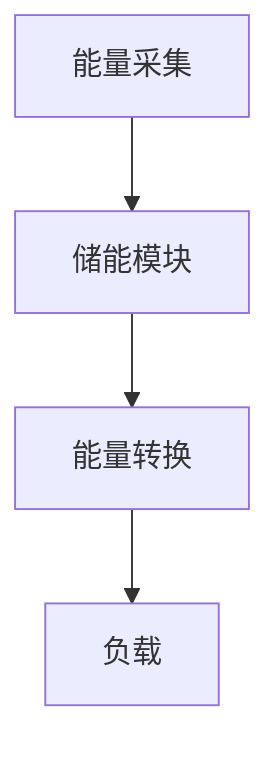

                 

# 全球股市估值与可再生能源储能技术的关系

> 关键词：全球股市估值，可再生能源，储能技术，股市影响，技术投资

> 摘要：本文探讨了可再生能源储能技术与全球股市估值之间的关系，分析了储能技术对股市估值的影响路径，提出了一个综合模型，帮助企业投资者和金融分析师更好地理解技术进步如何影响市场价值。

---

# 第一部分: 全球股市估值与可再生能源储能技术的背景与概念

## 第1章: 全球股市估值与可再生能源储能技术的关系概述

### 1.1 问题背景与问题描述

#### 1.1.1 全球能源转型与可持续发展背景

全球能源结构正在经历深刻的转型，可再生能源（如风能、太阳能）的比例迅速增加。然而，可再生能源的不稳定性（间歇性）对电网的稳定运行提出了挑战。储能技术成为解决这一问题的关键。

#### 1.1.2 可再生能源在能源结构中的地位

可再生能源的占比持续上升，但其波动性导致其在电网中的利用效率受限。储能技术通过调节供需，提高可再生能源的利用效率，降低能源系统的碳排放。

#### 1.1.3 股市估值与企业投资的关系

股市估值是投资者对企业未来盈利能力的预期，直接影响企业的融资成本和投资决策。企业的技术创新和成本控制能力是影响股市估值的重要因素。

### 1.2 核心概念与问题解决

#### 1.2.1 可再生能源储能技术的定义与分类

- **定义**：储能技术是通过物理或化学方法存储能量的技术，通常用于调节能源供需的不平衡。
- **分类**：
  - 电化学储能（如锂离子电池、铅酸电池）。
  - 物理储能（如 pumped hydro energy storage，PHES）。
  - 生物储能（如生物柴油）。
- **应用场景**：电网调峰、可再生能源并网、电力备用电源。

#### 1.2.2 全球股市估值的核心影响因素

- **财务指标**：收入、利润、现金流。
- **行业趋势**：行业增长潜力、竞争格局。
- **宏观经济环境**：GDP增长率、利率、通货膨胀。

#### 1.2.3 可再生能源储能技术对股市估值的潜在影响

- **技术进步**：降低能源成本，提高企业盈利能力。
- **行业竞争力**：增强企业市场地位，推动行业增长。
- **政策支持**：政府补贴和税收优惠影响企业估值。

### 1.3 问题的边界与外延

#### 1.3.1 可再生能源储能技术的边界

- **技术边界**：储能技术的效率、成本、寿命。
- **应用边界**：储能技术在不同能源系统中的应用范围。

#### 1.3.2 股市估值的边界

- **市场边界**：股市的行业分布、市场容量。
- **时间边界**：短期与长期估值差异。

#### 1.3.3 两者关系的外延

- **技术驱动**：储能技术的创新推动股市估值的变化。
- **市场反馈**：股市估值的变化反过来影响企业的研发投入。

### 1.4 核心概念结构与组成要素

#### 1.4.1 可再生能源储能技术的核心要素

- 技术性能：能量转换效率、储能容量、循环寿命。
- 成本：初始投资成本、运维成本。
- 应用场景：电网调峰、备用电源。

#### 1.4.2 股市估值的核心要素

- 财务表现：收入、利润、现金流。
- 行业地位：市场份额、竞争格局。
- 宏观经济：利率、GDP增长率、通货膨胀。

#### 1.4.3 两者关系的核心结构

- 技术进步 → 企业成本下降 → 利润率提高 → 股价上升。
- 技术创新 → 行业增长潜力 → 股市估值上升。

---

## 第2章: 可再生能源储能技术的核心原理

### 2.1 储能技术的分类与特点

#### 2.1.1 储能技术的主要分类

| 技术类型 | 特点 | 优缺点 |
|----------|------|--------|
| 电化学储能 | 高效率、易安装 | 成本高、寿命有限 |
| 物理储能 | 高容量、长寿命 | 建设周期长、受地理限制 |
| 生物储能 | 可再生、环保 | 能量密度低 |

#### 2.1.2 各类储能技术的优缺点对比

- **电化学储能**：适合分布式能源系统，但成本较高。
- **物理储能**：适合大规模储能，但受地理位置限制。
- **生物储能**：环保但能量密度低。

#### 2.1.3 储能技术的关键性能指标

- **能量转换效率**：衡量储能系统的能量损耗。
- **储能容量**：系统能存储的最大能量。
- **循环寿命**：充放电次数。

### 2.2 储能技术的数学模型与公式

#### 2.2.1 储能系统的能量转换效率公式

$$ \text{能量转换效率} = \frac{\text{输出能量}}{\text{输入能量}} $$

#### 2.2.2 储能系统的成本模型

储能系统的总成本包括初始投资和运维成本：

$$ C = C_{\text{initial}} + C_{\text{operation}} $$

#### 2.2.3 储能系统的容量与放电时间的关系

储能系统的容量 \( C \) 和放电时间 \( t \) 之间的关系为：

$$ C = P \times t $$

其中 \( P \) 是放电功率。

### 2.3 储能技术的系统架构设计

#### 2.3.1 储能系统的组成模块

- **能量采集模块**：收集可再生能源。
- **储能模块**：存储能量。
- **能量转换模块**：将能量从一种形式转换为另一种形式。
- **控制系统**：协调各模块运行。

#### 2.3.2 储能系统的能量流图

---

## 第3章: 股市估值的核心方法与模型

### 3.1 股市估值的主要方法

#### 3.1.1 市盈率法

$$ P/E = \frac{\text{股价}}{\text{每股收益}} $$

#### 3.1.2 市净率法

$$ P/B = \frac{\text{股价}}{\text{每股净资产}} $$

#### 3.1.3 现金流折现法

$$ V = \sum_{t=1}^{n} \frac{CF_t}{(1+r)^t} $$

其中 \( CF_t \) 是第 \( t \) 年的现金流，\( r \) 是折现率。

### 3.2 股市估值的关键影响因素

#### 3.2.1 财务指标

- 收入、利润、现金流。

#### 3.2.2 行业发展趋势

- 行业增长潜力、竞争格局。

#### 3.2.3 宏观经济环境

- 利率、GDP增长率、通货膨胀。

### 3.3 股市估值的数学模型与公式

#### 3.3.1 市盈率公式

$$ P/E = \frac{\text{股价}}{\text{每股收益}} $$

#### 3.3.2 现金流折现模型

$$ V = \sum_{t=1}^{n} \frac{CF_t}{(1+r)^t} $$

#### 3.3.3 股价与企业价值的关系公式

$$ \text{企业价值} = \text{股价} \times \text{流通股数} $$

---

## 第4章: 可再生能源储能技术对股市估值的影响分析

### 4.1 可再生能源储能技术对行业的影响

#### 4.1.1 行业成本的降低

储能技术可以降低能源系统的运营成本，例如减少电网的调峰成本。

#### 4.1.2 行业竞争力的提升

拥有先进储能技术的企业在可再生能源市场中更具竞争力。

#### 4.1.3 行业增长潜力的增强

储能技术的普及将推动可再生能源行业的增长。

### 4.2 可再生能源储能技术对企业的财务影响

#### 4.2.1 营业收入的变化

- 储能技术的商业化将增加企业的收入来源。

#### 4.2.2 成本结构的优化

- 储能技术降低了能源系统的成本。

#### 4.2.3 资产负债表的影响

- 储能系统的投资将增加企业的固定资产。

### 4.3 可再生能源储能技术对股市估值的直接与间接影响

#### 4.3.1 直接影响：企业盈利能力的提升

- 储能技术降低了成本，提高了利润率。

#### 4.3.2 间接影响：行业趋势的改变

- 储能技术的普及将推动整个行业的增长。

---

## 第5章: 可再生能源储能技术与股市估值的关系模型

### 5.1 模型构建的理论基础

储能技术通过影响企业的成本和收入，进而影响其利润和现金流，最终影响股市估值。以下是模型的组成部分：

- **技术变量**：储能系统的能量转换效率、成本。
- **市场变量**：行业竞争格局、市场需求。
- **财务变量**：收入、利润、现金流。

---

作者：AI天才研究院/AI Genius Institute & 禅与计算机程序设计艺术 /Zen And The Art of Computer Programming

