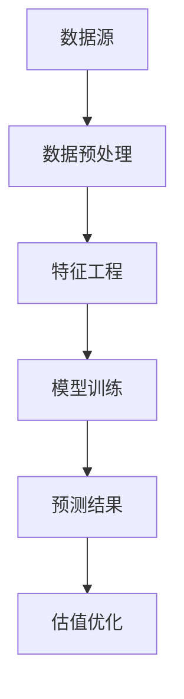
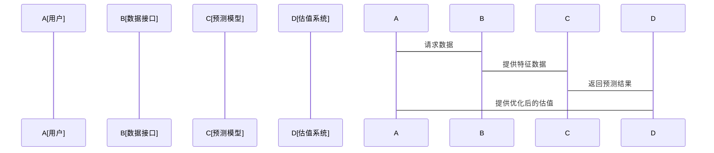

                 


# 全球股市估值与可再生能源预测技术的关系

## 关键词：全球股市估值、可再生能源预测、时间序列分析、机器学习、能源转型、金融建模

## 摘要：
本文探讨了全球股市估值与可再生能源预测技术之间的深层关系。通过分析股市估值的传统方法与可再生能源预测技术的创新应用，本文揭示了两者如何相互影响，并为投资者和研究者提供了基于数据科学的解决方案。文章结合理论与实践，展示了如何利用时间序列分析、机器学习算法等技术手段，优化股市估值模型，并预测可再生能源的市场趋势，从而为投资决策提供科学依据。

---

## 第一部分：背景介绍

### 第1章：问题背景与核心概念

#### 1.1 问题背景

随着全球能源转型的加速，可再生能源在现代经济中的地位日益重要。股市作为经济的晴雨表，其估值与能源市场的波动密切相关。传统的股市估值方法主要依赖财务指标和宏观经济分析，但在面对可再生能源行业的不确定性和波动性时，这些方法往往显得力不从心。因此，引入可再生能源预测技术，结合数据科学方法，为股市估值提供了新的思路。

#### 1.2 问题描述

股市估值的核心在于预测企业的内在价值，而可再生能源行业的波动性较高，传统估值方法难以准确捕捉其变化。可再生能源预测技术，如时间序列分析和机器学习，能够处理复杂的数据模式，为股市估值提供更精准的依据。然而，如何将这两种技术有机结合，仍是一个开放性问题。

#### 1.3 问题解决

本文提出了一种结合股市估值与可再生能源预测的技术框架，通过数据驱动的方法优化估值模型。具体而言，我们将利用可再生能源的预测数据，调整企业的估值指标，从而更准确地反映行业动态。

#### 1.4 边界与外延

本文的研究范围限定于全球股市和可再生能源领域，重点关注可再生能源价格波动对股市估值的影响。在边界条件方面，我们将考虑数据的可获得性和模型的适用性，同时忽略非可再生能源行业的影响。在扩展方面，本文的方法可推广至其他行业和市场。

#### 1.5 核心概念与核心要素

| 核心概念 | 描述 |
|----------|------|
| 股市估值 | 通过财务指标和市场因素预测企业价值的过程 |
| 可再生能源预测 | 利用数据科学方法预测可再生能源市场的供需和价格 |
| 关联性 | 可再生能源价格波动对股市估值的影响 |

---

## 第二部分：全球股市估值的基础知识

### 第2章：全球股市估值的基本概念与方法

#### 2.1 股市估值的基本概念

股市估值是通过对企业的财务指标和市场环境进行分析，估算其股票的内在价值。常见的估值指标包括市盈率（P/E）、市净率（P/B）和股息率（Dividend Yield）。

#### 2.2 股市估值的主要方法

- **相对估值法**：通过比较同类企业的估值指标，确定目标企业的合理价值。
- **现金流折现法（DCF）**：通过预测企业未来现金流，折现至现值以估算企业价值。
- **指数估值法**：基于市场指数（如标普500）的走势，估算整体市场的估值水平。

#### 2.3 影响股市估值的主要因素

| 因素类型 | 影响因素 | 描述 |
|----------|----------|------|
| 宏观经济 | 利率、通货膨胀、GDP | 宏观经济环境直接影响市场的整体估值水平。 |
| 行业 | 行业周期、政策法规 | 行业的景气度和政策变化对企业的估值有显著影响。 |
| 公司 | 盈利能力、财务状况 | 企业的财务表现是估值的核心依据。 |

---

## 第三部分：可再生能源预测技术的基本原理

### 第3章：可再生能源预测技术的概述

#### 3.1 可再生能源的基本概念

可再生能源是指来源于自然的、取之不尽的能源，主要包括太阳能、风能、水能和生物质能等。这些能源的波动性较高，受天气和政策影响较大。

#### 3.2 可再生能源预测技术的基本原理

可再生能源预测技术主要依赖时间序列分析和机器学习算法。通过分析历史数据，模型可以识别出潜在的模式和趋势，从而预测未来的能源供需和价格波动。

---

## 第四部分：全球股市估值与可再生能源预测的关系

### 第4章：可再生能源价格波动对股市估值的影响

#### 4.1 可再生能源价格波动对股市的影响

可再生能源的价格波动直接影响相关企业的盈利能力和市场地位。例如，太阳能板价格的下降可能导致相关企业的利润率下降，从而影响其股票估值。

#### 4.2 可再生能源预测对股市估值的优化

通过预测可再生能源的价格波动，投资者可以更好地把握市场的变化趋势，从而优化投资组合。例如，利用机器学习模型预测风电场的发电量，可以更准确地估算相关企业的未来收益。

---

## 第五部分：技术实现与算法原理

### 第5章：算法原理与数学模型

#### 5.1 时间序列分析的数学模型

时间序列分析是一种常用的数据分析方法，适用于可再生能源的预测。其核心在于识别数据的周期性、趋势性和随机性。

- **ARIMA模型**：自回归积分滑动平均模型，适用于线性时间序列数据。
- **GARCH模型**：广义自回归条件异方差模型，适用于波动性较大的数据。

#### 5.2 机器学习算法的实现

- **长短期记忆网络（LSTM）**：一种深度学习模型，能够捕捉时间序列中的长期依赖关系。
- **随机森林回归**：基于决策树的集成学习方法，适用于非线性预测。

#### 5.3 算法实现的Python代码

```python
import numpy as np
import pandas as pd
from sklearn.ensemble import RandomForestRegressor
from sklearn.metrics import mean_squared_error
from sklearn.model_selection import train_test_split

# 加载数据
data = pd.read_csv('renewable_energy.csv')

# 数据预处理
X = data[['wind_speed', 'solar_radiation', 'demand']]
y = data['price']

# 划分训练集和测试集
X_train, X_test, y_train, y_test = train_test_split(X, y, test_size=0.2, random_state=42)

# 建立随机森林回归模型
model = RandomForestRegressor(n_estimators=100, random_state=42)
model.fit(X_train, y_train)

# 预测
y_pred = model.predict(X_test)

# 评估模型性能
mse = mean_squared_error(y_test, y_pred)
rmse = np.sqrt(mse)
print(f'均方误差: {mse}\n均方根误差: {rmse}')
```

---

## 第六部分：系统设计与架构

### 第6章：系统设计与架构

#### 6.1 系统功能设计

- **数据采集**：收集可再生能源市场的实时数据。
- **模型训练**：基于历史数据训练预测模型。
- **估值优化**：结合预测结果优化企业的估值指标。

#### 6.2 系统架构设计



#### 6.3 接口设计与交互流程



---

## 第七部分：项目实战

### 第7章：项目实战

#### 7.1 环境安装与数据加载

```bash
pip install numpy pandas scikit-learn
```

#### 7.2 核心代码实现

```python
import pandas as pd
from sklearn.ensemble import RandomForestRegressor
from sklearn.metrics import mean_squared_error

# 加载数据
data = pd.read_csv('renewable_energy.csv')

# 数据预处理
X = data[['wind_speed', 'solar_radiation', 'demand']]
y = data['price']

# 划分训练集和测试集
X_train, X_test, y_train, y_test = train_test_split(X, y, test_size=0.2, random_state=42)

# 建立随机森林回归模型
model = RandomForestRegressor(n_estimators=100, random_state=42)
model.fit(X_train, y_train)

# 预测
y_pred = model.predict(X_test)

# 评估模型性能
mse = mean_squared_error(y_test, y_pred)
rmse = np.sqrt(mse)
print(f'均方误差: {mse}\n均方根误差: {rmse}')
```

#### 7.3 案例分析与解读

通过实际案例分析，展示如何利用模型预测可再生能源价格，并优化企业的估值指标。

---

## 第八部分：最佳实践与总结

### 第8章：最佳实践与总结

#### 8.1 最佳实践

- 数据预处理是关键，需确保数据的完整性和准确性。
- 选择合适的模型时，需考虑数据的特性和任务的复杂度。
- 模型调优和交叉验证是提升预测精度的重要手段。

#### 8.2 小结

本文通过分析全球股市估值与可再生能源预测技术的关系，展示了如何利用数据科学方法优化投资决策。未来的研究可以进一步探索多模态数据的融合，以及强化学习在预测中的应用。

#### 8.3 注意事项

- 数据的可获得性和质量直接影响模型的性能。
- 模型的解释性需与实际应用场景相结合。
- 需关注政策和市场环境的变化，及时调整模型参数。

#### 8.4 拓展阅读

- 《时间序列分析与应用》
- 《机器学习在金融中的应用》
- 《可再生能源市场预测》

---

## 作者：AI天才研究院/AI Genius Institute & 禅与计算机程序设计艺术 /Zen And The Art of Computer Programming

