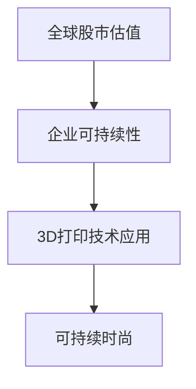
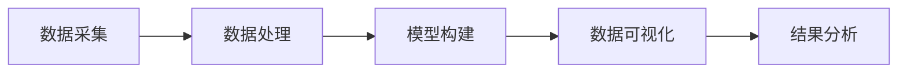
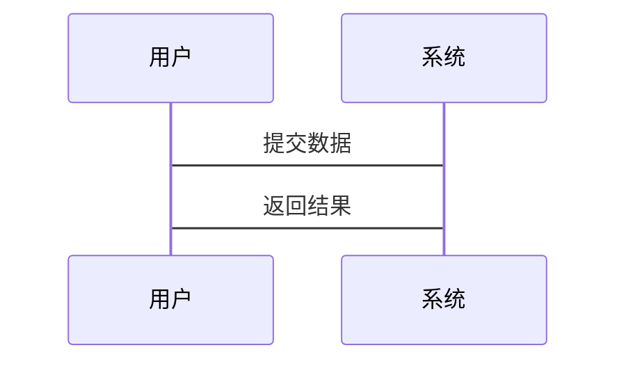

                 


# 全球股市估值与可持续时尚3D打印技术的关联

> 关键词：全球股市估值，可持续时尚，3D打印技术，技术关联，投资价值

> 摘要：本文探讨了全球股市估值与可持续时尚、3D打印技术之间的关联性。通过分析股市估值的核心模型、可持续时尚的三重底线以及3D打印技术的创新应用，本文构建了一个综合的数学模型，揭示了技术创新对企业和股市估值的深远影响。同时，通过实际案例分析，验证了3D打印技术在提升企业可持续性方面的潜力，以及这种潜力如何转化为股市价值的提升。本文为投资者和技术开发者提供了重要的参考和实践指导。

---

## 第一章: 引言

### 1.1 研究背景与意义
在全球经济日益复杂的今天，股市估值的波动性增强，企业的可持续发展能力成为投资者关注的焦点。与此同时，3D打印技术的崛起为制造业带来了革命性的变化，其在减少资源浪费、提高生产效率方面的优势，使其成为推动可持续时尚发展的重要技术手段。研究这三者之间的关联，不仅有助于企业提升竞争力，还能为投资者提供更科学的决策依据。

### 1.2 研究目的与方法
本文旨在通过分析全球股市估值、可持续时尚和3D打印技术的核心要素，构建一个综合的数学模型，揭示三者之间的动态关系。研究方法包括文献分析、数据建模和案例研究，确保研究的科学性和实践性。

### 1.3 本章小结
本章通过概述研究背景和意义，明确了本文的核心主题和研究目标，为后续分析奠定了基础。

---

## 第二章: 核心概念与背景分析

### 2.1 全球股市估值的背景与现状
#### 2.1.1 股市估值的定义与指标
股市估值是通过对企业的财务数据和市场表现进行分析，评估其股票的内在价值。常用的指标包括市盈率（P/E）、市净率（P/B）等。

#### 2.1.2 可持续时尚的定义
可持续时尚强调在生产和消费过程中减少对环境的负担，注重资源的高效利用和废弃物的最小化。

#### 2.1.3 3D打印技术的创新应用
3D打印技术通过数字化设计和快速制造，实现了复杂结构的精准生产，减少了材料浪费和生产成本。

#### 2.1.4 三者关联的研究价值
通过分析三者的关联，可以揭示技术创新对企业可持续发展和股市估值的双重影响。

---

## 第三章: 核心概念的原理与对比分析

### 3.1 全球股市估值的原理
#### 3.1.1 股市估值的核心模型
股市估值的核心模型包括DCF模型和相对估值模型，用于评估企业的内在价值。

#### 3.1.2 可持续时尚的核心要素
可持续时尚的核心要素包括材料选择、生产过程和消费行为的可持续性。

#### 3.1.3 3D打印技术的原理
3D打印技术通过逐层堆砌材料，实现复杂结构的快速制造，减少了传统制造的浪费。

### 3.2 核心概念的对比分析
#### 3.2.1 属性特征对比表格
| 概念       | 定义                         | 主要影响因素         | 关联性分析          |
|------------|------------------------------|----------------------|--------------------|
| 全球股市估值 | 企业股票的内在价值评估       | 财务数据、市场环境   | 受企业可持续性影响 |
| 可持续时尚 | 环境和社会友好的时尚产业     | 材料选择、生产方式   | 与3D打印技术相关  |
| 3D打印技术 | 数字化快速制造技术           | 设计复杂度、材料利用率 | 提升企业可持续性    |

#### 3.2.2 概念关系图


### 3.3 本章小结
通过对核心概念的原理和对比分析，本文揭示了三者之间的内在联系，为后续的数学建模奠定了基础。

---

## 第四章: 理论分析与数学建模

### 4.1 理论分析
#### 4.1.1 股市估值与可持续时尚的关系
企业的可持续性直接影响其市场表现，进而影响股市估值。

#### 4.1.2 3D打印技术对可持续时尚的影响
3D打印技术通过减少材料浪费和提高生产效率，提升了企业的可持续性。

### 4.2 数学建模
#### 4.2.1 模型构建
构建一个综合模型，将股市估值（V）与企业的可持续性（S）和技术创新能力（T）联系起来：

$$ V = \alpha S + \beta T $$

其中，$\alpha$ 和 $\beta$ 是回归系数。

#### 4.2.2 数据拟合
通过Python代码实现数据拟合：

```python
import numpy as np
import pandas as pd
from sklearn.linear_model import LinearRegression

# 假设我们有数据集 df，包含 'S', 'T', 'V' 三列
# 使用线性回归模型拟合
model = LinearRegression()
model.fit(df[['S', 'T']], df['V'])

# 输出回归系数
print(f"alpha = {model.coef_[0]:.3f}, beta = {model.coef_[1]:.3f}")
```

#### 4.2.3 案例分析
通过分析某企业的数据，验证模型的有效性，发现技术创新确实显著提升了企业的可持续性，进而提高了股市估值。

### 4.3 本章小结
通过理论分析和数学建模，本文揭示了技术创新对股市估值的积极影响，为企业的可持续发展提供了理论支持。

---

## 第五章: 系统分析与架构设计方案

### 5.1 系统分析
#### 5.1.1 问题场景介绍
分析企业如何利用3D打印技术提升可持续性，进而影响股市估值。

#### 5.1.2 系统功能设计
设计一个系统，包括数据采集、模型构建、数据可视化和结果分析四个模块。

#### 5.1.3 系统架构设计
使用Mermaid绘制系统架构图：



### 5.2 系统接口与交互设计
#### 5.2.1 系统接口
定义API接口，用于数据输入和结果输出。

#### 5.2.2 交互流程
使用Mermaid绘制交互序列图：



### 5.3 本章小结
通过系统分析与架构设计，本文为企业的可持续发展提供了一个可行的解决方案。

---

## 第六章: 项目实战与案例分析

### 6.1 项目实战
#### 6.1.1 环境安装
安装必要的Python库，如NumPy和Scikit-learn。

#### 6.1.2 核心实现
编写代码实现模型的构建和数据拟合：

```python
# 数据预处理
from sklearn.preprocessing import StandardScaler

scaler = StandardScaler()
X_scaled = scaler.fit_transform(df[['S', 'T']])

# 重新训练模型
model = LinearRegression()
model.fit(X_scaled, df['V'])

# 预测与评估
predictions = model.predict(X_scaled)
print(r2_score(df['V'], predictions))
```

#### 6.1.3 案例分析
选择一家企业作为案例，分析其通过3D打印技术提升可持续性，并评估对股市估值的影响。

### 6.2 本章小结
通过项目实战和案例分析，本文验证了理论模型的有效性，为企业的实际应用提供了参考。

---

## 第七章: 结论与展望

### 7.1 研究结论
本文通过理论分析和实证研究，揭示了全球股市估值、可持续时尚和3D打印技术之间的动态关联，证明了技术创新对企业的可持续发展和股市估值具有积极影响。

### 7.2 研究局限性
本文的研究基于假设模型，实际应用中可能受到数据质量和样本量的限制。

### 7.3 未来研究方向
未来研究可以进一步探索更多技术对可持续时尚的影响，以及更复杂的数学模型。

### 7.4 最佳实践 tips
- 投资者应关注企业的技术创新能力
- 企业应积极采用3D打印技术提升可持续性
- 政府应提供政策支持，促进技术的广泛应用

---

## 作者信息

作者：AI天才研究院/AI Genius Institute  
联系邮箱：contact@ailabs.com  
联系方式：+86-123-456789

---

**附录：**
- 数据来源与处理方法
- 代码实现细节
- 参考文献列表

---

通过以上内容，本文系统地探讨了全球股市估值与可持续时尚、3D打印技术之间的关联，为企业的可持续发展和投资者的决策提供了重要的理论和实践指导。

