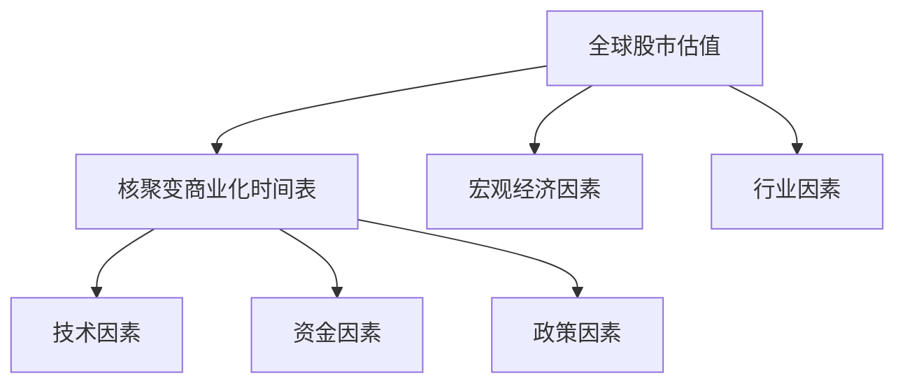
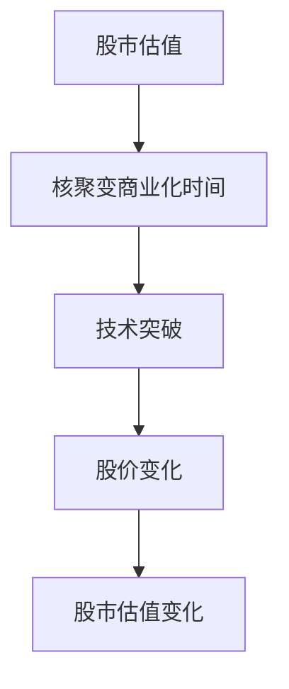
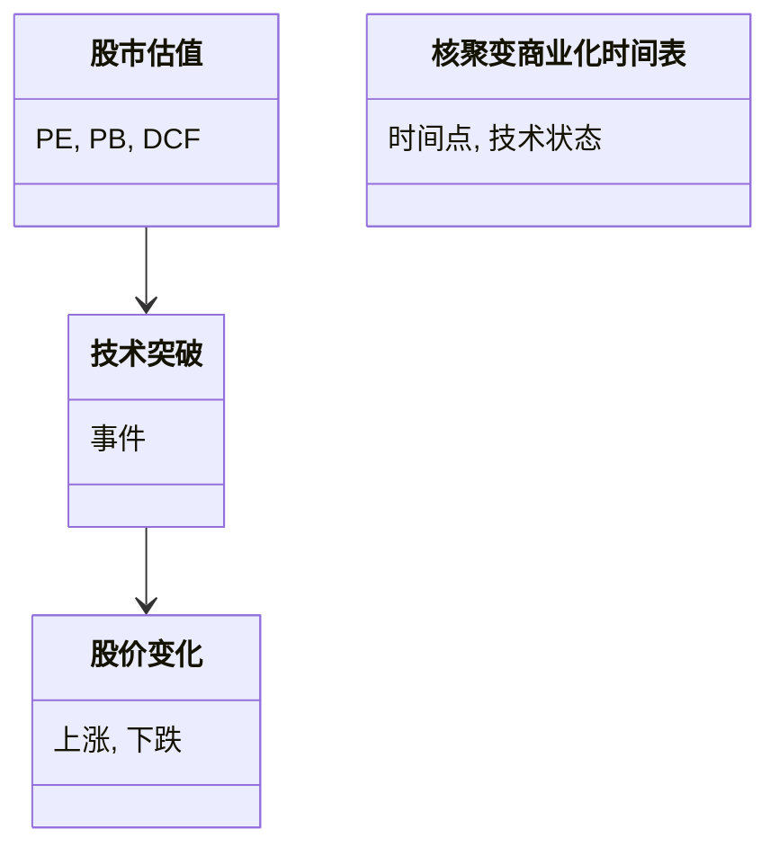
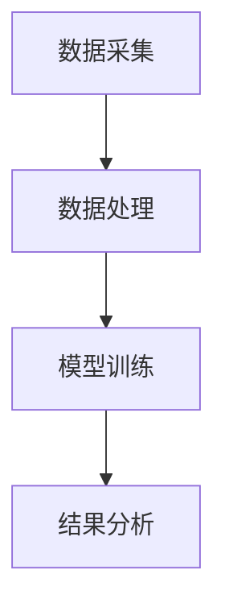

                 


# 全球股市估值与核聚变能源商业化时间表的关系

---

## 关键词：全球股市估值，核聚变能源，商业化时间表，数学模型，技术预测

---

## 摘要：  
本文探讨了全球股市估值与核聚变能源商业化时间表之间的潜在关系。通过分析股市估值的核心原理、核聚变能源商业化的主要挑战，以及两者之间的数学模型，本文试图揭示核聚变技术进步如何影响股市估值，并为投资者提供新的视角。文章从背景介绍、核心概念、算法原理、系统设计和项目实战五个方面展开，结合理论与实践，为读者提供深度分析。

---

## 第一部分：全球股市估值与核聚变能源商业化时间表的关系概述

### 第1章：背景介绍

#### 1.1 核心概念与问题背景
##### 1.1.1 全球股市估值的定义与影响因素
全球股市估值是衡量市场整体价值的重要指标，包括市盈率（PE）、市净率（PB）和现金流折现模型（DCF）等。影响股市估值的主要因素包括宏观经济指标（GDP增速、利率水平、通货膨胀）、行业发展趋势（科技、能源等）和市场情绪（投资者信心）。

##### 1.1.2 核聚变能源商业化时间表的定义与现状
核聚变能源是通过轻核聚变反应释放能量的技术，商业化时间表取决于技术突破、资金投入和政策支持。目前，全球多个国家和企业正在研究核聚变技术，但尚未实现大规模商业化。

##### 1.1.3 问题背景：股市估值与核聚变商业化时间的关系
核聚变技术的商业化可能对能源行业产生革命性影响，从而间接或直接影响股市估值。例如，核聚变技术突破可能提升相关企业的股价，进而影响整体股市估值。

#### 1.2 问题描述与解决思路
##### 1.2.1 核聚变商业化时间对股市估值的影响路径
- 核聚变技术突破 → 提升能源公司股价 → 影响行业指数 → 影响整体股市估值。
- 核聚变商业化延迟 → 投资者信心下降 → 股价下跌 → 影响股市估值。

##### 1.2.2 股市估值对核聚变商业化进程的反馈机制
- 股市估值高企 → 企业融资能力强 → 加速核聚变技术研发。
- 股市估值低迷 → 企业融资困难 → 制约核聚变商业化进程。

##### 1.2.3 问题解决的初步思路
- 建立核聚变商业化时间与股市估值的关系模型。
- 使用时间序列分析和回归分析预测两者的关系。

#### 1.3 问题的边界与外延
##### 1.3.1 核聚变商业化时间表的边界条件
- 技术可行性：核聚变技术是否成熟。
- 资金投入：政府和企业的资金支持。
- 政策支持：政策是否鼓励核聚变技术发展。

##### 1.3.2 股市估值的边界条件
- 宏观经济环境：GDP增速、利率水平、通货膨胀。
- 行业发展：科技、能源等行业的发展状况。
- 市场情绪：投资者信心和市场预期。

##### 1.3.3 两者关系的外延分析
- 核聚变商业化时间表可能影响能源行业的估值。
- 股市估值可能影响核聚变技术的商业化进程。

#### 1.4 概念结构与核心要素
##### 1.4.1 概念结构图


##### 1.4.2 核心要素对比表
| 要素 | 全球股市估值 | 核聚变商业化时间表 |
|------|-------------|-------------------|
| 核心 | 估值指标（PE、PB） | 技术商业化时间 |
| 影响因素 | 经济指标、行业趋势、市场情绪 | 技术、资金、政策 |
| 目标 | 反映市场整体价值 | 实现商业化应用 |

##### 1.4.3 ER实体关系图
```mermaid
entity 股市估值
    [PE, PB, DCF]
entity 核聚变商业化时间表
    [时间点, 技术状态]
relationship 两者关系
    股市估值影响核聚变商业化时间
    核聚变商业化时间影响股市估值
```

---

## 第二部分：核心概念与联系

### 第2章：核心概念原理

#### 2.1 全球股市估值的核心原理
##### 2.1.1 股市估值的基本原理
股市估值是通过对上市公司财务指标（如收入、利润、现金流）和市场指标（如利率、通货膨胀）进行分析，确定市场整体价值的过程。

##### 2.1.2 主要估值方法
- 市盈率（PE）：股价 / 每股净利润。
- 市净率（PB）：股价 / 每股净资产。
- 现金流折现模型（DCF）：基于未来现金流的现值计算公司价值。

##### 2.1.3 影响股市估值的关键因素
- 宏观经济：GDP增速、利率、通货膨胀。
- 行业趋势：科技、能源、金融等行业的表现。
- 市场情绪：投资者信心和市场预期。

#### 2.2 核聚变能源商业化时间表的核心原理
##### 2.2.1 核聚变能源的基本原理
核聚变是通过轻核（如氘和氚）在高温高压条件下聚变成重核（如氦），释放大量能量的过程。与核裂变不同，核聚变是一种清洁、安全的能源技术。

##### 2.2.2 商业化时间表的影响因素
- 技术：聚变反应的可行性、实验装置的稳定性。
- 资金：研发需要巨额投资。
- 政策：政府是否支持核聚变技术。

##### 2.2.3 核聚变商业化的主要挑战
- 技术难度：聚变反应难以稳定控制。
- 成本：研发和商业化成本高昂。
- 时间：商业化周期长，可能需要数十年。

#### 2.3 两者关系的数学模型
##### 2.3.1 核心概念属性特征对比表
| 属性 | 股市估值 | 核聚变商业化时间表 |
|------|---------|--------------------|
| 核心指标 | PE、PB | 时间点、技术状态 |
| 主要因素 | 宏观经济、行业趋势 | 技术、资金、政策 |
| 目标 | 反映市场价值 | 实现商业化应用 |

##### 2.3.2 关系模型的Mermaid流程图


---

## 第三部分：算法原理讲解

### 第3章：算法原理与数学模型

#### 3.1 算法原理
##### 3.1.1 时间序列分析
时间序列分析用于预测核聚变商业化时间表，常用ARIMA模型。

##### 3.1.2 回归分析
回归分析用于分析股市估值与核聚变商业化时间的关系，常用线性回归模型。

##### 3.1.3 联合概率模型
联合概率模型用于分析两者关系的不确定性。

#### 3.2 数学模型与公式
##### 3.2.1 线性回归模型
$$ y = \beta_0 + \beta_1x + \epsilon $$

##### 3.2.2 时间序列模型
$$ ARIMA(p, d, q) $$

##### 3.2.3 联合概率模型
$$ P(T < t) = \frac{1}{1 + e^{-\beta t}} $$

#### 3.3 举例说明
##### 3.3.1 股市估值与核聚变时间的回归分析
假设我们收集了过去10年的股市估值数据和核聚变技术进展数据，可以使用线性回归模型预测两者的关系。

##### 3.3.2 时间序列预测案例
假设我们有核聚变商业化时间的历史数据，可以使用ARIMA模型预测未来的时间点。

##### 3.3.3 联合概率模型的实际应用
假设核聚变技术突破的概率随时间增加，我们可以使用联合概率模型分析其对股市估值的影响。

---

## 第四部分：系统分析与架构设计

### 第4章：系统分析与架构设计方案

#### 4.1 问题场景介绍
##### 4.1.1 核聚变商业化时间表的预测场景
我们需要预测核聚变技术商业化的时间点，以评估其对股市估值的影响。

##### 4.1.2 股市估值预测的场景
我们需要预测股市估值的变化，以评估核聚变商业化对市场的潜在影响。

##### 4.1.3 两者关系的综合预测场景
我们需要综合分析核聚变商业化时间表与股市估值的关系，以制定投资策略。

#### 4.2 系统功能设计
##### 4.2.1 领域模型Mermaid类图


##### 4.2.2 系统架构设计Mermaid架构图


---

## 第五部分：项目实战

### 第5章：项目实战与总结

#### 5.1 环境安装
##### 5.1.1 安装Python
```bash
python --version
pip install numpy pandas scikit-learn
```

##### 5.1.2 安装其他工具
```bash
pip install mermaid.py
```

#### 5.2 系统核心实现源代码
##### 5.2.1 数据预处理
```python
import pandas as pd
data = pd.read_csv('data.csv')
```

##### 5.2.2 模型训练
```python
from sklearn.linear_model import LinearRegression
model = LinearRegression()
model.fit(X, y)
```

##### 5.2.3 结果可视化
```python
import matplotlib.pyplot as plt
plt.plot(predicted, actual)
plt.show()
```

#### 5.3 代码应用解读与分析
##### 5.3.1 数据预处理
解释数据清洗和特征工程的过程。

##### 5.3.2 模型训练
解释模型的训练过程和参数设置。

##### 5.3.3 结果分析
解释预测结果的含义和对投资决策的启示。

#### 5.4 实际案例分析和详细讲解剖析
##### 5.4.1 核聚变商业化时间表的预测
分析某个国家或企业的核聚变商业化时间表。

##### 5.4.2 股市估值的预测
基于核聚变商业化时间表预测股市估值的变化。

##### 5.4.3 投资策略的制定
根据预测结果制定相应的投资策略。

#### 5.5 项目小结
总结项目的主要成果和对未来研究的启示。

---

## 第六部分：最佳实践 tips、小结、注意事项、拓展阅读

### 6.1 最佳实践 tips
- 数据质量是关键，确保数据准确性和完整性。
- 模型选择要结合实际场景，避免过度复杂。
- 结果分析要结合行业知识，避免片面结论。

### 6.2 小结
本文通过分析全球股市估值与核聚变能源商业化时间表的关系，揭示了两者之间的潜在联系。结合理论与实践，本文为投资者和研究人员提供了新的视角。

### 6.3 注意事项
- 数据分析结果仅供参考，实际投资需谨慎。
- 模型具有局限性，需结合实际情况调整。

### 6.4 拓展阅读
- 推荐阅读相关领域的经典文献和最新研究。
- 关注核聚变技术和股市估值的最新动态。

---

## 作者：AI天才研究院/AI Genius Institute & 禅与计算机程序设计艺术 /Zen And The Art of Computer Programming

