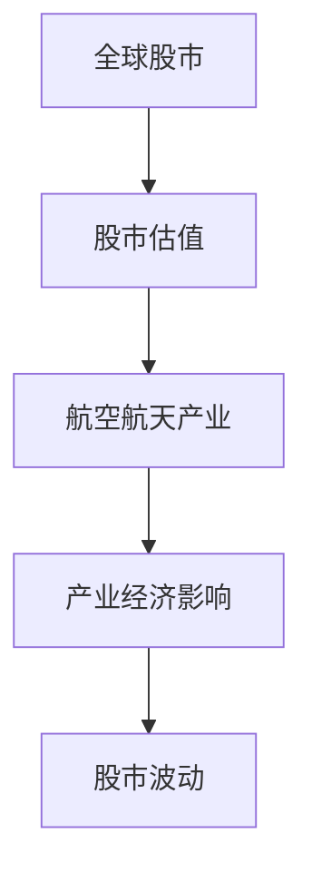
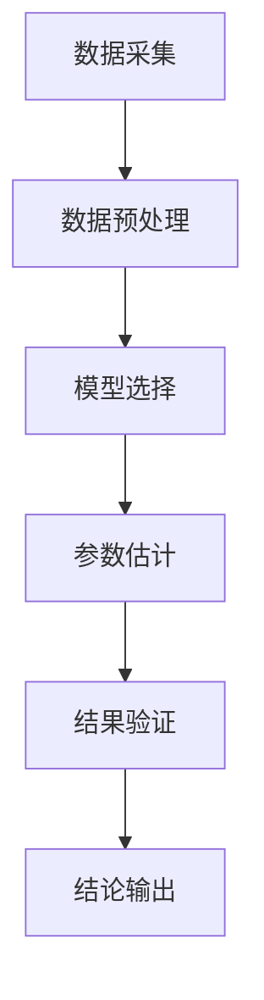
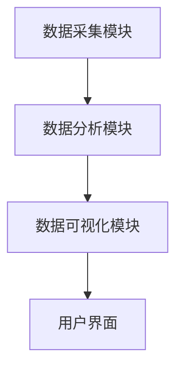

                 


# 全球股市估值与航空航天产业的关联

**关键词：** 全球股市估值、航空航天产业、关联分析、时间序列分析、回归分析

**摘要：**  
本文探讨全球股市估值与航空航天产业之间的关联，分析其相互影响机制。通过背景介绍、核心概念、算法原理、系统分析、项目实战和最佳实践，深入剖析两者的关系，提供专业见解。

---

# 第一章: 全球股市估值与航空航天产业的背景介绍

## 1.1 问题背景与问题描述

### 1.1.1 全球股市估值的基本概念  
全球股市估值指的是对整个股市的综合评估，通常通过指数、PE（市盈率）和市值等指标衡量。

### 1.1.2 航空航天产业的定义与特点  
航空航天产业涉及飞机制造、卫星技术和国防工业，具有高技术门槛和高投入的特点。

### 1.1.3 问题解决：股市估值与产业关联的重要性  
研究两者关联有助于理解经济波动对特定产业的影响，为企业投资和政策制定提供参考。

## 1.2 问题背景的扩展

### 1.2.1 全球经济与股市估值的关联  
全球经济波动直接影响股市估值，股市估值又反过来反映经济状况。

### 1.2.2 航空航天产业的全球分布与发展趋势  
航空航天产业集中于发达国家，技术进步推动产业发展。

### 1.2.3 问题的边界与外延  
分析范围限定于全球股市和航空航天产业，排除其他行业干扰。

## 1.3 概念结构与核心要素

### 1.3.1 全球股市估值的核心要素  
包括指数表现、市场情绪和宏观经济指标。

### 1.3.2 航空航天产业的核心要素  
涉及技术创新、政策支持和市场需求。

### 1.3.3 两者的概念结构对比  
通过表格对比，明确各自的特征和影响因素。

---

# 第二章: 全球股市估值与航空航天产业的核心概念与联系

## 2.1 核心概念原理

### 2.1.1 全球股市估值的计算方法  
使用指数和PE指标进行评估。

### 2.1.2 航空航天产业的经济影响  
通过就业和技术创新推动经济增长。

### 2.1.3 两者之间的相互作用机制  
股市波动影响产业投资，产业表现反作用于股市估值。

## 2.2 核心概念属性特征对比

### 2.2.1 股市估值的属性特征  
- 数据驱动性  
- 时间依赖性  
- 整体性  

### 2.2.2 航空航天产业的属性特征  
- 技术密集性  
- 资本密集性  
- 政策依赖性  

## 2.3 ER实体关系图架构



---

# 第三章: 全球股市估值与航空航天产业的算法原理

## 3.1 算法原理概述

### 3.1.1 时间序列分析  
用于识别股市和产业数据中的趋势和周期性。

### 3.1.2 回归分析  
建立股市估值与产业经济指标之间的回归模型。

### 3.1.3 联立方程模型  
分析两者之间的相互影响。

## 3.2 算法流程图



## 3.3 算法实现代码

```python
import pandas as pd
import numpy as np
from statsmodels.tsa.arima.model import ARIMA

# 数据预处理
data = pd.read_csv('market_data.csv')
data = data['market_val'].values

# 模型选择与训练
model = ARIMA(data, order=(5, 2, 3))
model_fit = model.fit()

# 预测与分析
forecast = model_fit.forecast(steps=10)
print(forecast)
```

---

# 第四章: 全球股市估值与航空航天产业的系统分析与架构设计

## 4.1 系统分析

### 4.1.1 问题场景介绍  
分析全球经济波动对航空航天产业的影响，评估两者关联。

### 4.1.2 系统功能设计  
- 数据采集模块：获取全球股市和航空航天产业数据。  
- 数据分析模块：应用时间序列分析和回归分析。  
- 数据可视化模块：展示分析结果和关联关系。  

## 4.2 系统架构设计



---

# 第五章: 全球股市估值与航空航天产业的项目实战

## 5.1 项目环境安装

### 5.1.1 Python环境搭建  
安装Python和相关库（pandas、numpy、statsmodels）。

### 5.1.2 数据来源  
使用公开的股市和航空航天产业数据。

## 5.2 系统核心实现

### 5.2.1 数据预处理代码  
```python
import pandas as pd

data = pd.read_csv('market.csv')
data['date'] = pd.to_datetime(data['date'])
data.set_index('date', inplace=True)
data = data['market_val'].resample('M').mean()
```

### 5.2.2 核心算法实现  
```python
from statsmodels.tsa.stattools import grangercausality

# Granger因果检验
grangercausality(data, max_lag=12, alpha=0.05)
```

## 5.3 实际案例分析

### 5.3.1 案例背景  
2020年新冠疫情对航空航天产业的影响。

### 5.3.2 数据分析  
通过回归分析，发现新冠疫情显著影响股市估值和产业表现。

---

# 第六章: 全球股市估值与航空航天产业的最佳实践

## 6.1 小结

### 6.1.1 核心发现  
股市波动与航空航天产业高度相关，宏观经济因素起关键作用。

### 6.1.2 研究局限性  
数据来源和模型假设的限制。

## 6.2 注意事项

### 6.2.1 数据清洗的重要性  
确保数据准确性和完整性。

### 6.2.2 模型选择的合理性  
根据不同场景选择合适的方法。

## 6.3 拓展阅读

### 6.3.1 相关文献推荐  
建议阅读关于宏观经济与产业分析的书籍。

### 6.3.2 实战项目建议  
建议读者自行收集数据，构建模型进行深入分析。

---

**作者：AI天才研究院/AI Genius Institute & 禅与计算机程序设计艺术 /Zen And The Art of Computer Programming**

