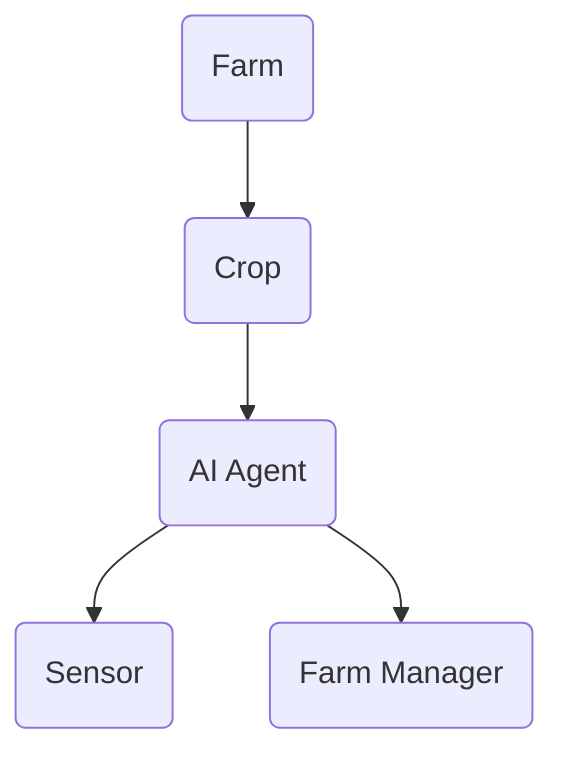
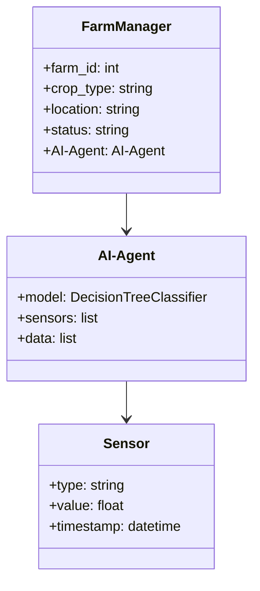
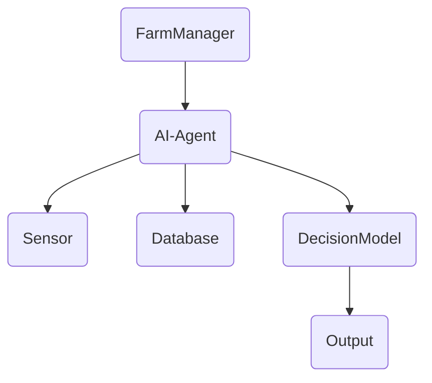
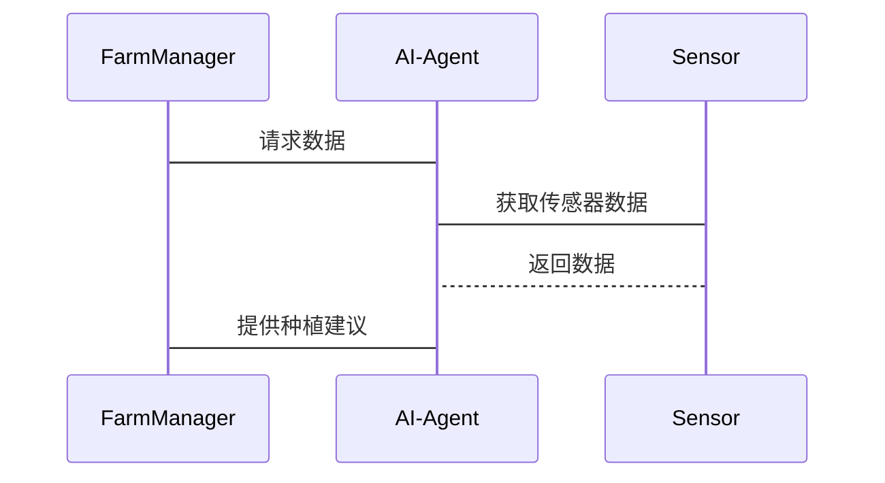

                 


# 农业AI Agent：智能种植与农场管理

---

## 关键词：
农业、AI Agent、智能种植、农场管理、机器学习、数字化转型、精准农业

---

## 摘要：
随着农业数字化转型的推进，AI Agent（人工智能代理）在农业领域的应用日益广泛。本文深入探讨农业AI Agent的核心概念、算法原理、系统架构以及实际应用，旨在为农业从业者和技术开发者提供一份全面的指南。通过分析农业AI Agent在智能种植和农场管理中的具体应用场景，结合实际案例和代码实现，本文为读者展示了如何利用AI技术提升农业生产效率、降低资源浪费，并实现精准农业管理。

---

## 第1章：农业数字化转型与AI Agent的引入

### 1.1 农业现代化与数字化转型
1.1.1 传统农业的局限性  
传统农业依赖人工经验，存在效率低下、资源浪费和管理粗放等问题。例如，农民通常根据经验判断作物的生长状况，难以实现精准施肥和病虫害防治。

1.1.2 数字化农业的概念与目标  
数字化农业通过物联网（IoT）、大数据、人工智能等技术，将农业生产过程中的数据进行采集、分析和优化，以提高生产效率、降低成本并减少环境影响。

1.1.3 AI技术在农业中的应用前景  
AI技术在农业中的应用涵盖了作物生长监测、病虫害识别、土壤分析、天气预测等多个领域，为农业智能化提供了强大的技术支持。

---

### 1.2 农业AI Agent的基本概念
1.2.1 什么是AI Agent  
AI Agent是一种智能系统，能够感知环境、做出决策并执行任务。在农业领域，AI Agent可以用于监测作物生长状态、预测天气变化、优化资源分配等。

1.2.2 农业AI Agent的核心功能  
- 数据采集与分析：通过传感器和摄像头采集农田数据，分析土壤湿度、光照强度、温度等环境参数。
- 病虫害识别：利用图像识别技术，快速识别作物病虫害并提供防治建议。
- 资源优化：根据作物生长需求，智能分配水、肥等资源，减少浪费。

1.2.3 农业AI Agent与传统农业管理的区别  
传统农业管理依赖人工经验，而AI Agent能够通过大数据分析和机器学习模型，实现精准管理和决策优化。

---

### 1.3 农业AI Agent的优势与应用场景
1.3.1 提高农业生产效率  
通过AI Agent的实时监测和智能决策，农民可以更高效地管理作物生长，减少人工干预。

1.3.2 降低资源浪费  
AI Agent可以根据作物实际需求精准分配水和肥料，减少资源浪费，降低生产成本。

1.3.3 实现精准农业管理  
AI Agent能够根据农田环境和作物生长状态，提供个性化的种植方案，实现精准农业管理。

---

## 第2章：农业AI Agent的核心概念与联系

### 2.1 AI Agent的原理与架构
2.1.1 AI Agent的基本原理  
AI Agent通过感知环境、分析数据、做出决策并执行任务，实现对农业生产的智能化管理。

2.1.2 农业AI Agent的系统架构  
农业AI Agent通常由数据采集模块、数据处理模块、决策模块和执行模块组成，各模块协同工作以实现智能化管理。

---

### 2.2 农业AI Agent的核心要素
2.2.1 数据采集与处理  
数据采集是AI Agent工作的基础，包括土壤湿度、温度、光照强度等环境数据的采集与处理。

2.2.2 知识库构建  
AI Agent需要一个包含作物生长知识、病虫害识别规则等的知识库，以支持智能决策。

2.2.3 决策模型  
决策模型是AI Agent的核心，基于机器学习算法，AI Agent能够根据输入数据生成最优决策。

---

### 2.3 农业AI Agent的实体关系图



---

## 第3章：农业AI Agent的算法原理

### 3.1 农业AI Agent的核心算法
3.1.1 机器学习算法  
机器学习算法（如支持向量机、随机森林）用于作物分类、病虫害识别等任务。

3.1.2 自然语言处理算法  
自然语言处理算法用于分析农业相关的文本数据，如病虫害防治建议。

3.1.3 视觉识别算法  
视觉识别算法用于作物图像分析，帮助识别病虫害和作物生长状态。

---

### 3.2 决策树算法的实现

#### 3.2.1 决策树的基本原理
决策树是一种基于树状结构的分类算法，通过特征选择和分裂策略构建决策树模型。

#### 3.2.2 农业场景中的决策树应用
在农业中，决策树可以用于作物分类、病虫害识别等任务。

#### 3.2.3 决策树的优缺点
- 优点：易于解释、计算效率高。
- 缺点：对噪声数据敏感、容易过拟合。

---

### 3.3 算法实现代码示例

```python
from sklearn.tree import DecisionTreeClassifier
from sklearn.model_selection import train_test_split

# 数据集准备
X = [[特征1, 特征2, ...], ...]
y = [标签]

# 数据集划分
X_train, X_test, y_train, y_test = train_test_split(X, y, test_size=0.2)

# 模型训练
model = DecisionTreeClassifier()
model.fit(X_train, y_train)

# 模型预测
predictions = model.predict(X_test)
```

---

### 3.4 决策树算法的数学模型
决策树的分裂标准通常采用信息增益或基尼指数，具体公式如下：

$$
\text{信息增益} = \text{熵}(X) - \text{期望熵}(X, 特征)
$$

$$
\text{基尼指数} = \sum_{i=1}^{n} p_i(1-p_i)
$$

---

## 第4章：系统分析与架构设计方案

### 4.1 问题场景介绍
本文设计一个基于AI Agent的智能种植系统，用于监测作物生长状态并提供种植建议。

### 4.2 系统功能设计
4.2.1 领域模型（类图）



---

### 4.3 系统架构设计



---

### 4.4 系统接口设计
系统接口包括数据采集接口、模型调用接口和结果输出接口。

---

### 4.5 系统交互设计



---

## 第5章：项目实战

### 5.1 环境安装
安装Python、Scikit-learn、Mermaid等工具。

### 5.2 核心代码实现

```python
import pandas as pd
from sklearn.tree import DecisionTreeClassifier
from sklearn.metrics import accuracy_score

# 数据加载
data = pd.read_csv('crop_data.csv')

# 数据预处理
X = data.drop('label', axis=1)
y = data['label']

# 数据划分
X_train, X_test, y_train, y_test = train_test_split(X, y, test_size=0.2)

# 模型训练
model = DecisionTreeClassifier()
model.fit(X_train, y_train)

# 模型预测
y_pred = model.predict(X_test)

# 模型评估
print("准确率：", accuracy_score(y_test, y_pred))
```

---

### 5.3 实际案例分析
以水稻种植为例，AI Agent可以根据土壤湿度、温度等数据，提供精准的灌溉和施肥建议。

---

### 5.4 项目小结
通过本项目，读者可以掌握农业AI Agent的基本实现方法，并能够将其应用于实际种植管理中。

---

## 第6章：最佳实践与注意事项

### 6.1 小结
农业AI Agent的应用为农业智能化提供了有力工具，能够显著提高生产效率并降低成本。

### 6.2 注意事项
- 数据质量：确保数据采集的准确性和完整性。
- 模型优化：根据实际需求优化机器学习模型。
- 安全性：确保系统的数据安全和隐私保护。

### 6.3 拓展阅读
推荐阅读《机器学习实战》和《人工智能在农业中的应用》等书籍。

---

## 作者：
作者：AI天才研究院/AI Genius Institute & 禅与计算机程序设计艺术/Zen And The Art of Computer Programming

