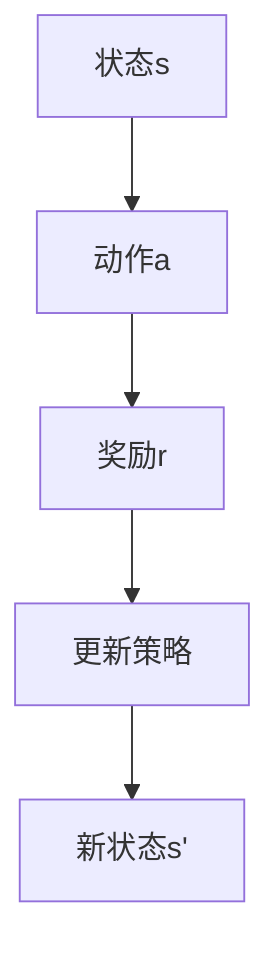
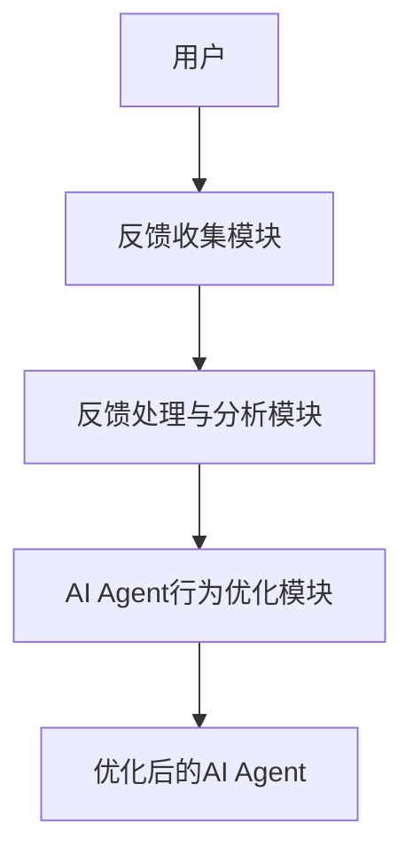

                 


# 利用用户反馈改进AI Agent的方法

> 关键词：用户反馈，AI Agent，强化学习，系统设计，项目实战

> 摘要：本文详细探讨了如何利用用户反馈来改进AI Agent的性能和行为。通过分析用户反馈的分类、处理机制，结合强化学习算法，系统性地讲解了如何将用户反馈整合到AI Agent的设计与优化中。文章从理论到实践，结合实际案例，展示了用户反馈在提升AI Agent用户体验和智能水平中的重要作用。

---

# 第一部分: 利用用户反馈改进AI Agent的背景与基础

# 第1章: 用户反馈与AI Agent概述

## 1.1 用户反馈的基本概念

### 1.1.1 用户反馈的定义与分类

用户反馈是指用户在与AI Agent交互过程中，对AI Agent的行为、结果或服务质量做出的评价、建议或反应。用户反馈可以是显性的（如评分、点击、点赞等），也可以是隐性的（如停留时间、浏览路径等）。

用户反馈的分类如下：
1. **显性反馈**：用户主动提供的明确评价，如评分（1-5分）、点赞、投诉等。
2. **隐性反馈**：通过用户的行为间接反映的反馈，如点击率、停留时间、购买行为等。
3. **语言反馈**：用户通过文本或语音形式提供的反馈，如评价、建议或抱怨。
4. **情感反馈**：用户在与AI Agent交互过程中表现出的情感状态，如满意、不满、困惑等。

### 1.1.2 用户反馈在AI系统中的作用

用户反馈在AI系统中起到了关键的指导和优化作用：
1. **行为指导**：用户反馈帮助AI Agent了解用户的偏好和需求，从而调整其行为策略。
2. **性能优化**：通过分析用户反馈，可以发现AI Agent的不足之处，并针对性地进行优化。
3. **服务质量提升**：用户反馈是衡量AI Agent服务质量的重要指标，有助于提高用户体验。

### 1.1.3 AI Agent的基本概念与特点

AI Agent（智能代理）是一种能够感知环境、自主决策并执行任务的智能体。AI Agent的特点包括：
1. **自主性**：能够在没有外部干预的情况下自主运行。
2. **反应性**：能够实时感知环境并做出反应。
3. **目标导向**：通过设定目标来驱动行为。
4. **学习能力**：能够通过学习不断提升自身的性能和能力。

---

## 1.2 用户反馈与AI Agent的结合

### 1.2.1 用户反馈在AI Agent中的应用场景

用户反馈在AI Agent中的应用场景非常广泛：
1. **推荐系统**：通过用户的反馈（如点击、评分）来优化推荐算法，提高推荐的精准度。
2. **对话系统**：根据用户的反馈调整对话策略，提升对话的流畅性和准确性。
3. **任务执行**：用户对AI Agent执行任务的结果提供反馈，帮助AI Agent改进任务执行策略。

### 1.2.2 用户反馈对AI Agent性能的提升作用

用户反馈对AI Agent的性能提升主要体现在以下几个方面：
1. **行为优化**：通过分析用户反馈，AI Agent能够调整其行为策略，以更好地满足用户需求。
2. **模型改进**：用户反馈可以作为训练数据的一部分，用于改进AI Agent的模型参数。
3. **服务质量提升**：通过用户反馈，可以发现并解决AI Agent在服务过程中存在的问题，从而提升服务质量。

### 1.2.3 用户反馈与AI Agent的交互模式

用户反馈与AI Agent的交互模式主要包括：
1. **实时反馈**：用户在与AI Agent交互的过程中实时提供反馈，AI Agent根据反馈立即调整其行为。
2. **延时反馈**：用户在完成某个任务后，提供对整个过程的反馈，AI Agent根据反馈进行整体优化。
3. **主动反馈**：AI Agent主动向用户请求反馈，用户根据自己的体验提供反馈。

---

## 1.3 本章小结

本章主要介绍了用户反馈的基本概念、分类及其在AI系统中的作用，同时详细阐述了AI Agent的基本概念和特点。通过分析用户反馈与AI Agent的结合方式，揭示了用户反馈在提升AI Agent性能和用户体验中的重要性。

---

# 第二部分: 用户反馈改进AI Agent的核心概念与联系

# 第2章: 用户反馈的分类与处理机制

## 2.1 用户反馈的分类

### 2.1.1 显性反馈与隐性反馈

显性反馈是用户主动提供的明确评价，如评分、点赞、投诉等；隐性反馈则是通过用户的行为间接反映的，如点击率、停留时间等。显性反馈具有明确的评价性质，而隐性反馈则更多地反映了用户的偏好和行为模式。

### 2.1.2 用户行为数据与用户评价数据

用户行为数据包括用户的点击、浏览、搜索等行为，而用户评价数据则包括用户的评分、评论等。行为数据反映了用户的实际操作，评价数据则更直接地表达了用户对AI Agent的主观感受。

### 2.1.3 正向反馈与负向反馈

正向反馈是指用户对AI Agent的积极评价，表示满意或认可；负向反馈则是指用户的负面评价，表示不满或抱怨。正向反馈有助于激励AI Agent继续保持良好表现，而负向反馈则为AI Agent提供了改进的方向。

---

## 2.2 用户反馈的处理流程

### 2.2.1 反馈数据的采集与预处理

反馈数据的采集是通过用户与AI Agent的交互过程进行的，可以通过日志记录、用户调查等方式获取。预处理步骤包括数据清洗、数据格式化等。

### 2.2.2 反馈数据的特征提取

特征提取是将反馈数据转化为可用于模型训练的特征向量。例如，将用户的评分转化为数值型特征，或将用户的评论转化为文本特征。

### 2.2.3 反馈数据的分类与分析

通过对用户反馈进行分类，可以将其分为不同的类别，如正面、负面、中性等。分析反馈数据可以帮助识别用户的主要需求和痛点，从而为AI Agent的优化提供依据。

---

## 2.3 用户反馈与AI Agent行为的关系

### 2.3.1 反馈对AI Agent行为的直接影响

用户的反馈直接影响AI Agent的行为策略。例如，用户对推荐结果的评分可以指导AI Agent调整推荐算法，以提高推荐的相关性。

### 2.3.2 反馈对AI Agent模型的间接影响

用户的反馈可以作为训练数据的一部分，用于改进AI Agent的模型参数。例如，基于反馈的强化学习算法可以通过用户的评分来优化模型的决策策略。

### 2.3.3 反馈在不同场景下的应用差异

在不同的场景下，用户反馈的应用方式可能会有所不同。例如，在对话系统中，实时反馈可以帮助AI Agent立即调整对话策略；而在推荐系统中，延时反馈则可以帮助AI Agent优化长期的推荐策略。

---

## 2.4 本章小结

本章详细探讨了用户反馈的分类及其处理机制，分析了用户反馈与AI Agent行为之间的关系。通过理解用户反馈的分类和处理流程，可以更好地利用用户反馈来改进AI Agent的性能和用户体验。

---

# 第三部分: 用户反馈改进AI Agent的算法原理

# 第3章: 基于用户反馈的强化学习算法

## 3.1 强化学习的基本原理

### 3.1.1 强化学习的定义与核心要素

强化学习是一种机器学习范式，其中智能体通过与环境交互来学习策略，以最大化累计奖励。核心要素包括状态、动作、奖励、策略和价值函数。

### 3.1.2 状态、动作、奖励的定义

- **状态**：智能体所处的环境状态。
- **动作**：智能体在给定状态下采取的行动。
- **奖励**：智能体执行动作后获得的反馈，用于指导学习过程。

### 3.1.3 策略与价值函数的数学模型

策略函数：$ \pi(a|s) $，表示在状态$s$下选择动作$a$的概率。  
价值函数：$ V(s) $，表示从状态$s$开始的期望回报。

---

## 3.2 用户反馈在强化学习中的应用

### 3.2.1 基于用户反馈的奖励函数设计

用户反馈可以作为奖励函数的重要组成部分。例如，用户的评分可以直接作为奖励值，或者通过加权的方式影响奖励函数。

### 3.2.2 用户反馈驱动的策略优化

通过用户反馈，可以调整强化学习算法中的策略参数，以优化智能体的行为策略。

### 3.2.3 增量式学习与反馈驱动的更新机制

增量式学习是指在新数据到来时，逐步更新模型参数。反馈驱动的更新机制则基于用户的反馈信息，动态调整模型参数。

---

## 3.3 基于反馈的强化学习算法实现

### 3.3.1 算法流程图（mermaid）



### 3.3.2 算法数学模型

强化学习中的Q-learning算法：

$$ Q(s, a) = Q(s, a) + \alpha (r + \gamma \max_{a'} Q(s', a') - Q(s, a)) $$

其中：
- $ \alpha $ 是学习率，
- $ \gamma $ 是折扣因子。

---

## 3.4 本章小结

本章主要介绍了强化学习的基本原理及其在用户反馈中的应用，详细讲解了基于反馈的强化学习算法的实现过程。通过用户反馈驱动的奖励函数和策略优化，可以有效提升AI Agent的性能。

---

# 第四部分: 用户反馈改进AI Agent的系统分析与架构设计

# 第4章: 基于用户反馈的AI Agent系统设计

## 4.1 系统功能设计

### 4.1.1 用户反馈收集模块

用户反馈收集模块负责采集用户的反馈信息，包括显性反馈和隐性反馈。

### 4.1.2 反馈处理与分析模块

反馈处理与分析模块负责对收集到的反馈数据进行预处理、特征提取和分类分析。

### 4.1.3 AI Agent行为优化模块

行为优化模块基于反馈分析结果，调整AI Agent的行为策略和模型参数。

---

## 4.2 系统架构设计

### 4.2.1 系统架构图（mermaid）



---

## 4.3 系统接口设计

系统接口设计包括用户与AI Agent的交互接口、反馈收集接口和反馈处理接口。

### 4.3.1 用户与AI Agent的交互接口

用户通过该接口与AI Agent进行交互，提供反馈信息。

### 4.3.2 反馈收集接口

AI Agent通过该接口收集用户的反馈数据。

### 4.3.3 反馈处理接口

反馈处理模块通过该接口接收反馈数据，并进行处理和分析。

---

## 4.4 本章小结

本章详细描述了基于用户反馈的AI Agent系统的功能设计和架构设计，展示了如何将用户反馈整合到系统中，以实现AI Agent的优化与提升。

---

# 第五部分: 用户反馈改进AI Agent的项目实战

# 第5章: 项目实战

## 5.1 环境安装

需要安装的环境包括Python、TensorFlow、Keras、Pandas、NumPy等。

### 5.1.1 Python安装

```bash
python --version
pip install --upgrade pip
```

### 5.1.2 TensorFlow安装

```bash
pip install tensorflow
pip install tensorflow.keras
```

---

## 5.2 系统核心实现源代码

### 5.2.1 反馈收集模块

```python
import pandas as pd

def collect_feedback(user_id, action, reward):
    feedback = {
        'user_id': user_id,
        'action': action,
        'reward': reward
    }
    return pd.DataFrame(feedback)
```

### 5.2.2 反馈处理与分析模块

```python
import numpy as np
from tensorflow.keras import layers

def process_feedback(feedback_data):
    model = tf.keras.Sequential()
    model.add(layers.Dense(64, activation='relu', input_dim=3))
    model.add(layers.Dense(1, activation='sigmoid'))
    model.compile(optimizer='adam', loss='binary_crossentropy')
    model.fit(feedback_data, epochs=10)
    return model
```

### 5.2.3 AI Agent行为优化模块

```python
def optimize_agent(model, state):
    predicted_action = model.predict(state)
    return predicted_action
```

---

## 5.3 实际案例分析

以一个推荐系统为例，展示用户反馈如何驱动AI Agent的优化。

### 5.3.1 案例背景

假设我们有一个基于用户的评分数据的推荐系统，用户对推荐结果进行评分（1-5分）。

### 5.3.2 数据收集与处理

用户评分数据：

| 用户ID | 推荐物品ID | 用户评分 |
|------|------|------|
| 1 | 100 | 4 |
| 2 | 101 | 3 |
| 3 | 102 | 5 |

### 5.3.3 模型训练与优化

使用用户的评分数据训练推荐模型，优化模型参数以提高推荐的准确性。

### 5.3.4 模型评估与测试

通过测试用户的评分数据，评估模型的性能，并根据反馈进一步优化模型。

---

## 5.4 项目小结

本章通过一个实际案例，展示了如何将用户反馈整合到AI Agent的设计与优化中。通过环境安装、代码实现和案例分析，详细讲解了用户反馈在提升AI Agent性能中的具体应用。

---

# 第六部分: 总结与展望

# 第6章: 总结与展望

## 6.1 本章总结

本文详细探讨了用户反馈在改进AI Agent中的重要作用，从理论到实践，系统性地讲解了用户反馈的分类、处理机制以及在强化学习算法中的应用。通过系统设计和项目实战，展示了如何将用户反馈整合到AI Agent的优化过程中，以提升用户体验和智能水平。

## 6.2 未来展望

未来，随着人工智能技术的不断发展，用户反馈在AI Agent中的应用将更加广泛和深入。可以通过以下方向进一步研究：
1. **多模态反馈分析**：结合文本、语音、图像等多种模态的反馈信息，提升AI Agent的理解能力。
2. **实时反馈驱动的自适应系统**：实现用户反馈的实时处理和动态响应，提升AI Agent的实时性。
3. **个性化反馈机制**：根据不同用户的需求和偏好，设计个性化的反馈机制，提升用户体验。

---

# 作者：AI天才研究院/AI Genius Institute & 禅与计算机程序设计艺术 /Zen And The Art of Computer Programming

---

以上是《利用用户反馈改进AI Agent的方法》的技术博客文章的详细内容，涵盖了从基础理论到实际应用的各个方面，希望对读者有所帮助！

