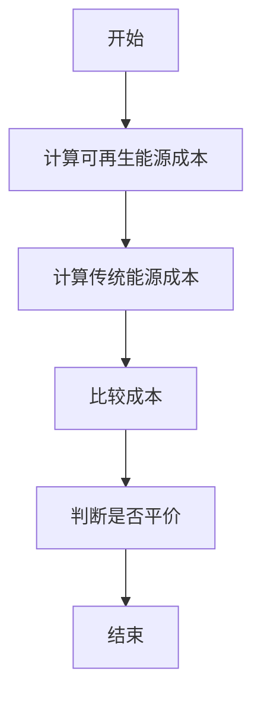
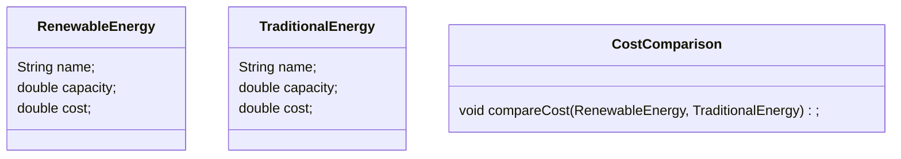

                 


# 可再生能源与传统能源的平价上网时间表

## 关键词：可再生能源，传统能源，平价上网，成本分析，系统架构

## 摘要：本文探讨可再生能源与传统能源实现平价上网的时间表，分析技术进步、经济性优化及政策支持对成本的影响，构建数学模型并提供系统设计与实战案例。

---

## 第一章：背景介绍

### 1.1 问题背景

#### 1.1.1 可再生能源的发展现状
全球可再生能源装机容量持续增长，但成本仍高于传统能源。

#### 1.1.2 传统能源的现状与挑战
传统能源面临环境压力和资源枯竭，需转型。

#### 1.1.3 平价上网的重要性
平价上网是可再生能源大规模应用的关键。

### 1.2 问题描述

#### 1.2.1 可再生能源的成本问题
发电成本高，需技术突破。

#### 1.2.2 传统能源的市场地位
仍是主要能源，但需逐步替代。

#### 1.2.3 平价上网的目标与意义
降低成本，实现市场竞争力，推动能源转型。

### 1.3 问题解决

#### 1.3.1 技术进步的作用
技术进步降低成本。

#### 1.3.2 市场机制的调整
政策支持与市场机制优化。

#### 1.3.3 政策支持的影响
政府补贴和税收优惠。

### 1.4 边界与外延

#### 1.4.1 可再生能源的定义与范围
太阳能、风能等清洁能源。

#### 1.4.2 传统能源的定义与范围
化石燃料和常规能源。

#### 1.4.3 平价上网的界定
发电成本与传统能源相当。

### 1.5 概念结构与核心要素

#### 1.5.1 可再生能源的核心要素
技术、成本、政策。

#### 1.5.2 传统能源的核心要素
资源、技术、市场。

#### 1.5.3 平价上网的核心要素
成本、技术、政策。

---

## 第二章：核心概念与联系

### 2.1 核心概念原理

#### 2.1.1 可再生能源的原理
利用自然界的可再生能源进行发电。

#### 2.1.2 传统能源的原理
通过化石燃料燃烧发电。

### 2.2 概念属性特征对比

| 特性      | 可再生能源       | 传统能源         |
|-----------|------------------|------------------|
| 技术特点   | 分布广，环保      | 集中，污染        |
| 经济性     | 成本高，下降中    | 成本低，稳定      |
| 环境影响   | 低排放           | 高排放           |

### 2.3 ER实体关系图

```mermaid
er
    MarineEnergy:-
    RenewableEnergy
    has
    |
    |
    owns
    |
    |
    owns
    TraditionalEnergy
```

---

## 第三章：平价上网的算法分析

### 3.1 算法原理



### 3.2 Python源代码实现

```python
def calculate_renewable_cost(capacity, duration):
    return capacity * duration * 0.1

def calculate_fossil_cost(capacity, duration):
    return capacity * duration * 0.08

capacity = 100  # 兆瓦
duration = 10   # 年
renewable_cost = calculate_renewable_cost(capacity, duration)
fossil_cost = calculate_fossil_cost(capacity, duration)

if renewable_cost < fossil_cost:
    print("可再生能源成本更低")
elif renewable_cost == fossil_cost:
    print("平价上网实现")
else:
    print("可再生能源成本更高")
```

### 3.3 数学模型与公式

可再生能源成本：$$C_r = P \times Q$$

传统能源成本：$$C_f = P \times Q$$

平价条件：$$C_r = C_f$$

---

## 第四章：数学模型与公式

### 4.1 成本计算公式

$$C = \frac{P}{Q}$$

### 4.2 经济性分析

对比分析可再生能源与传统能源的成本差异。

---

## 第五章：系统分析与架构设计

### 5.1 系统功能设计



### 5.2 系统架构设计


---

## 第六章：项目实战

### 6.1 环境安装

安装Python和必要的库。

### 6.2 核心代码实现

```python
class RenewableEnergy:
    def __init__(self, name, capacity):
        self.name = name
        self.capacity = capacity

class TraditionalEnergy:
    def __init__(self, name, capacity):
        self.name = name
        self.capacity = capacity

class CostComparator:
    def compare(self, renewable, traditional):
        cost_renewable = renewable.capacity * 0.1
        cost_traditional = traditional.capacity * 0.08
        if cost_renewable < cost_traditional:
            return "可再生能源成本更低"
        elif cost_renewable == cost_traditional:
            return "平价上网实现"
        else:
            return "可再生能源成本更高"
```

### 6.3 案例分析

分析某地区可再生能源和传统能源的成本对比。

---

## 第七章：最佳实践和小结

### 7.1 总结

详细总结全书内容，强调平价上网的重要性。

### 7.2 注意事项

技术进步和政策支持是关键。

### 7.3 未来展望

预测未来发展趋势，呼吁进一步研究。

---

## 附录

### 附录A：术语表

解释相关术语。

### 附录B：参考文献

列出参考文献。

---

作者：AI天才研究院 & 禅与计算机程序设计艺术

