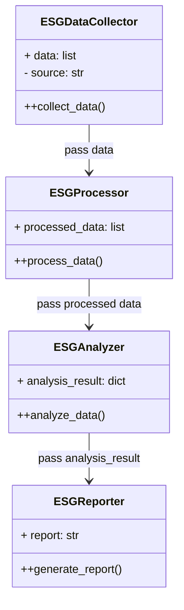

                 


# 可持续投资：ESG因素在当前市场中的重要性

## 关键词：
- ESG
- 可持续投资
- 环境因素
- 社会因素
- 治理因素
- 投资策略
- 风险管理

## 摘要：
可持续投资正成为全球金融市场的重要趋势，而ESG（环境、社会、治理）因素在其中扮演着关键角色。本文详细探讨了ESG的核心概念、量化方法、系统架构以及实际应用案例。通过因子分析模型和系统设计，展示了如何将ESG因素融入投资决策，帮助投资者实现长期价值增长和风险控制。

---

## 正文：

### 第1章：可持续投资的背景与概念

#### 1.1 可持续投资的定义与内涵
可持续投资是一种关注环境、社会和治理因素的投资策略，旨在在追求财务回报的同时，推动社会和环境的可持续发展。它强调企业不仅要创造经济价值，还要承担社会责任，减少对环境的负面影响。

#### 1.2 ESG的定义与重要性
- **环境（E）**：关注企业的环境表现，包括碳排放、资源使用效率等。
- **社会（S）**：关注企业与社会的互动，包括员工权益、社区贡献等。
- **治理（G）**：关注企业的治理结构，包括董事会构成、高管薪酬等。

ESG因素不仅影响企业的声誉，还直接关系到企业的长期盈利能力。例如，治理不善的企业可能面临更高的法律风险，而忽视环境因素的企业可能面临更高的合规成本。

#### 1.3 可持续投资的背景与发展趋势
随着全球气候变化和不平等问题的加剧，投资者越来越关注企业的可持续性。越来越多的机构投资者将ESG因素纳入投资决策，以避免投资于可能引发社会或环境危机的企业。

---

### 第2章：ESG的核心概念与相互关系

#### 2.1 ESG的核心要素与相互关系
- **环境（E）**：碳排放、能源使用效率。
- **社会（S）**：员工权益、社会责任。
- **治理（G）**：董事会结构、高管薪酬。

ESG三者相互关联，共同影响企业的整体表现。例如，良好的治理结构能够提高企业的社会责任履行能力，而高效的环境管理可以提升企业的资源利用效率。

#### 2.2 ESG的相互作用与整体影响
通过比较表格，可以清晰看到环境、社会和治理三个维度在不同方面的影响：

| 因素 | 影响方面       | 具体表现                           |
|------|----------------|------------------------------------|
| E    | 环境风险       | 碳排放、资源浪费                   |
| S    | 社会责任       | 员工权益、社区关系                 |
| G    | 治理结构       | 董事会效率、高管透明度             |

### 第3章：ESG的量化与分析方法

#### 3.1 ESG评分模型的概述
因子分析模型是常用的ESG评分方法。通过对企业在环境、社会和治理方面的表现进行量化评分，计算因子得分，并根据权重分配得出综合ESG评分。

#### 3.2 因子分析模型
因子分析模型用于提取ESG的关键因素，并计算因子得分。假设我们有以下因素：

- E1: 碳排放强度
- S1: 员工满意度
- G1: 董事会多样性

公式：
$$
F = \sum (\lambda_i \cdot X_i)
$$

其中，$F$ 是因子得分，$\lambda_i$ 是载荷，$X_i$ 是原始变量。

代码示例：
```python
import pandas as pd
from sklearn.decomposition import FactorAnalysis

# 假设data是包含ESG指标的数据框
fa = FactorAnalysis(n_components=3)
fa.fit(data)
factor_scores = pd.DataFrame(fa.components_, columns=['Factor1', 'Factor2', 'Factor3'])
```

### 第4章：系统分析与架构设计

#### 4.1 系统功能设计
系统功能包括数据收集、处理、分析和输出。通过Mermaid类图展示系统架构：



### 第5章：项目实战

#### 5.1 环境安装
- 安装必要的Python库：`pandas`, `numpy`, `scikit-learn`

#### 5.2 核心代码实现
```python
import pandas as pd
import numpy as np

# 示例数据
data = {
    'E1': [0.5, 1.2, 0.8],
    'S1': [0.7, 0.6, 0.9],
    'G1': [0.8, 0.7, 0.9]
}

df = pd.DataFrame(data)

# 计算因子得分
from sklearn.decomposition import FactorAnalysis

fa = FactorAnalysis(n_components=3)
fa.fit(df)
factor_scores = pd.DataFrame(fa.components_, columns=['Factor1', 'Factor2', 'Factor3'])

print(factor_scores)
```

#### 5.3 案例分析
假设我们有一个企业数据集，计算其ESG因子得分，并分析其在投资组合中的表现。通过因子得分，可以识别哪些企业在ESG方面表现优异，从而优化投资组合。

### 第6章：最佳实践、小结与展望

#### 6.1 最佳实践
- 使用可靠的ESG数据源，如MSCI、Sustainalytics。
- 定期更新ESG评分，以反映企业的最新表现。
- 结合财务指标，综合评估企业的投资价值。

#### 6.2 小结
ESG因素不仅影响企业的长期价值，还帮助投资者规避风险。通过量化方法和系统设计，可以更有效地将ESG因素融入投资决策。

#### 6.3 未来展望
随着技术的进步，ESG评估将更加精准和自动化。未来，投资者可能更多地依赖AI和大数据分析来优化ESG投资策略。

---

## 作者：
AI天才研究院/AI Genius Institute  
禅与计算机程序设计艺术/Zen And The Art of Computer Programming

