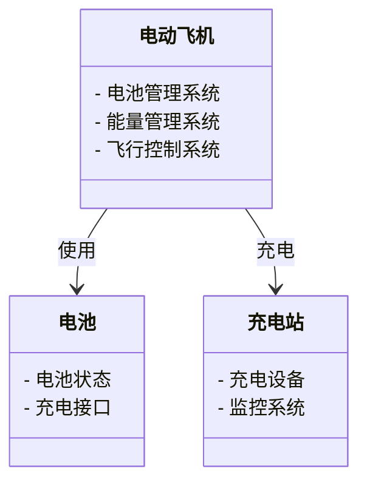
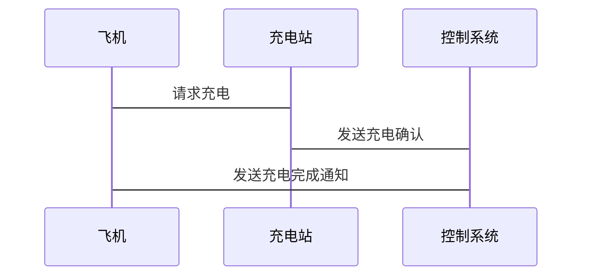
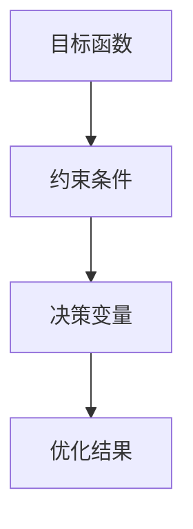

                 


# 可持续航空技术的研发投入与市场前景

> 关键词：可持续航空技术，研发投入，市场前景，技术创新，航空可持续发展，绿色航空，环保飞行

> 摘要：本文深入探讨了可持续航空技术的研发投入与市场前景，分析了绿色航空技术的创新点及其对航空行业的深远影响。通过结合数学模型、算法原理和实际案例，本文详细阐述了可持续航空技术的核心概念、系统架构和市场潜力，为读者提供了全面的技术见解和商业分析。

---

# 第一部分：可持续航空技术的背景与定义

## 第1章：可持续航空技术的背景与问题背景

### 1.1 可持续航空技术的定义

#### 1.1.1 可持续航空技术的核心概念
可持续航空技术是指通过技术创新和优化，减少航空业对环境的影响，同时提高飞行效率和降低成本的一系列技术。这些技术包括但不限于替代燃料、更高效的飞机设计、智能导航系统、碳捕获技术等。

#### 1.1.2 可持续航空技术的背景与现状
随着全球气候变化问题的加剧，航空业作为碳排放的主要来源之一，面临着巨大的压力。国际社会对减少碳排放的要求日益严格，推动了可持续航空技术的研发。当前，可持续航空技术在多个领域取得了进展，例如电动飞机、混合动力飞机、可持续航空燃料（SAF）等。

#### 1.1.3 可持续航空技术的边界与外延
可持续航空技术的边界包括从飞机设计、燃料生产到飞行操作的各个环节。其外延则涵盖了与之相关的政策、经济、社会等多个方面的影响。

---

## 第2章：可持续航空技术研发与市场的关联

### 2.1 可持续航空技术研发的必要性

#### 2.1.1 研发背景与驱动因素
航空业的碳排放问题不仅威胁环境，还可能导致高昂的罚款和运营成本。因此，研发可持续航空技术不仅是环保的需要，也是企业生存和发展的必要条件。

#### 2.1.2 技术创新对可持续航空的影响
技术创新是推动可持续航空发展的核心动力。例如，电动飞机技术的突破可以显著减少碳排放，而智能导航系统的优化可以降低燃油消耗。

#### 2.1.3 研发投入与市场前景的关系
研发投入与市场前景密切相关。高研发投入可以带来技术领先，从而在市场中占据更大的份额。然而，技术研发也存在失败的风险，需要企业在投入与回报之间找到平衡。

---

### 2.2 可持续航空技术的市场前景

#### 2.2.1 市场现状与趋势分析
目前，全球航空市场对可持续航空技术的需求正在快速增长。根据市场研究机构的预测，到2030年，可持续航空燃料的市场份额将达到10%以上。

#### 2.2.2 市场驱动因素与挑战
市场驱动因素包括政策支持、环保需求和消费者偏好。然而，技术成熟度不足、成本高昂和基础设施限制是当前市场发展的主要挑战。

#### 2.2.3 市场潜力与未来预测
可持续航空技术的市场潜力巨大。未来，随着技术的进步和成本的下降，电动飞机、混合动力飞机和可持续航空燃料将逐步取代传统技术，成为市场的主流。

---

# 第二部分：可持续航空技术的核心概念与联系

## 第3章：可持续航空技术的核心原理

### 3.1 可持续航空技术的核心原理

#### 3.1.1 可持续航空技术的基本原理
可持续航空技术的核心原理包括能量优化、资源高效利用和环境友好。例如，电动飞机通过电能驱动，减少了对化石燃料的依赖，从而降低了碳排放。

#### 3.1.2 核心技术的创新点
可持续航空技术的创新点在于其对传统技术的颠覆性改进。例如，混合动力技术结合了内燃机和电动机的优势，可以在不同飞行阶段优化能源使用。

#### 3.1.3 核心原理的数学模型与公式
以下是可持续航空技术中能量优化的一个简单数学模型：

$$
\text{能量消耗} = \frac{\text{飞行距离} \times \text{燃料效率}}{\text{能量转换效率}}
$$

---

## 第4章：可持续航空技术的系统分析与架构设计

### 4.1 可持续航空技术的系统分析

#### 4.1.1 问题场景介绍
以电动飞机为例，其系统设计需要考虑电池能量密度、充电时间、飞行距离和安全性等多个因素。

#### 4.1.2 系统功能设计
系统功能包括能量管理、飞行控制、电池管理等。

#### 4.1.3 领域模型设计（Mermaid类图）


---

### 4.2 可持续航空技术的系统架构设计

#### 4.2.1 系统架构设计（Mermaid架构图）


#### 4.2.2 系统接口设计
系统接口包括飞机与地面控制系统的接口、电池与充电站的接口等。

#### 4.2.3 系统交互流程（Mermaid序列图）


---

# 第三部分：可持续航空技术的算法原理与数学模型

## 第5章：可持续航空技术的优化算法

### 5.1 可持续航空技术的优化模型

#### 5.1.1 线性规划模型（Mermaid流程图）



---

## 第6章：项目实战

### 6.1 可持续航空技术的环境搭建

#### 6.1.1 环境安装
需要安装Python、数学优化库（如 scipy、numpy）和Mermaid工具。

---

### 6.2 可持续航空技术的核心代码实现

#### 6.2.1 优化算法代码示例

```python
import numpy as np
from scipy.optimize import linprog

# 定义目标函数
c = [-2, -3]

# 定义约束条件
A = [[1, 1], [0, 1]]
b = [4, 2]

# 定义变量范围
x_bounds = (0, None)
y_bounds = (0, None)

# 求解线性规划问题
result = linprog(c, A, b, bounds=[x_bounds, y_bounds], method='highs')

# 输出结果
print("最优解为:", result.x)
```

---

## 第7章：最佳实践与总结

### 7.1 小结与注意事项

- 技术创新是推动可持续航空发展的关键。
- 研发投入需要平衡成本与收益。
- 市场需求和技术成熟度是影响市场前景的主要因素。

### 7.2 未来展望

未来，随着技术的进步，可持续航空技术将在全球范围内得到更广泛的应用，推动航空业向绿色、低碳方向发展。

---

作者：AI天才研究院/AI Genius Institute & 禅与计算机程序设计艺术 /Zen And The Art of Computer Programming

