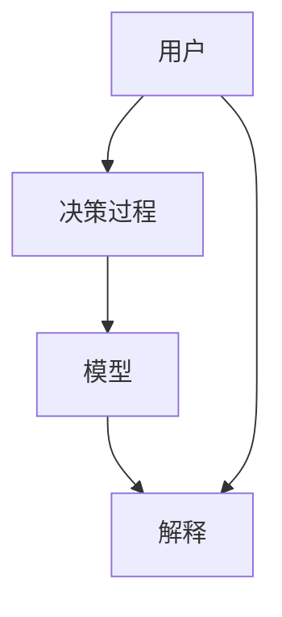
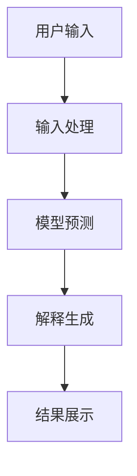

                 


# 可解释性设计：理解AI Agent的决策过程

## 关键词：可解释性设计, AI Agent, 决策过程, 模型解释性, 算法原理, 系统架构, 项目实战

## 摘要：  
本文将深入探讨可解释性设计在AI Agent中的应用，从背景、核心概念、算法原理到系统设计和项目实战，全面解析如何理解AI Agent的决策过程。通过具体案例分析和实战代码实现，帮助读者掌握可解释性设计的关键技术，并能够将其应用于实际项目中。

---

# 第一部分: 可解释性设计的背景与核心概念

## 第1章: 可解释性设计的背景与问题背景

### 1.1 可解释性设计的核心概念  
#### 1.1.1 问题背景：AI Agent决策的不透明性  
随着AI技术的快速发展，AI Agent（智能体）在各个领域的应用日益广泛，例如金融、医疗、自动驾驶等。然而，AI Agent的决策过程往往缺乏透明性，导致用户或开发者无法理解其背后的逻辑，这成为应用中的痛点。  

#### 1.1.2 问题描述：可解释性的重要性  
AI Agent的决策过程需要可解释性，以便：  
1. 确保决策的合理性，避免错误或不公平的结果。  
2. 满足监管要求，例如金融领域的合规性检查。  
3. 提高用户信任，尤其是在医疗等高风险领域。  

#### 1.1.3 问题解决：可解释性设计的目标  
可解释性设计的目标是通过透明化AI Agent的决策过程，使其行为能够被用户或开发者理解。  

#### 1.1.4 可解释性设计的边界与外延  
可解释性设计的边界包括：  
1. 仅关注决策过程的透明性，不涉及具体实现技术。  
2. 针对特定场景，而非所有AI模型。  

#### 1.1.5 可解释性设计的核心要素组成  
可解释性设计的核心要素包括：  
1. 解释性模型：能够将决策过程转化为可理解的解释。  
2. 特征重要性：分析输入特征对决策的影响程度。  
3. 可视化工具：通过图表或文字展示决策过程。  

---

## 第2章: 可解释性设计的核心概念与联系  

### 2.1 可解释性设计的核心原理  
#### 2.1.1 解释性模型的分类与特点  
解释性模型可以分为以下几类：  
1. **线性模型**：如线性回归，具有较强的可解释性。  
2. **树模型**：如决策树，可以通过树结构展示决策逻辑。  
3. **规则集模型**：通过一系列规则描述决策过程。  

#### 2.1.2 可解释性与不可解释性模型的对比  
| 特征       | 可解释性模型         | 不可解释性模型       |  
|------------|--------------------|--------------------|  
| 解释能力   | 高                 | 低                 |  
| 透明度     | 高                 | 低                 |  
| 简单性     | 高                 | 低                 |  

#### 2.1.3 可解释性设计的数学模型基础  
可解释性设计的数学模型基础包括线性回归、决策树等，这些模型具有较强的可解释性。  

---

### 2.2 可解释性设计的属性特征对比  
#### 2.2.1 可解释性模型的特征对比表格  
| 特征       | 线性回归         | 决策树            | 规则集模型       |  
|------------|-----------------|------------------|-----------------|  
| 解释能力   | 高             | 中               | 高             |  
| 透明度     | 高             | 中               | 高             |  
| 简单性     | 高             | 中               | 高             |  

---

### 2.3 可解释性设计的ER实体关系图  


---

## 第3章: 可解释性设计的算法原理  

### 3.1 解释性模型的算法原理  
#### 3.1.1 LIME算法原理  
LIME（局部 interpretable model-agnostic explanations）是一种用于解释机器学习模型的算法。其原理如下：  
1. 对于给定的输入数据，生成多个扰动样本。  
2. 对每个扰动样本，计算其在原始模型中的预测结果。  
3. 使用线性回归或其他简单模型，拟合这些扰动样本及其预测结果。  
4. 通过拟合模型，生成可解释的规则或权重。  

#### 3.1.2 SHAP值的计算与解释  
SHAP（Shapley Additive exPlanations）是一种基于Shapley值的解释方法，其计算公式为：  
$$ SHAP\_value = \sum_{i=1}^{n} \phi_i $$  
其中，$\phi_i$ 表示每个特征对最终预测结果的贡献。  

---

## 3.2 算法原理的代码实现  

### 3.2.1 使用LIME解释模型  
```python
from lime import lime_tabular
import numpy as np

# 初始化LIME解释器
explainer = lime_tabular.LimeTabularExplainer(X_train, feature_names=feature_names)

# 解释单个样本
i = np.random.randint(0, len(X_test))
explanation = explainer.explain_instance(X_test[i], model.predict, num_samples=1000)
print(explanation.as_list())
```

---

## 3.3 算法原理的数学模型  

### 3.3.1 线性回归模型的解释性  
线性回归模型的解释性公式为：  
$$ y = \beta_0 + \beta_1x_1 + \beta_2x_2 + ... + \beta_nx_n $$  
其中，$\beta_i$ 表示每个特征 $x_i$ 对预测结果的权重，权重越大，特征的重要性越高。  

---

## 3.4 算法原理的可视化  

### 3.4.1 使用SHAP值的可视化  
```python
import shap
import matplotlib.pyplotas plt

# 初始化SHAP解释器
explainer = shap.TreeExplainer(model)
shap_values = explainer.shap_values(X_test)

# 绘制特征重要性图表
shap.summary_plot(shap_values, X_test, feature_names=feature_names, max_display=10)
plt.show()
```

---

## 4章: 可解释性设计的系统分析与架构设计方案  

### 4.1 系统分析与设计  

#### 4.1.1 系统功能设计  
1. **输入处理**：接收用户输入的数据。  
2. **模型预测**：使用AI Agent进行预测。  
3. **解释生成**：根据模型输出生成可解释的解释。  
4. **结果展示**：将解释以可视化或文本形式展示给用户。  

#### 4.1.2 系统架构设计  


---

## 4.2 项目实战  

### 4.2.1 项目环境安装  
```bash
pip install lime
pip install shap
pip install scikit-learn
```

---

## 4.3 项目核心代码实现  

### 4.3.1 核心代码实现  
```python
from sklearn.linear_model import LinearRegression
from lime import lime_tabular
import numpy as np

# 初始化模型
model = LinearRegression()
model.fit(X_train, y_train)

# 初始化LIME解释器
explainer = lime_tabular.LimeTabularExplainer(X_train, feature_names=feature_names)

# 解释单个样本
i = np.random.randint(0, len(X_test))
explanation = explainer.explain_instance(X_test[i], model.predict, num_samples=1000)
print(explanation.as_list())
```

---

## 4.4 项目小结  

---

## 5章: 可解释性设计的最佳实践  

### 5.1 最佳实践 tips  
1. 在实际应用中，优先选择可解释性模型，如线性回归或决策树。  
2. 使用SHAP或LIME等工具，对不可解释性模型进行事后解释。  
3. 在模型部署前，对模型的可解释性进行充分验证。  

---

## 5.2 小结  

---

## 5.3 注意事项  

---

## 5.4 拓展阅读  

---

## 作者：AI天才研究院/AI Genius Institute & 禅与计算机程序设计艺术 /Zen And The Art of Computer Programming  

---

# 结语  
通过本文的详细讲解，读者可以全面理解可解释性设计在AI Agent中的应用，并掌握其实现方法。希望本文能为AI领域的研究和实践提供有价值的参考。

