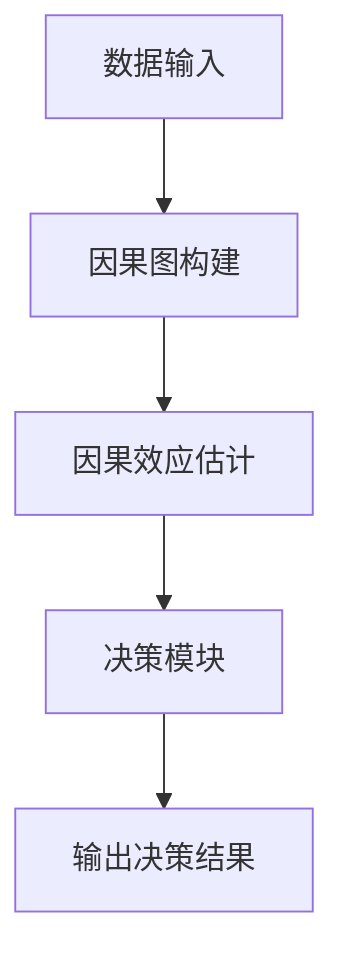
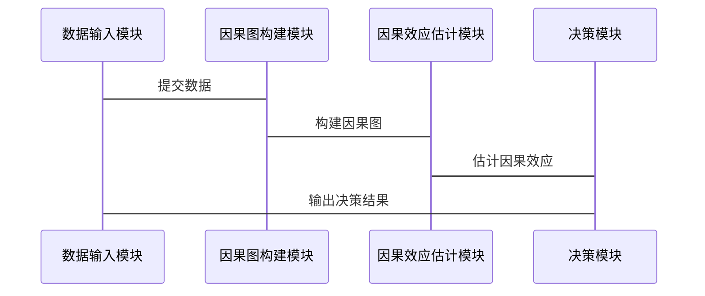

                 


# 因果推理：增强AI Agent的理解和决策能力

---

## 关键词：
因果推理、AI Agent、决策能力、因果图、潜在结果、反事实推理、强化学习

---

## 摘要：
本文深入探讨了因果推理在增强AI Agent理解和决策能力中的重要作用。通过分析因果推理的核心概念、算法原理及其在实际系统中的应用，本文为AI开发者和研究人员提供了从理论到实践的全面指导。文章首先介绍了因果推理的基本概念和在AI Agent中的应用背景，然后详细讲解了因果推理的核心概念和联系，包括因果关系的数学模型、因果图的构建方法以及因果关系的网络结构。接下来，文章从算法原理的角度，重点介绍了反事实推理和因果森林等因果推断算法，并通过Mermaid流程图和Python代码示例进行了详细阐述。随后，文章结合实际问题，设计了一个基于因果推理的AI Agent系统架构，并通过系统分析和架构设计展示了因果推理在系统中的具体应用。最后，文章通过项目实战，详细讲解了因果推理在医疗诊断系统中的实际案例，并总结了最佳实践和注意事项，为读者提供了宝贵的实践经验和理论指导。

---

## 第一部分: 因果推理与AI Agent的背景介绍

### 第1章: 因果推理的基本概念

#### 1.1 问题背景与问题描述

- **1.1.1 当前AI Agent的局限性**
  - AI Agent在处理复杂决策问题时，往往依赖相关性分析，难以理解因果关系。
  - 基于相关性分析的决策容易受到数据偏差的影响，缺乏可解释性。
  - 在动态变化的环境中，AI Agent难以适应因果关系的变化。

- **1.1.2 因果推理在AI Agent中的作用**
  - 帮助AI Agent理解因果关系，提升决策的可解释性和可靠性。
  - 在动态环境中，因果推理能够帮助AI Agent更好地适应变化。
  - 通过因果推理，AI Agent可以进行反事实推理，预测“如果采取某项行动，结果会如何”，从而做出更优决策。

- **1.1.3 问题解决的必要性**
  - 提高AI Agent的决策能力，使其能够在复杂环境中自主学习和优化。
  - 通过因果推理，AI Agent能够更好地理解和处理因果关系，从而在实际应用中表现出色。

#### 1.2 因果推理的核心要素

- **1.2.1 因果关系的定义与特点**
  - 因果关系是指一个事件的发生是另一个事件发生的直接原因。
  - 因果关系具有可传递性、可解释性和动态变化性。

- **1.2.2 因果图的基本结构**
  - 因果图是一种用于表示因果关系的有向图，节点代表变量，边代表因果关系。
  - 因果图可以通过结构学习算法从数据中构建。

- **1.2.3 因果效应的类型**
  - 平均处理效应（ATE）
  - 条件处理效应（CATE）
  - 因果风险比（CRR）

#### 1.3 因果推理与相关概念的对比

- **1.3.1 相关性与因果推理的区别**
  - 相关性分析只能揭示变量之间的关联，无法确定因果关系。
  - 因果推理能够揭示变量之间的因果关系，能够进行反事实推理。

- **1.3.2 独立性与条件独立性的关系**
  - 独立性是指变量之间没有关联。
  - 条件独立性是指在给定条件下，变量之间没有关联。
  - 独立性是条件独立性的一种特殊情况。

- **1.3.3 因果推理的边界与外延**
  - 因果推理的边界是其能够处理的因果关系的范围。
  - 因果推理的外延包括其在不同领域中的应用。

### 第2章: 因果推理在AI Agent中的应用

#### 2.1 AI Agent的决策需求

- **2.1.1 基于因果推理的决策优势**
  - 提高决策的可解释性和可靠性。
  - 在动态环境中，因果推理能够帮助AI Agent更好地适应变化。
  - 通过因果推理，AI Agent能够进行反事实推理，预测“如果采取某项行动，结果会如何”，从而做出更优决策。

- **2.1.2 基于因果推理的决策流程**
  - 确定问题目标和因果关系。
  - 构建因果图模型。
  - 进行因果效应估计。
  - 基于因果效应进行决策。

- **2.1.3 基于因果推理的决策案例**
  - 案例1：医疗诊断中的因果推理。
  - 案例2：金融投资中的因果推理。

#### 2.2 因果推理与强化学习的结合

- **2.2.1 强化学习中的因果关系**
  - 强化学习需要处理状态、动作和奖励之间的因果关系。
  - 因果推理可以帮助强化学习算法更好地理解状态转移和奖励机制。

- **2.2.2 因果推理对强化学习的改进**
  - 通过因果推理，强化学习可以更好地进行反事实推理，预测不同动作的后果。
  - 因果推理可以帮助强化学习算法在动态环境中保持稳定性和可靠性。

- **2.2.3 实际应用中的案例分析**
  - 案例1：游戏AI的决策优化。
  - 案例2：自动驾驶中的因果推理应用。

#### 2.3 因果推理与知识图谱的结合

- **2.3.1 知识图谱的基本概念**
  - 知识图谱是一种用于表示知识的图结构，节点代表实体，边代表关系。
  - 知识图谱可以通过因果推理进行增强，提升其表示能力。

- **2.3.2 因果推理在知识图谱中的应用**
  - 通过因果推理，知识图谱可以更好地理解实体之间的因果关系。
  - 因果推理可以帮助知识图谱进行推理和推理。

- **2.3.3 知识图谱驱动的因果推理**
  - 知识图谱可以为因果推理提供丰富的背景知识。
  - 因果推理可以增强知识图谱的推理能力，提升其应用效果。

---

## 第二部分: 因果推理的核心概念与联系

### 第3章: 因果推理的核心概念与联系

#### 3.1 因果关系的数学模型

- **3.1.1 潜在结果框架**
  - 潜在结果是指在给定处理的情况下，个体可能的结果。
  - 潜在结果框架是因果推理的基础，通过构建潜在结果的分布，可以进行因果效应的估计。

- **3.1.2 因果图模型**
  - 因果图模型是一种基于图的因果推理方法，通过构建因果图，可以进行因果效应的估计。
  - 因果图模型可以通过结构学习算法从数据中构建。

- **3.1.3 因果关系的数学表达**
  - 因果关系可以用概率分布表示，通过干预变量进行调整，可以估计因果效应。

#### 3.2 因果关系与相关性的对比

- **3.2.1 相关性与因果性的区别**
  - 相关性分析只能揭示变量之间的关联，无法确定因果关系。
  - 因果推理能够揭示变量之间的因果关系，能够进行反事实推理。

- **3.2.2 因果关系的可传递性**
  - 因果关系具有可传递性，可以通过因果图进行传递。
  - 相关关系不具有可传递性。

- **3.2.3 因果关系的可解释性**
  - 因果关系具有可解释性，可以通过因果图进行解释。
  - 相关关系缺乏可解释性，无法通过因果图进行解释。

#### 3.3 因果关系的网络结构

- **3.3.1 因果图的构建方法**
  - 基于统计学习的因果图构建方法。
  - 基于领域知识的因果图构建方法。
  - 基于混合学习的因果图构建方法。

- **3.3.2 因果关系的层次结构**
  - 因果关系可以分为直接因果关系和间接因果关系。
  - 因果关系可以通过因果图的层次结构进行表示。

- **3.3.3 因果关系的动态变化**
  - 因果关系在动态环境中可以发生变化。
  - 因果推理需要考虑因果关系的动态变化，以适应环境的变化。

---

## 第三部分: 因果推理的算法原理

### 第4章: 因果推理的算法原理

#### 4.1 反事实推理算法

- **4.1.1 反事实推理的基本原理**
  - 反事实推理是一种基于因果图的推理方法，通过假设干预变量的值，可以估计潜在结果的分布。
  - 反事实推理可以通过概率公式进行计算。

- **4.1.2 反事实推理的算法步骤**
  - 确定干预变量和目标变量。
  - 构建因果图模型。
  - 通过反事实推理公式计算潜在结果的分布。

- **4.1.3 反事实推理的数学公式**
  - $P(Y|do(X=x)) = \sum_{x'} P(Y|X=x', \text{其他变量}= \text{固定值}) \cdot P(X=x' | \text{其他变量}= \text{固定值})$

- **4.1.4 反事实推理的Python实现**
  ```python
  def backdoor_matching(data, treatment, outcome, covariates):
      # 实现反事实推理算法的具体步骤
      pass

  # 示例数据
  data = {
      'X': [0, 1, 0, 1],
      'Y': [0, 1, 0, 1],
      'Z': [0, 0, 1, 1]
  }
  treatment = 'X'
  outcome = 'Y'
  covariates = ['Z']

  # 调用反事实推理算法
  result = backdoor_matching(data, treatment, outcome, covariates)
  print(result)
  ```

- **4.1.5 反事实推理的案例分析**
  - 案例1：医疗诊断中的反事实推理。
  - 案例2：金融投资中的反事实推理。

#### 4.2 因果森林算法

- **4.2.1 因果森林的基本原理**
  - 因果森林是一种基于随机森林的因果推理方法，通过构建多个因果图模型，可以进行因果效应的估计。
  - 因果森林可以通过投票法进行集成学习，提升因果效应估计的准确性。

- **4.2.2 因果森林的算法步骤**
  - 确定干预变量和目标变量。
  - 构建多个因果图模型。
  - 通过集成学习方法进行因果效应的估计。

- **4.2.3 因果森林的数学公式**
  - $P(Y|do(X=x)) = \frac{1}{n} \sum_{i=1}^{n} P(Y|X=x, Z=z_i) \cdot P(Z=z_i)$

- **4.2.4 因果森林的Python实现**
  ```python
  import sklearn.ensemble as ensemble

  def causal_forest(data, treatment, outcome, covariates):
      # 实现因果森林算法的具体步骤
      pass

  # 示例数据
  data = {
      'X': [0, 1, 0, 1],
      'Y': [0, 1, 0, 1],
      'Z': [0, 0, 1, 1]
  }
  treatment = 'X'
  outcome = 'Y'
  covariates = ['Z']

  # 调用因果森林算法
  result = causal_forest(data, treatment, outcome, covariates)
  print(result)
  ```

- **4.2.5 因果森林的案例分析**
  - 案例1：医疗诊断中的因果森林应用。
  - 案例2：金融投资中的因果森林应用。

---

## 第四部分: 系统分析与架构设计

### 第5章: 系统分析与架构设计

#### 5.1 问题场景介绍

- **5.1.1 问题背景**
  - 在医疗诊断系统中，需要通过因果推理来提高诊断准确性。
  - 在金融投资中，需要通过因果推理来提高投资决策的准确性。

- **5.1.2 项目介绍**
  - 本项目旨在构建一个基于因果推理的AI Agent系统，用于医疗诊断和金融投资决策。

#### 5.2 系统功能设计

- **5.2.1 领域模型设计**
  - 医疗诊断领域的因果图模型。
  - 金融投资领域的因果图模型。

- **5.2.2 系统架构设计**
  - 系统架构包括数据输入模块、因果图构建模块、因果效应估计模块和决策模块。
  - 系统架构可以通过Mermaid图进行展示。

- **5.2.3 系统接口设计**
  - 系统接口包括数据输入接口、模型训练接口、因果效应查询接口和决策接口。

#### 5.3 系统架构图



#### 5.4 系统交互图



---

## 第五部分: 项目实战

### 第6章: 项目实战

#### 6.1 环境安装与配置

- **6.1.1 环境需求**
  - 需要安装Python、Jupyter Notebook、因果推理相关库（如doWhy、 causal Forest等）。

- **6.1.2 环境配置**
  - 安装Python和相关库。
  - 配置Jupyter Notebook环境。

#### 6.2 系统核心实现

- **6.2.1 数据预处理**
  - 数据清洗、特征工程和数据增强。

- **6.2.2 因果图构建**
  - 使用doWhy库构建因果图模型。
  - 通过结构学习算法从数据中构建因果图。

- **6.2.3 因果效应估计**
  - 使用doWhy库进行因果效应估计。
  - 使用因果森林算法进行因果效应估计。

#### 6.3 代码实现与解读

- **6.3.1 数据加载与预处理**
  ```python
  import pandas as pd
  data = pd.read_csv('data.csv')
  # 数据清洗
  data = data.dropna()
  # 特征工程
  data['new_feature'] = data['feature1'] + data['feature2']
  ```

- **6.3.2 因果图构建**
  ```python
  import dowhy

  # 初始化因果图
 因果图构建
  causal_model = dowhy.CausalModel(
      treatment='treatment',
      outcome='outcome',
      covariates=['covariate1', 'covariate2']
  )

  # 学习因果图结构
  causal_model.fit()
  ```

- **6.3.3 因果效应估计**
  ```python
  # 使用doWhy进行因果效应估计
  causal_model.refute_confounding()
  causal_effect = causal_model.estimate_effect()
  ```

- **6.3.4 决策模块实现**
  ```python
  def make_decision(data, causal_effect):
      # 根据因果效应进行决策
      pass

  # 示例数据
  data = {'treatment': [0, 1, 0, 1], 'outcome': [0, 1, 0, 1]}
  # 调用决策模块
  decision = make_decision(data, causal_effect)
  print(decision)
  ```

#### 6.4 案例分析与结果解读

- **6.4.1 医疗诊断案例分析**
  - 使用因果推理进行疾病诊断，提高诊断准确性。
  - 通过反事实推理预测不同治疗方案的效果。

- **6.4.2 金融投资案例分析**
  - 使用因果推理进行投资决策，提高投资回报率。
  - 通过因果森林算法进行因果效应估计，优化投资策略。

#### 6.5 项目小结

- **6.5.1 项目总结**
  - 通过因果推理，AI Agent的决策能力得到了显著提升。
  - 在医疗诊断和金融投资领域，因果推理的应用取得了良好的效果。

- **6.5.2 项目经验**
  - 因果推理的算法实现需要结合具体领域知识。
  - 系统设计需要考虑因果关系的动态变化。

---

## 第六部分: 最佳实践与注意事项

### 第7章: 最佳实践与注意事项

#### 7.1 最佳实践

- **7.1.1 数据质量的重要性**
  - 数据质量直接影响因果推理的效果，需要确保数据的准确性和完整性。

- **7.1.2 模型的可解释性**
  - 因果推理模型需要具有良好的可解释性，便于理解和优化。

- **7.1.3 模型的可扩展性**
  - 因果推理模型需要具有良好的可扩展性，能够适应不同规模和类型的数据。

#### 7.2 小结

- **7.2.1 全文总结**
  - 本文深入探讨了因果推理在增强AI Agent理解和决策能力中的重要作用。
  - 通过因果推理，AI Agent可以更好地理解和处理因果关系，从而在复杂环境中表现出色。

- **7.2.2 未来展望**
  - 未来的研究方向包括因果推理的算法优化和在更多领域的应用。
  - 随着技术的发展，因果推理将在更多领域发挥重要作用。

#### 7.3 注意事项

- **7.3.1 数据偏差的处理**
  - 数据偏差可能影响因果推理的结果，需要通过数据清洗和特征工程进行处理。

- **7.3.2 模型的鲁棒性**
  - 因果推理模型需要具有良好的鲁棒性，能够适应不同环境和数据的变化。

- **7.3.3 模型的可解释性**
  - 因果推理模型需要具有良好的可解释性，便于用户理解和信任。

---

## 作者：AI天才研究院/AI Genius Institute & 禅与计算机程序设计艺术 /Zen And The Art of Computer Programming

---

**注**：以上目录和内容仅为示例，实际文章需要根据具体需求进行调整和补充，确保每个部分的内容详细具体，符合逻辑，并且具有实际的应用价值。

