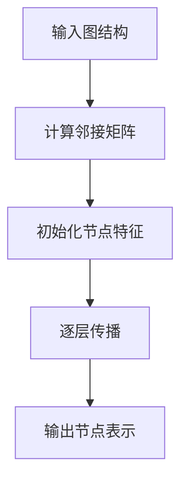
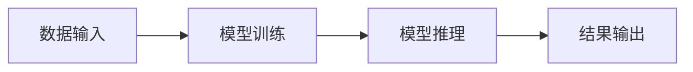

                 


# 图神经网络：处理结构化数据的AI Agent

## 关键词：图神经网络，结构化数据，AI Agent，深度学习，图数据

## 摘要：  
图神经网络（Graph Neural Networks, GNNs）是一种专门处理图结构化数据的深度学习模型，能够有效捕捉数据中的复杂关系和依赖性。本文将从图数据的基本概念出发，深入探讨图神经网络的核心原理、经典算法、系统设计以及实际应用。通过详细分析图神经网络的数学模型和算法流程，结合实际案例，帮助读者理解如何利用图神经网络构建高效的AI Agent，处理复杂的结构化数据问题。

---

## 第四章: 图神经网络的数学基础

### 4.1 图论基础

#### 4.1.1 图的表示与基本性质
- 图的表示：图由节点（顶点）和边（边）组成，可以表示为 $G = (V, E)$，其中 $V$ 是节点集合，$E$ 是边集合。
- 无向图与有向图：无向图中边没有方向，有向图中边有方向。
- 加权图：边可以有权重，表示为 $w_{ij}$。

#### 4.1.2 图的遍历
- 深度优先搜索（DFS）：从一个节点出发，尽可能深入访问节点。
- 广度优先搜索（BFS）：从一个节点出发，逐层访问所有相邻节点。
- 应用：图的遍历用于发现连通性、寻找最短路径等。

#### 4.1.3 常见的图类型
- 完全图：每对节点之间都有边相连。
- 树：无环连通图。
- 强连通图：图中任意两个节点之间都有路径相连。

### 4.2 线性代数基础

#### 4.2.1 向量与矩阵
- 向量：一维数组，表示节点的特征。
- 矩阵：二维数组，用于表示图的邻接矩阵或权重矩阵。

#### 4.2.2 矩阵运算
- 点积：$a \cdot b = \sum_{i=1}^{n} a_i b_i$
- 矩阵乘法：$C = AB$，其中 $C_{ij} = \sum_{k=1}^{m} A_{ik}B_{kj}$
- 转置：矩阵的行和列交换。

#### 4.2.3 特征分解
- 特征向量：矩阵作用下的不变方向向量。
- 特征值：特征向量在变换后的伸缩因子。

### 4.3 概率论基础

#### 4.3.1 概率分布
- 离散分布：如二项分布、泊松分布。
- 连续分布：如高斯分布、均匀分布。

#### 4.3.2 贝叶斯定理
- 贝叶斯定理：$P(A|B) = \frac{P(B|A)P(A)}{P(B)}$
- 应用：在图神经网络中用于概率推理和节点分类。

---

## 第五章: 图神经网络的算法原理

### 5.1 图卷积网络（GCN）

#### 5.1.1 GCN的数学模型
- 节点表示：$h_i^{(l)} = \sum_{j \in N(i)} \frac{1}{d_j} W^{(l)} h_j^{(l-1)}$
  其中，$N(i)$ 是节点 $i$ 的邻居，$d_j$ 是节点 $j$ 的度数。
- 邻接矩阵：$A$ 表示图的结构，$I$ 是单位矩阵。
- 算法流程图：



#### 5.1.2 GCN的实现
- 使用PyTorch实现GCN：
  ```python
  import torch
  import torch.nn as nn
  import torch.nn.functional as F

  class GCN(nn.Module):
      def __init__(self, in_channels, out_channels):
          super(GCN, self).__init__()
          self.W = nn.Parameter(torch.randn(in_channels, out_channels))
          self.bias = nn.Parameter(torch.randn(out_channels))

      def forward(self, x, A):
          # x: [n, in_channels], A: [n, n]
          support = torch.mm(A, x)
          out = torch.mm(support, self.W) + self.bias
          return F.relu(out)
  ```

### 5.2 图注意力网络（GAT）

#### 5.2.1 GAT的数学模型
- 注意力机制：$a^{T} [W_i h_i; W_j h_j]$
- 节点表示：$h_i^{(l)} = \sum_{j \in N(i)} \alpha_{ij} h_j^{(l-1)}$
  其中，$\alpha_{ij}$ 是注意力权重。

#### 5.2.2 GAT的实现
- 使用PyTorch实现GAT：
  ```python
  import torch
  import torch.nn as nn
  import torch.nn.functional as F

  class GAT(nn.Module):
      def __init__(self, in_channels, out_channels):
          super(GAT, self).__init__()
          self.W = nn.Parameter(torch.randn(in_channels, out_channels))
          self.a = nn.Parameter(torch.randn(out_channels, out_channels))

      def forward(self, x, A):
          h = torch.mm(A, x)
          h = torch.mm(h, self.W)
          attention = torch.mm(h, self.a)
          attention = F.softmax(attention, dim=1)
          out = torch.mm(attention, h)
          return F.relu(out)
  ```

---

## 第六章: 图神经网络的系统设计

### 6.1 系统架构设计

#### 6.1.1 系统功能模块
- 数据输入模块：接收图数据和节点特征。
- 模型训练模块：训练图神经网络模型。
- 推理模块：利用训练好的模型进行预测。

#### 6.1.2 系统架构图：



### 6.2 接口与交互设计

#### 6.2.1 系统接口
- 输入接口：接收图数据和节点特征。
- 输出接口：返回节点表示或预测结果。

#### 6.2.2 交互设计
- 用户通过API调用模型。
- 模型返回预测结果或节点表示。

### 6.3 实现细节

#### 6.3.1 系统实现代码
- 系统实现示例：
  ```python
  import torch
  import torch.nn as nn
  import torch.nn.functional as F

  class GraphNN(nn.Module):
      def __init__(self, in_channels, hidden_channels, out_channels):
          super(GraphNN, self).__init__()
          self.conv = GCN(in_channels, hidden_channels)
          self.fc = nn.Linear(hidden_channels, out_channels)

      def forward(self, x, A):
          h = self.conv(x, A)
          out = self.fc(h)
          return out
  ```

---

## 第七章: 图神经网络的项目实战

### 7.1 环境安装

#### 7.1.1 安装依赖
- 安装PyTorch和torch-geometric：
  ```bash
  pip install torch torch-geometric
  ```

### 7.2 核心功能实现

#### 7.2.1 数据准备
- 加载图数据和节点特征：
  ```python
  import torch
  from torch_geometric.data import Data

  edge_index = torch.tensor([[0, 1], [1, 0], [1, 2], [2, 1]], dtype=torch.long)
  x = torch.tensor([[1.0], [2.0], [3.0]], dtype=torch.float)
  data = Data(x=x, edge_index=edge_index)
  ```

#### 7.2.2 模型训练
- 训练GCN模型：
  ```python
  model = GCN(1, 2)
  optimizer = torch.optim.Adam(model.parameters(), lr=0.01)
  criterion = nn.MSELoss()

  for epoch in range(100):
      out = model(data.x, data.adj)
      loss = criterion(out, data.y)
      loss.backward()
      optimizer.step()
  ```

### 7.3 案例分析

#### 7.3.1 实际案例
- 社交网络中的节点分类：
  ```python
  import torch
  import torch.nn as nn
  import torch.nn.functional as F

  class GCN(nn.Module):
      def __init__(self, in_channels, hidden_channels, out_channels):
          super(GCN, self).__init__()
          self.conv1 = GCNConv(in_channels, hidden_channels)
          self.conv2 = GCNConv(hidden_channels, out_channels)

      def forward(self, x, edge_index):
          h = self.conv1(x, edge_index)
          h = F.relu(h)
          h = self.conv2(h, edge_index)
          return F.log_softmax(h, dim=1)
  ```

---

## 第八章: 图神经网络的高级主题

### 8.1 图神经网络的可扩展性

#### 8.1.1 大规模图数据的处理
- 使用分布式计算和并行处理。
- 分层图神经网络：将图分成多个子图进行处理。

#### 8.1.2 图神经网络的实时推理
- 使用边缘计算和流式处理。
- 实时更新模型权重。

### 8.2 图神经网络的多模态数据处理

#### 8.2.1 多模态图数据
- 文本、图像等多种数据类型。
- 跨模态特征融合。

#### 8.2.2 图神经网络与大语言模型的结合
- 将图结构数据与大规模语言模型结合。
- 跨模态推理和生成。

### 8.3 图神经网络的未来趋势

#### 8.3.1 图神经网络的轻量化
- 减少模型参数。
- 提高推理速度。

#### 8.3.2 图神经网络的可解释性
- 提供模型决策的可解释性。
- 调整模型行为。

---

## 作者信息

作者：AI天才研究院/AI Genius Institute & 禅与计算机程序设计艺术/Zen And The Art of Computer Programming

---

以上是《图神经网络：处理结构化数据的AI Agent》的完整目录和内容大纲。每一章都详细阐述了图神经网络的核心概念、算法原理、系统设计和实际应用，帮助读者从基础到高级全面掌握图神经网络的知识。

