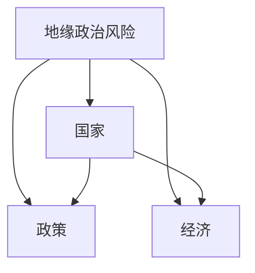
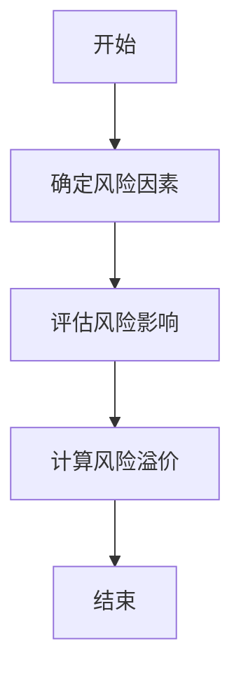
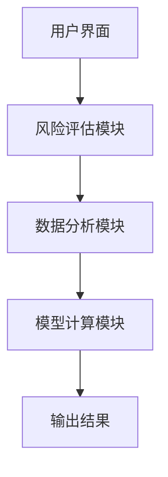

                 


# 地缘政治风险定价：如何在投资决策中考虑政治因素

**关键词：** 地缘政治风险、投资决策、风险定价、系统架构、数学模型、案例分析

**摘要：** 本文探讨如何在投资决策中考虑地缘政治风险，通过数学模型和系统架构的设计，详细分析地缘政治风险的构成及其定价方法，并通过实际案例展示其在投资中的应用。

---

## 第一部分: 地缘政治风险定价概述

### 第1章: 地缘政治风险与投资决策

#### 1.1 地缘政治风险的基本概念

##### 1.1.1 地缘政治风险的定义

地缘政治风险是指由于政治因素、国际关系紧张或政策变化等引起的市场风险，可能影响资产的价格和投资回报。这些风险通常难以预测，但可以通过系统的方法进行评估和定价。

##### 1.1.2 地缘政治风险的核心要素

- **政治稳定性**：政府更迭、政策变化等。
- **国际关系**：贸易争端、制裁措施等。
- **经济依赖**：资源分配、外资流动等。

##### 1.1.3 地缘政治风险与投资决策的关系

地缘政治风险直接影响投资回报，投资者需将其纳入决策模型，以合理定价资产，避免重大损失。

#### 1.2 地缘政治风险的影响因素

##### 1.2.1 政治环境的稳定性

- 民主制度 vs 专制制度。
- 政府更迭对政策的影响。

##### 1.2.2 经济政策的不确定性

- 货币政策、财政政策的变化。
- 外汇管制、税收政策等。

##### 1.2.3 地缘关系的紧张程度

- 贸易摩擦、军事冲突。
- 地区政治动荡对全球经济的影响。

#### 1.3 地缘政治风险定价的必要性

##### 1.3.1 投资决策中的风险识别

识别地缘政治风险是投资决策的第一步，需系统性地分析潜在风险因素。

##### 1.3.2 风险定价的重要性

合理定价可帮助投资者在高风险地区做出更明智的投资决策，平衡风险与收益。

##### 1.3.3 地缘政治风险对资产定价的影响

通过调整资产的预期收益，投资者可更准确地评估其价值，避免因政治因素导致的损失。

#### 1.4 本章小结

地缘政治风险是投资决策中不可忽视的因素，通过系统分析和模型构建，投资者可以更好地识别和定价这些风险。

---

## 第二部分: 地缘政治风险的核心概念与联系

### 第2章: 地缘政治风险的构成与属性

#### 2.1 地缘政治风险的构成要素

##### 2.1.1 政治制度与政策变化

不同政治制度下的政策稳定性不同，影响投资环境。

##### 2.1.2 国际关系与冲突

贸易摩擦、制裁措施等直接影响市场。

##### 2.1.3 经济依赖与资源分配

资源依赖程度高的国家面临更高的地缘政治风险。

#### 2.2 地缘政治风险的属性特征

##### 2.2.1 不确定性

风险的发生具有不可预测性，影响资产定价。

##### 2.2.2 传染性

局部风险可能扩散至全球市场，引发连锁反应。

##### 2.2.3 长期性

某些地缘政治问题可能长期存在，影响投资策略。

#### 2.3 地缘政治风险的ER实体关系图



---

## 第三部分: 地缘政治风险定价的数学模型与算法

### 第3章: 地缘政治风险定价的算法原理

#### 3.1 风险定价的基本原理

##### 3.1.1 风险-收益平衡

投资者通过预期收益补偿承担的风险。

##### 3.1.2 风险调整的现值模型

资产的现值需考虑风险调整后的折现率。

#### 3.2 地缘政治风险定价的数学模型

##### 3.2.1 风险调整现值模型（CAPM）

$$ CAPM = R_f + \beta (R_m - R_f) $$

其中，$\beta$ 为资产的系统性风险系数，$R_f$ 为无风险利率，$R_m$ 为市场预期收益率。

##### 3.2.2 风险溢价模型

$$ RP = \lambda \times R_p $$

$\lambda$ 为风险溢价系数，$R_p$ 为基准收益率。

#### 3.3 算法流程图



---

## 第四部分: 地缘政治风险定价的系统分析与架构设计

### 第4章: 地缘政治风险定价系统架构

#### 4.1 系统功能设计

##### 4.1.1 风险评估模块

收集和分析地缘政治事件，评估其对资产的影响。

##### 4.1.2 数据分析模块

处理历史数据，提取相关风险因素。

##### 4.1.3 模型计算模块

应用数学模型计算风险溢价。

#### 4.2 系统架构设计



#### 4.3 系统接口设计

##### 4.3.1 数据输入接口

接收外部数据源，如新闻、政府公告等。

##### 4.3.2 数据处理接口

对数据进行清洗和特征提取。

##### 4.3.3 结果输出接口

输出风险评估结果和定价建议。

---

## 第五部分: 地缘政治风险定价的项目实战

### 第5章: 项目实战与案例分析

#### 5.1 项目背景与目标

##### 5.1.1 项目背景

分析新兴市场国家的地缘政治风险，制定投资策略。

##### 5.1.2 项目目标

构建模型，评估风险，优化投资组合。

#### 5.2 核心代码实现

##### 5.2.1 数据预处理

```python
import pandas as pd

data = pd.read_csv('geopolitical_data.csv')
data.head()
```

##### 5.2.2 风险模型计算

```python
import numpy as np

beta = np.array([0.8, 1.2, 0.5])
rf = 0.02
rm = 0.1

expected_return = rf + beta * (rm - rf)
print(expected_return)
```

#### 5.3 案例分析

##### 5.3.1 案例：新兴市场投资

分析某新兴市场的地缘政治风险，计算风险溢价，调整资产配置。

##### 5.3.2 案例：能源行业投资

考虑地缘政治风险对能源价格的影响，制定投资策略。

#### 5.4 项目小结

通过实际案例分析，验证模型的有效性，优化投资策略。

---

## 总结

地缘政治风险是投资决策中不可忽视的因素，本文通过理论分析、数学建模和系统设计，提供了全面的解决方案。投资者需结合实际案例，灵活应用这些方法，以应对复杂的地缘政治环境。

**作者：AI天才研究院/AI Genius Institute & 禅与计算机程序设计艺术 /Zen And The Art of Computer Programming**

