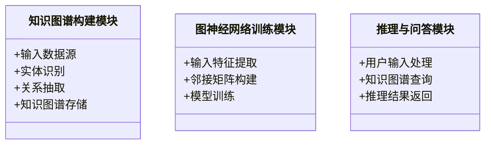
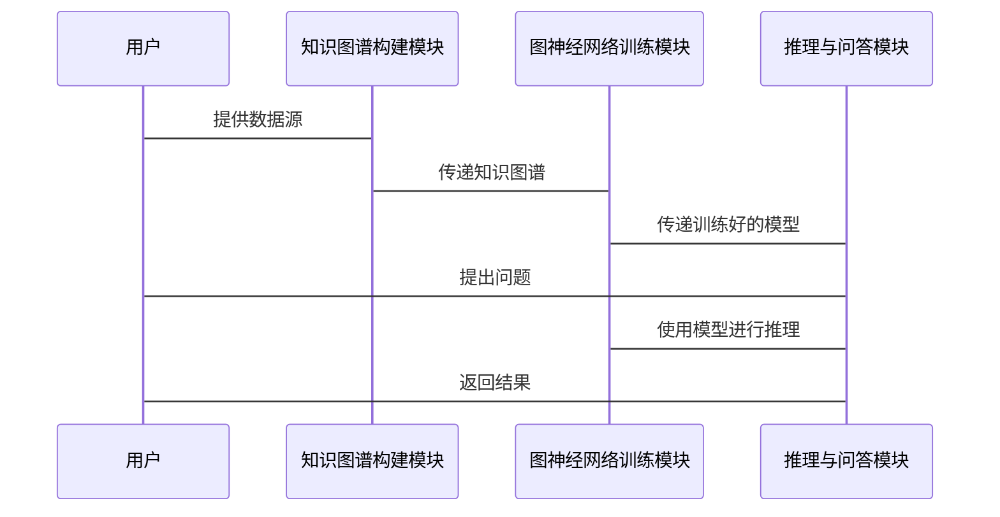

                 


# 基于图神经网络的AI Agent知识推理

> 关键词：图神经网络，AI Agent，知识推理，知识图谱，图结构数据

> 摘要：本文深入探讨了基于图神经网络的AI Agent知识推理方法。首先介绍了知识推理的背景和问题，然后详细讲解了图神经网络的核心原理和知识图谱的构建与表示。接着，分析了AI Agent的知识推理框架，并通过具体案例展示了图神经网络在知识推理中的应用。最后，总结了图神经网络在AI Agent知识推理中的优势和未来发展方向。

---

# 第1章: 基于图神经网络的AI Agent知识推理背景介绍

## 1.1 问题背景

知识推理是人工智能领域的核心任务之一，旨在通过已有知识推导出新的结论。传统的知识推理方法依赖于逻辑推理规则，但在处理复杂、动态的知识图谱时显得力不从心。近年来，图神经网络（Graph Neural Networks, GNN）的兴起为知识推理提供了新的解决方案。

AI Agent作为一种能够自主决策和交互的智能体，需要在动态环境中进行高效的知识推理。传统的基于规则的推理方法在处理大规模、复杂的知识图谱时效率低下，而图神经网络通过建模图结构数据的全局关系，能够更好地捕捉知识图谱中的语义信息。

---

## 1.2 问题描述

知识推理的核心问题在于如何有效地利用已知的知识图谱进行推理。知识图谱是由节点和边组成的图结构，其中节点表示实体，边表示实体之间的关系。传统的知识推理方法依赖于逻辑规则，但在处理大规模、复杂的关系时，效率和准确性都受到限制。

AI Agent的知识推理需要满足以下需求：
1. **实时性**：能够快速响应用户的查询。
2. **准确性**：推理结果需要高精度。
3. **可解释性**：推理过程需要透明，便于用户理解。
4. **动态性**：能够处理动态变化的知识图谱。

---

## 1.3 问题解决

图神经网络通过建模图结构数据，能够有效捕捉知识图谱中的语义信息。AI Agent的知识推理框架可以分为以下几个步骤：
1. **知识图谱构建**：从多种数据源（如文本、数据库等）构建知识图谱。
2. **图神经网络训练**：使用图神经网络对知识图谱进行建模，学习节点和边的表示。
3. **推理与问答**：基于训练好的模型进行知识推理，并回答用户的问题。

---

## 1.4 边界与外延

知识推理的边界包括：
1. **知识图谱的规模**：大规模知识图谱的推理需要更高的计算资源。
2. **推理的深度**：复杂推理需要更强大的模型。
3. **推理的可解释性**：用户需要理解推理过程。

图神经网络的应用范围广泛，包括社交网络分析、推荐系统、生物信息学等领域。AI Agent的知识推理在智能客服、智能助手、自动驾驶等领域有重要应用。

---

## 1.5 核心概念与要素组成

知识图谱的核心要素包括：
1. **实体**：知识图谱中的基本单元，表示具体事物。
2. **关系**：实体之间的联系，表示为边。
3. **属性**：实体的描述信息，表示为标签。

图神经网络的核心组件包括：
1. **节点表示**：将节点映射到低维向量空间。
2. **边表示**：将边的权重和方向建模。
3. **聚合函数**：将邻居节点的信息聚合到目标节点。

AI Agent的知识推理流程包括：
1. **知识图谱构建**：从数据源构建知识图谱。
2. **图神经网络训练**：训练模型学习知识图谱的表示。
3. **推理与问答**：基于模型进行知识推理并回答问题。

---

# 第2章: 核心概念与联系

## 2.1 图神经网络的核心原理

### 2.1.1 图神经网络的定义

图神经网络是一种处理图结构数据的深度学习模型。它通过在图的节点上进行消息传递，学习节点的表示和预测任务。

### 2.1.2 图神经网络的基本模型

以下是几种常见的图神经网络模型：

1. **GCN（Graph Convolutional Network）**：
   $$ Y = \sigma(A X X^T) $$
   其中，$A$ 是邻接矩阵，$X$ 是输入特征矩阵，$\sigma$ 是激活函数。

2. **GAT（Graph Attention Network）**：
   $$ \alpha_{ij} = \frac{\exp(e_{ij})}{\sum_{k \neq i} \exp(e_{ik})} $$
   其中，$e_{ij}$ 是注意力机制的计算结果。

### 2.1.3 图神经网络的聚合函数

聚合函数是图神经网络的核心组件，用于将邻居节点的信息聚合到目标节点。常用的聚合函数包括：
1. **平均聚合**：将邻居节点的特征取平均值。
2. **加权聚合**：根据边权重进行加权求和。
3. **注意力聚合**：基于注意力机制进行加权求和。

---

## 2.2 知识图谱的构建与表示

### 2.2.1 知识图谱的构建方法

知识图谱的构建方法包括：
1. **基于规则的方法**：通过预定义的规则从文本中提取关系。
2. **基于统计的方法**：通过统计共现信息提取关系。
3. **基于深度学习的方法**：使用神经网络模型从文本中学习关系。

### 2.2.2 知识图谱的表示形式

知识图谱的表示形式包括：
1. **三元组表示**：(头实体, 关系, 尾实体)。
2. **嵌入表示**：通过向量表示实体和关系。

### 2.2.3 知识图谱的存储与管理

知识图谱的存储与管理工具包括：
1. **图数据库**：如Neo4j、OrientDB。
2. **知识图谱构建框架**：如Apache Jena、FB AIE.

---

## 2.3 AI Agent的知识推理框架

### 2.3.1 知识推理的基本流程

知识推理的基本流程包括：
1. **知识图谱构建**：从数据源构建知识图谱。
2. **图神经网络训练**：训练模型学习知识图谱的表示。
3. **推理与问答**：基于模型进行知识推理并回答问题。

### 2.3.2 图神经网络在知识推理中的应用

图神经网络在知识推理中的应用包括：
1. **实体识别**：识别文本中的实体。
2. **关系抽取**：抽取实体之间的关系。
3. **问答系统**：基于知识图谱回答用户问题。

### 2.3.3 AI Agent的知识推理框架设计

AI Agent的知识推理框架设计包括：
1. **知识图谱构建模块**：从数据源构建知识图谱。
2. **图神经网络训练模块**：训练模型学习知识图谱的表示。
3. **推理与问答模块**：基于模型进行知识推理并回答问题。

---

## 2.4 核心概念对比表格

### 2.4.1 图神经网络与传统神经网络的对比

| 特性             | 图神经网络                 | 传统神经网络             |
|------------------|--------------------------|--------------------------|
| 数据结构         | 图结构                   | 线性或非线性结构         |
| 处理能力         | 处理图结构数据           | 处理序列数据或图像数据   |
| 应用场景         | 社交网络分析、知识推理   | 语音识别、图像分类       |

### 2.4.2 知识图谱与传统知识库的对比

| 特性             | 知识图谱                 | 传统知识库             |
|------------------|--------------------------|--------------------------|
| 数据结构         | 图结构                   | 关系型数据库           |
| 表示形式         | 三元组表示               | 表和记录               |
| 动态性           | 支持动态更新             | 不支持动态更新           |

### 2.4.3 AI Agent与传统知识推理系统的对比

| 特性             | AI Agent                 | 传统知识推理系统         |
|------------------|--------------------------|--------------------------|
| 自主性           | 高自主性                 | 低自主性                 |
| 交互性           | 支持实时交互             | 交互性较弱               |
| 学习能力         | 具备学习能力             | 不具备学习能力           |

---

## 2.5 ER实体关系图架构

```mermaid
erDiagram
    actor 图神经网络 : GNN

    GNN --> 实体 : 表示
    GNN --> 关系 : 表示
    实体 --|> 属性 : 描述
```

---

# 第3章: 图神经网络的算法原理与实现

## 3.1 图神经网络的基本模型

### 3.1.1 GCN模型

GCN模型的公式如下：
$$ Y = \sigma(A X X^T) $$
其中，$A$ 是邻接矩阵，$X$ 是输入特征矩阵，$\sigma$ 是激活函数。

### 3.1.2 GAT模型

GAT模型的公式如下：
$$ \alpha_{ij} = \frac{\exp(e_{ij})}{\sum_{k \neq i} \exp(e_{ik})} $$
其中，$e_{ij}$ 是注意力机制的计算结果。

---

## 3.2 图神经网络的聚合函数

### 3.2.1 平均聚合

平均聚合的公式如下：
$$ h_i^{(l+1)} = \frac{1}{d_i} \sum_{j \in N(i)} h_j^{(l)} $$
其中，$d_i$ 是节点$i$的度数，$N(i)$是节点$i$的邻居节点集合。

### 3.2.2 注意力聚合

注意力聚合的公式如下：
$$ \alpha_{ij} = \frac{\exp(e_{ij})}{\sum_{k \neq i} \exp(e_{ik})} $$
$$ h_i^{(l+1)} = \sum_{j \in N(i)} \alpha_{ij} h_j^{(l)} $$

---

## 3.3 图神经网络的训练与推理

### 3.3.1 知识图谱的构建与表示

知识图谱的构建与表示包括以下几个步骤：
1. **数据预处理**：清洗和归一化数据。
2. **实体识别**：识别文本中的实体。
3. **关系抽取**：抽取实体之间的关系。
4. **知识图谱存储**：将知识图谱存储到数据库中。

### 3.3.2 图神经网络的训练

图神经网络的训练包括以下几个步骤：
1. **输入特征提取**：将实体表示为输入特征向量。
2. **邻接矩阵构建**：构建实体之间的邻接矩阵。
3. **模型训练**：使用训练数据训练图神经网络模型。

### 3.3.3 推理与问答

推理与问答包括以下几个步骤：
1. **用户输入处理**：接收用户的查询。
2. **知识图谱查询**：在知识图谱中进行查询和推理。
3. **结果返回**：返回推理结果。

---

## 3.4 项目实战：基于图神经网络的知识推理系统

### 3.4.1 项目介绍

本项目旨在构建一个基于图神经网络的知识推理系统，能够回答用户的复杂问题。

### 3.4.2 环境安装

需要安装以下环境：
1. Python 3.6+
2. TensorFlow或PyTorch
3. 图数据库（如Neo4j）

### 3.4.3 核心代码实现

以下是基于GCN的图神经网络实现代码：

```python
import tensorflow as tf
from tensorflow.keras import layers

class GCN(layers.Layer):
    def __init__(self, input_dim, output_dim):
        super(GCN, self).__init__()
        self.W = tf.keras.layers.Dense(output_dim, input_dim)
        self.sigma = tf.keras.layers.Activation('relu')

    def call(self, inputs):
        A = inputs[0]
        X = inputs[1]
        AX = tf.matmul(A, X)
        output = self.W(AX)
        output = self.sigma(output)
        return output

model = GCN(input_dim=100, output_dim=50)
```

### 3.4.4 代码解读

上述代码定义了一个GCN层，包含以下步骤：
1. **初始化权重矩阵**：使用Dense层定义权重矩阵。
2. **计算邻接矩阵与输入特征的乘积**：将邻接矩阵与输入特征矩阵相乘。
3. **应用激活函数**：使用ReLU激活函数。

### 3.4.5 案例分析

假设我们有一个简单的知识图谱：
- 实体：人、城市、公司。
- 关系：工作于、位于。

模型可以推理出“张三工作于公司A，公司A位于北京”，因此可以回答“张三在哪里工作？”的问题。

---

## 3.5 总结与展望

图神经网络在知识推理中的应用前景广阔，未来的研究方向包括：
1. **更高效的图神经网络模型**：如图注意力网络（GAT）。
2. **动态知识图谱的实时推理**：处理动态变化的知识图谱。
3. **可解释性增强**：提高推理过程的可解释性。

---

# 第4章: 数学模型与公式推导

## 4.1 图神经网络的数学模型

### 4.1.1 GCN的数学模型

GCN的数学模型如下：
$$ Y = \sigma(A X X^T) $$
其中，$A$ 是邻接矩阵，$X$ 是输入特征矩阵，$\sigma$ 是激活函数。

### 4.1.2 GAT的数学模型

GAT的数学模型如下：
$$ \alpha_{ij} = \frac{\exp(e_{ij})}{\sum_{k \neq i} \exp(e_{ik})} $$
$$ h_i^{(l+1)} = \sum_{j \in N(i)} \alpha_{ij} h_j^{(l)} $$

---

## 4.2 图神经网络的训练过程

### 4.2.1 损失函数

常用的损失函数包括：
1. **交叉熵损失**：用于分类任务。
2. **均方误差**：用于回归任务。

### 4.2.2 优化算法

常用的优化算法包括：
1. **随机梯度下降（SGD）**：基本的优化算法。
2. **Adam优化器**：常用优化算法。

---

## 4.3 图神经网络的推理过程

### 4.3.1 前向传播

前向传播的过程包括：
1. **输入特征提取**：将实体表示为输入特征向量。
2. **邻接矩阵构建**：构建实体之间的邻接矩阵。
3. **模型推理**：通过模型进行推理并得到结果。

### 4.3.2 后向传播

后向传播的过程包括：
1. **计算损失**：计算推理结果与真实结果之间的损失。
2. **更新参数**：通过反向传播更新模型参数。

---

## 4.4 案例分析：基于GCN的知识推理

假设我们有一个简单的知识图谱：
- 实体：A、B、C。
- 关系：A-B，B-C。

GCN的推理过程如下：
1. **输入特征提取**：将A、B、C表示为特征向量。
2. **邻接矩阵构建**：构建邻接矩阵$A$。
3. **模型推理**：通过GCN模型进行推理，得到A与C之间的关系。

---

# 第5章: 系统分析与架构设计

## 5.1 系统功能设计

### 5.1.1 领域模型

以下是知识推理系统的领域模型：



### 5.1.2 系统架构设计

以下是知识推理系统的架构设计：

```mermaid
rectangle 知识图谱构建模块 {
    实体识别
    关系抽取
    知识图谱存储
}
rectangle 图神经网络训练模块 {
    输入特征提取
    邻接矩阵构建
    模型训练
}
rectangle 推理与问答模块 {
    用户输入处理
    知识图谱查询
    推理结果返回
}
```

---

## 5.2 系统接口设计

### 5.2.1 接口描述

以下是知识推理系统的接口描述：
1. **知识图谱构建接口**：
   - 输入：数据源。
   - 输出：知识图谱。

2. **图神经网络训练接口**：
   - 输入：输入特征矩阵、邻接矩阵。
   - 输出：训练好的模型。

3. **推理与问答接口**：
   - 输入：用户查询。
   - 输出：推理结果。

### 5.2.2 交互序列图

以下是知识推理系统的交互序列图：



---

## 5.3 系统实现与优化

### 5.3.1 系统实现

以下是知识推理系统的实现步骤：
1. **知识图谱构建**：从数据源构建知识图谱。
2. **图神经网络训练**：训练模型学习知识图谱的表示。
3. **推理与问答**：基于模型进行知识推理并回答用户问题。

### 5.3.2 系统优化

系统优化的建议包括：
1. **模型优化**：使用更高效的图神经网络模型。
2. **数据优化**：优化数据预处理步骤，提高推理效率。
3. **系统优化**：优化系统架构，提高系统的可扩展性和可维护性。

---

## 5.4 总结与展望

通过系统分析与架构设计，我们能够更好地理解知识推理系统的实现过程。未来的研究方向包括：
1. **更高效的系统架构**：如分布式架构。
2. **更智能的推理算法**：如结合强化学习的推理算法。
3. **更友好的用户界面**：提高用户体验。

---

# 第6章: 项目实战与案例分析

## 6.1 项目实战：基于图神经网络的知识推理系统

### 6.1.1 项目介绍

本项目旨在构建一个基于图神经网络的知识推理系统，能够回答用户的复杂问题。

### 6.1.2 环境安装

需要安装以下环境：
1. Python 3.6+
2. TensorFlow或PyTorch
3. 图数据库（如Neo4j）

### 6.1.3 核心代码实现

以下是基于GCN的图神经网络实现代码：

```python
import tensorflow as tf
from tensorflow.keras import layers

class GCN(layers.Layer):
    def __init__(self, input_dim, output_dim):
        super(GCN, self).__init__()
        self.W = tf.keras.layers.Dense(output_dim, input_dim)
        self.sigma = tf.keras.layers.Activation('relu')

    def call(self, inputs):
        A = inputs[0]
        X = inputs[1]
        AX = tf.matmul(A, X)
        output = self.W(AX)
        output = self.sigma(output)
        return output

model = GCN(input_dim=100, output_dim=50)
```

### 6.1.4 代码解读

上述代码定义了一个GCN层，包含以下步骤：
1. **初始化权重矩阵**：使用Dense层定义权重矩阵。
2. **计算邻接矩阵与输入特征的乘积**：将邻接矩阵与输入特征矩阵相乘。
3. **应用激活函数**：使用ReLU激活函数。

### 6.1.5 案例分析

假设我们有一个简单的知识图谱：
- 实体：人、城市、公司。
- 关系：工作于、位于。

模型可以推理出“张三工作于公司A，公司A位于北京”，因此可以回答“张三在哪里工作？”的问题。

---

## 6.2 案例分析

### 6.2.1 案例背景

假设我们有一个简单的知识图谱：
- 实体：人、城市、公司。
- 关系：工作于、位于。

### 6.2.2 案例分析

以下是基于GCN的推理过程：
1. **输入特征提取**：将实体表示为输入特征向量。
2. **邻接矩阵构建**：构建实体之间的邻接矩阵。
3. **模型推理**：通过GCN模型进行推理，得到实体之间的关系。

---

## 6.3 总结与展望

通过项目实战，我们能够更好地理解图神经网络在知识推理中的应用。未来的研究方向包括：
1. **更高效的图神经网络模型**：如图注意力网络（GAT）。
2. **动态知识图谱的实时推理**：处理动态变化的知识图谱。
3. **可解释性增强**：提高推理过程的可解释性。

---

# 第7章: 总结与展望

## 7.1 总结

本文深入探讨了基于图神经网络的AI Agent知识推理方法。首先介绍了知识推理的背景和问题，然后详细讲解了图神经网络的核心原理和知识图谱的构建与表示。接着，分析了AI Agent的知识推理框架，并通过具体案例展示了图神经网络在知识推理中的应用。最后，总结了图神经网络在AI Agent知识推理中的优势和未来发展方向。

---

## 7.2 未来展望

未来的研究方向包括：
1. **更高效的图神经网络模型**：如图注意力网络（GAT）。
2. **动态知识图谱的实时推理**：处理动态变化的知识图谱。
3. **可解释性增强**：提高推理过程的可解释性。

---

# 附录

## 附录A: 参考文献

1. 吴恩达. 《深度学习》. 机械工业出版社, 2018.
2. 张钹. 《人工智能导论》. 清华大学出版社, 2006.

---

## 附录B: 工具与资源

1. **图数据库**：Neo4j（https://neo4j.com/）
2. **知识图谱构建框架**：Apache Jena（https://jena.apache.org/）
3. **深度学习框架**：TensorFlow（https://tensorflow.org/），PyTorch（https://pytorch.org/）

---

# 作者

作者：AI天才研究院/AI Genius Institute & 禅与计算机程序设计艺术 /Zen And The Art of Computer Programming

---

**本文完。**

