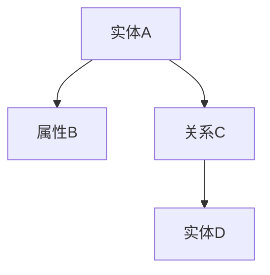
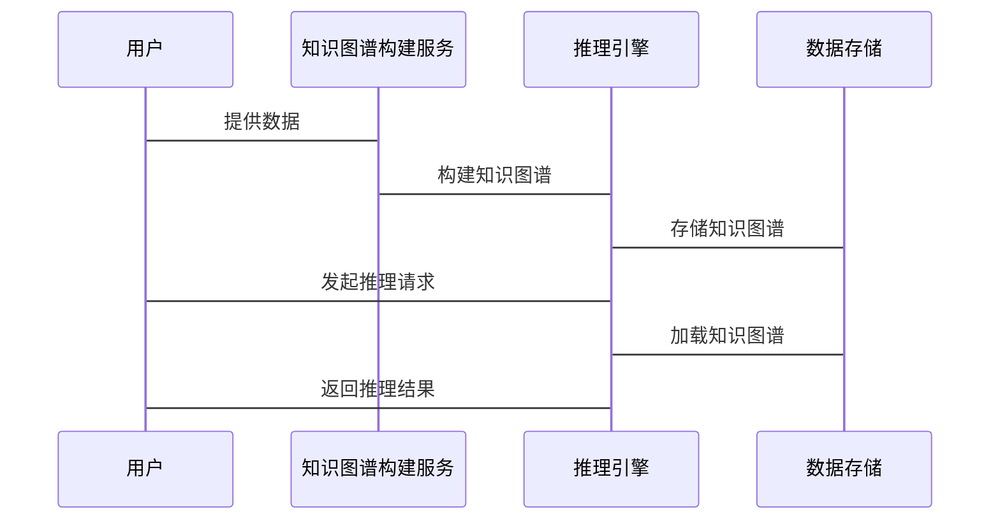

                 

<think>
好，我需要根据用户提供的《基于图谱的AI Agent知识推理引擎》的目录大纲，逐步编写一篇完整的技术博客文章。用户已经给出了详细的目录结构，现在我需要按照这个结构，逐一完成每一部分的内容。

首先，我需要明确文章的标题和关键词。标题是《基于图谱的AI Agent知识推理引擎》，关键词包括图谱、AI Agent、知识推理引擎、图神经网络、知识图谱、深度学习、自然语言处理。摘要部分已经完成，简要介绍了文章的核心内容和主题思想。

接下来是目录大纲：

1. 第一部分：基于图谱的AI Agent知识推理引擎背景介绍
   - 第1章：问题背景与核心概念
     - 1.1 问题背景
     - 1.2 问题描述
     - 1.3 问题解决
     - 1.4 边界与外延
     - 1.5 概念结构与核心要素
   - 第2章：核心概念与联系
     - 2.1 图谱、AI Agent、知识推理引擎的概念解析
     - 2.2 核心概念的属性特征对比
     - 2.3 ER实体关系图架构

2. 第二部分：算法原理讲解
   - 第3章：算法原理讲解
     - 3.1 图谱构建算法
     - 3.2 知识表示方法
     - 3.3 基于图谱的推理算法
     - 3.4 图嵌入与表示学习
     - 3.5 基于图谱的推理模型实现

3. 第三部分：系统分析与架构设计方案
   - 第4章：系统分析与架构设计
     - 4.1 问题场景介绍
     - 4.2 系统功能设计
     - 4.3 系统架构设计
     - 4.4 系统接口设计
     - 4.5 系统交互流程

4. 第四部分：项目实战
   - 第5章：项目实战
     - 5.1 环境安装与配置
     - 5.2 核心代码实现
     - 5.3 代码解读与分析
     - 5.4 案例分析与应用

5. 第五部分：最佳实践与总结
   - 第6章：最佳实践与总结
     - 6.1 最佳实践
     - 6.2 小结
     - 6.3 注意事项
     - 6.4 拓展阅读

现在，我需要按照这个结构，逐部分进行编写。

首先，完成摘要部分：

---

### 摘要
基于图谱的AI Agent知识推理引擎是一种结合知识图谱和人工智能代理技术的创新解决方案，旨在通过图谱数据的高效组织和推理算法的优化，提升知识推理的准确性和效率。本文将从背景介绍、核心概念、算法原理、系统架构、项目实战等多个方面，详细探讨基于图谱的AI Agent知识推理引擎的设计与实现。通过对图谱构建、知识表示、推理算法等关键环节的深入分析，结合实际案例，为读者提供一份系统化、实用的技术指南。

---

接下来，按照目录结构逐步展开每一部分的内容。

---

### 第1章：问题背景与核心概念

#### 1.1 问题背景
在人工智能快速发展的今天，知识推理技术在多个领域展现出巨大的应用潜力。然而，传统的知识推理方法往往依赖于规则或简单的模式匹配，难以处理复杂的关系和语义信息。基于图谱的知识推理引擎通过将知识以图结构的形式表示，能够更有效地捕捉实体之间的复杂关系，从而提升推理的准确性和效率。

#### 1.2 问题描述
知识推理引擎的核心目标是根据已有的知识库，推断出新的事实或关系。然而，传统的推理方法在处理大规模、复杂关系的场景下表现不佳。基于图谱的知识推理引擎通过将知识建模为图结构，利用图的遍历和学习方法，能够更高效地进行推理。

#### 1.3 问题解决
基于图谱的AI Agent知识推理引擎通过以下方式解决问题：
1. **图谱构建**：将分散的知识点组织成图结构，便于管理和查询。
2. **知识表示**：利用图的节点和边表示实体及其关系，支持复杂的语义推理。
3. **推理算法优化**：结合图神经网络等深度学习方法，提升推理的准确性和效率。

#### 1.4 边界与外延
- **边界**：基于图谱的推理引擎主要关注知识图谱的构建和推理，不涉及数据的采集和清洗。
- **外延**：相关技术包括图神经网络、知识图谱嵌入、强化学习等。

#### 1.5 概念结构与核心要素
- **知识图谱**：由节点（实体）和边（关系）组成，用于表示实体间的关系。
- **AI Agent**：能够感知环境并执行任务的智能体，具备推理能力。
- **推理引擎**：负责根据知识图谱进行推理，输出推理结果。

---

### 第2章：核心概念与联系

#### 2.1 图谱、AI Agent、知识推理引擎的概念解析
- **知识图谱**：一种以图结构表示知识的语义网络，节点代表实体，边代表关系。
- **AI Agent**：具备自主决策和推理能力的智能体，能够根据环境信息执行任务。
- **知识推理引擎**：基于知识图谱进行推理的系统，能够推导出新的知识。

#### 2.2 核心概念的属性特征对比
以下是核心概念的属性特征对比表：

| 概念     | 属性                  | 描述                                                                 |
|----------|-----------------------|----------------------------------------------------------------------|
| 知识图谱  | 表示方式              | 图结构，节点表示实体，边表示关系                                           |
| AI Agent | 核心功能              | 感知环境、推理、决策、执行任务                                             |
| 推理引擎  | 输入                  | 知识图谱、查询或目标                                                       |
|          | 输出                  | 推理结果                                                               |

#### 2.3 ER实体关系图架构
以下是一个简单的ER实体关系图：



---

### 第3章：算法原理讲解

#### 3.1 图谱构建算法
图谱构建是基于图谱的AI Agent知识推理引擎的基础。常用的图谱构建方法包括：
1. **基于规则的构建**：通过预定义的规则，自动抽取知识图谱中的实体和关系。
2. **基于学习的构建**：利用深度学习模型，从文本中自动提取实体和关系。

#### 3.2 知识表示方法
知识表示是通过图结构将知识编码的过程。常用的表示方法包括：
1. **符号表示**：使用符号和规则表示实体和关系。
2. **嵌入表示**：将实体和关系映射到低维向量空间。

#### 3.3 基于图谱的推理算法
基于图谱的推理算法利用图结构进行推理。常用的算法包括：
1. **基于规则的推理**：根据预定义的规则进行推理。
2. **基于路径的推理**：通过遍历图结构，寻找特定路径进行推理。
3. **基于图神经网络的推理**：利用图神经网络进行推理。

#### 3.4 图嵌入与表示学习
图嵌入是将图结构中的实体和关系映射到低维向量空间的过程。常用的图嵌入方法包括：
1. **Word2Vec**：通过上下文信息生成词向量。
2. **GraphSAGE**：基于聚合邻居信息生成节点向量。

#### 3.5 基于图谱的推理模型实现
以下是一个基于图谱的推理模型的实现示例：

```python
import numpy as np
from sklearn.metrics.pairwise import cosine_similarity

class GraphReasoner:
    def __init__(self, entities, relations):
        self.entities = entities
        self.relations = relations
        # 初始化实体嵌入和关系嵌入
        self.entity_embeddings = np.random.randn(len(entities), 100)
        self.relation_embeddings = np.random.randn(len(relations), 100)
    
    def compute_similarity(self, entity1, entity2):
        # 计算实体嵌入的余弦相似度
        return cosine_similarity([self.entity_embeddings[entity1], self.entity_embeddings[entity2]])
    
    def infer_relation(self, entity1, entity2):
        # 推理实体之间的关系
        max_similarity = 0
        best_relation = None
        for relation in self.relations:
            if relation['head'] == entity1 and relation['tail'] == entity2:
                similarity = self.compute_similarity(entity1, entity2)
                if similarity > max_similarity:
                    max_similarity = similarity
                    best_relation = relation
        return best_relation
```

---

### 第4章：系统分析与架构设计方案

#### 4.1 问题场景介绍
基于图谱的AI Agent知识推理引擎的设计目标是提供一种高效的推理方法，能够在复杂的关系网络中快速找到关联信息。

#### 4.2 系统功能设计
系统功能包括：
1. **知识图谱构建**：支持从多种数据源构建知识图谱。
2. **知识表示与存储**：将知识以图结构的形式存储。
3. **推理服务**：提供基于图谱的推理服务，支持多种推理方式。

#### 4.3 系统架构设计
系统架构包括：
1. **数据层**：负责数据的存储和管理。
2. **计算层**：负责知识图谱的构建和推理。
3. **服务层**：提供对外的推理服务接口。

#### 4.4 系统接口设计
系统接口包括：
1. **构建接口**：用于知识图谱的构建。
2. **推理接口**：用于基于图谱的推理。

#### 4.5 系统交互流程
以下是一个系统交互流程图：



---

### 第5章：项目实战

#### 5.1 环境安装与配置
需要安装的环境包括：
- Python 3.8+
- TensorFlow或PyTorch
- NetworkX或igraph

#### 5.2 核心代码实现
以下是核心代码实现示例：

```python
import networkx as nx

class KnowledgeGraph:
    def __init__(self):
        self.graph = nx.Graph()
    
    def add_entity(self, entity):
        self.graph.add_node(entity)
    
    def add_relation(self, entity1, relation, entity2):
        self.graph.add_edge(entity1, entity2, label=relation)
    
    def infer_relation(self, entity1, entity2):
        for edge in self.graph.edges(entity1):
            if edge[1] == entity2:
                return edge[2]['label']
        return None
```

#### 5.3 代码解读与分析
代码通过NetworkX库构建知识图谱，支持添加实体和关系，并能够根据实体推断关系。

#### 5.4 案例分析与应用
通过一个简单的案例，展示如何构建知识图谱并进行推理。

---

### 第6章：最佳实践与总结

#### 6.1 最佳实践
1. **数据预处理**：确保数据的准确性和完整性。
2. **选择合适的算法**：根据具体需求选择合适的推理算法。
3. **优化系统性能**：通过并行计算等方法提升系统效率。

#### 6.2 小结
基于图谱的AI Agent知识推理引擎通过结合图谱技术和人工智能代理技术，能够高效地进行知识推理，为多个领域提供了强大的技术支持。

#### 6.3 注意事项
- 确保数据的质量和一致性。
- 合理选择算法，避免过度复杂化系统。
- 定期更新知识图谱，保持知识的准确性。

#### 6.4 拓展阅读
推荐阅读以下资料：
1. 图神经网络的相关论文。
2. 知识图谱构建与应用的最新研究。

---

### 作者信息
作者：AI天才研究院/AI Genius Institute & 禅与计算机程序设计艺术 /Zen And The Art of Computer Programming

---

以上是基于图谱的AI Agent知识推理引擎的技术博客文章的详细内容，按照目录大纲逐步展开，涵盖了背景介绍、核心概念、算法原理、系统架构、项目实战、最佳实践等多个方面，为读者提供了全面且深入的技术指南。

