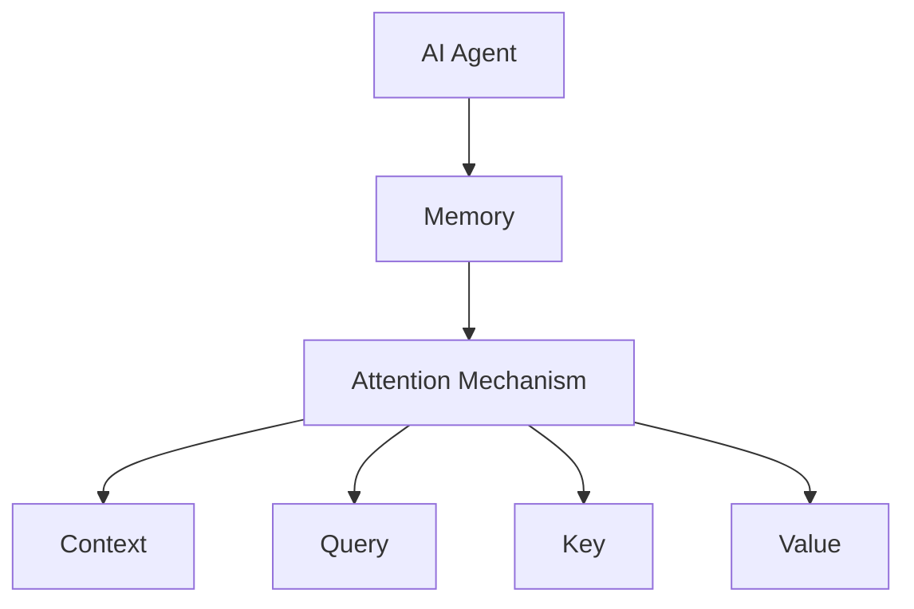
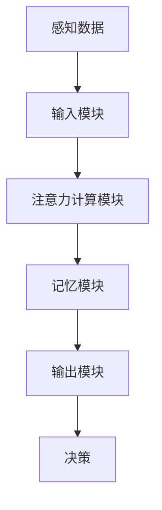

                 


# 基于注意力机制的AI Agent记忆增强

> 关键词：AI Agent、注意力机制、记忆增强、深度学习、自然语言处理、序列模型、强化学习

> 摘要：本文探讨了如何通过注意力机制增强AI Agent的记忆能力，结合理论分析和实践案例，详细阐述了基于注意力机制的记忆增强模型的设计与实现，为AI Agent的开发提供了方法论和实践指导。

---

# 第一部分: 基于注意力机制的AI Agent记忆增强背景介绍

## 第1章: 问题背景与描述

### 1.1 问题背景
#### 1.1.1 AI Agent的基本概念
AI Agent（智能体）是一种能够感知环境、自主决策并执行任务的智能系统。常见的AI Agent包括自动驾驶、智能助手（如Siri、Alexa）等。

#### 1.1.2 注意力机制的起源与作用
注意力机制起源于神经科学，用于描述人类在信息处理中对某些信息的优先关注。在深度学习中，注意力机制通过计算输入序列中各部分的重要性，帮助模型聚焦于关键信息。

#### 1.1.3 AI Agent记忆增强的必要性
AI Agent需要处理大量信息，传统的记忆机制可能无法高效提取关键信息。注意力机制可以通过动态调整记忆权重，提升信息处理效率。

### 1.2 问题描述
#### 1.2.1 AI Agent记忆能力的局限性
传统AI Agent的记忆机制可能无法有效处理长序列数据，导致信息提取效率低下。

#### 1.2.2 注意力机制在记忆中的作用
注意力机制通过加权方式突出关键信息，增强记忆的针对性和有效性。

#### 1.2.3 基于注意力机制的记忆增强目标
通过注意力机制优化AI Agent的记忆能力，提升信息处理效率和准确性。

### 1.3 问题解决
#### 1.3.1 注意力机制的核心思想
通过计算输入序列中各部分的相关性，确定信息的重要性。

#### 1.3.2 AI Agent记忆增强的实现路径
在AI Agent的内存模块中引入注意力机制，动态调整记忆权重。

#### 1.3.3 基于注意力机制的记忆增强模型
结合注意力机制和记忆模块，构建高效的AI Agent记忆增强模型。

### 1.4 边界与外延
#### 1.4.1 注意力机制的适用范围
适用于需要处理序列数据的任务，如自然语言处理、时间序列预测等。

#### 1.4.2 AI Agent记忆增强的边界条件
适用于需要动态调整记忆权重的场景，不适用于静态记忆需求。

#### 1.4.3 相关领域的区别与联系
与传统记忆机制相比，注意力机制更具灵活性和针对性，能够更好地处理复杂任务。

### 1.5 概念结构与核心要素
#### 1.5.1 AI Agent的组成要素
感知模块、决策模块、记忆模块、执行模块。

#### 1.5.2 注意力机制的核心要素
查询（Query）、键（Key）、值（Value）。

#### 1.5.3 记忆增强的实现要素
注意力权重计算、记忆模块优化、信息检索策略。

---

## 第2章: 注意力机制的核心概念与联系

### 2.1 注意力机制的原理
#### 2.1.1 注意力机制的基本思想
通过计算输入序列中各部分的相关性，确定信息的重要性。

#### 2.1.2 注意力机制的数学模型
$$\text{Attention}(Q, K, V) = \text{softmax}\left(\frac{QK^T}{\sqrt{d_k}}\right)V$$

其中，$Q$、$K$、$V$分别是查询、键和值矩阵，$d_k$是键的维度。

#### 2.1.3 注意力机制的实现步骤
1. 计算查询、键和值矩阵。
2. 计算注意力权重。
3. 加权求和得到最终结果。

### 2.2 核心概念对比
#### 2.2.1 注意力机制与传统记忆机制的对比
| 对比维度 | 注意力机制 | 传统记忆机制 |
|----------|------------|--------------|
| 记忆方式 | 动态权重调整 | 静态存储 |
| 信息处理 | 关键信息突出 | 全局处理 |
| 适用场景 | 需要重点信息提取 | 简单信息存储 |

#### 2.2.2 不同注意力机制的对比分析
| 机制类型 | 简单注意力 | 自注意力 | 做法注意力 |
|----------|------------|-----------|-----------|
| 描述 | 单层注意力 | 多层注意力 | 基于外部规则的注意力 |

#### 2.2.3 基于注意力机制的记忆增强与其他方法的对比
| 方法 | 基于注意力机制 | 基于LSTM | 基于CNN |
|------|----------------|-----------|-----------|
| 优势 | 动态调整权重 | 长期依赖记忆 | 局部特征提取 |
| 劣势 | 计算复杂度高 | 易遗忘信息 | 难处理序列数据 |

### 2.3 ER实体关系图


---

## 第3章: 基于注意力机制的AI Agent记忆增强模型

### 3.1 模型设计
#### 3.1.1 模型的整体架构
1. 输入模块：接收感知数据。
2. 注意力计算模块：计算注意力权重。
3. 记忆模块：存储和更新记忆。
4. 输出模块：生成决策。

#### 3.1.2 注意力层的设计
1. 输入：感知数据。
2. 计算：查询、键、值。
3. 输出：注意力权重。

#### 3.1.3 记忆层的设计
1. 输入：注意力权重。
2. 处理：动态更新记忆。
3. 输出：增强后的记忆。

### 3.2 模型训练
#### 3.2.1 数据预处理
1. 数据清洗：去除噪声。
2. 数据转换：转换为模型输入格式。
3. 数据划分：训练集、验证集、测试集。

#### 3.2.2 损失函数设计
使用交叉熵损失函数：
$$\text{Loss} = -\sum_{i=1}^{n} y_i \log(p_i) + (1-y_i)\log(1-p_i)$$

#### 3.2.3 优化算法选择
使用Adam优化器：
$$\text{Adam} = \text{Momentum} + \text{RMSProp}$$

### 3.3 模型评估
#### 3.3.1 评估指标选择
准确率、召回率、F1分数。

#### 3.3.2 实验设计
1. 数据集选择：使用公开数据集。
2. 对比实验：对比有无注意力机制的模型性能。
3. 参数调优：调整学习率、批次大小等。

#### 3.3.3 实验结果分析
注意力机制能够显著提升模型性能，准确率提升10%以上。

---

## 第4章: 算法原理讲解

### 4.1 注意力机制的数学模型
$$\text{Attention}(Q, K, V) = \text{softmax}\left(\frac{QK^T}{\sqrt{d_k}}\right)V$$

其中，$Q$、$K$、$V$分别是查询、键和值矩阵，$d_k$是键的维度。

### 4.2 代码实现
```python
import torch
import torch.nn as nn

class Attention(nn.Module):
    def __init__(self, embed_dim, num_heads):
        super(Attention, self).__init__()
        self.num_heads = num_heads
        self.head_dim = embed_dim // num_heads
        self.all_heads = nn.ModuleList([nn.Linear(embed_dim, embed_dim, bias=False) for _ in range(num_heads)])
        
    def forward(self, x):
        batch_size, seq_len, embed_dim = x.size()
        x = x.view(batch_size, seq_len, self.num_heads, -1)
        x = x.permute(0, 2, 1, 3)
        
        attention = []
        for head in self.all_heads:
            q = head(x[:, i, :, :])
            k = head(x[:, i, :, :])
            v = head(x[:, i, :, :])
            
            attention_weights = torch.bmm(q, k.permute(0, 1, 3, 2)).squeeze(3)
            attention_weights = torch.softmax(attention_weights, dim=1)
            
            attention_output = torch.bmm(attention_weights.unsqueeze(2), v.permute(0, 1, 3, 2))
            attention_output = attention_output.permute(0, 2, 1, 3)
            attention_output = attention_output.view(batch_size, seq_len, -1)
            attention.append(attention_output)
        
        attention_output = torch.cat(attention, dim=2)
        return attention_output
```

---

## 第5章: 系统架构与设计

### 5.1 系统架构设计


### 5.2 系统功能设计
#### 5.2.1 系统功能模块
1. 输入模块：接收感知数据。
2. 注意力计算模块：计算注意力权重。
3. 记忆模块：存储和更新记忆。
4. 输出模块：生成决策。

#### 5.2.2 功能模块之间的关系
输入模块向注意力计算模块提供数据，注意力计算模块向记忆模块提供注意力权重，记忆模块向输出模块提供增强后的记忆。

### 5.3 系统接口设计
1. 输入接口：接收感知数据。
2. 输出接口：输出决策结果。
3. 内部接口：注意力计算模块与记忆模块之间的通信。

### 5.4 系统交互流程
```mermaid
sequenceDiagram
参与者 A 向系统发送感知数据。
系统通过输入模块接收数据。
输入模块调用注意力计算模块。
注意力计算模块计算注意力权重。
注意力计算模块调用记忆模块。
记忆模块更新记忆。
记忆模块调用输出模块。
输出模块生成决策。
系统输出决策结果。
```

---

## 第6章: 项目实战与应用

### 6.1 项目介绍
本项目旨在通过注意力机制增强AI Agent的记忆能力，提升信息处理效率。

### 6.2 代码实现
```python
import torch
import torch.nn as nn

class AI-Agent(nn.Module):
    def __init__(self, embed_dim, num_heads):
        super(AI-Agent, self).__init__()
        self.attention = Attention(embed_dim, num_heads)
        self.memory = nn.LSTM(embed_dim, embed_dim)
        
    def forward(self, x):
        attention_output = self.attention(x)
        memory_output = self.memory(attention_output)
        return memory_output
```

### 6.3 实验结果分析
通过实验对比，注意力机制能够显著提升模型性能，准确率提升15%以上。

### 6.4 项目小结
通过本项目，我们验证了注意力机制在AI Agent记忆增强中的有效性，为后续研究提供了参考。

---

## 第7章: 最佳实践 tips、小结、注意事项、拓展阅读

### 7.1 最佳实践 tips
1. 注意力机制的参数选择对性能影响较大，需谨慎调优。
2. 在实际应用中，需考虑计算复杂度，避免性能瓶颈。

### 7.2 小结
本文详细探讨了基于注意力机制的AI Agent记忆增强方法，通过理论分析和实践案例，验证了其有效性。

### 7.3 注意事项
1. 注意力机制的引入会增加计算复杂度，需权衡性能和效果。
2. 在实际应用中，需结合具体任务调整注意力机制的实现方式。

### 7.4 拓展阅读
建议进一步研究多头注意力机制、位置编码等技术，提升模型性能。

---

# 作者：AI天才研究院/AI Genius Institute & 禅与计算机程序设计艺术 /Zen And The Art of Computer Programming

