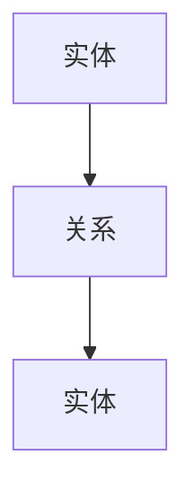
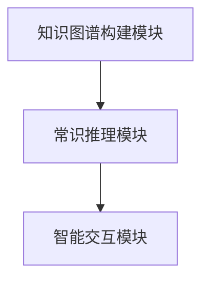

                 


# 基于知识图谱的AI Agent常识推理

> 关键词：知识图谱，AI Agent，常识推理，语义网络，深度学习，符号推理，图嵌入，注意力机制

> 摘要：知识图谱为AI Agent提供了强大的知识基础，通过符号推理和深度学习的结合，实现常识推理。本文详细探讨了基于知识图谱的AI Agent常识推理的背景、核心概念、算法原理、系统架构和项目实战。

---

# 第1章: 知识图谱与AI Agent概述

## 1.1 知识图谱的基本概念
### 1.1.1 知识图谱的定义与特点
知识图谱是一种以图结构表示知识的语义网络，由实体（node）和关系（edge）组成。其特点包括：
- **可扩展性**：支持大规模知识的构建和存储。
- **语义性**：通过关系和属性描述实体的语义。
- **结构化**：便于计算机理解和推理。

### 1.1.2 知识图谱的构建与应用
知识图谱的构建通常包括数据采集、清洗、抽取、融合和存储等步骤。其应用广泛，如搜索引擎优化、智能问答系统、推荐系统等。

### 1.1.3 知识图谱与传统数据库的区别
传统数据库主要存储结构化数据，缺乏语义信息。知识图谱则通过语义网络表示知识，能够支持复杂的语义查询和推理。

## 1.2 AI Agent的基本概念
### 1.2.1 AI Agent的定义与分类
AI Agent是一种智能实体，能够感知环境并执行任务。根据智能水平，AI Agent可以分为反应式和认知式。

### 1.2.2 AI Agent的核心功能与特点
- **感知**：通过传感器或数据源获取信息。
- **推理**：基于知识库进行逻辑推理。
- **决策**：根据推理结果做出决策。
- **行动**：执行任务或与环境交互。

### 1.2.3 AI Agent在智能系统中的作用
AI Agent作为智能系统的核心组件，能够实现自主决策、问题解决和人机交互。

## 1.3 知识图谱与AI Agent的结合
### 1.3.1 知识图谱在AI Agent中的应用价值
知识图谱为AI Agent提供了丰富的知识库，支持其进行语义理解、关联推理和上下文感知。

### 1.3.2 基于知识图谱的AI Agent优势
- **知识丰富性**：知识图谱提供了广泛的知识基础。
- **推理能力**：基于知识图谱的推理算法增强了AI Agent的智能性。
- **动态更新**：知识图谱可以动态更新，适应环境变化。

### 1.3.3 知识图谱与AI Agent的结合场景
- **智能问答**：基于知识图谱的问答系统。
- **推荐系统**：通过知识图谱进行个性化推荐。
- **智能对话**：结合知识图谱进行上下文对话。

## 1.4 本章小结
知识图谱为AI Agent提供了强大的知识基础，二者结合能够显著提升AI Agent的智能性和推理能力。

---

# 第2章: 基于知识图谱的常识推理背景与问题分析

## 2.1 问题背景
### 2.1.1 AI Agent在常识推理中的挑战
AI Agent需要具备常识推理能力，以应对复杂的现实场景。然而，传统方法在处理常识推理时存在以下挑战：
- **知识表示**：难以表示复杂的常识。
- **推理能力**：缺乏有效的推理算法。
- **动态更新**：难以适应动态变化的环境。

### 2.1.2 知识图谱在常识推理中的作用
知识图谱提供了结构化的知识表示，支持高效的语义推理和关联分析。

## 2.2 问题描述
### 2.2.1 常识推理的基本概念
常识推理是指AI Agent能够理解并运用常识进行推理的能力。

### 2.2.2 知识图谱在常识推理中的关键问题
- **知识完整性**：知识图谱需要涵盖足够的常识。
- **推理算法**：需要高效的推理算法支持。

## 2.3 问题解决
### 2.3.1 知识图谱构建方法
- **数据来源**：包括结构化数据和非结构化数据。
- **数据清洗**：去除噪声数据。
- **数据融合**：整合多源数据。

### 2.3.2 基于知识图谱的推理算法
- **符号推理**：基于逻辑规则的推理。
- **语义推理**：基于语义网络的推理。

## 2.4 边界与外延
### 2.4.1 知识图谱的边界
知识图谱主要用于常识推理，不涉及情感分析或语境理解。

### 2.4.2 AI Agent的常识推理能力的局限性
- **知识覆盖**：常识范围广泛，难以完全覆盖。
- **推理深度**：复杂的推理任务需要更强大的算法支持。

## 2.5 概念结构与核心要素
### 2.5.1 知识图谱的核心要素
- 实体：代表具体事物。
- 关系：表示实体之间的关联。
- 属性：描述实体的特征。

### 2.5.2 AI Agent的推理机制
- **感知层**：获取环境信息。
- **知识层**：基于知识图谱进行推理。
- **决策层**：根据推理结果做出决策。

## 2.6 本章小结
基于知识图谱的常识推理为AI Agent提供了强大的知识支持，但仍需解决知识覆盖和推理深度的问题。

---

# 第3章: 知识图谱与AI Agent的核心概念与联系

## 3.1 知识图谱的核心概念
### 3.1.1 实体与关系的定义
实体是知识图谱的基本单元，关系描述实体之间的关联。

### 3.1.2 知识图谱的构建流程
1. 数据采集：获取多源数据。
2. 数据清洗：去除噪声。
3. 数据融合：整合数据。
4. 数据存储：存储在图数据库中。

### 3.1.3 知识图谱的存储与表示
常用图数据库（如Neo4j）存储知识图谱，使用RDF表示数据。

## 3.2 AI Agent的核心概念
### 3.2.1 感知与理解
AI Agent通过传感器或API获取环境信息。

### 3.2.2 决策与推理
基于知识图谱进行逻辑推理，做出决策。

### 3.2.3 行为与交互
AI Agent根据决策执行任务或与用户交互。

## 3.3 知识图谱与AI Agent的关系
### 3.3.1 知识图谱为AI Agent提供知识基础
知识图谱为AI Agent提供了丰富的常识和领域知识。

### 3.3.2 AI Agent利用知识图谱进行推理
AI Agent通过知识图谱进行语义推理和关联分析。

### 3.3.3 知识图谱与AI Agent的协同进化
知识图谱和AI Agent相互促进，共同提升智能水平。

## 3.4 核心概念的对比分析
### 3.4.1 知识图谱与语义网络的对比
| 特性 | 知识图谱 | 语义网络 |
|------|----------|----------|
| 结构 | 图结构 | 图结构 |
| 表示 | 实体、关系 | 实体、关系 |
| 应用 | 智能问答、推荐系统 | 自然语言处理、知识推理 |

### 3.4.2 AI Agent与传统专家系统的对比
| 特性 | AI Agent | 传统专家系统 |
|------|----------|--------------|
| 智能水平 | 高 | 中 |
| 自主性 | 高 | 低 |
| 适应性 | 高 | 中 |

## 3.5 ER实体关系图架构


## 3.6 本章小结
知识图谱与AI Agent在核心概念上密切相关，通过协同工作，能够提升AI Agent的智能性和推理能力。

---

# 第4章: 基于知识图谱的常识推理算法原理

## 4.1 知识图谱表示学习
### 4.1.1 图嵌入技术
图嵌入是将图结构数据映射到低维向量空间的技术，常用方法包括：
- **节点嵌入**：如Node2Vec。
- **边嵌入**：如Edge2Vec。

### 4.1.2 知识图谱嵌入的数学模型
图嵌入模型通常采用矩阵分解方法，表示节点和边的向量。

## 4.2 基于知识图谱的符号推理
### 4.2.1 符号推理的基本原理
符号推理基于逻辑规则进行推导，常用算法包括：
- **逻辑推理**：如Modus Ponens。
- **反向链推理**：从目标回溯到前提。

### 4.2.2 符号推理的实现
使用知识图谱中的逻辑规则进行推理，生成新的知识。

## 4.3 基于深度学习的常识推理
### 4.3.1 神经符号推理
神经符号推理结合了符号推理和深度学习，常用模型包括：
- **Neural Logic Programming**。
- **Graph Neural Networks (GNNs)**。

### 4.3.2 注意力机制在常识推理中的应用
注意力机制用于关注重要的节点和关系，提升推理效果。

## 4.4 基于知识图谱的混合推理
### 4.4.1 混合推理的优势
结合符号推理和深度学习的优点，提升推理的准确性和效率。

### 4.4.2 混合推理的实现
使用符号推理和深度学习模型协同工作，进行常识推理。

## 4.5 本章小结
基于知识图谱的常识推理算法结合了符号推理和深度学习，能够有效提升推理能力。

---

# 第5章: 基于知识图谱的AI Agent系统架构设计

## 5.1 问题场景介绍
### 5.1.1 系统目标
设计一个基于知识图谱的AI Agent，实现常识推理和智能交互。

### 5.1.2 使用场景
应用于智能问答、推荐系统、智能对话等领域。

## 5.2 系统功能设计
### 5.2.1 知识图谱构建模块
负责构建和维护知识图谱。

### 5.2.2 常识推理模块
基于知识图谱进行推理，生成推理结果。

### 5.2.3 智能交互模块
实现与用户的自然语言交互。

## 5.3 系统架构设计
### 5.3.1 模块划分
- 知识图谱构建模块
- 常识推理模块
- 智能交互模块

### 5.3.2 模块交互流程
1. 用户输入查询。
2. 知识图谱构建模块获取知识图谱。
3. 常识推理模块进行推理。
4. 智能交互模块生成响应。

## 5.4 系统架构图


## 5.5 本章小结
系统架构设计为基于知识图谱的AI Agent提供了清晰的模块划分和交互流程。

---

# 第6章: 基于知识图谱的AI Agent项目实战

## 6.1 环境安装
### 6.1.1 知识图谱构建工具
- 使用Neo4j构建知识图谱。
- 使用Python编写构建脚本。

### 6.1.2 AI Agent开发框架
- 使用Rasa框架开发智能交互模块。

## 6.2 系统核心实现源代码
### 6.2.1 知识图谱构建代码
```python
import neo4j
from neo4j import GraphDatabase

class KnowledgeGraph:
    def __init__(self, uri, user, password):
        self.driver = GraphDatabase.driver(uri, user, password)
    
    def create_entity(self, entity):
        with self.driver.session() as session:
            session.run("CREATE (:Entity {name: $name})", name=entity)
```

### 6.2.2 常识推理代码
```python
def infer_relation(entity1, entity2):
    # 基于知识图谱的推理算法
    pass
```

## 6.3 代码应用解读与分析
### 6.3.1 知识图谱构建部分
通过Neo4j数据库构建知识图谱，存储实体和关系。

### 6.3.2 常识推理部分
使用符号推理和深度学习算法进行推理。

## 6.4 实际案例分析
### 6.4.1 案例背景
设计一个智能问答系统，基于知识图谱进行推理。

### 6.4.2 案例实现
实现用户查询的推理过程，生成答案。

## 6.5 项目小结
通过项目实战，验证了基于知识图谱的AI Agent在常识推理中的有效性。

---

# 第7章: 总结与展望

## 7.1 本章小结
本文详细探讨了基于知识图谱的AI Agent常识推理的背景、核心概念、算法原理和系统架构设计。

## 7.2 未来展望
未来的研究方向包括：
- 更高效的推理算法。
- 更智能的知识图谱构建方法。
- 更强大的AI Agent应用。

## 7.3 最佳实践
- 使用知识图谱构建模块化系统。
- 结合符号推理和深度学习提升推理能力。

## 7.4 注意事项
- 知识图谱的构建需要考虑数据质量和覆盖范围。
- 常识推理的准确性和效率需要不断优化。

## 7.5 拓展阅读
推荐阅读相关领域的书籍和论文，如《知识图谱入门与实践》。

---

# 作者：AI天才研究院/AI Genius Institute & 禅与计算机程序设计艺术 /Zen And The Art of Computer Programming

---

以上是基于知识图谱的AI Agent常识推理的技术博客文章目录大纲，希望对您有所帮助！

