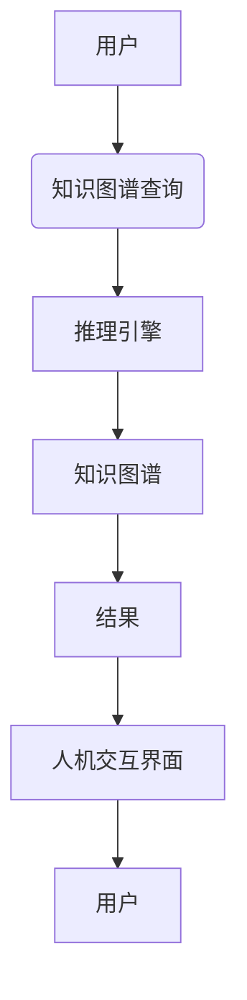

                 


# 基于知识图谱的AI Agent推理系统

> 关键词：知识图谱，AI Agent，推理系统，智能问答，智能搜索引擎，智慧医疗

> 摘要：本文探讨了基于知识图谱的AI Agent推理系统的构建与应用。首先介绍了知识图谱的基本概念、构建方法及其在不同场景中的应用。接着详细阐述了AI Agent的原理，包括其定义、类型和决策机制。然后，重点分析了知识图谱与AI Agent结合的推理机制、对话系统及多智能体协作。最后，通过一个实际案例展示了系统的构建过程，并探讨了未来的研究方向。

---

## 第一部分: 知识图谱基础

### 第1章: 知识图谱的基本概念

#### 1.1 知识图谱的定义与特点

知识图谱是一种以图结构形式表示知识的语义网络，节点代表实体或概念，边表示实体之间的关系。知识图谱具有以下特点：

- **结构化**：通过节点和边的组合，能够清晰表示实体间的关系。
- **语义化**：通过语义信息的嵌入，能够理解上下文。
- **可扩展性**：能够轻松添加新的实体和关系。

#### 1.2 知识图谱的构建方法

知识图谱的构建通常包括数据抽取、融合和存储三个阶段。常见的构建方法有：

- **基于规则的方法**：通过预定义规则提取实体和关系。
- **基于深度学习的方法**：利用神经网络模型从文本中自动抽取实体和关系。

#### 1.3 知识图谱的应用场景

知识图谱在多个领域有广泛应用，如智能搜索引擎、智能问答系统和智慧医疗。

---

### 第2章: 知识图谱的构建技术

#### 2.1 知识抽取与实体识别

知识抽取是从文本中提取实体和关系的过程。实体识别是知识抽取的第一步，常用的方法包括基于规则和基于深度学习的方法。

#### 2.2 关系抽取与属性提取

关系抽取是识别文本中实体之间的关系。属性提取则是从文本中提取实体的属性信息。

#### 2.3 知识图谱的存储与管理

知识图谱的存储通常使用图数据库，如Neo4j。知识图谱的查询语言主要有SPARQL和Cypher。

---

## 第二部分: AI Agent的原理与应用

### 第3章: AI Agent的基本概念

#### 3.1 AI Agent的定义与类型

AI Agent是一种能够感知环境并采取行动以实现目标的智能实体。常见的AI Agent类型包括简单反射型、基于模型的反射型和目标驱动型。

#### 3.2 AI Agent的决策机制

AI Agent的决策机制包括基于规则的决策和基于学习的决策。基于规则的决策通过预定义的规则进行推理，基于学习的决策通过机器学习模型进行预测。

---

### 第4章: 基于知识图谱的AI Agent推理系统

#### 4.1 知识图谱与AI Agent的结合

知识图谱为AI Agent提供了丰富的知识表示，能够帮助AI Agent更好地理解上下文并进行推理。

#### 4.2 知识图谱推理机制

知识图谱推理是通过逻辑推理引擎在知识图谱中进行推导的过程。常见的推理方法包括基于规则的推理和基于学习的推理。

#### 4.3 对话系统与知识图谱

知识图谱可以为对话系统提供背景知识，帮助AI Agent更好地理解用户意图并生成准确的回答。

---

### 第5章: 多智能体协作与知识图谱

#### 5.1 多智能体协作的定义

多智能体协作是指多个智能体协同工作以完成复杂任务的过程。

#### 5.2 知识图谱在多智能体协作中的应用

知识图谱可以为多智能体协作提供共享知识库，帮助智能体之间更好地协同工作。

---

## 第三部分: 系统架构与设计

### 第6章: 系统架构设计

#### 6.1 系统功能设计

系统功能包括知识图谱的构建、AI Agent的推理和人机交互。

#### 6.2 系统架构图

以下是系统的架构图：



---

## 第四部分: 项目实战

### 第7章: 项目实战

#### 7.1 环境安装

需要安装Python、TensorFlow、Neo4j和相关库。

#### 7.2 核心代码实现

以下是知识图谱构建和AI Agent推理的核心代码：

```python
# 知识图谱构建
class KnowledgeGraph:
    def __init__(self):
        self.nodes = {}  # 存储节点
        self.edges = {}  # 存储边

    def add_node(self, node_id, label):
        self.nodes[node_id] = label

    def add_edge(self, node1, node2, relation):
        self.edges[(node1, node2)] = relation

# AI Agent推理
class AI_Agent:
    def __init__(self, knowledge_graph):
        self.knowledge_graph = knowledge_graph

    def infer(self, query):
        # 简单的推理逻辑
        return self.knowledge_graph.edges.get(query, None)
```

#### 7.3 案例分析

通过一个简单的问答系统案例，展示知识图谱和AI Agent推理系统的实际应用。

---

## 第五部分: 扩展与展望

### 第8章: 未来研究方向

#### 8.1 知识图谱的动态更新

如何实现实时更新和维护知识图谱是一个重要的研究方向。

#### 8.2 多模态知识图谱

将图像、音频等多种模态的数据融入知识图谱，是未来的研究热点。

#### 8.3 AI Agent的自主学习

如何让AI Agent具备自主学习能力，是未来发展的关键。

---

## 作者：AI天才研究院 & 禅与计算机程序设计艺术

---

本文详细介绍了基于知识图谱的AI Agent推理系统的构建与应用，从知识图谱的基础到AI Agent的原理，再到系统的实际应用，为读者提供了一个全面的技术视角。

