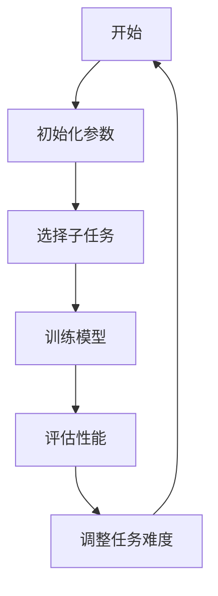
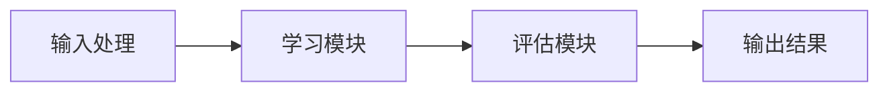

                 


# 基于课程学习的AI Agent能力进阶

> **关键词**: 课程学习, AI Agent, 人工智能, 能力进阶, 系统设计

> **摘要**: 本文深入探讨了基于课程学习的AI Agent能力提升方法，从课程学习的核心概念到AI Agent的设计与实现，详细分析了课程学习在AI Agent能力进阶中的应用。文章结合数学模型、算法原理和系统架构设计，通过实际案例展示课程学习在AI Agent中的具体应用，帮助读者全面理解并掌握基于课程学习的AI Agent能力进阶方法。

---

## 第一章：课程学习与AI Agent的背景

### 1.1 课程学习的核心概念

课程学习（Curriculum Learning）是一种机器学习策略，通过逐步调整任务难度，引导模型从简单到复杂地学习知识。其核心在于将复杂任务分解为一系列递增难度的子任务，确保模型在每个阶段都能高效学习。

#### 1.1.1 课程学习的定义与特点
- **定义**: 课程学习是指在学习过程中，逐步增加任务的难度，使学习者能够逐步掌握知识。
- **特点**: 任务难度递增、学习目标明确、学习效率高。

#### 1.1.2 AI Agent的基本概念
- **定义**: AI Agent是具有感知环境和自主决策能力的智能体。
- **特点**: 反应性、主动性、社会性、适应性。

#### 1.1.3 课程学习在AI Agent中的重要性
- 通过课程学习，AI Agent能够逐步掌握复杂任务，提升整体能力。

### 1.2 课程学习与AI Agent的关系
- **课程学习如何提升AI Agent能力**: 通过递进式学习策略，帮助AI Agent逐步掌握复杂任务。
- **AI Agent的课程学习框架**: 包括任务分解、知识表示、学习策略等关键模块。

---

## 第二章：课程学习的核心原理

### 2.1 课程学习的数学模型

#### 2.1.1 基于监督学习的课程模型
- **数学公式**: 假设损失函数为$L$，学习目标为最小化$L$。
  $$ L = \frac{1}{n}\sum_{i=1}^{n}(y_i - \hat{y_i})^2 $$

#### 2.1.2 基于强化学习的课程模型
- **Q-learning算法**: 
  $$ Q(s, a) = r + \gamma \max_{a'} Q(s', a') $$
  其中，$Q(s, a)$表示状态-动作对的价值，$r$为奖励，$\gamma$为折扣因子。

#### 2.1.3 基于迁移学习的课程模型
- 通过迁移学习，将低难度任务的知识迁移到高难度任务中。

### 2.2 课程学习的算法实现

#### 2.2.1 算法流程图（Mermaid）


---

## 第三章：AI Agent的能力模型设计

### 3.1 任务分解与知识表示

#### 3.1.1 任务分解
- 将复杂任务分解为简单子任务，例如图像分类任务可以分解为边缘检测、特征提取等步骤。

#### 3.1.2 知识表示
- 使用知识图谱或向量表示法，例如Word2Vec。

### 3.2 技能学习与能力提升

#### 3.2.1 技能学习
- 通过监督学习、强化学习等方法实现技能的逐步掌握。

#### 3.2.2 能力提升
- 通过课程学习策略，逐步提升AI Agent的综合能力。

---

## 第四章：系统架构设计与实现

### 4.1 系统架构设计

#### 4.1.1 系统模块划分
- **输入处理模块**: 处理输入数据。
- **学习模块**: 执行课程学习。
- **评估模块**: 评估学习效果。

#### 4.1.2 系统架构图（Mermaid）


### 4.2 系统实现

#### 4.2.1 系统核心代码（Python）
```python
class CurriculumLearning:
    def __init__(self, tasks):
        self.tasks = tasks
        self.current_task = 0

    def train(self):
        while self.current_task < len(self.tasks):
            task = self.tasks[self.current_task]
            # 训练模型
            model.train(task)
            # 评估性能
            if model.evaluate(task) >= threshold:
                self.current_task += 1
```

---

## 第五章：项目实战与案例分析

### 5.1 项目实战

#### 5.1.1 环境安装
- 安装必要的库，如TensorFlow、Keras等。

#### 5.1.2 核心代码实现
```python
import numpy as np
from tensorflow import keras

# 定义模型
model = keras.Sequential([
    keras.layers.Dense(64, activation='relu'),
    keras.layers.Dense(10, activation='softmax')
])

# 定义任务
tasks = ['task1', 'task2', 'task3']

# 课程学习训练
curriculum = CurriculumLearning(tasks)
curriculum.train(model)
```

#### 5.1.3 结果分析
- 通过训练结果分析模型性能，逐步提升任务难度。

### 5.2 案例分析

#### 5.2.1 案例背景
- 某AI Agent需要通过课程学习掌握图像识别任务。

#### 5.2.2 实施步骤
1. 任务分解：将图像识别任务分解为边缘检测、特征提取等子任务。
2. 课程设计：设计递进式任务列表。
3. 模型训练：逐步训练模型完成每个子任务。
4. 性能评估：评估模型在每个阶段的表现。

---

## 第六章：高级主题与未来展望

### 6.1 多智能体协作
- 在课程学习中，多个AI Agent协同工作，提升整体能力。

### 6.2 持续学习与自适应系统
- 系统能够根据新任务动态调整学习策略。

---

## 第七章：总结与展望

### 7.1 总结
- 课程学习是一种有效的AI Agent能力提升方法，通过递进式学习策略，帮助模型逐步掌握复杂任务。

### 7.2 未来展望
- 结合多智能体协作、持续学习等技术，课程学习将在更广泛的应用场景中发挥作用。

---

**作者：AI天才研究院 & 禅与计算机程序设计艺术**

---

这篇文章详细介绍了基于课程学习的AI Agent能力进阶方法，从理论到实践，结合数学模型、算法实现和系统设计，帮助读者全面理解并掌握相关知识。

