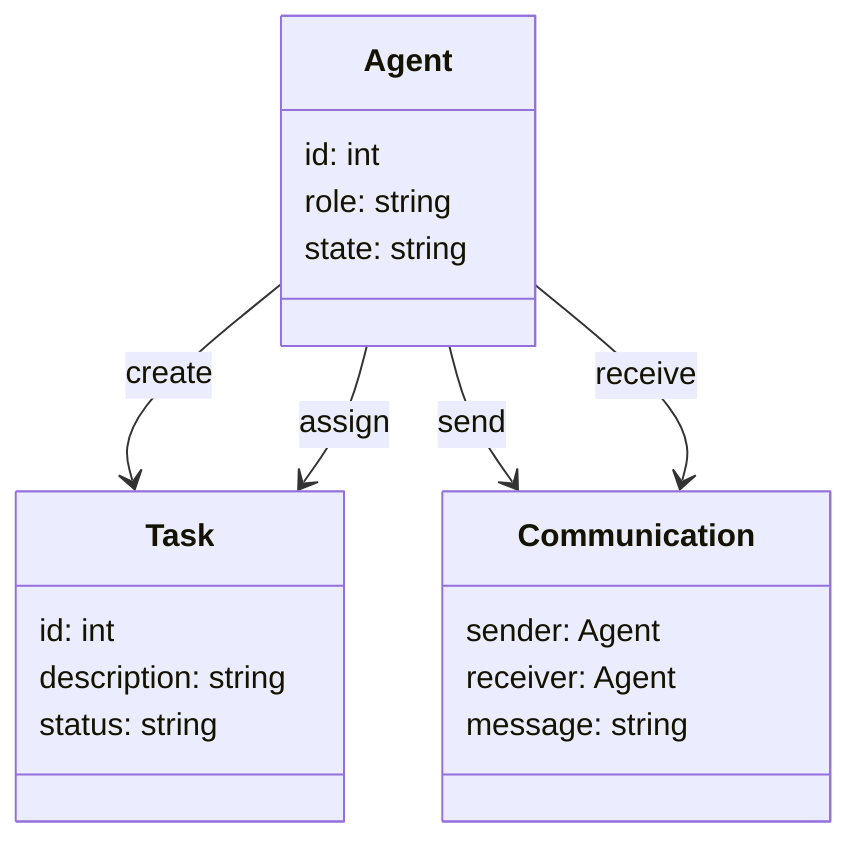
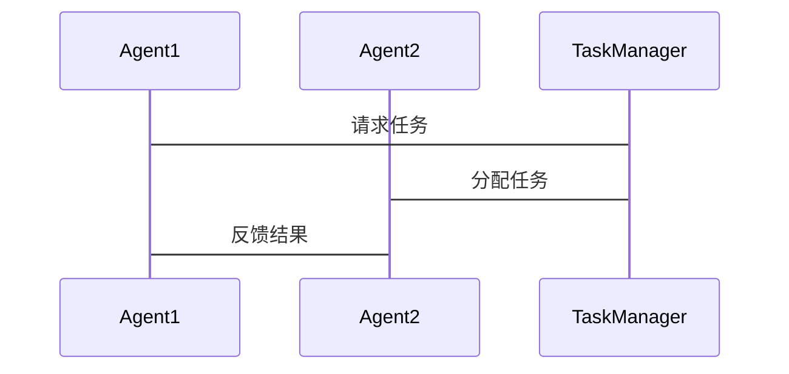

                 


# 多Agent协作：构建复杂的智能系统

## 关键词：
多Agent协作、分布式智能、智能系统、任务分配、协调机制、分布式算法、系统设计

## 摘要：
多Agent协作是构建复杂智能系统的核心技术之一。本文将深入探讨多Agent协作的基本概念、核心算法、系统架构设计以及实际应用案例。通过详细分析，读者将理解如何设计和实现高效的多Agent协作系统，掌握关键算法和系统设计原则，并通过实战案例提升实践能力。

---

## 第1章: 多Agent协作概述

### 1.1 多Agent协作的概念与特点

#### 1.1.1 多Agent系统的定义
多Agent系统（Multi-Agent System, MAS）是由多个智能体（Agent）组成的分布式系统，每个智能体都是具有独立性、自主性和协作能力的实体。多Agent系统通过智能体之间的交互与协作，共同完成复杂的任务。

#### 1.1.2 多Agent协作的核心特点
- **自主性**：每个Agent能够独立决策和行动。
- **反应性**：Agent能够感知环境并实时响应。
- **协作性**：多个Agent通过通信和协调共同完成任务。
- **分布式性**：系统中的Agent分布在网络的不同节点上，没有中央控制点。

#### 1.1.3 多Agent与单体智能体的区别
| 特性 | 单体智能体 | 多Agent协作 |
|------|------------|--------------|
| 独立性 | 单一实体，独立运行 | 多个实体，协作完成任务 |
| 控制方式 | 中央控制 | 分布式控制 |
| 任务处理 | 单一任务 | 多任务协作 |

### 1.2 多Agent协作的重要性

#### 1.2.1 分布式智能的需求
随着智能系统规模的扩大，单体智能体难以处理复杂任务，分布式协作成为必然趋势。

#### 1.2.2 多Agent协作的优势
- **任务分工明确**：通过任务分配算法，每个Agent专注于特定任务。
- **容错性高**：分布式结构提高了系统的容错性和鲁棒性。
- **灵活性强**：系统可以根据环境变化动态调整协作策略。

#### 1.2.3 复杂智能系统构建的必要性
在机器人、自动驾驶、分布式计算等领域，多Agent协作是实现复杂功能的核心技术。

---

## 第2章: 多Agent协作的核心概念与联系

### 2.1 多Agent协作的核心概念

#### 2.1.1 Agent的基本属性
- **自主性**：Agent能够独立决策。
- **反应性**：Agent能够感知环境并做出反应。
- **协作性**：Agent能够与其他Agent协作完成任务。

#### 2.1.2 协作问题的定义
协作问题是指在多Agent系统中，如何协调多个Agent的行为，使其共同完成目标。

#### 2.1.3 通信协议的作用
通信协议定义了Agent之间的通信规则，确保信息传递的准确性和高效性。

### 2.2 多Agent协作中的关键问题

#### 2.2.1 任务分配问题
任务分配是多Agent协作中的核心问题，需要确保每个Agent的任务分配合理。

#### 2.2.2 协调机制的选择
协调机制决定了Agent如何协作完成任务，常见的协调机制包括同步和异步两种。

#### 2.2.3 冲突解决策略
在协作过程中，可能会出现资源冲突，需要有效的冲突解决策略。

---

## 第3章: 多Agent协作的数学模型与算法原理

### 3.1 多Agent协作的数学模型

#### 3.1.1 Agent行为模型
Agent的行为模型可以用状态转移图表示，每个状态对应一个行为。

#### 3.1.2 协作任务分配模型
协作任务分配模型可以用图论中的图表示，节点表示任务，边表示任务之间的依赖关系。

#### 3.1.3 协调机制的数学表达
协调机制可以用数学公式表示，例如：$$C = \sum_{i=1}^{n} c_i$$，其中$c_i$表示每个Agent的贡献。

### 3.2 分布式协调算法

#### 3.2.1 分布式任务分配算法
分布式任务分配算法通过Agent之间的通信实现任务分配，常见的算法包括基于优先级的分配算法。

#### 3.2.2 协作过程中的同步算法
同步算法确保多个Agent在协作过程中保持一致，常见的同步算法包括基于时间戳的同步算法。

#### 3.2.3 冲突解决算法
冲突解决算法通过协商机制解决资源冲突，例如基于协商的冲突解决算法。

---

## 第4章: 系统分析与架构设计方案

### 4.1 问题场景介绍
假设我们正在设计一个多Agent协作系统，用于实现分布式任务分配和协作。

### 4.2 项目介绍
项目目标是设计一个多Agent协作系统，实现任务分配、协作和冲突解决。

### 4.3 系统功能设计

#### 4.3.1 领域模型
领域模型可以用mermaid类图表示，展示系统的功能模块和交互关系。



### 4.4 系统架构设计

#### 4.4.1 系统架构图
系统架构图可以用mermaid架构图表示，展示系统的各个模块和交互关系。


### 4.5 系统接口设计

#### 4.5.1 系统接口设计
系统接口设计需要定义Agent之间的通信接口和任务管理接口。

### 4.6 系统交互设计

#### 4.6.1 系统交互图
系统交互图可以用mermaid序列图表示，展示系统中的交互过程。



---

## 第5章: 项目实战

### 5.1 环境安装
安装必要的软件和工具，例如Python、Git、Jupyter Notebook。

### 5.2 系统核心实现

#### 5.2.1 任务分配算法实现
任务分配算法可以用Python代码实现，例如基于优先级的分配算法。

```python
class Agent:
    def __init__(self, id):
        self.id = id
        self.role = "worker"
        self.state = "idle"

    def assign_task(self, task):
        self.state = "busy"
        print(f"Agent {self.id} assigned task {task.id}")

class TaskManager:
    def __init__(self):
        self.tasks = []

    def create_task(self, description):
        task = Task(description)
        self.tasks.append(task)
        return task

    def assign_task(self, agent):
        if self.tasks:
            task = self.tasks.pop(0)
            agent.assign_task(task)
```

#### 5.2.2 协作过程实现
协作过程可以用Python代码实现，例如基于协商的协作机制。

### 5.3 代码应用解读与分析
详细解读代码实现，分析每个模块的功能和交互过程。

### 5.4 实际案例分析
通过具体案例分析，展示多Agent协作系统的实际应用。

### 5.5 项目小结
总结项目实现的关键点和经验教训。

---

## 第6章: 最佳实践与注意事项

### 6.1 注意事项
- **通信延迟**：注意通信延迟对系统性能的影响。
- **任务分配策略**：选择合适的任务分配策略，提高系统效率。
- **冲突解决机制**：设计有效的冲突解决机制，减少系统冲突。

### 6.2 小结
通过本文的分析和实践，读者可以掌握多Agent协作的核心概念、算法和系统设计方法。

### 6.3 拓展阅读
推荐阅读相关领域的书籍和论文，进一步深入学习多Agent协作技术。

---

## 作者信息

作者：AI天才研究院/AI Genius Institute & 禅与计算机程序设计艺术 /Zen And The Art of Computer Programming

---

本文通过系统的分析和实践，深入探讨了多Agent协作的核心概念、算法、系统设计和实际应用。希望本文能为读者提供有价值的技术参考，帮助他们在复杂的智能系统构建中取得成功。

