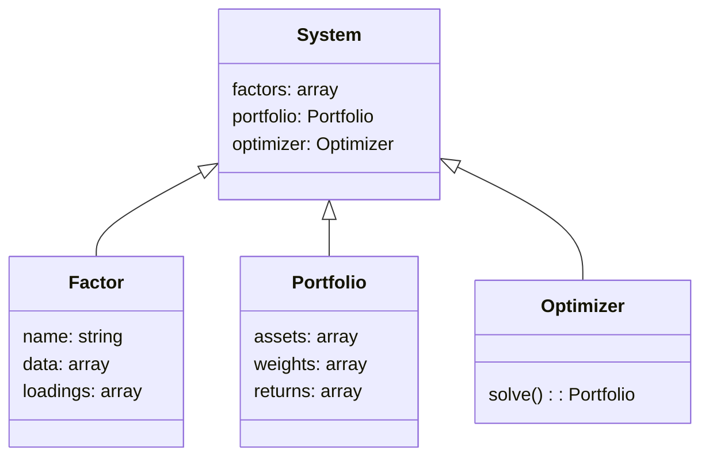
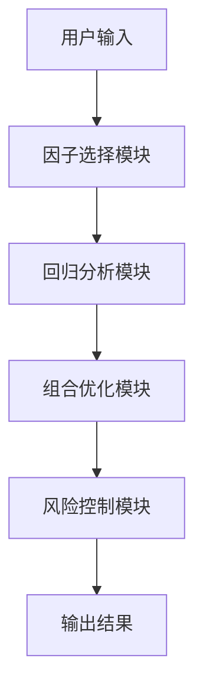
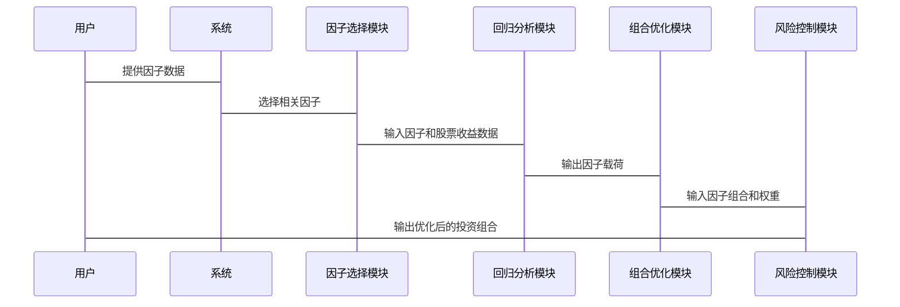

                 


# 多因子模型：提高投资组合表现的系统方法

> 关键词：多因子模型，投资组合，因子选择，回归分析，系统设计

> 摘要：本文系统介绍了多因子模型的概念、数学基础、系统设计、项目实现及应用。通过详细讲解因子选择、回归分析、组合优化等关键步骤，结合实际案例和代码示例，帮助读者掌握多因子模型在投资组合管理中的应用方法。

---

## 第一部分: 多因子模型概述

### 第1章: 多因子模型的背景与核心概念

#### 1.1 多因子模型的背景

##### 1.1.1 投资组合优化的背景
投资组合优化是现代金融的核心问题之一。投资者希望通过合理的资产配置，在风险可控的前提下，最大化投资收益。然而，单一因子模型（如市值因子）往往无法充分解释股票收益的多样性。多因子模型通过引入多个相关因子，能够更全面地捕捉股票收益的驱动因素。

##### 1.1.2 单因子模型的局限性
- **解释力不足**：单一因子（如市值或价值因子）无法完全解释股票收益的波动。
- **风险分散化不足**：仅依赖单一因子可能导致投资组合过于集中，风险过高。
- **稳定性差**：单一因子在不同市场环境下的表现波动较大。

##### 1.1.3 多因子模型的提出与意义
多因子模型通过综合多个因子（如市值、价值、动量等）来捕捉股票收益的驱动因素，提高了模型的解释力和稳定性。它能够帮助投资者构建更分散化、更高效的投资组合。

#### 1.2 多因子模型的核心概念

##### 1.2.1 多因子模型的定义
多因子模型是一种将股票收益分解为多个因子（如市值、价值、动量等）线性组合的模型。它通过回归分析确定每个因子对收益的贡献程度。

##### 1.2.2 多因子模型的分类
- **基于统计的多因子模型**：如Fama-French三因子模型。
- **基于经济理论的多因子模型**：如APT模型。
- **基于机器学习的多因子模型**：如使用Lasso回归选择因子。

##### 1.2.3 多因子模型的关键要素
- **因子**：驱动股票收益的因素，如市值（Size）、价值（Value）、动量（Momentum）等。
- **因子权重**：每个因子对收益的贡献程度。
- **因子组合**：多个因子的线性组合，用于预测股票收益。

#### 1.3 多因子模型的应用场景

##### 1.3.1 股票投资中的应用
- **选股策略**：通过多因子模型筛选具有高收益潜力的股票。
- **风险控制**：通过多因子模型分散投资组合的风险。

##### 1.3.2 基金组合管理中的应用
- **组合优化**：通过多因子模型构建最优基金组合。
- **风险调整**：通过多因子模型调整组合的风险敞口。

##### 1.3.3 行业与风格投资中的应用
- **行业轮动**：通过多因子模型捕捉行业轮动的机会。
- **风格投资**：通过多因子模型实现特定投资风格的配置。

---

### 第2章: 多因子模型的数学基础

#### 2.1 多因子模型的因子选择

##### 2.1.1 因子来源与筛选标准
- **常见因子**：市值（Size）、价值（Value）、动量（Momentum）、流动性（Liquidity）等。
- **因子筛选标准**：因子的相关性、因子的解释力、因子的稳定性等。

##### 2.1.2 因子的标准化与去相关性
- **标准化**：将每个因子标准化为均值为0，方差为1的形式。
- **去相关性**：通过主成分分析（PCA）等方法去除因子之间的多重共线性。

##### 2.1.3 因子风险调整
- **风险调整**：通过回归分析确定每个因子对收益的解释力，并进行风险调整。

#### 2.2 多因子回归模型

##### 2.2.1 多因子回归的数学表达
$$
R_i = \beta_1 F_1 + \beta_2 F_2 + \cdots + \beta_n F_n + \epsilon
$$
其中，$R_i$ 是股票 $i$ 的收益，$F_j$ 是第 $j$ 个因子，$\beta_j$ 是因子的载荷，$\epsilon$ 是误差项。

##### 2.2.2 因子载荷的估计方法
- **最小二乘法**：通过最小二乘法估计因子载荷。
- **加权最小二乘法**：根据因子的重要性进行加权。

##### 2.2.3 因子方差与协方差矩阵
- **因子方差**：因子之间的波动性。
- **因子协方差矩阵**：因子之间的相关性。

#### 2.3 多因子模型的优化方法

##### 2.3.1 最小二乘法在因子回归中的应用
- **最小二乘法**：通过最小化残差平方和来估计因子载荷。
- **逐步回归**：逐步引入因子，剔除不显著的因子。

##### 2.3.2 线性规划与因子权重优化
- **线性规划**：通过线性规划优化因子权重，使投资组合收益最大化或风险最小化。
- **约束条件**：权重之和为1，权重非负等。

##### 2.3.3 非线性优化方法简介
- **非线性规划**：用于处理非线性约束的优化问题。
- **遗传算法**：一种模拟自然选择的优化方法。

---

### 第3章: 多因子模型的系统分析与架构设计

#### 3.1 投资组合管理系统概述

##### 3.1.1 系统目标与功能模块划分
- **系统目标**：构建一个多因子模型驱动的投资组合管理系统。
- **功能模块**：因子选择、回归分析、组合优化、风险控制等。

##### 3.1.2 系统输入与输出定义
- **输入**：股票数据、因子数据、目标收益或风险。
- **输出**：最优因子组合、投资组合配置、风险收益分析报告。

##### 3.1.3 系统边界与外延
- **系统边界**：数据获取、因子计算、模型构建、组合优化。
- **外延**：市场数据接口、用户交互界面。

#### 3.2 系统设计

##### 3.2.1 系统功能设计
- **领域模型类图**


- **系统架构图**


##### 3.2.2 系统接口设计
- **输入接口**：接收因子数据和股票数据。
- **输出接口**：输出最优因子组合和投资组合配置。

##### 3.2.3 系统交互序列图


---

## 第四部分: 项目实战

### 第4章: 多因子模型的实现与案例分析

#### 4.1 环境安装与配置

##### 4.1.1 安装Python环境
- 安装Python 3.8及以上版本。
- 安装必要的库：pandas、numpy、scipy、sklearn等。

##### 4.1.2 数据获取
- 使用pandas获取股票数据和因子数据。
- 数据清洗与预处理。

#### 4.2 核心代码实现

##### 4.2.1 因子选择与计算
```python
import pandas as pd
import numpy as np
from sklearn.linear_model import LinearRegression

# 假设factor_data是因子数据，returns是股票收益
factor_data = pd.DataFrame(...)
returns = pd.Series(...)

# 使用最小二乘法进行回归分析
model = LinearRegression()
model.fit(factor_data, returns)
loadings = model.coef_
```

##### 4.2.2 多因子回归分析
```python
# 计算因子方差与协方差矩阵
factor_cov = factor_data.cov()
```

##### 4.2.3 组合优化与权重分配
```python
# 使用线性规划优化因子权重
from scipy.optimize import minimize

def objective(weights):
    return np.dot(weights.T, factor_cov @ weights)

# 约束条件
constraints = [{'type': 'eq', 'fun': lambda w: np.sum(w) - 1}]
bounds = [(0, 1)] * len(loadings)

result = minimize(objective, np.ones(len(loadings)) / len(loadings), constraints, bounds)
optimal_weights = result.x
```

#### 4.3 案例分析与结果解读

##### 4.3.1 实际案例分析
- 选择一组因子（如市值、价值、动量）。
- 使用历史数据进行回归分析，确定因子载荷。
- 优化因子权重，构建最优因子组合。

##### 4.3.2 结果解读
- **因子载荷**：每个因子对收益的贡献程度。
- **因子权重**：每个因子在组合中的权重。
- **投资组合收益与风险**：优化后的投资组合收益和风险表现。

---

## 第五部分: 总结与展望

### 第5章: 多因子模型的总结与展望

#### 5.1 多因子模型的总结

##### 5.1.1 多因子模型的优势
- **全面性**：考虑多个因子，提高模型的解释力。
- **稳定性**：通过多因子模型分散风险，提高投资组合的稳定性。
- **灵活性**：可以根据不同的市场环境调整因子组合。

##### 5.1.2 多因子模型的局限性
- **因子选择的挑战**：如何选择有效的因子是一个复杂的问题。
- **模型的过拟合风险**：过多的因子可能导致模型过拟合。
- **因子之间的相关性**：因子之间的高度相关性可能影响模型的稳定性。

#### 5.2 多因子模型的未来展望

##### 5.2.1 动态因子模型
- **动态调整因子**：根据市场环境的变化动态调整因子组合。
- **实时更新**：实时更新因子数据，提高模型的适应性。

##### 5.2.2 机器学习与多因子模型的结合
- **深度学习**：使用深度学习方法自动提取因子。
- **强化学习**：通过强化学习优化投资策略。

##### 5.2.3 全球化视角
- **全球化投资**：将多因子模型应用于全球市场，捕捉全球投资机会。
- **跨市场因子**：研究跨市场的因子，如全球动量因子。

#### 5.3 投资建议

##### 5.3.1 最佳实践 tips
- **因子选择**：选择长期稳定的因子，避免短期策略。
- **模型验证**：定期验证模型的有效性，避免过拟合。
- **风险控制**：通过多因子模型分散投资组合的风险。

##### 5.3.2 注意事项
- **数据质量**：确保数据的准确性和完整性。
- **模型假设**：明确模型的假设，并定期验证。
- **市场环境**：考虑市场环境的变化，动态调整投资策略。

##### 5.3.3 拓展阅读
- **经典文献**：Fama-French三因子模型、APT模型。
- **最新研究**：关注最新的多因子模型研究和应用。

---

## 作者信息

作者：AI天才研究院/AI Genius Institute & 禅与计算机程序设计艺术 /Zen And The Art of Computer Programming

---

希望这篇文章能为您提供多因子模型的系统性理解，并为实际应用提供有价值的参考！

