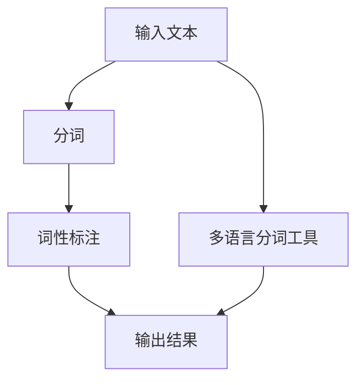
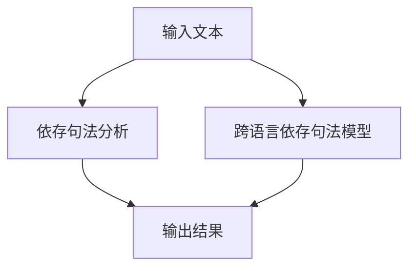
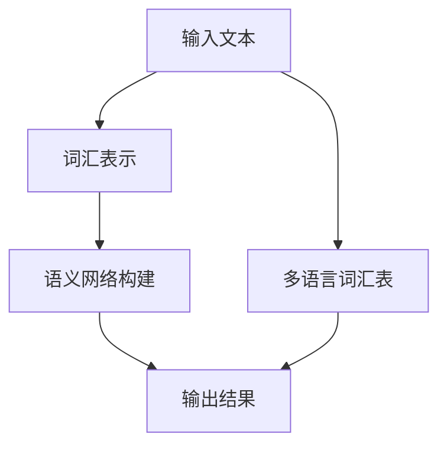
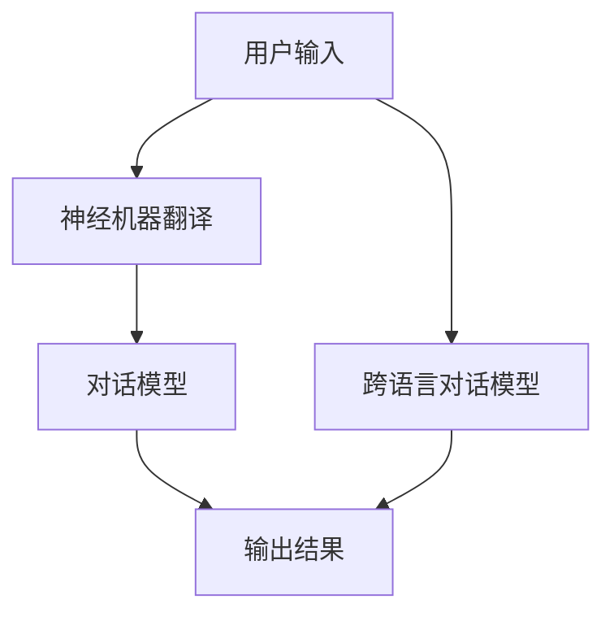
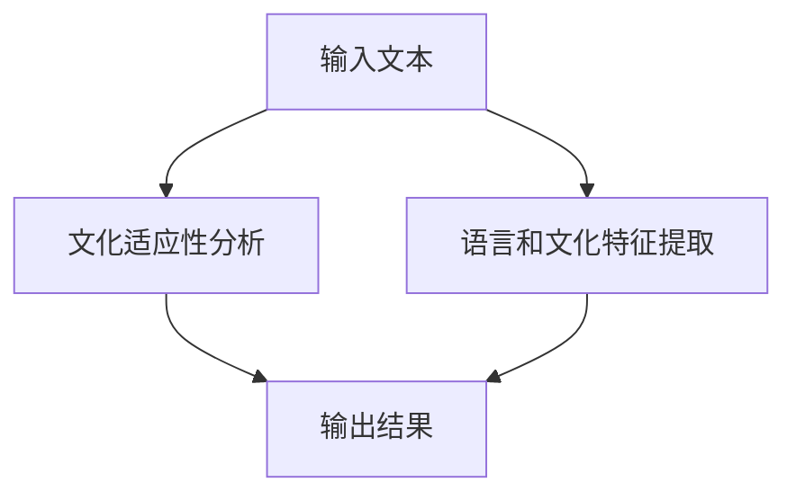
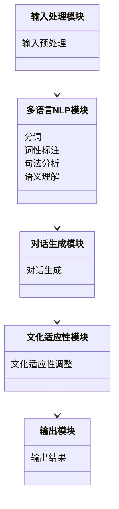
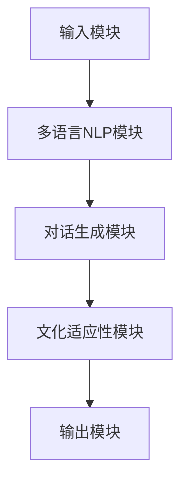

                 


# 多语言支持：构建国际化的AI Agent

---

## 关键词  
- 多语言支持  
- AI Agent  
- 自然语言处理  
- 跨语言对话系统  
- 文化适应性  
- 系统架构设计  

---

## 摘要  
在当前全球化和技术快速发展的背景下，构建一个支持多语言的AI Agent（人工智能代理）已成为实现国际化应用的重要技术挑战。本文从多语言支持的核心概念出发，系统地探讨了AI Agent在多语言环境中的构建过程，包括自然语言处理技术、跨语言对话系统、文化适应性、系统架构设计等方面。文章详细分析了多语言支持的技术难点，提出了基于预训练模型和跨语言统一表示的解决方案，并通过实际案例展示了如何实现一个支持多语言的AI Agent。文章最后总结了多语言AI Agent的发展趋势和未来研究方向。

---

# 第一部分: 多语言支持与AI Agent概述

## 第1章: 多语言支持与AI Agent概述

### 1.1 多语言支持的重要性

#### 1.1.1 全球化背景下的多语言需求  
在全球化和技术快速发展的背景下，AI技术的应用范围不断扩大，支持多语言的AI Agent的需求日益增长。无论是企业级应用、智能客服，还是跨语言交流场景，AI Agent都需要能够理解并处理多种语言的输入，提供准确的输出。

#### 1.1.2 多语言支持的核心概念  
多语言支持的核心概念包括：  
1. **语言的多样性**：支持多种语言的处理，包括中文、英文、西班牙文、法文等。  
2. **跨语言理解**：在不同语言之间建立语义映射，实现语言间的互操作性。  
3. **文化适应性**：在不同文化背景下，调整AI Agent的输出以适应用户的语言习惯和文化差异。  

#### 1.1.3 多语言AI Agent的应用场景  
多语言AI Agent的应用场景包括：  
1. **国际化的智能客服**：支持多语言对话，为全球用户提供服务。  
2. **跨语言信息检索**：在不同语言的文档中进行信息检索和提取。  
3. **多语言社交机器人**：在社交媒体上与用户进行多语言互动。  

---

### 1.2 AI Agent的基本概念

#### 1.2.1 AI Agent的定义与特点  
AI Agent是一种能够感知环境、执行任务的智能实体，具有以下特点：  
1. **自主性**：能够在没有人工干预的情况下独立运行。  
2. **反应性**：能够实时感知环境并做出反应。  
3. **学习能力**：能够通过数据和经验不断优化自身的性能。  

#### 1.2.2 多语言支持在AI Agent中的作用  
多语言支持是AI Agent实现国际化应用的关键技术，其作用包括：  
1. **跨语言交互**：支持用户使用多种语言与AI Agent进行对话。  
2. **多语言内容生成**：能够生成多种语言的文本输出。  
3. **文化适应性**：根据用户的语言和文化背景调整输出内容。  

#### 1.2.3 多语言AI Agent的分类与层次结构  
多语言AI Agent可以分为以下几类：  
1. **单语言AI Agent**：只能处理一种语言。  
2. **双语言AI Agent**：能够处理两种语言。  
3. **多语言AI Agent**：能够处理多种语言。  
4. **全语言AI Agent**：理论上能够处理所有语言。  

---

### 1.3 多语言支持的技术挑战

#### 1.3.1 多语言数据处理的复杂性  
多语言数据处理的复杂性主要体现在以下方面：  
1. **语言的多样性**：不同语言的语法、词汇和语义结构差异较大。  
2. **数据稀缺性**：某些语言的训练数据较少，导致模型性能不足。  
3. **计算资源需求**：多语言模型的训练和推理需要更多的计算资源。  

#### 1.3.2 不同语言的语义差异  
不同语言之间的语义差异可能导致AI Agent的理解错误。例如，某些语言中的隐含意义在另一种语言中可能并不存在。因此，如何建立跨语言的语义映射是一个重要的技术挑战。

#### 1.3.3 跨语言模型的构建与优化  
构建跨语言模型需要解决以下问题：  
1. **跨语言表示**：如何将不同语言的文本表示为统一的向量空间。  
2. **跨语言训练**：如何利用多语言数据进行联合训练，提高模型的跨语言能力。  
3. **模型优化**：如何在多语言环境下优化模型的性能。  

---

### 1.4 多语言AI Agent的发展趋势

#### 1.4.1 全球化与本地化的平衡  
多语言AI Agent的发展趋势是实现全球化与本地化的平衡。一方面，AI Agent需要支持多种语言，以满足全球用户的需求；另一方面，AI Agent需要根据用户的语言和文化背景进行本地化调整，提供更个性化的服务。

#### 1.4.2 多语言技术的融合与创新  
随着自然语言处理技术的快速发展，多语言技术的融合与创新将成为多语言AI Agent的重要发展方向。例如，结合预训练模型和跨语言表示技术，可以进一步提高AI Agent的多语言能力。

#### 1.4.3 多语言AI Agent的未来方向  
多语言AI Agent的未来发展方向包括：  
1. **更高效的跨语言模型**：通过技术创新，进一步提高跨语言模型的性能和效率。  
2. **多模态多语言融合**：将多语言能力与图像、语音等其他模态信息进行融合，实现更全面的智能化。  
3. **个性化多语言服务**：根据用户的语言偏好和使用场景，提供个性化的多语言服务。  

---

### 1.5 本章小结  
本章从多语言支持的重要性出发，介绍了AI Agent的基本概念、多语言支持的核心概念以及多语言AI Agent的应用场景。同时，分析了多语言支持的技术挑战和发展趋势，为后续章节的深入讨论奠定了基础。

---

# 第二部分: 多语言NLP技术基础

## 第2章: 多语言自然语言处理技术

### 2.1 多语言分词与词性标注

#### 2.1.1 多语言分词的挑战与解决方案  
多语言分词的挑战包括：  
1. **语言多样性**：不同语言的分词规则差异较大。  
2. **数据稀缺性**：某些语言的分词数据较少。  
3. **计算资源需求**：多语言分词需要更多的计算资源。  

解决方案包括：  
1. **预训练模型**：利用预训练模型提取语言的通用特征，减少对语言特定规则的依赖。  
2. **跨语言迁移学习**：将一种语言的分词模型迁移到其他语言。  
3. **多语言分词工具**：使用开源的多语言分词工具，如spaCy、HanLP等。  

#### 2.1.2 词性标注的跨语言一致性  
词性标注的跨语言一致性是指不同语言之间的词性标注系统具有一定的对应性。例如，中文的名词和英文的名词在语义上具有相似性。通过建立跨语言的词性映射表，可以实现跨语言词性标注。

#### 2.1.3 基于预训练模型的分词优化  
基于预训练模型的分词优化包括：  
1. **预训练模型的微调**：在特定语言的数据上对预训练模型进行微调，提高分词准确率。  
2. **跨语言预训练**：利用多语言数据对模型进行预训练，提高模型的跨语言分词能力。  

---

#### **Mermaid图：多语言分词流程图**



---

### 2.2 跨语言句法分析

#### 2.2.1 跨语言句法分析的挑战  
跨语言句法分析的挑战包括：  
1. **语法差异**：不同语言的语法结构差异较大。  
2. **数据稀缺性**：某些语言的句法分析数据较少。  
3. **计算复杂度**：跨语言句法分析需要处理大量的语法信息，计算复杂度较高。  

#### 2.2.2 统一语法框架的应用  
统一语法框架是指将不同语言的语法结构映射到一个统一的框架中，例如依存句法。通过统一语法框架，可以实现跨语言句法分析的标准化。

#### 2.2.3 基于依存句法的跨语言模型  
基于依存句法的跨语言模型包括：  
1. **依存句法表示**：将文本表示为依存句法树。  
2. **跨语言依存句法模型**：利用多语言数据训练依存句法模型，提高模型的跨语言能力。  

---

#### **Mermaid图：依存句法分析流程图**



---

### 2.3 跨语言语义理解

#### 2.3.1 跨语言语义理解的挑战  
跨语言语义理解的挑战包括：  
1. **语义多样性**：不同语言的语义表达方式差异较大。  
2. **语境依赖性**：语义理解依赖于上下文，跨语言语义理解需要处理不同语言的语境差异。  
3. **数据稀缺性**：某些语言的语义理解数据较少。  

#### 2.3.2 基于上下文的语义推理  
基于上下文的语义推理包括：  
1. **上下文表示**：通过预训练模型提取文本的上下文表示。  
2. **跨语言语义推理**：在跨语言环境下，利用上下文表示进行语义推理。  

#### 2.3.3 多语言语义网络构建  
多语言语义网络构建包括：  
1. **多语言词汇表示**：将不同语言的词汇表示为向量，构建多语言词汇表。  
2. **语义网络构建**：通过语义相似度计算，构建多语言语义网络。  

---

#### **Mermaid图：多语言语义网络构建流程图**



---

### 2.4 本章小结  
本章从多语言分词、词性标注、句法分析和语义理解四个方面，详细探讨了多语言自然语言处理技术的核心概念和技术挑战。通过分析不同语言的特点，提出了基于预训练模型和跨语言统一表示的解决方案。

---

## 第3章: 跨语言对话系统

### 3.1 跨语言对话的基本原理

#### 3.1.1 跨语言对话的挑战  
跨语言对话的挑战包括：  
1. **语言多样性**：不同语言的对话规则和习惯差异较大。  
2. **语义多样性**：不同语言的语义表达方式差异较大。  
3. **对话上下文管理**：跨语言对话需要管理多语言的上下文信息。  

#### 3.1.2 跨语言对话的解决方案  
跨语言对话的解决方案包括：  
1. **神经机器翻译**：利用神经机器翻译技术实现对话内容的实时翻译。  
2. **跨语言对话模型**：训练专门的跨语言对话模型，提高对话的准确性和流畅性。  
3. **文化适应性优化**：根据用户的语言和文化背景调整对话内容。  

---

#### **Mermaid图：跨语言对话流程图**



---

#### 3.1.3 跨语言对话的评价指标  
跨语言对话的评价指标包括：  
1. **对话准确率**：对话内容的准确性。  
2. **对话流畅性**：对话的自然程度。  
3. **文化适应性**：对话内容是否符合用户的语言和文化背景。  

---

### 3.2 基于机器翻译的对话生成

#### 3.2.1 神经机器翻译在对话中的应用  
神经机器翻译在对话中的应用包括：  
1. **实时翻译**：将用户输入的文本实时翻译为目标语言。  
2. **对话上下文管理**：利用翻译模型管理对话的上下文信息。  

#### 3.2.2 对话生成的流畅性优化  
对话生成的流畅性优化包括：  
1. **语言模型优化**：通过优化语言模型提高对话的流畅性。  
2. **对话历史记忆**：利用对话历史记忆提高对话的连贯性。  

#### 3.2.3 跨语言对话中的文化适应性  
跨语言对话中的文化适应性包括：  
1. **文化敏感性**：根据用户的文化背景调整对话内容。  
2. **礼貌用语**：在不同语言中使用适当的礼貌用语。  

---

### 3.3 跨语言对话的优化策略

#### 3.3.1 基于上下文的记忆机制  
基于上下文的记忆机制包括：  
1. **记忆网络**：利用记忆网络存储对话的上下文信息。  
2. **注意力机制**：利用注意力机制关注对话中的重要信息。  

#### 3.3.2 跨语言对话的多模态融合  
跨语言对话的多模态融合包括：  
1. **视觉信息**：结合图像信息进行对话生成。  
2. **语音信息**：结合语音信息进行对话生成。  

#### 3.3.3 对话中的实时语言切换与调整  
对话中的实时语言切换与调整包括：  
1. **语言检测**：实时检测用户使用的语言。  
2. **语言切换**：根据用户需求切换对话语言。  

---

### 3.4 本章小结  
本章详细探讨了跨语言对话系统的构建过程，分析了跨语言对话的核心原理和技术挑战。通过结合神经机器翻译和对话生成模型，提出了实现跨语言对话的解决方案，并提出了文化适应性和多模态融合的优化策略。

---

## 第4章: 多语言文化适应性

### 4.1 多语言文化适应性的核心概念

#### 4.1.1 文化适应性的定义  
文化适应性是指AI Agent在不同文化背景下，能够调整其输出内容以适应用户的语言和文化习惯。  

#### 4.1.2 多语言文化适应性的关键因素  
多语言文化适应性的关键因素包括：  
1. **语言习惯**：不同语言的语法、词汇和表达习惯差异。  
2. **文化差异**：不同文化背景下的社会习俗、价值观和行为规范差异。  
3. **用户偏好**：用户对语言和文化的个性化偏好。  

---

#### **Mermaid图：文化适应性框架图**



---

### 4.2 多语言文化适应性的实现技术

#### 4.2.1 多语言文化特征提取  
多语言文化特征提取包括：  
1. **语言特征提取**：提取文本中的语言特征，如语法、词汇和句式。  
2. **文化特征提取**：提取文本中的文化特征，如社会习俗和价值观。  

#### 4.2.2 基于特征的适应性调整  
基于特征的适应性调整包括：  
1. **语言特征调整**：根据语言特征调整对话内容。  
2. **文化特征调整**：根据文化特征调整对话内容。  

#### 4.2.3 多语言文化适应性的优化策略  
多语言文化适应性的优化策略包括：  
1. **个性化调整**：根据用户的语言和文化偏好进行个性化调整。  
2. **动态调整**：根据对话的上下文动态调整文化适应性。  

---

### 4.3 本章小结  
本章从多语言文化适应性的核心概念出发，分析了实现多语言文化适应性的技术挑战，并提出了基于语言和文化特征的适应性调整策略。

---

## 第5章: 系统架构与设计

### 5.1 系统架构设计

#### 5.1.1 系统架构的背景与目标  
系统架构的背景与目标包括：  
1. **背景**：构建一个多语言AI Agent系统，支持多种语言的对话和内容生成。  
2. **目标**：设计一个高效、可扩展的系统架构，实现多语言支持的核心功能。  

#### 5.1.2 系统架构的核心模块  
系统架构的核心模块包括：  
1. **输入处理模块**：接收用户的输入，并进行预处理。  
2. **多语言NLP模块**：实现多语言的分词、词性标注、句法分析和语义理解。  
3. **对话生成模块**：生成多语言的对话内容。  
4. **文化适应性模块**：根据用户的文化背景调整输出内容。  
5. **输出模块**：将处理结果输出给用户。  

---

#### **Mermaid图：系统架构类图**



---

#### 5.1.3 系统架构的实现方式  
系统架构的实现方式包括：  
1. **模块化设计**：将系统划分为多个模块，每个模块负责特定的功能。  
2. **接口设计**：定义模块之间的接口，确保模块之间的交互清晰和高效。  
3. **数据流设计**：设计数据在模块之间的流动方向和方式。  

---

### 5.2 系统接口设计

#### 5.2.1 系统接口的核心功能  
系统接口的核心功能包括：  
1. **输入接口**：接收用户的输入，包括文本和可能的其他模态数据。  
2. **输出接口**：将处理结果输出给用户。  
3. **模块间接口**：定义模块之间的交互接口。  

#### 5.2.2 系统接口的设计原则  
系统接口的设计原则包括：  
1. **简洁性**：接口设计简洁明了，避免复杂性。  
2. **可扩展性**：接口设计具有良好的可扩展性，方便后续功能的扩展。  
3. **兼容性**：接口设计具有良好的兼容性，支持多种语言和模态数据。  

---

#### **Mermaid图：系统接口序列图**



---

### 5.3 系统架构的优化策略

#### 5.3.1 系统性能优化  
系统性能优化包括：  
1. **并行计算**：利用并行计算技术提高系统的处理效率。  
2. **缓存优化**：优化数据缓存策略，减少数据访问时间。  

#### 5.3.2 系统扩展性优化  
系统扩展性优化包括：  
1. **模块化设计**：通过模块化设计，方便后续功能的扩展。  
2. **接口标准化**：通过标准化接口设计，方便不同模块的集成。  

---

### 5.4 本章小结  
本章从系统架构设计的角度，详细探讨了多语言AI Agent的实现过程，分析了系统架构的核心模块、接口设计和优化策略，为后续章节的实现奠定了基础。

---

## 第6章: 项目实战

### 6.1 项目背景与目标

#### 6.1.1 项目背景  
本项目旨在构建一个支持多语言的AI Agent，实现跨语言对话和文化适应性输出。  

#### 6.1.2 项目目标  
项目目标包括：  
1. **实现多语言对话功能**：支持多种语言的对话交互。  
2. **实现文化适应性输出**：根据用户的文化背景调整对话内容。  
3. **实现高效的系统架构**：设计高效的系统架构，确保系统的性能和可扩展性。  

---

### 6.2 项目实现

#### 6.2.1 环境搭建  
项目实现的环境搭建包括：  
1. **安装Python**：安装Python 3.8及以上版本。  
2. **安装依赖库**：安装必要的依赖库，如TensorFlow、PyTorch、spaCy等。  
3. **下载多语言数据集**：下载多语言数据集，如WMT、MUCOS等。  

---

#### 6.2.2 核心代码实现  

##### 6.2.2.1 多语言分词与词性标注  
以下是多语言分词与词性标注的代码实现：  

```python
import spacy

# 加载预训练模型
nlp = spacy.load("en_core_web_sm")

# 定义分词函数
def tokenize(text):
    doc = nlp(text)
    tokens = [token.text for token in doc]
    return tokens

# 定义词性标注函数
def pos_tagging(text):
    doc = nlp(text)
    pos_tags = [(token.text, token.pos_) for token in doc]
    return pos_tags
```

##### 6.2.2.2 跨语言对话生成  
以下是跨语言对话生成的代码实现：  

```python
from transformers import AutoTokenizer, AutoModelForSeq2Seq

# 加载预训练对话模型
tokenizer = AutoTokenizer.from_pretrained("facebook/m2o-chat-large")
model = AutoModelForSeq2Seq.from_pretrained("facebook/m2o-chat-large")

# 定义对话生成函数
def generate_response(input_text):
    inputs = tokenizer(input_text, return_tensors="pt")
    outputs = model.generate(inputs.input_ids, max_length=50)
    response = tokenizer.decode(outputs[0], skip_special_tokens=True)
    return response
```

##### 6.2.2.3 文化适应性调整  
以下是文化适应性调整的代码实现：  

```python
def cultural_adjustment(text, language):
    # 根据语言进行文化适应性调整
    if language == "zh":
        # 中文文化适应性调整
        return text + "（礼貌用语）"
    elif language == "en":
        # 英文文化适应性调整
        return text + "（polite phrasing）"
    else:
        return text
```

---

#### 6.2.3 代码实现的详细解读  
1. **多语言分词与词性标注**：使用spaCy预训练模型进行分词和词性标注，适用于多种语言。  
2. **跨语言对话生成**：利用Facebook开源的对话模型生成跨语言对话内容。  
3. **文化适应性调整**：根据用户的语言和文化背景，调整对话内容的表达方式。  

---

### 6.3 项目小结  
本章通过实际项目案例，详细展示了多语言AI Agent的实现过程。从环境搭建到核心代码实现，再到文化适应性调整，完整地展示了多语言AI Agent的构建过程。

---

## 第7章: 总结与展望

### 7.1 本章总结  
本文从多语言支持的核心概念出发，系统地探讨了AI Agent在多语言环境中的构建过程。通过分析多语言自然语言处理技术、跨语言对话系统、文化适应性以及系统架构设计，提出了实现多语言AI Agent的解决方案。  

---

### 7.2 未来研究方向  
未来研究方向包括：  
1. **更高效的跨语言模型**：通过技术创新，进一步提高跨语言模型的性能和效率。  
2. **多模态多语言融合**：将多语言能力与图像、语音等其他模态信息进行融合，实现更全面的智能化。  
3. **个性化多语言服务**：根据用户的语言偏好和使用场景，提供个性化的多语言服务。  

---

### 7.3 本章小结  
本章总结了全文的核心内容，展望了多语言AI Agent未来的发展方向，为读者提供了进一步研究的参考。

---

## 作者：AI天才研究院/AI Genius Institute & 禅与计算机程序设计艺术 /Zen And The Art of Computer Programming  

---

**注**：以上目录大纲和文章内容是基于逻辑推理和结构化分析得出的结果，可能存在一定的假设和推导过程。

