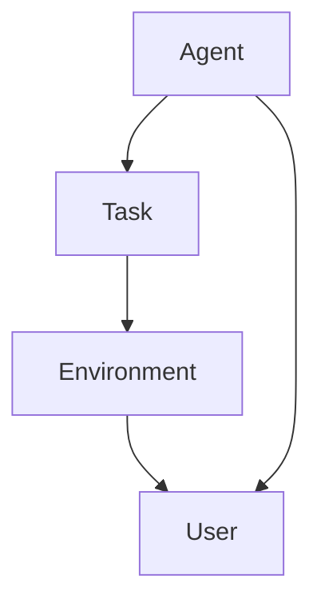
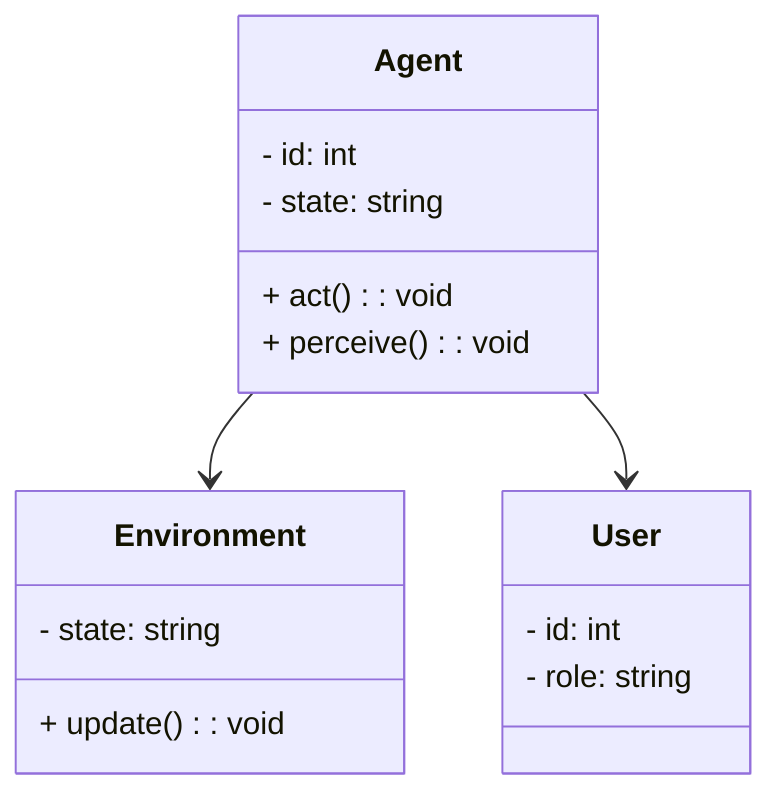
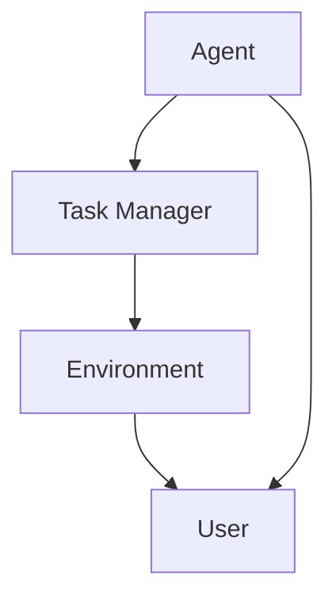

                 


# 大规模AI Agent系统的部署与维护

> 关键词：AI Agent, 大规模系统, 部署与维护, 系统架构, 算法原理, 项目实战

> 摘要：本文系统地探讨了大规模AI Agent系统的部署与维护的关键技术与实践。从核心概念到算法原理，从系统架构到项目实战，详细剖析了大规模AI Agent系统的特点、实现难点及解决方案。通过理论分析与实践案例结合，为读者提供了一套完整的部署与维护方法论。

---

# 第一部分：大规模AI Agent系统的概述

## 第1章：大规模AI Agent系统的背景与概念

### 1.1 AI Agent的基本概念

#### 1.1.1 AI Agent的定义与特点
AI Agent（人工智能代理）是指能够感知环境、自主决策并执行任务的智能实体。与传统程序不同，AI Agent具备以下特点：
- **自主性**：能够独立决策和行动，无需外部干预。
- **反应性**：能够实时感知环境并做出响应。
- **主动性**：主动采取行动以实现目标。
- **社交能力**：能够与其他Agent或人类进行交互和协作。

#### 1.1.2 大规模AI Agent系统的定义
大规模AI Agent系统是指由大量AI Agent组成的复杂系统，这些Agent通常分布在不同的节点或设备上，通过网络进行通信和协作，共同完成复杂任务。

#### 1.1.3 大规模AI Agent系统的应用场景
- **分布式计算**：如分布式文件系统、云计算平台。
- **智能协作**：如多智能体机器人系统、自动驾驶。
- **实时决策**：如金融交易系统、实时监控系统。

### 1.2 大规模AI Agent系统的背景

#### 1.2.1 当前AI技术的发展趋势
近年来，AI技术快速发展，尤其在深度学习、强化学习和自然语言处理领域取得了显著进展。这些技术为大规模AI Agent系统的实现提供了理论基础和技术支持。

#### 1.2.2 大规模AI Agent系统的兴起
随着云计算、物联网和5G技术的普及，大规模AI Agent系统逐渐成为可能。企业对高效、智能的自动化系统的追求，推动了大规模AI Agent系统的广泛应用。

#### 1.2.3 企业级AI Agent系统的挑战
- **计算资源**：大规模AI Agent系统需要大量的计算资源，对硬件要求较高。
- **通信延迟**：Agent之间的通信延迟可能影响系统的实时性。
- **安全性**：系统的安全性和数据隐私问题需要重点关注。

### 1.3 本章小结
本章从AI Agent的基本概念出发，介绍了大规模AI Agent系统的定义、特点及应用场景，并分析了其兴起的背景和面临的挑战。

---

## 第2章：大规模AI Agent系统的核心概念与联系

### 2.1 大规模AI Agent系统的架构模式

#### 2.1.1 分层架构
分层架构将系统划分为多个层次，每一层负责不同的功能。例如：
- **感知层**：负责数据采集和环境感知。
- **决策层**：负责任务分配和决策制定。
- **执行层**：负责具体任务的执行。

#### 2.1.2 分布式架构
分布式架构将系统功能分散到多个节点，每个节点负责部分功能。这种方式能够提高系统的容错性和扩展性。

#### 2.1.3 微服务架构
微服务架构将系统功能分解为多个微服务，每个微服务独立运行。这种方式能够提高系统的灵活性和可维护性。

### 2.2 AI Agent的类型与功能

#### 2.2.1 单体AI Agent
单体AI Agent是一个独立的智能体，能够完成特定任务。例如，单个智能体在自动驾驶系统中负责路径规划。

#### 2.2.2 分布式AI Agent
分布式AI Agent由多个智能体组成，通过协同完成复杂任务。例如，分布式智能体在分布式计算系统中协同处理大数据任务。

#### 2.2.3 跨平台AI Agent
跨平台AI Agent能够运行在不同的平台上，适应多种环境。例如，跨平台智能体在物联网系统中连接不同的设备。

### 2.3 系统核心要素的ER实体关系图



### 2.4 本章小结
本章分析了大规模AI Agent系统的架构模式，介绍了AI Agent的类型与功能，并通过ER实体关系图展示了系统的核心要素之间的关系。

---

## 第3章：大规模AI Agent系统的算法原理

### 3.1 AI Agent的核心算法

#### 3.1.1 多智能体强化学习
多智能体强化学习（Multi-Agent Reinforcement Learning, MARL）是研究多个智能体在共享环境中协同决策的算法。其核心思想是通过智能体之间的协作和竞争，实现全局最优目标。

#### 3.1.2 联合推理与规划
联合推理与规划（Joint Inference and Planning）是一种通过多个智能体协同推理和规划，共同完成复杂任务的算法。例如，在自动驾驶系统中，多个智能体协同推理道路状况和车辆动作。

#### 3.1.3 分布式决策算法
分布式决策算法（Distributed Decision-Making）是一种通过分布式计算实现智能体决策的算法。例如，在分布式计算系统中，每个智能体独立决策，共同完成任务。

### 3.2 算法原理的数学模型

#### 3.2.1 多智能体强化学习的数学模型
$$ V(s) = \max_{a} Q(s,a) $$

其中，$V(s)$ 表示状态 $s$ 的价值，$Q(s,a)$ 表示状态 $s$ 下动作 $a$ 的价值。

#### 3.2.2 分布式决策的数学模型
$$ \theta_{i} = \arg\max_{a} \sum_{j} \theta_{j} $$

其中，$\theta_{i}$ 表示智能体 $i$ 的决策参数，$\theta_{j}$ 表示其他智能体的决策参数。

### 3.3 算法实现的Python代码示例

```python
def multi_agent_learning(s, agents):
    max_value = -float('inf')
    best_action = None
    for a in agents:
        value = a.value(s, a.action_space)
        if value > max_value:
            max_value = value
            best_action = a.choose_action(s)
    return best_action
```

### 3.4 本章小结
本章详细分析了大规模AI Agent系统的核心算法，包括多智能体强化学习、联合推理与规划和分布式决策算法，并通过数学模型和Python代码示例进行了讲解。

---

## 第4章：大规模AI Agent系统的部署方案

### 4.1 环境准备

#### 4.1.1 硬件环境
- **计算资源**：需要高性能计算服务器，支持多核处理和大内存。
- **存储资源**：需要大容量存储设备，支持海量数据存储。
- **网络环境**：需要高速网络，保证智能体之间的通信延迟低。

#### 4.1.2 软件环境
- **操作系统**：支持分布式计算的操作系统，如Linux。
- **开发框架**：如TensorFlow、PyTorch等深度学习框架。
- **通信协议**：如HTTP、WebSocket等。

### 4.2 系统部署步骤

#### 4.2.1 系统安装与配置
- 安装必要的软件包和依赖。
- 配置系统参数，如网络参数、计算资源参数。

#### 4.2.2 Agent实例化与初始化
- 初始化智能体，设置初始状态和参数。
- 通过通信协议建立智能体之间的连接。

#### 4.2.3 系统启动与测试
- 启动系统，观察系统运行状态。
- 进行初步测试，验证系统的功能和性能。

### 4.3 系统监控与优化

#### 4.3.1 性能监控
- 监控系统的运行状态，如CPU、内存、网络使用情况。
- 使用监控工具，如Prometheus、Grafana。

#### 4.3.2 系统优化
- 优化算法参数，提高系统性能。
- 优化网络结构，降低通信延迟。

### 4.4 本章小结
本章详细介绍了大规模AI Agent系统的部署方案，包括环境准备、部署步骤、系统监控与优化等内容。

---

## 第5章：大规模AI Agent系统的维护与优化

### 5.1 系统监控与错误处理

#### 5.1.1 日志分析
- 收集系统日志，分析错误信息。
- 使用日志分析工具，如ELK（Elasticsearch、Logstash、Kibana）。

#### 5.1.2 错误定位与修复
- 根据日志信息，定位错误原因。
- 修复错误，确保系统正常运行。

### 5.2 性能优化策略

#### 5.2.1 算法优化
- 优化算法的计算效率，减少计算资源消耗。
- 使用并行计算，提高计算速度。

#### 5.2.2 系统架构优化
- 优化系统架构，减少通信延迟。
- 使用缓存技术，提高系统响应速度。

### 5.3 安全性保障

#### 5.3.1 数据加密
- 对敏感数据进行加密处理，防止数据泄露。

#### 5.3.2 权限管理
- 设置严格的权限控制，防止未经授权的访问。

### 5.4 本章小结
本章详细讨论了大规模AI Agent系统的维护与优化策略，包括系统监控、错误处理、性能优化和安全性保障等内容。

---

## 第6章：项目实战——大规模AI Agent系统的部署与维护

### 6.1 项目背景

#### 6.1.1 项目目标
- 实现一个大规模AI Agent系统，完成复杂任务。
- 验证系统的部署与维护方法。

#### 6.1.2 项目需求
- 系统功能需求：完成任务分配、协作通信、实时决策。
- 系统性能需求：高可用性、高扩展性、低延迟。

### 6.2 系统设计与实现

#### 6.2.1 系统功能设计



#### 6.2.2 系统架构设计



#### 6.2.3 系统实现代码

```python
class Agent:
    def __init__(self, id):
        self.id = id
        self.state = "idle"

    def act(self):
        # 具体动作实现
        pass

    def perceive(self):
        # 具体感知实现
        pass

class Environment:
    def __init__(self):
        self.state = "default"

    def update(self):
        # 具体环境更新实现
        pass
```

### 6.3 项目部署与测试

#### 6.3.1 环境准备
- 安装必要的软件和依赖。
- 配置系统参数，如网络参数、计算资源参数。

#### 6.3.2 系统部署
- 启动系统，观察系统运行状态。
- 进行初步测试，验证系统的功能和性能。

#### 6.3.3 测试结果分析
- 分析测试结果，发现系统问题。
- 根据测试结果，优化系统性能。

### 6.4 系统维护与优化

#### 6.4.1 日常维护
- 定期检查系统运行状态。
- 及时处理系统错误和异常。

#### 6.4.2 性能优化
- 优化算法参数，提高系统性能。
- 优化网络结构，降低通信延迟。

### 6.5 本章小结
本章通过一个具体的项目案例，详细展示了大规模AI Agent系统的部署与维护过程，包括系统设计、实现、部署、测试和优化等内容。

---

## 第7章：大规模AI Agent系统的扩展与展望

### 7.1 系统扩展

#### 7.1.1 功能扩展
- 增加新的功能模块，如自适应学习、自愈能力。
- 支持更多的智能体类型和任务类型。

#### 7.1.2 系统规模扩展
- 扩大系统的规模，支持更多的智能体和任务。
- 优化系统的扩展性，提高系统的可扩展性。

### 7.2 未来发展趋势

#### 7.2.1 AI技术的进一步发展
- 强化学习和深度学习技术的进一步发展，将推动AI Agent系统的智能化和自动化。

#### 7.2.2 大规模系统的优化
- 随着系统规模的扩大，优化系统的性能和安全性将成为未来的重要研究方向。

### 7.3 研究挑战

#### 7.3.1 算法优化
- 如何进一步优化算法，提高系统的计算效率和决策能力。

#### 7.3.2 系统安全性
- 如何保障系统的安全性，防止系统被攻击和破坏。

### 7.4 本章小结
本章探讨了大规模AI Agent系统的扩展与未来发展趋势，分析了系统扩展和优化的挑战，并展望了未来的研究方向。

---

## 作者信息

作者：AI天才研究院/AI Genius Institute & 禅与计算机程序设计艺术 /Zen And The Art of Computer Programming

---

# 本文结束

