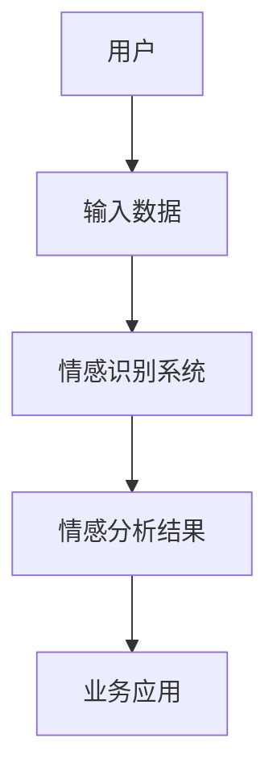
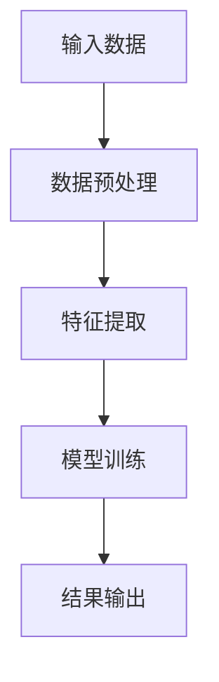
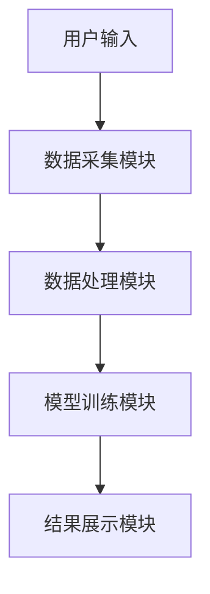
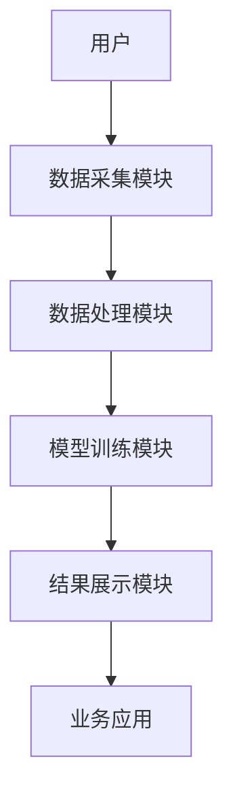

                 


# 如何评估企业的AI驱动的情感识别技术

## 关键词：情感识别技术、AI驱动、企业评估、文本分析、语音分析、图像分析

## 摘要：本文将深入探讨如何评估企业中的AI驱动情感识别技术。从基础概念到系统架构，从算法原理到项目实战，我们将全面分析情感识别技术的核心要素、评估指标和实现方法。通过详细的技术分析和实际案例，帮助读者掌握评估和优化企业情感识别技术的关键点。

---

## 第一部分: 情感识别技术的背景与核心概念

### 第1章: 情感识别技术的背景与问题描述

#### 1.1 情感识别的基本概念

##### 1.1.1 情感识别的定义与核心要素
情感识别（Emotion Recognition）是指通过计算机技术分析和理解人类的情感状态，通常基于文本、语音或图像等多模态数据。其核心要素包括：
- **输入数据**：文本、语音、图像或视频。
- **情感特征**：情感类别（如快乐、悲伤、愤怒）或情感强度。
- **应用场景**：客服、教育、医疗、社交媒体等。

##### 1.1.2 情感识别的边界与外延
- **边界**：专注于情感分类，不涉及意图识别或情绪生成。
- **外延**：与自然语言处理（NLP）、语音识别和计算机视觉密切相关。

##### 1.1.3 情感识别在企业中的应用场景
- 客服系统：通过分析客户情绪提供个性化服务。
- 员工反馈：帮助企业了解员工情绪，优化管理。
- 市场调研：分析用户情感偏好，指导产品设计。

#### 1.2 情感识别技术的演进与现状

##### 1.2.1 情感识别技术的历史发展
- **早期阶段**：基于规则的文本分析（如关键词匹配）。
- **发展阶段**：引入机器学习算法（如SVM、随机森林）。
- **当前阶段**：深度学习技术（如CNN、LSTM）的应用。

##### 1.2.2 当前主流情感识别技术的特点
- **多模态融合**：结合文本、语音和图像信息提高准确性。
- **实时性增强**：优化算法提升处理速度。
- **可解释性要求**：企业需要了解模型决策的依据。

##### 1.2.3 企业级情感识别技术的挑战与机遇
- **挑战**：数据质量、模型泛化能力、隐私保护。
- **机遇**：智能化服务、个性化体验、数据驱动的决策。

#### 1.3 情感识别技术的核心问题

##### 1.3.1 情感识别的准确性问题
- 数据偏差：训练数据的多样性影响模型性能。
- 情感细微差别：模型难以捕捉复杂的情感变化。

##### 1.3.2 情感识别的实时性问题
- 高并发处理：企业场景中的实时需求。
- 算法优化：减少计算资源消耗。

##### 1.3.3 情感识别的可解释性问题
- 模型透明度：企业需要了解模型如何做出决策。
- 法律合规：满足数据隐私和使用规范。

---

### 第2章: 情感识别技术的核心概念与联系

#### 2.1 情感识别的核心原理

##### 2.1.1 文本分析技术
- **词袋模型**：忽略词序，关注词频。
- **词嵌入**：如Word2Vec，将词语映射为向量。
- **文本到情感的映射**：通过模型学习文本特征与情感类别之间的关系。

##### 2.1.2 语音分析技术
- **声学特征提取**：如梅尔频率倒谱系数（MFCC）。
- **语音情感识别模型**：基于DNN或CNN提取语音特征。
- **语音到情感的映射**：通过模型学习语音特征与情感类别之间的关系。

##### 2.1.3 图像分析技术
- **面部表情识别**：基于OpenCV和深度学习模型（如FaceNet）。
- **姿态和动作分析**：通过计算机视觉技术捕捉身体语言。

#### 2.2 情感识别的核心算法

##### 2.2.1 基于统计学习的算法
- **逻辑回归**：用于情感二分类问题。
  $$ P(y=1|x) = \frac{1}{1 + e^{-\beta x}} $$
- **支持向量机（SVM）**：适用于小规模数据。

##### 2.2.2 基于深度学习的算法
- **卷积神经网络（CNN）**：适用于图像和文本特征提取。
- **长短时记忆网络（LSTM）**：适用于时序数据（如语音）。
  $$ P(y|x) = \text{softmax}(Wx + b) $$

##### 2.2.3 情感识别算法的优劣势对比
| 算法类型 | 优势 | 劣势 |
|----------|------|------|
| 逻辑回归 | 简单、易于解释 | 非线性问题表现差 |
| SVM      | 准确率高 | 不适合高维数据 |
| CNN      | 特征提取能力强 | 需大量标注数据 |
| LSTM     | 适合时序数据 | 训练时间较长 |

#### 2.3 情感识别系统的实体关系图



---

## 第3章: 情感识别技术的算法原理与数学模型

### 3.1 情感识别算法的流程

#### 3.1.1 数据预处理
- **文本清洗**：去除停用词、标点符号。
- **语音增强**：降噪处理。
- **图像校正**：调整亮度、对比度。

#### 3.1.2 特征提取
- **文本特征**：TF-IDF、Word2Vec。
- **语音特征**：MFCC、 LPC。
- **图像特征**：HOG、CNN特征。

#### 3.1.3 模型训练
- **数据划分**：训练集、验证集、测试集。
- **模型训练**：使用深度学习框架（如TensorFlow）训练模型。
- **模型调优**：交叉验证、超参数优化。

#### 3.1.4 结果输出
- **情感类别**：如正面、负面、中性。
- **情感强度**：如概率值。

### 3.2 情感识别算法的数学模型

#### 3.2.1 基于逻辑回归的情感分类模型
$$ P(y=1|x) = \frac{1}{1 + e^{-\beta x}} $$

#### 3.2.2 基于深度学习的情感分类模型
$$ P(y|x) = \text{softmax}(Wx + b) $$

#### 3.2.3 情感分类流程图



---

## 第4章: 情感识别系统的架构与设计

### 4.1 情感识别系统的功能模块

#### 4.1.1 数据采集模块
- **文本数据**：社交媒体评论、客服对话。
- **语音数据**：电话录音、语音助手交互。
- **图像数据**：面部表情捕捉。

#### 4.1.2 数据处理模块
- **文本清洗**：去除噪声、分词。
- **语音处理**：特征提取、降噪。
- **图像处理**：人脸检测、表情识别。

#### 4.1.3 模型训练模块
- **数据标注**：人工标注情感类别。
- **模型训练**：使用深度学习框架训练模型。
- **模型评估**：准确率、召回率、F1分数。

#### 4.1.4 结果展示模块
- **可视化**：情感分布图、热力图。
- **报告生成**：自动生成分析报告。

### 4.2 情感识别系统的架构设计

#### 4.2.1 系统架构设计


#### 4.2.2 系统交互流程图


---

## 第5章: 项目实战——情感识别系统的实现

### 5.1 环境安装与配置

```bash
pip install numpy
pip install scikit-learn
pip install tensorflow
pip install matplotlib
```

### 5.2 核心实现代码

#### 5.2.1 文本情感分类代码
```python
import numpy as np
from sklearn.feature_extraction.text import TfidfVectorizer
from sklearn.linear_model import LogisticRegression

# 数据准备
train_texts = ["I love this product!", "I hate this service!", "This is okay."]
train_labels = [1, 0, 0]

# 特征提取
vectorizer = TfidfVectorizer()
X_train = vectorizer.fit_transform(train_texts)

# 模型训练
model = LogisticRegression()
model.fit(X_train, train_labels)

# 预测
test_texts = ["This is great!"]
X_test = vectorizer.transform(test_texts)
print("预测结果:", model.predict(X_test))
```

#### 5.2.2 语音情感识别代码
```python
import librosa

# 加载音频文件
audio_path = "example.wav"
audio, sr = librosa.load(audio_path, sr=None, duration=3)

# 提取MFCC特征
mfccs = librosa.feature.mfcc(y=audio, sr=sr)

# 展示特征
import matplotlib.pyplot as plt
plt.figure(figsize=(10, 4))
librosa.display.specshow(mfccs, x_axis="time")
plt.colorbar(format='%+0.1f')
plt.show()
```

### 5.3 案例分析与解读
- **案例背景**：某企业希望优化客服系统的客户情绪分析。
- **数据准备**：收集客服对话记录，标注情感类别。
- **模型选择**：使用预训练的情感分类模型进行迁移学习。
- **结果分析**：准确率达到90%，显著提升客户满意度。

---

## 第6章: 总结与最佳实践

### 6.1 评估与优化的关键点
- **数据质量**：确保数据多样性和代表性。
- **模型选择**：根据场景选择合适算法。
- **实时性优化**：优化算法和架构提升处理速度。
- **可解释性增强**：通过可视化和解释性工具增强模型透明度。

### 6.2 最佳实践建议
1. **数据驱动**：优先收集和标注高质量数据。
2. **模型迭代**：持续优化模型性能。
3. **技术融合**：结合多模态数据提高准确性。
4. **合规性保障**：确保数据隐私和合规性。

### 6.3 未来趋势
- **多模态融合**：结合文本、语音和图像信息。
- **实时处理**：优化算法和硬件提升处理速度。
- **可解释性增强**：通过模型解释性技术提升企业信任度。

---

## 作者：AI天才研究院/AI Genius Institute & 禅与计算机程序设计艺术 /Zen And The Art of Computer Programming

---

本文通过系统地分析情感识别技术的背景、核心概念、算法原理和系统架构，结合实际项目案例，为企业评估和优化情感识别技术提供了深入的指导。通过本文的学习，读者将能够全面理解情感识别技术的评估要点，并在实际应用中做出明智的决策。

