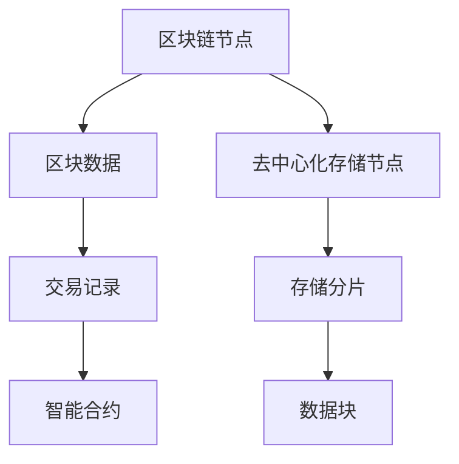
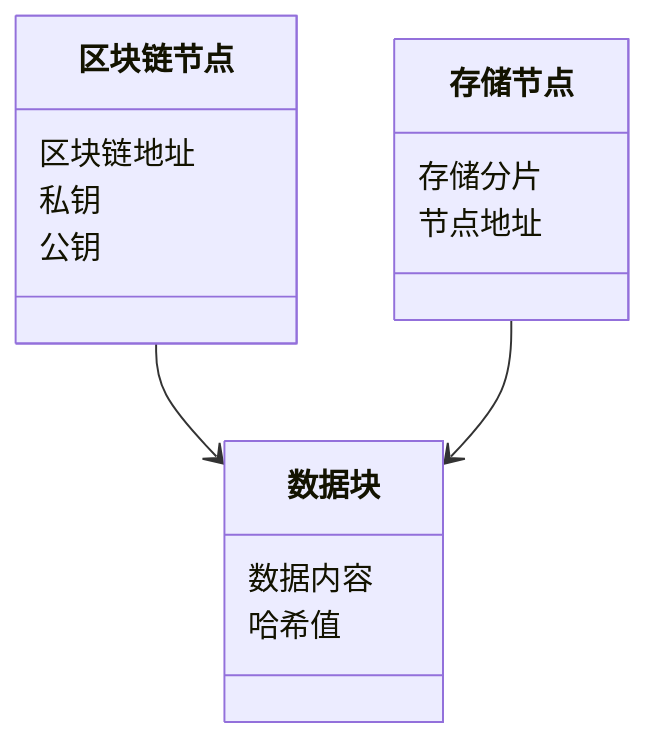
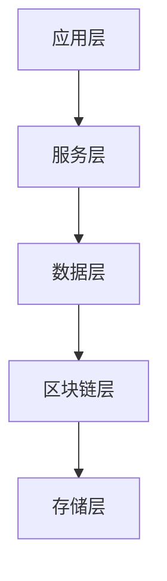

                 


# 如何评估企业的区块链去中心化存储平台

> 关键词：区块链，去中心化存储，分布式系统，共识机制，数据安全，技术评估

> 摘要：本文详细探讨了如何评估企业的区块链去中心化存储平台，从背景介绍、核心概念、算法原理、系统架构、项目实战到最佳实践，全面分析了评估的关键点和方法。

---

# 第1章 区块链去中心化存储平台的背景与概念

## 1.1 区块链技术的基本概念

### 1.1.1 区块链的定义与核心特征

区块链是一种分布式账本技术，通过去中心化的节点网络记录和验证数据，具有不可篡改、透明性和去信任化的特性。

### 1.1.2 区块链的分类与应用场景

区块链可以分为公链、私链和联盟链，应用场景包括金融、供应链管理、医疗数据等。

### 1.1.3 去中心化存储的定义与特点

去中心化存储是指将数据分散存储在多个节点上，避免单点故障，提高数据冗余性和安全性。

---

## 1.2 区块链去中心化存储的背景与需求

### 1.2.1 传统存储方式的局限性

传统存储方式存在单点故障、数据被篡改风险高、成本高等问题。

### 1.2.2 区块链技术如何解决存储问题

区块链通过分布式账本和共识机制，确保数据的不可篡改性和一致性。

### 1.2.3 企业对去中心化存储的需求

企业需要提高数据安全性、降低存储成本、增强隐私保护等。

---

## 1.3 区块链去中心化存储的核心价值

### 1.3.1 数据的安全性与不可篡改性

通过区块链技术，数据一旦写入，难以被篡改，保证了数据的安全性和可靠性。

### 1.3.2 去中心化存储的成本优势

去中心化存储避免了中心化存储的高成本，同时提高了数据的冗余性和可用性。

### 1.3.3 去中心化存储的隐私保护

通过加密技术和隐私保护机制，确保数据在存储和传输过程中的隐私性。

---

## 1.4 区块链去中心化存储的边界与外延

### 1.4.1 区块链去中心化存储的边界

区块链去中心化存储的边界包括数据的写入、存储和查询等操作的权限和规则。

### 1.4.2 区块链去中心化存储与传统存储的对比

通过对比分析，明确区块链去中心化存储的优势和不足。

### 1.4.3 区块链去中心化存储的外延应用

区块链去中心化存储在智能合约、物联网、大数据分析等领域有广泛应用。

---

## 1.5 本章小结

本章介绍了区块链去中心化存储的基本概念、背景、核心价值及其与传统存储的对比，为后续的分析奠定了基础。

---

# 第2章 区块链去中心化存储的核心概念与联系

## 2.1 区块链的核心原理

### 2.1.1 区块链的共识机制

共识机制（如PoW、PoS）确保了区块链网络中各个节点的数据一致性。

### 2.1.2 区块链的分布式账本

分布式账本记录了所有交易信息，确保数据的完整性和不可篡改性。

### 2.1.3 区块链的智能合约

智能合约是在区块链上自动执行的脚本，用于实现特定的业务逻辑。

---

## 2.2 去中心化存储的核心原理

### 2.2.1 去中心化存储的实现方式

通过数据分片、冗余存储等技术实现数据的分布式存储。

### 2.2.2 去中心化存储的数据分片技术

将数据分割成多个部分，分别存储在不同的节点上，提高存储效率和数据冗余性。

### 2.2.3 去中心化存储的激励机制

通过激励机制（如区块链代币）鼓励节点参与数据存储和验证。

---

## 2.3 区块链与去中心化存储的关系

### 2.3.1 区块链如何支持去中心化存储

区块链提供了一个去中心化的信任机制，确保数据的安全性和一致性。

### 2.3.2 去中心化存储如何增强区块链的特性

通过去中心化存储，区块链能够实现更高效的数据存储和访问。

### 2.3.3 区块链与去中心化存储的协同发展

区块链和去中心化存储的结合，推动了数据存储和管理的革新。

---

## 2.4 核心概念对比表

| 概念 | 区块链 | 去中心化存储 |
|------|--------|-------------|
| 数据结构 | 区块链账本 | 分片存储 |
| 节点关系 | 去中心化节点 | 去中心化存储节点 |
| 数据特性 | 不可篡改性 | 分布式冗余性 |

---

## 2.5 ER实体关系图



---

## 2.6 本章小结

本章详细讲解了区块链和去中心化存储的核心概念及其关系，通过对比和图表分析，帮助读者更好地理解两者之间的联系。

---

# 第3章 区块链去中心化存储的算法原理

## 3.1 区块链的共识机制

### 3.1.1 工作量证明（PoW）

通过计算哈希函数来证明节点的计算能力，确保区块链的安全性。

### 3.1.2 权益证明（PoS）

通过持有代币的权益来决定节点的记账权，降低能源消耗。

---

## 3.2 去中心化存储的数据分片技术

### 3.2.1 数据分片的实现

将数据分割成多个部分，分别存储在不同的节点上。

### 3.2.2 数据分片的优化

通过哈希分片、范围分片等技术提高数据存储和访问效率。

---

## 3.3 区块链去中心化存储的加密算法

### 3.3.1 数据加密

使用对称加密和非对称加密技术保护数据的安全性。

### 3.3.2 数字签名

通过数字签名确保数据的完整性和真实性。

---

## 3.4 区块链去中心化存储的数学模型

### 3.4.1 哈希函数

$$H(x) = \text{hash}(x)$$

### 3.4.2 签名算法

$$S(x) = \text{sign}(x, \text{private key})$$

---

## 3.5 本章小结

本章详细讲解了区块链去中心化存储的共识机制、数据分片技术、加密算法及其数学模型，帮助读者理解其技术实现。

---

# 第4章 区块链去中心化存储的系统分析与架构设计

## 4.1 问题场景介绍

### 4.1.1 企业数据存储的痛点

数据安全、存储成本高、数据冗余性差等问题。

### 4.1.2 区块链去中心化存储的优势

通过去中心化和分布式存储，提高数据的安全性和可用性。

---

## 4.2 系统功能设计

### 4.2.1 领域模型设计



---

## 4.3 系统架构设计

### 4.3.1 分层架构



### 4.3.2 微服务架构

通过微服务架构实现系统的模块化和高扩展性。

---

## 4.4 系统接口设计

### 4.4.1 存储接口

定义数据的写入、读取和删除接口。

### 4.4.2 节点通信接口

定义节点之间的数据同步和通信接口。

---

## 4.5 本章小结

本章从系统分析和架构设计的角度，详细讲解了区块链去中心化存储的实现方式和系统结构。

---

# 第5章 区块链去中心化存储的项目实战

## 5.1 环境安装

### 5.1.1 安装区块链框架

安装以太坊、Hyperledger等区块链框架。

### 5.1.2 安装分布式存储系统

安装IPFS、Arweave等分布式存储系统。

---

## 5.2 核心代码实现

### 5.2.1 区块链节点的实现

```python
class BlockchainNode:
    def __init__(self, private_key):
        self.private_key = private_key
        self.address = self.gen_address(private_key)
    
    def gen_address(self, private_key):
        # 生成地址的逻辑
        return "0x" + private_key.hex()
```

### 5.2.2 去中心化存储节点的实现

```python
class StorageNode:
    def __init__(self, node_id):
        self.node_id = node_id
        self.shards = {}  # 存储分片
    
    def store_data(self, data):
        # 存储数据到分片
        shard_id = self.get_shard_id(data)
        self.shards[shard_id] = data
    
    def get_shard_id(self, data):
        # 根据数据生成分片ID
        return hash(data) % 10
```

---

## 5.3 案例分析与实现解读

### 5.3.1 案例背景

某企业希望通过区块链去中心化存储实现数据的安全存储和管理。

### 5.3.2 实现过程

1. 安装并配置区块链框架和分布式存储系统。
2. 实现区块链节点和存储节点的通信接口。
3. 部署系统并进行测试。

---

## 5.4 本章小结

本章通过项目实战，详细讲解了区块链去中心化存储的实现过程和注意事项。

---

# 第6章 区块链去中心化存储的最佳实践与小结

## 6.1 评估关键点

### 6.1.1 数据安全性

确保数据在存储和传输过程中的安全性。

### 6.1.2 系统性能

优化系统的存储和访问效率，提高吞吐量。

### 6.1.3 成本控制

合理规划存储资源，降低存储成本。

---

## 6.2 最佳实践 tips

1. 合理选择区块链框架和存储技术。
2. 确保系统的可扩展性和可维护性。
3. 加强系统的安全性和容错性。

---

## 6.3 本章小结

本章总结了评估区块链去中心化存储平台的关键点和最佳实践，为读者提供了实际的指导和建议。

---

作者：AI天才研究院/AI Genius Institute & 禅与计算机程序设计艺术 /Zen And The Art of Computer Programming

---

**注**：以上内容仅为目录大纲和部分内容展示，完整文章需要按照上述结构进一步扩展和完善，确保每一部分都详细且逻辑清晰。

