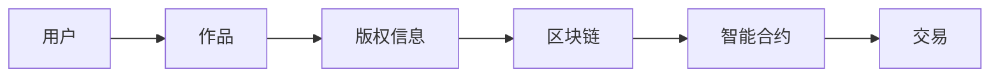
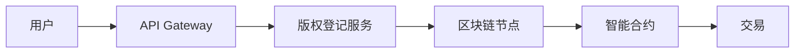
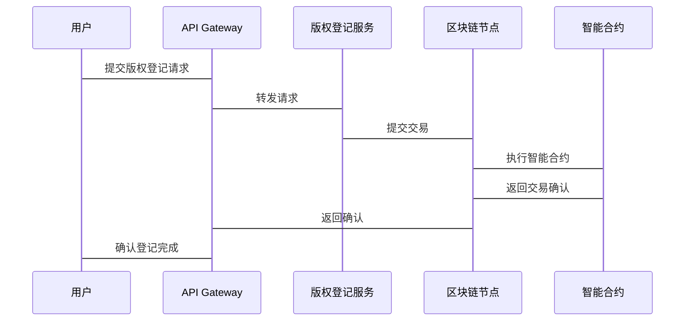

                 


# 如何评估企业的区块链数字版权保护平台

## 关键词：区块链，数字版权，版权保护，技术评估，法律合规

## 摘要：区块链技术为数字版权保护提供了去中心化、不可篡改的解决方案。本文详细分析了如何评估企业区块链数字版权保护平台，从技术、法律和用户体验等多个维度进行考量，确保平台的安全性、合规性和可用性。

---

# 如何评估企业的区块链数字版权保护平台

## 第一部分：区块链数字版权保护平台概述

### 第1章：区块链与数字版权保护概述

#### 1.1 区块链技术简介
- **1.1.1 区块链的基本概念**
  区块链是一种去中心化的分布式账本技术，通过密码学确保数据不可篡改，通过共识机制实现数据一致性。
- **1.1.2 区块链的核心特点**
  - 去中心化：数据由多个节点共同维护，无单点故障。
  - 不可篡改性：数据一旦写入区块链，难以被修改。
  - 可追溯性：每个数据块都包含时间戳和哈希指针，便于追踪数据来源。
- **1.1.3 区块链在数字版权保护中的应用**
  区块链可以用于记录版权信息、追踪作品流转，确保版权归属清晰，防止盗版侵权。

#### 1.2 数字版权保护的背景与挑战
- **1.2.1 数字版权保护的现状**
  数字化浪潮下，数字内容易于复制和传播，导致版权保护难度增加。
- **1.2.2 数字版权保护的主要挑战**
  - 盗版问题严重，难以追踪侵权者。
  - 版权归属不清，难以证明创作时间。
  - 中心化平台存在数据泄露和篡改风险。
- **1.2.3 区块链技术如何解决这些问题**
  区块链的去中心化和不可篡改性，能够有效解决数字版权保护中的信任和溯源问题。

#### 1.3 区块链数字版权保护平台的定义与目标
- **1.3.1 定义**
  区块链数字版权保护平台是基于区块链技术，提供数字内容版权登记、确权、流转和维权支持的平台。
- **1.3.2 核心目标**
  - 提供版权登记和确权服务。
  - 支持数字内容的合法流转。
  - 提供侵权监测和维权支持。
- **1.3.3 平台的主要功能**
  - 用户身份验证与管理。
  - 数字内容上链存证。
  - 版权信息查询与验证。
  - 智能合约自动执行交易。

---

## 第二部分：区块链数字版权保护平台的核心概念与技术原理

### 第2章：区块链技术在数字版权保护中的核心概念

#### 2.1 区块链的核心概念
- **2.1.1 去中心化**
  区块链通过分布式账本实现数据的去中心化存储，避免单点故障和数据篡改。
- **2.1.2 共识机制**
  共识机制（如PoW、PoS）确保所有节点达成一致，保证区块链账本的一致性。
- **2.1.3 智能合约**
  智能合约是部署在区块链上的自动执行程序，用于自动化执行预设的条件。

#### 2.2 数字版权保护中的关键属性
- **2.2.1 独占性**
  每个数字内容在区块链上都有唯一的标识，确保版权归属明确。
- **2.2.2 可追溯性**
  通过区块链记录的内容流转历史，可以追踪数字内容的使用和传播情况。
- **2.2.3 不可篡改性**
  区块链上的数据一旦写入，难以被修改，确保版权信息的真实性。

#### 2.3 区块链数字版权保护的实体关系图


---

## 第三部分：区块链数字版权保护平台的评估标准与方法

### 第3章：评估标准概述

#### 3.1 技术评估标准
- **3.1.1 区块链技术的成熟度**
  评估平台使用的区块链技术是否成熟，是否有实际应用场景和成功案例。
- **3.1.2 智能合约的安全性**
  智能合约是否存在漏洞，是否经过严格测试和审计。
- **3.1.3 网络性能**
  区块链平台的交易速度、延迟和处理能力是否能够满足实际需求。

#### 3.2 法律与合规性评估
- **3.2.1 数据隐私合规性**
  平台是否符合数据保护相关法律法规，如GDPR。
- **3.2.2 版权登记的法律效力**
  区块链上的版权登记是否具有法律效力，能否被法院认可。
- **3.2.3 合规性审查**
  平台是否获得相关法律认证，是否符合行业标准。

#### 3.3 用户体验评估
- **3.3.1 界面友好程度**
  用户界面是否直观，操作是否简便。
- **3.3.2 操作便捷性**
  用户完成版权登记和查询的操作流程是否复杂，是否提供良好的指导。
- **3.3.3 响应速度**
  平台的响应速度是否快，是否影响用户体验。

---

## 第四部分：系统分析与架构设计

### 第4章：系统分析与架构设计

#### 4.1 系统功能模块划分
- **4.1.1 用户模块**
  负责用户身份验证、注册、登录和管理。
- **4.1.2 版权登记模块**
  提供数字内容的上链存证功能，记录版权信息。
- **4.1.3 智能合约模块**
  执行版权流转和使用授权的智能合约。

#### 4.2 系统架构设计


#### 4.3 系统接口设计
- **4.3.1 用户接口**
  提供Web和移动端的用户界面，支持版权登记、查询和管理。
- **4.3.2 区块链节点接口**
  提供API接口，允许其他系统与区块链节点交互。
- **4.3.3 智能合约接口**
  提供标准接口，允许外部系统触发智能合约执行。

#### 4.4 交互流程设计


---

## 第五部分：项目实战与案例分析

### 第5章：项目实战

#### 5.1 环境配置
- 安装所需的区块链框架（如Ethereum、Hyperledger Fabric）。
- 配置智能合约开发环境（如Solidity、Node.js）。
- 设置测试网络或私有链。

#### 5.2 系统核心实现源代码
- **版权登记模块**
  ```javascript
  const fs = require('fs');
  const Web3 = require('web3');

  async function registerCopyright(filePath, contractAddress, web3Provider) {
    const content = fs.readFileSync(filePath, 'utf8');
    const web3 = new Web3(web3Provider);
    const contract = new web3.ContractABI(contractAddress, abi);
    const result = await contract.methods.register(content).send();
    return result;
  }
  ```

- **智能合约实现**
  ```solidity
  // SPDX-License-Identifier: MIT
  pragma solidity ^0.8.0;

  contract CopyrightProtection {
    struct Copyright {
        address owner;
        string contentHash;
        uint256 timestamp;
    }

    mapping(string => Copyright) private registry;

    function register(string calldata contentHash) external {
        registry[contentHash] = Copyright(msg.sender, contentHash, block.timestamp);
    }

    function query(string calldata contentHash) external view returns (address, uint256) {
        return (registry[contentHash].owner, registry[contentHash].timestamp);
    }
  }
  ```

#### 5.3 测试与验证
- 使用单元测试框架（如Mocha）对智能合约进行测试。
- 部署测试环境，模拟用户提交、查询和流转版权信息。

#### 5.4 实际案例分析
- **案例：音乐版权保护**
  某音乐平台使用区块链技术保护音乐版权，确保创作者的权益。
  - **环境配置**
    - 使用Ethereum区块链。
    - 部署智能合约到Ropsten测试网。
    - 开发Web界面供音乐人提交版权信息。
  - **实现细节**
    - 用户提交音乐作品的哈希值到智能合约。
    - 合约记录版权信息，包括创作者地址和时间戳。
    - 提供API接口查询版权信息。

#### 5.5 项目小结
- 项目成功实现了区块链数字版权保护的核心功能。
- 在实际应用中，需要考虑性能优化和用户体验提升。
- 法律合规性是项目成功的关键，需与法律团队紧密合作。

---

## 第六部分：总结与展望

### 第6章：总结与展望

#### 6.1 最佳实践 tips
- **选择合适的区块链平台**
  根据需求选择公有链或私有链，考虑性能、安全性和成本。
- **确保智能合约安全**
  在部署前进行充分的测试和审计。
- **关注法律合规性**
  确保平台符合相关法律法规，避免法律风险。
- **优化用户体验**
  提供直观的界面和便捷的操作流程。

#### 6.2 小结
区块链数字版权保护平台的评估需要综合考虑技术、法律和用户体验等多个方面。通过本文的分析，读者可以系统地评估和选择适合自身需求的平台。

#### 6.3 注意事项
- 技术实现需要结合实际需求，避免过度复杂。
- 数据隐私保护是关键，需采取适当的加密措施。
- 智能合约的设计需简单可靠，避免复杂逻辑。

#### 6.4 拓展阅读
- 推荐阅读《Blockchain Basics: A Non-Technical Guide to Understanding Blockchain》。
- 关注行业动态，了解最新的区块链技术发展和应用案例。

---

## 作者：AI天才研究院 & 禅与计算机程序设计艺术

