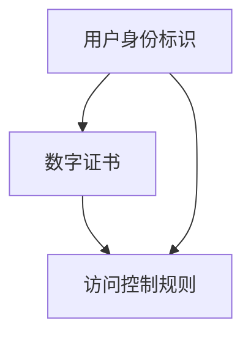
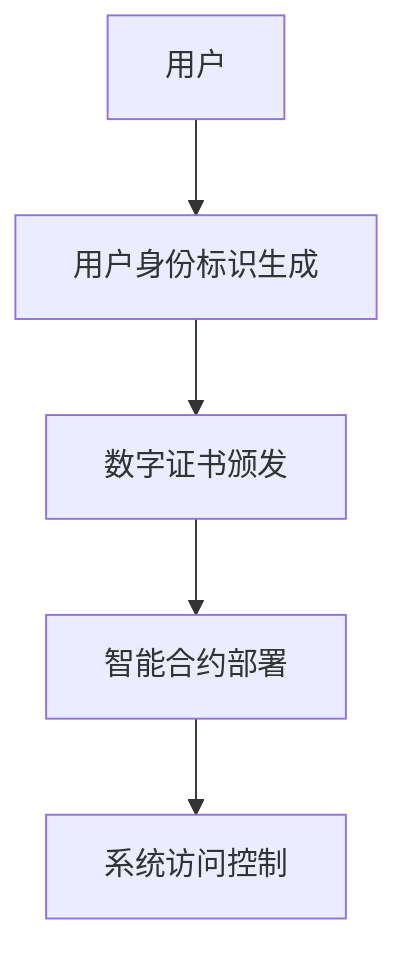

                 


# 如何评估企业的区块链数字身份系统

> 关键词：区块链数字身份系统, 企业评估标准, 安全性, 可扩展性, 数字身份认证

> 摘要：本文从企业区块链数字身份系统的背景出发，深入分析其核心概念、技术实现、评估标准和方法论，结合实际案例，为企业评估提供系统的指导和建议。通过详细的技术分析和实践案例，帮助企业在数字化转型中构建安全、高效、可扩展的区块链数字身份系统。

---

# 第一部分: 区块链数字身份系统概述

## 第1章: 区块链数字身份系统背景介绍

### 1.1 区块链技术基础

#### 1.1.1 区块链的基本概念

区块链是一种分布式账本技术，通过去中心化的节点网络记录数据，确保数据的不可篡改性和可追溯性。区块链的核心特征包括去中心化、数据一致性、不可篡改性和可扩展性。

#### 1.1.2 区块链的核心特性

- **去中心化**：数据不由单个中心节点控制，而是分散在多个节点中。
- **数据一致性**：通过共识机制确保所有节点的数据一致。
- **不可篡改性**：数据一旦写入区块链，难以被篡改。
- **可扩展性**：通过优化共识算法和数据结构，区块链系统可以支持更大的数据量和更高的交易吞吐量。

#### 1.1.3 区块链在企业中的应用

区块链技术在企业中的应用非常广泛，包括供应链管理、金融支付、知识产权保护和数字身份认证等领域。在数字身份认证中，区块链技术可以帮助企业实现更安全、更高效的用户身份管理。

### 1.2 数字身份系统概述

#### 1.2.1 数字身份的定义

数字身份是指用户在数字系统中的唯一标识，通常包括用户的用户名、密码、数字证书等。数字身份的核心目标是确保用户在数字系统中的身份是唯一的、可信的和安全的。

#### 1.2.2 数字身份系统的应用场景

- **金融支付**：用户在进行在线支付时需要验证其身份。
- **社交网络**：用户在社交网络中登录和发布内容时需要身份认证。
- **企业内部系统**：员工在访问企业内部资源时需要身份认证。

#### 1.2.3 数字身份系统的挑战

数字身份系统面临的主要挑战包括安全性、隐私保护和可扩展性。如何在确保用户隐私的同时，实现高效的身份认证，是数字身份系统设计中的难点。

---

## 第2章: 区块链数字身份系统的概念与核心要素

### 2.1 区块链数字身份系统的定义

区块链数字身份系统是一种基于区块链技术的数字身份认证系统，通过区块链的去中心化特性，实现用户身份信息的安全存储和高效验证。

### 2.2 系统的核心要素

#### 2.2.1 用户身份标识

用户身份标识是区块链数字身份系统的核心要素之一，通常包括用户的公钥、私钥和数字证书。公钥用于标识用户，私钥用于签名和验证，数字证书用于证明用户身份的合法性。

#### 2.2.2 数字证书

数字证书是区块链数字身份系统中的一种重要凭证，通常由可信的证书颁发机构颁发。数字证书包含用户的身份信息、公钥和签名等信息，可以用于验证用户身份。

#### 2.2.3 访问控制规则

访问控制规则是区块链数字身份系统中的另一重要要素，用于定义用户在系统中的访问权限。访问控制规则可以通过智能合约实现，确保用户只能访问其权限范围内的资源。

### 2.3 系统的边界与外延

区块链数字身份系统的边界包括用户身份信息的存储、身份认证和访问控制。外延则包括与系统交互的外部系统，如企业内部系统、第三方服务等。

### 2.4 核心概念之间的关系

图1展示了区块链数字身份系统中核心概念之间的关系：



---

## 第3章: 区块链数字身份系统的原理与技术实现

### 3.1 区块链数字身份系统的数据结构

#### 3.1.1 区块链中的数据存储结构

区块链中的数据存储结构包括区块头和区块体。区块头包含区块的哈希值、时间戳和父区块哈希值等信息。区块体包含交易数据和交易的元数据。

#### 3.1.2 数字身份信息的存储方式

数字身份信息可以通过区块链的智能合约进行存储。智能合约是一种运行在区块链上的自动执行程序，可以实现用户身份信息的存储和验证。

#### 3.1.3 智能合约的实现

智能合约可以通过编程语言（如Solidity）编写，并部署在区块链上。智能合约可以实现用户身份信息的注册、验证和权限管理等功能。

### 3.2 区块链数字身份系统的共识机制

#### 3.2.1 共识机制的基本原理

共识机制是区块链系统的核心组件之一，用于确保所有节点的数据一致性。常见的共识机制包括工作量证明（PoW）、权益证明（PoS）和实用拜占庭容错（PBFT）等。

#### 3.2.2 常见的共识算法对比

表1展示了常见共识算法的对比：

| 算法名称 | 特点 | 优缺点 |
|----------|------|--------|
| PoW     | 需要大量计算资源 | 安全性高，但效率低 |
| PoS     | 基于持有代币的权益 | 效率高，但安全性较低 |
| PBFT     | 支持 Byzantine Fault Tolerance | 适用于小型网络 |

#### 3.2.3 选择共识机制的影响因素

选择共识机制时需要考虑的因素包括安全性、效率、网络规模和成本等。对于企业内部的区块链数字身份系统，通常选择PBFT等高效的共识算法。

### 3.3 区块链数字身份系统的加密机制

#### 3.3.1 加密算法的选择

区块链数字身份系统通常使用椭圆曲线加密（ECC）算法，具有安全性高、计算效率高的特点。

#### 3.3.2 数字签名的实现

数字签名是区块链数字身份系统中的重要技术，通过哈希函数和加密算法实现数据的签名和验证。

---

## 第4章: 区块链数字身份系统的安全与隐私保护

### 4.1 系统安全性的关键因素

#### 4.1.1 加密算法的选择

选择安全的加密算法是确保系统安全的基础。常见的加密算法包括AES、RSA和ECC等。

#### 4.1.2 防篡改机制

区块链的防篡改机制通过数据的分布式存储和共识机制实现，确保数据的安全性。

#### 4.1.3 身份认证流程

身份认证流程包括用户身份标识的生成、存储和验证，确保用户身份的合法性。

### 4.2 用户隐私保护措施

#### 4.2.1 数据加密存储

用户身份信息可以通过加密技术存储在区块链上，确保数据的安全性。

#### 4.2.2 匿名化处理

通过匿名化处理，可以保护用户的隐私，避免用户身份信息被滥用。

#### 4.2.3 访问权限控制

通过访问控制规则，确保用户只能访问其权限范围内的资源。

---

## 第5章: 区块链数字身份系统的评估标准与方法论

### 5.1 评估指标的分类

#### 5.1.1 安全性指标

安全性指标包括系统的抗攻击能力、数据完整性等。

#### 5.1.2 可扩展性指标

可扩展性指标包括系统的交易吞吐量、网络延迟等。

#### 5.1.3 可维护性指标

可维护性指标包括系统的可升级性、错误恢复能力等。

#### 5.1.4 可用性指标

可用性指标包括系统的 uptime、容错能力等。

### 5.2 评估指标的权重分配

评估指标的权重分配需要根据具体应用场景进行调整。例如，在金融支付场景中，安全性指标的权重可能更高。

---

## 第6章: 区块链数字身份系统的项目实战

### 6.1 项目背景与目标

假设某企业需要构建一个区块链数字身份系统，用于员工的内部访问控制和外部合作伙伴的身份认证。

### 6.2 系统功能设计

#### 6.2.1 用户身份标识生成

用户身份标识可以通过椭圆曲线加密算法生成公钥和私钥。

#### 6.2.2 数字证书颁发

数字证书由可信的证书颁发机构颁发，并存储在区块链上。

#### 6.2.3 身份认证流程

用户在访问系统时，需要提供公钥和数字证书，系统通过智能合约进行身份验证。

### 6.3 系统架构设计

图2展示了系统的架构设计：



### 6.4 系统实现与测试

#### 6.4.1 智能合约实现

以下是智能合约的实现代码：

```solidity
// SPDX-License-Identifier: MIT
pragma solidity ^0.8.0;

contract DigitalIdentity {
    struct UserIdentity {
        bytes publicKey;
        bool isValid;
    }

    mapping(address => UserIdentity) private identities;

    function register(bytes memory publicKey) public {
        identities[msg.sender].publicKey = publicKey;
        identities[msg.sender].isValid = true;
    }

    function authenticate(address addr, bytes memory publicKey) public view returns (bool) {
        return identities[addr].publicKey == publicKey && identities[addr].isValid;
    }
}
```

#### 6.4.2 测试与优化

通过单元测试和集成测试，确保系统的安全性和可扩展性。测试内容包括身份认证、权限控制和数据完整性等。

---

## 第7章: 总结与展望

### 7.1 总结

区块链数字身份系统通过区块链技术实现用户身份信息的安全存储和高效验证，具有安全性高、可扩展性强等优点。企业在评估系统时，需要综合考虑安全性、可扩展性和可用性等多方面的因素。

### 7.2 未来展望

未来，区块链数字身份系统将更加智能化和自动化。通过结合人工智能技术，可以实现更智能的身份认证和动态权限管理。同时，随着技术的发展，区块链数字身份系统在企业中的应用将更加广泛。

---

作者：AI天才研究院/AI Genius Institute & 禅与计算机程序设计艺术 /Zen And The Art of Computer Programming

