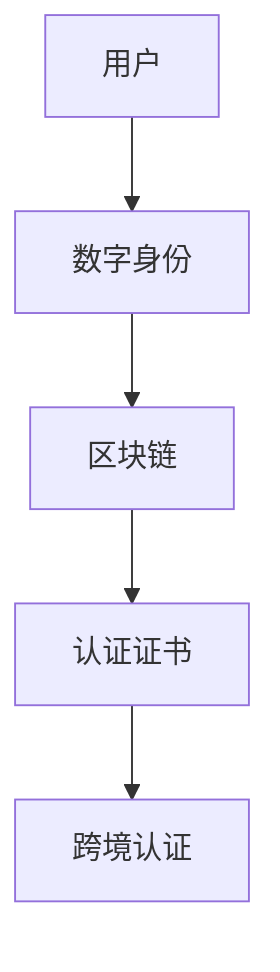
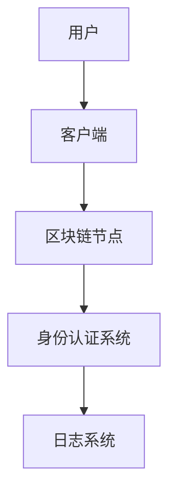

                 


# 如何评估企业的区块链数字身份跨境认证应用

> 关键词：区块链，数字身份，跨境认证，系统架构，技术评估，身份验证

> 摘要：本文深入探讨了如何评估企业的区块链数字身份跨境认证应用，从核心概念、算法原理到系统架构、项目实战，详细分析了区块链技术在身份认证中的应用潜力及实现方案。通过实际案例和最佳实践，帮助读者全面理解如何在企业中有效实施区块链数字身份跨境认证。

---

# 第一部分：区块链数字身份跨境认证应用的背景与核心概念

## 第1章：区块链数字身份跨境认证的背景与问题背景

### 1.1 问题背景

#### 1.1.1 当前企业身份认证的痛点

传统企业身份认证系统存在以下痛点：

- **安全性不足**：密码泄露、钓鱼攻击等问题导致身份信息容易被篡改或盗用。
- **跨平台兼容性差**：不同系统之间的身份认证标准不统一，难以实现无缝对接。
- **效率低下**：传统中心化认证方式依赖于第三方机构，存在延迟和冗余流程。
- **隐私问题**：用户身份信息集中存储，容易成为黑客攻击的目标。

#### 1.1.2 跨境身份认证的复杂性

跨境身份认证面临的挑战包括：

- **法律差异**：不同国家的法律法规对身份认证的要求各不相同。
- **技术壁垒**：不同国家之间的身份认证系统互操作性差。
- **信任成本**：跨国认证需要建立互信机制，成本较高。

#### 1.1.3 区块链技术如何解决身份认证问题

区块链技术的核心优势在于去中心化、不可篡改和透明性。通过区块链技术，可以实现以下目标：

- **去中心化身份认证**：用户无需依赖第三方机构，直接通过区块链进行身份验证。
- **数据不可篡改**：区块链的分布式账本特性确保身份信息的安全性和唯一性。
- **高效互操作性**：区块链可以提供统一的接口和标准，实现跨平台的身份认证。

### 1.2 问题描述

#### 1.2.1 跨境认证的业务场景

跨境认证的典型业务场景包括：

- **跨国登录**：用户在不同国家的平台上使用同一身份登录。
- **跨国支付**：用户在不同国家的支付系统中进行身份验证。
- **跨国社交**：用户在不同国家的社交网络中进行身份认证。

#### 1.2.2 跨境认证的流程与挑战

跨境认证的流程通常包括：

1. 用户在本国平台注册身份信息。
2. 身份信息通过区块链进行加密和签名。
3. 跨境传输至目标国家的认证系统。
4. 目标系统验证身份信息的合法性和有效性。

挑战包括：

- **数据隐私**：如何在跨境传输中保护用户隐私。
- **法律合规**：如何遵守不同国家的法律法规。
- **技术实现**：如何实现不同区块链平台之间的互操作性。

#### 1.2.3 区块链技术在跨境认证中的应用潜力

区块链技术的应用潜力在于：

- **提高效率**：通过智能合约自动执行认证流程，减少人工干预。
- **降低成本**：去中心化减少了对第三方机构的依赖，降低运营成本。
- **增强信任**：区块链的透明性和不可篡改性增强了用户对系统的信任。

### 1.3 问题解决

#### 1.3.1 区块链技术的核心优势

区块链技术的核心优势包括：

- **去中心化**：无需依赖中心化机构，减少单点故障。
- **不可篡改**：数据一旦写入区块链，无法被修改。
- **透明性**：所有交易记录公开透明，便于审计和追踪。

#### 1.3.2 数字身份的定义与实现

数字身份的定义：数字身份是指在数字世界中，用于标识个人或组织的一组数据和权限。其实现方式包括：

- **公钥基础设施（PKI）**：使用公钥和私钥对进行身份验证。
- **智能合约**：通过智能合约定义身份的权限和使用规则。

#### 1.3.3 跨境认证的实现方案

实现方案包括：

- **跨链技术**：实现不同区块链平台之间的互操作性。
- **身份桥接**：通过中间机构实现不同国家认证系统之间的桥梁作用。
- **联合签名**：多个区块链节点共同签名认证信息，确保其合法性。

### 1.4 边界与外延

#### 1.4.1 跨境认证的边界条件

- **认证范围**：仅限于身份认证，不包括其他业务逻辑。
- **数据范围**：仅涉及身份信息，不包括其他敏感数据。
- **法律范围**：遵守相关国家的法律法规。

#### 1.4.2 区块链技术的适用范围

- **适用于需要高安全性的场景**。
- **适用于需要跨平台互操作性的场景**。
- **适用于需要去中心化信任的场景**。

#### 1.4.3 数字身份的法律与合规问题

- **数据隐私**：遵守《通用数据保护条例》（GDPR）等法律法规。
- **跨境数据传输**：遵守目标国家的法律法规，避免数据跨境传输的障碍。
- **合规性认证**：确保数字身份系统符合相关行业标准。

### 1.5 概念结构与核心要素

#### 1.5.1 区块链数字身份的核心要素

- **身份标识**：用于唯一标识用户身份的标识符。
- **权限管理**：定义用户在不同系统中的权限和访问控制规则。
- **签名机制**：通过数字签名确保身份信息的完整性和真实性。

#### 1.5.2 跨境认证的关键流程

1. **身份注册**：用户在本国平台注册身份信息，并生成公钥和私钥对。
2. **身份签名**：用户使用私钥对身份信息进行签名，生成签名数据。
3. **跨境传输**：签名数据通过区块链网络传输至目标国家的认证系统。
4. **身份验证**：目标系统验证签名数据的合法性和有效性。

#### 1.5.3 数字身份系统的架构

- **用户层**：用户通过客户端发起身份认证请求。
- **区块链层**：区块链网络负责存储和验证身份信息。
- **认证层**：目标系统验证身份信息的合法性和有效性。

## 第2章：区块链数字身份的核心概念与联系

### 2.1 区块链技术的核心原理

#### 2.1.1 区块链的定义与特点

区块链是一种去中心化的分布式账本技术，具有以下特点：

- **去中心化**：无需依赖中心化机构，数据由多个节点共同维护。
- **不可篡改**：数据一旦写入区块链，无法被修改。
- **透明性**：所有交易记录公开透明，便于审计和追踪。

#### 2.1.2 区块链的共识机制

共识机制是区块链的核心机制，常见的共识机制包括：

- **工作量证明（PoW）**：通过计算哈希值来验证交易的有效性。
- **权益证明（PoS）**：根据持有代币的数量来决定验证权。
- **拜占庭容错（BFT）**：通过投票机制实现共识。

#### 2.1.3 区块链的智能合约

智能合约是区块链上的自动执行程序，用于定义和执行合同条款。其特点包括：

- **自动执行**：一旦触发条件，智能合约自动执行相应操作。
- **不可篡改**：智能合约代码一旦部署，无法被修改。
- **透明性**：智能合约代码公开透明，便于审计和验证。

### 2.2 数字身份的定义与实现

#### 2.2.1 数字身份的定义

数字身份是指在数字世界中，用于标识个人或组织的一组数据和权限。其实现方式包括：

- **公钥基础设施（PKI）**：使用公钥和私钥对进行身份验证。
- **智能合约**：通过智能合约定义身份的权限和使用规则。

#### 2.2.2 数字身份的实现方式

数字身份的实现方式包括：

- **基于公钥的认证**：使用公钥和私钥对进行身份验证。
- **基于智能合约的认证**：通过智能合约定义身份的权限和使用规则。
- **基于生物特征的认证**：使用指纹、面部识别等生物特征进行身份验证。

#### 2.2.3 数字身份的生命周期

数字身份的生命周期包括：

1. **创建**：用户在系统中注册身份信息，并生成公钥和私钥对。
2. **使用**：用户使用私钥对身份信息进行签名，发起身份认证请求。
3. **撤销**：用户可以撤销身份信息，终止其使用权。
4. **存档**：身份信息存档，便于后续审计和追踪。

### 2.3 跨境认证的实现原理

#### 2.3.1 跨境认证的业务流程

跨境认证的业务流程包括：

1. **身份注册**：用户在本国平台注册身份信息，并生成公钥和私钥对。
2. **身份签名**：用户使用私钥对身份信息进行签名，生成签名数据。
3. **跨境传输**：签名数据通过区块链网络传输至目标国家的认证系统。
4. **身份验证**：目标系统验证签名数据的合法性和有效性。

#### 2.3.2 跨境认证的技术实现

跨境认证的技术实现包括：

- **跨链技术**：实现不同区块链平台之间的互操作性。
- **身份桥接**：通过中间机构实现不同国家认证系统之间的桥梁作用。
- **联合签名**：多个区块链节点共同签名认证信息，确保其合法性。

#### 2.3.3 跨境认证的法律合规性

跨境认证的法律合规性包括：

- **数据隐私**：遵守《通用数据保护条例》（GDPR）等法律法规。
- **跨境数据传输**：遵守目标国家的法律法规，避免数据跨境传输的障碍。
- **合规性认证**：确保数字身份系统符合相关行业标准。

### 2.4 核心概念的ER实体关系图

```mermaid
er
actor(用户) --> identity(数字身份)
actor --> certificate(认证证书)
identity --> blockchain(区块链)
blockchain --> transaction(交易记录)
```

### 2.5 核心概念的流程图



---

## 第3章：区块链数字身份跨境认证的算法原理

### 3.1 区块链共识机制的实现

#### 3.1.1 工作量证明（PoW）的实现

工作量证明（PoW）的实现包括：

1. **计算哈希值**：每个节点通过计算哈希值来验证交易的有效性。
2. **验证哈希值**：全网节点验证哈希值是否满足特定条件。
3. **区块打包**：通过哈希值验证的交易被打包成区块。

#### 3.1.2 权益证明（PoS）的实现

权益证明（PoS）的实现包括：

1. **持有代币**：节点根据持有的代币数量获得验证权。
2. **随机选举**：随机选举节点进行区块验证。
3. **区块打包**：通过验证的交易被打包成区块。

#### 3.1.3 拜占庭容错（BFT）的实现

拜占庭容错（BFT）的实现包括：

1. **节点投票**：节点通过投票机制验证交易的有效性。
2. **多数节点同意**：超过半数节点同意的交易被打包成区块。

### 3.2 数字身份认证的算法实现

#### 3.2.1 公钥加密算法

公钥加密算法包括：

- **RSA算法**：基于大整数分解的公钥加密算法。
- **椭圆曲线加密（ECC）**：基于椭圆曲线数学的公钥加密算法。

#### 3.2.2 数字签名算法

数字签名算法包括：

- **RSA-SHA**：使用RSA算法对SHA哈希值进行签名。
- **ECDSA**：使用椭圆曲线数字签名算法进行签名。

#### 3.2.3 身份验证流程

身份验证流程包括：

1. **用户发起请求**：用户向目标系统发起身份认证请求。
2. **签名验证**：目标系统验证用户的签名数据。
3. **身份确认**：目标系统确认用户身份的合法性和有效性。

### 3.3 数学公式

#### 3.3.1 哈希函数

哈希函数的定义为：

$$
H(x) = \text{哈希值}
$$

其中，$x$ 是输入数据，$H(x)$ 是哈希值。

#### 3.3.2 椭圆曲线加密

椭圆曲线加密的数学公式为：

$$
y^2 = x^3 + ax + b \mod p
$$

其中，$a$ 和 $b$ 是椭圆曲线的参数，$p$ 是模数。

#### 3.3.3 数字签名

数字签名的生成过程为：

$$
\text{签名} = \text{私钥} \times \text{哈希值} \mod p
$$

其中，$\text{私钥}$ 是用户的私钥，$\text{哈希值}$ 是输入数据的哈希值。

---

## 第4章：区块链数字身份跨境认证的系统分析与架构设计

### 4.1 系统功能设计

#### 4.1.1 用户功能

- **身份注册**：用户在系统中注册身份信息，并生成公钥和私钥对。
- **身份签名**：用户使用私钥对身份信息进行签名，发起身份认证请求。
- **身份验证**：用户在目标系统中验证身份信息的合法性和有效性。

#### 4.1.2 管理功能

- **权限管理**：管理用户的权限和访问控制规则。
- **日志管理**：记录用户的身份认证操作日志，便于审计和追踪。
- **系统监控**：监控系统的运行状态，及时发现和处理异常情况。

### 4.2 系统架构设计

#### 4.2.1 系统架构图



#### 4.2.2 模块划分

- **用户模块**：负责用户的注册、登录和身份验证。
- **区块链模块**：负责区块链网络的维护和交易的验证。
- **身份认证模块**：负责身份信息的验证和权限管理。
- **日志模块**：负责记录用户的操作日志，便于审计和追踪。

### 4.3 接口设计

#### 4.3.1 用户接口

- **注册接口**：用户通过注册接口注册身份信息。
- **登录接口**：用户通过登录接口发起身份认证请求。
- **验证接口**：目标系统通过验证接口验证用户身份信息的合法性和有效性。

#### 4.3.2 区块链接口

- **区块查询接口**：查询区块链上的交易记录。
- **签名验证接口**：验证用户的签名数据。

### 4.4 交互设计

#### 4.4.1 身份认证流程

1. 用户在本国平台注册身份信息，并生成公钥和私钥对。
2. 用户使用私钥对身份信息进行签名，生成签名数据。
3. 签名数据通过区块链网络传输至目标国家的认证系统。
4. 目标系统验证签名数据的合法性和有效性。
5. 目标系统确认用户身份的合法性和有效性，完成身份认证。

#### 4.4.2 跨境认证流程

1. 用户在本国平台注册身份信息，并生成公钥和私钥对。
2. 用户使用私钥对身份信息进行签名，生成签名数据。
3. 签名数据通过区块链网络传输至目标国家的认证系统。
4. 目标系统验证签名数据的合法性和有效性。
5. 目标系统确认用户身份的合法性和有效性，完成身份认证。

---

## 第5章：区块链数字身份跨境认证的项目实战

### 5.1 项目环境安装

#### 5.1.1 安装区块链平台

1. **安装以太坊客户端**：使用Geth或Node.js安装以太坊客户端。
2. **安装智能合约开发工具**：安装Solidity和Remix IDE。
3. **安装区块链钱包**：安装MetaMask或其他支持以太坊的 wallets。

#### 5.1.2 安装数字身份系统

1. **安装身份认证系统**：安装基于区块链的数字身份认证系统。
2. **配置系统参数**：配置系统参数，包括区块链节点地址、智能合约地址等。
3. **部署智能合约**：部署智能合约至区块链网络。

### 5.2 项目核心代码实现

#### 5.2.1 智能合约实现

```solidity
// SPDX-License-Identifier: MIT
pragma solidity ^0.8.0;

contract IdentityAuthentication {
    mapping(address => bytes32) private userIdentities;

    function register(address user, bytes32 identity) external {
        userIdentities[user] = identity;
    }

    function authenticate(address user, bytes32 identity) external returns (bool) {
        return userIdentities[user] == identity;
    }
}
```

#### 5.2.2 身份验证实现

```python
from web3 import Web3

def authenticate(user_address, identity_hash):
    # 连接到区块链节点
    web3 = Web3(Web3.HTTPProvider('http://localhost:8545'))
    # 获取智能合约实例
    contract = web3.eth.contract(address='0x...', abi='...')
    # 调用智能合约的authenticate函数
    result = contract.functions.authenticate(user_address, identity_hash).call()
    return result
```

### 5.3 项目应用解读与分析

#### 5.3.1 智能合约解读

智能合约的功能包括：

- **注册功能**：用户在系统中注册身份信息，并生成公钥和私钥对。
- **验证功能**：目标系统验证用户的签名数据，确认用户身份的合法性和有效性。

#### 5.3.2 身份验证流程分析

身份验证流程包括：

1. 用户在本国平台注册身份信息，并生成公钥和私钥对。
2. 用户使用私钥对身份信息进行签名，生成签名数据。
3. 签名数据通过区块链网络传输至目标国家的认证系统。
4. 目标系统验证签名数据的合法性和有效性。
5. 目标系统确认用户身份的合法性和有效性，完成身份认证。

### 5.4 实际案例分析

#### 5.4.1 案例背景

某跨国企业需要实现跨国身份认证，确保用户在不同国家的平台上使用同一身份登录。

#### 5.4.2 实施方案

1. 用户在本国平台注册身份信息，并生成公钥和私钥对。
2. 用户使用私钥对身份信息进行签名，生成签名数据。
3. 签名数据通过区块链网络传输至目标国家的认证系统。
4. 目标系统验证签名数据的合法性和有效性。
5. 目标系统确认用户身份的合法性和有效性，完成身份认证。

#### 5.4.3 项目小结

通过区块链技术实现跨国身份认证，可以有效提高效率，降低成本，增强用户信任。

---

## 第6章：区块链数字身份跨境认证应用的最佳实践

### 6.1 小结

区块链技术在数字身份跨境认证中的应用潜力巨大。通过区块链技术，可以实现去中心化身份认证，提高效率，降低成本，增强用户信任。

### 6.2 注意事项

在实施区块链数字身份跨境认证应用时，需要注意以下事项：

- **数据隐私**：遵守相关法律法规，保护用户隐私。
- **法律合规**：确保系统符合相关国家的法律法规。
- **技术实现**：确保技术实现的可靠性和安全性。

### 6.3 拓展阅读

1. **《区块链技术入门与实战》**：深入理解区块链技术的核心原理和实现方式。
2. **《数字身份认证技术》**：系统学习数字身份认证的技术和方法。
3. **《跨境认证与法律合规》**：了解跨境认证相关的法律法规和合规要求。

---

# 作者

作者：AI天才研究院/AI Genius Institute & 禅与计算机程序设计艺术 /Zen And The Art of Computer Programming

