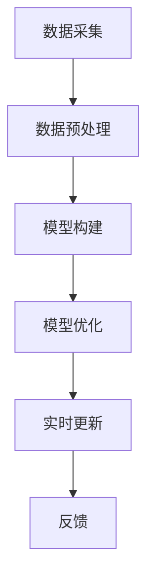
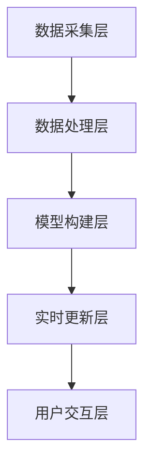

                 


# 如何评估企业的数字孪生技术应用

> 关键词：数字孪生、企业评估、技术应用、系统架构、实时数据、数据可视化、最佳实践

> 摘要：本文将详细介绍如何评估企业的数字孪生技术应用。通过分析数字孪生的核心概念、评估标准、实施方法和实际案例，本文旨在为企业提供一套系统化的评估框架和实践指南，帮助企业在数字化转型中更好地应用数字孪生技术。

---

# 第一部分：数字孪生技术概述

## 第1章：数字孪生技术的定义与背景

### 1.1 数字孪生技术的定义
#### 1.1.1 数字孪生的定义
数字孪生（Digital Twin）是一种通过物理实体的虚拟化表示，实时同步物理实体的状态、行为和过程的技术。它不仅能够反映物理实体的静态属性，还能模拟其动态行为，从而实现对物理世界的实时感知和预测。

#### 1.1.2 数字孪生的核心特点
- **实时性**：数字孪生能够实时反映物理实体的状态，确保虚拟模型与实际系统保持同步。
- **交互性**：用户可以通过数字孪生模型与物理实体进行交互，实现对系统的控制和优化。
- **数据驱动**：数字孪生依赖于多源数据的整合和分析，能够提供高精度的模拟和预测。
- **可扩展性**：数字孪生模型可以根据需求进行扩展，支持大规模复杂系统的建模和分析。

#### 1.1.3 数字孪生与相关技术的对比
数字孪生与物联网（IoT）、大数据、人工智能（AI）等技术密切相关，但也有显著区别：
- **物联网**：物联网是数字孪生的基础，提供了实时数据的采集和传输。
- **大数据**：大数据技术为数字孪生提供了数据存储、处理和分析的能力。
- **人工智能**：人工智能技术增强了数字孪生的预测和决策能力。

### 1.2 数字孪生技术的背景与发展趋势
#### 1.2.1 数字孪生技术的起源与发展
数字孪生的概念最早可以追溯到20世纪90年代的虚拟样机技术，随着物联网、云计算和人工智能技术的发展，数字孪生逐渐成熟并得到了广泛应用。

#### 1.2.2 数字孪生技术在企业中的应用现状
目前，数字孪生技术已经在制造业、智慧城市、医疗健康等领域得到了广泛应用。例如：
- 制造业：通过数字孪生实现生产设备的实时监控和预测维护。
- 智慧城市：利用数字孪生技术进行城市规划和交通管理。
- 医疗健康：通过数字孪生模型进行患者病情的模拟和治疗方案优化。

#### 1.2.3 数字孪生技术的未来发展趋势
随着5G、边缘计算和区块链技术的发展，数字孪生将更加智能化、实时化和安全化。未来的数字孪生技术将更加注重数据的可信性和系统的可扩展性，同时在人机交互和自动化决策方面也将取得更大的突破。

## 第2章：数字孪生技术的核心概念与联系

### 2.1 数字孪生技术的核心概念
#### 2.1.1 实体与数字模型的关系
数字孪生的核心是通过虚拟模型与物理实体的双向映射，实现对物理世界的实时感知和数字化管理。这种关系可以通过以下公式表示：
$$ \text{数字孪生} = f(\text{物理实体}, \text{数据流}, \text{交互}) $$
其中，$f$ 表示数字孪生的映射函数，$\text{物理实体}$ 是实际系统，$\text{数据流}$ 是数据来源，$\text{交互}$ 是用户与系统之间的互动。

#### 2.1.2 数据流与模型更新机制
数字孪生的实时性依赖于数据流的高效传输和模型的动态更新。数据流可以来自传感器、数据库、用户输入等多种来源，通过数据融合技术进行处理后，驱动数字模型的更新。

#### 2.1.3 交互与反馈机制
数字孪生的交互性使其能够支持用户与系统之间的实时互动。用户可以通过数字模型进行操作，系统则根据用户的反馈调整其行为，形成一个闭环的反馈机制。

### 2.2 数字孪生技术的属性特征对比
为了更好地理解数字孪生技术的特点，我们可以从以下几个方面进行对比分析：

| 属性 | 特征描述 | 数字孪生 | 其他技术 |
|------|----------|----------|----------|
| 实时性 | 高 | 高 | 中 |
| 数据准确性 | 高 | 中 | 低 |
| 可扩展性 | 高 | 高 | 中 |
| 交互性 | 高 | 中 | 低 |

### 2.3 ER实体关系图架构
以下是一个简单的ER实体关系图，展示了数字孪生系统中主要实体之间的关系：

```mermaid
erDiagram
    entity 实体 {
        +id 实体ID
        +name 实体名称
        +属性 属性
    }
    entity 数字模型 {
        +id 模型ID
        +name 模型名称
        +版本 版本号
    }
    entity 数据流 {
        +id 数据ID
        +时间戳 时间
        +数据值 数据
    }
    实体 --> 数字模型 : 创建
    实体 --> 数据流 : 采集
    数字模型 --> 数据流 : 更新
```

---

# 第二部分：数字孪生技术的算法原理

## 第3章：数字孪生技术的算法原理

### 3.1 算法原理概述
数字孪生的实现依赖于多种算法，包括数据采集与处理、模型构建与优化、实时更新与反馈等。以下是一个典型的算法流程图：



### 3.2 数据采集与处理
#### 3.2.1 数据采集
数据采集是数字孪生的第一步，主要通过传感器、数据库等渠道获取物理实体的状态数据。例如，一个智能工厂中的温度传感器可以实时采集设备的温度数据。

#### 3.2.2 数据预处理
数据预处理是确保数据质量和一致性的关键步骤，主要包括数据清洗、数据融合和数据转换。例如：
- 数据清洗：去除噪声数据，确保数据的准确性。
- 数据融合：将来自多个来源的数据进行整合，消除冗余和冲突。
- 数据转换：将数据转换为适合模型处理的格式。

### 3.3 模型构建与优化
#### 3.3.1 模型构建
模型构建是数字孪生的核心步骤，需要根据物理实体的特性和需求选择合适的建模方法。例如：
- 简单的几何模型：用于表示物理实体的形状和结构。
- 复杂的动态模型：用于模拟物理实体的行为和过程。

#### 3.3.2 模型优化
模型优化的目标是提高数字孪生的精度和效率。通过引入优化算法，如遗传算法、粒子群优化算法等，可以对模型的参数进行调整，使其更好地反映物理实体的状态。

### 3.4 实时更新与反馈
#### 3.4.1 实时更新
数字孪生的实时性依赖于数据流的高效传输和模型的动态更新。通过事件驱动的方式，系统可以在检测到变化时立即更新模型。

#### 3.4.2 反馈机制
反馈机制是数字孪生实现人机交互的重要组成部分。用户可以通过数字模型进行操作，系统则根据用户的反馈调整其行为，形成一个闭环的反馈机制。

---

## 第4章：数字孪生技术的系统架构与设计

### 4.1 系统架构设计
数字孪生系统的架构通常包括以下几个部分：
1. **数据采集层**：负责采集物理实体的状态数据。
2. **数据处理层**：对数据进行清洗、融合和转换。
3. **模型构建层**：根据数据构建数字模型。
4. **实时更新层**：对模型进行动态更新。
5. **用户交互层**：提供人机交互界面，支持用户与系统之间的互动。

以下是一个典型的数字孪生系统架构图：



### 4.2 接口设计
数字孪生系统需要与外部系统进行交互，因此需要设计合理的接口。常见的接口类型包括：
- **数据接口**：用于数据的输入和输出。
- **服务接口**：用于系统功能的调用。
- **API接口**：用于与其他系统的集成。

### 4.3 交互设计
交互设计是数字孪生系统的重要组成部分，直接影响用户体验。以下是几种常见的交互方式：
- **图形化界面**：通过可视化界面展示数字模型，支持用户的操作。
- **命令行界面**：通过命令行进行操作，适用于开发人员和高级用户。
- **语音交互**：通过语音识别技术实现人机交互。

---

## 第5章：数字孪生技术的项目实战

### 5.1 实际案例分析
以下是一个数字孪生技术在制造企业中的实际应用案例：

#### 项目介绍
某制造企业希望通过数字孪生技术实现生产设备的实时监控和预测维护。系统架构如下：
1. **数据采集层**：通过传感器采集设备的温度、压力、振动等数据。
2. **数据处理层**：对数据进行清洗和融合，消除噪声和冗余。
3. **模型构建层**：根据历史数据构建设备的数字模型。
4. **实时更新层**：根据最新的传感器数据动态更新模型。
5. **用户交互层**：提供图形化界面，支持用户进行设备监控和维护操作。

#### 实施步骤
1. **数据采集**：部署传感器并采集设备的实时数据。
2. **数据预处理**：清洗和融合数据，确保数据的准确性和一致性。
3. **模型构建**：根据历史数据构建设备的数字模型。
4. **实时更新**：根据最新的传感器数据动态更新模型。
5. **用户交互**：开发图形化界面，支持用户进行设备监控和维护操作。

#### 实施结果
通过数字孪生技术，该制造企业实现了生产设备的实时监控和预测维护，降低了设备故障率，提高了生产效率。

---

## 第6章：数字孪生技术的最佳实践与未来趋势

### 6.1 最佳实践
为了确保数字孪生技术的成功应用，企业需要注意以下几点：
- **数据质量管理**：确保数据的准确性和一致性。
- **模型优化**：通过优化算法提高模型的精度和效率。
- **用户交互设计**：提供直观易用的交互界面，提升用户体验。
- **系统安全性**：加强数据安全和系统防护，防止数据泄露和系统攻击。

### 6.2 未来趋势
随着技术的不断发展，数字孪生将在以下几个方面取得更大的突破：
- **智能化**：引入人工智能技术，提高数字孪生的预测和决策能力。
- **边缘计算**：通过边缘计算技术实现数字孪生的本地化和实时化。
- **区块链技术**：利用区块链技术提高数字孪生数据的安全性和可信性。

---

# 第三部分：总结

## 第7章：总结与展望

### 7.1 总结
数字孪生技术是一种具有广泛应用前景的新兴技术，通过实时数据的采集和处理，结合虚拟模型的构建和优化，能够为企业提供高效的数字化解决方案。本文从数字孪生的核心概念、算法原理、系统架构到实际案例分析，详细介绍了如何评估和应用数字孪生技术。

### 7.2 展望
未来，数字孪生技术将在更多的领域得到应用，尤其是在智能制造、智慧城市和医疗健康等领域，数字孪生技术将发挥更大的作用。随着技术的不断发展，数字孪生将成为企业数字化转型的重要驱动力。

---

# 作者：AI天才研究院/AI Genius Institute & 禅与计算机程序设计艺术 /Zen And The Art of Computer Programming

