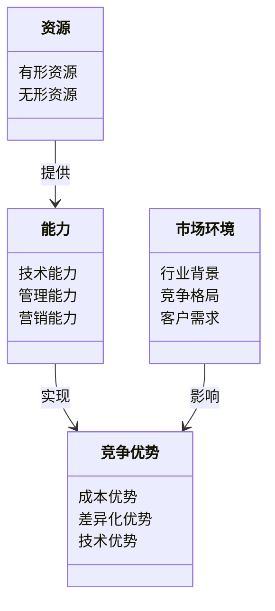

                 


# 如何评估企业的竞争优势

## 关键词：企业竞争优势、SWOT分析、波特五力分析、资源与能力、市场定位、战略规划

## 摘要：本文从企业竞争优势的核心概念出发，详细讲解了如何通过资源与能力分析、市场环境分析、竞争优势评估工具与方法等多方面来评估企业的竞争优势。文章结合实际案例，介绍了SWOT分析和波特五力分析的具体应用，并通过系统分析与架构设计，帮助企业更好地识别和提升自身的竞争优势。

---

## 第1章：竞争优势的基本概念

### 1.1 什么是竞争优势

竞争优势是指企业在市场中相对于竞争对手所具有的独特优势，这种优势可以是资源、技术、品牌、成本、管理等多个方面的综合体现。竞争优势决定了企业在市场中的地位和盈利能力，是企业长期发展的关键。

#### 1.1.1 竞争优势的定义
竞争优势是企业在特定市场中，通过提供独特的价值主张、资源、能力和战略，使自身能够在竞争中占据有利地位的能力。

#### 1.1.2 竞争优势的类型
竞争优势可以分为以下几种类型：
- **成本优势**：企业在生产或运营成本上具有优势，能够以更低的价格提供产品或服务。
- **差异化优势**：企业通过提供独特的产品或服务，满足特定客户群体的需求。
- **技术优势**：企业拥有领先的技术或专利，能够提供创新的产品或服务。
- **品牌优势**：企业通过强大的品牌形象和忠诚度，吸引更多的客户。

#### 1.1.3 竞争优势的重要性
竞争优势是企业生存和发展的关键，它直接影响企业的市场份额、利润能力和抗风险能力。

---

### 1.2 企业竞争优势的构成要素

竞争优势的构成要素主要包括资源、能力、战略定位和市场环境四个方面。

#### 1.2.1 资源与能力
资源是指企业拥有的有形资产（如资金、设备、原材料）和无形资产（如品牌、专利、技术）。能力是指企业在经营过程中所具备的技能和知识，包括研发能力、管理能力、营销能力等。

#### 1.2.2 战略定位
战略定位是指企业在市场中选择的目标市场和竞争方式。清晰的战略定位能够帮助企业更好地利用资源和能力，实现竞争优势。

#### 1.2.3 市场环境
市场环境包括行业趋势、市场需求、竞争格局等因素。企业需要根据市场环境的变化，调整自身的资源和能力，以保持竞争优势。

---

### 1.3 竞争优势的评估框架

竞争优势的评估框架包括以下几个步骤：
1. **明确评估目标**：确定评估的核心问题，例如企业的市场地位、资源利用效率等。
2. **选择评估方法**：常用的评估方法包括SWOT分析、波特五力分析等。
3. **收集数据**：通过市场调研、财务分析等方式，收集与竞争优势相关的数据。
4. **分析与评估**：结合数据和方法，分析企业的竞争优势。
5. **制定优化策略**：根据评估结果，制定改进措施，提升竞争优势。

---

## 第2章：资源与能力分析

### 2.1 企业资源分析

#### 2.1.1 资源的分类与特点
资源可以分为以下几类：
- **有形资源**：包括资金、设备、原材料等。
- **无形资源**：包括品牌、专利、技术、管理经验等。

#### 2.1.2 核心资源的识别
核心资源是指对企业竞争优势具有决定性影响的资源。识别核心资源的方法包括：
- **价值链分析**：通过分析企业的价值链，识别关键环节所需的核心资源。
- **竞争分析**：通过与竞争对手的对比，找出自身的独特资源。

#### 2.1.3 资源的评估方法
资源的评估方法包括：
- **资源价值评估**：评估资源的市场价值和对企业利润的贡献。
- **资源利用效率评估**：评估资源的使用效率，找出浪费和低效环节。

#### 图表：资源分类与特点对比表

| 资源类型 | 特点 | 示例 |
|----------|------|------|
| 有形资源 | 可以用货币衡量 | 设备、原材料 |
| 无形资源 | 难以用货币衡量 | 品牌、技术 |

---

### 2.2 核心能力分析

#### 2.2.1 核心能力的定义
核心能力是指企业在特定领域中所具备的独特优势，能够为客户提供独特的价值。

#### 2.2.2 核心能力的评估维度
核心能力的评估维度包括：
- **技术能力**：企业的技术水平和创新能力。
- **管理能力**：企业的组织结构和管理水平。
- **营销能力**：企业的市场推广和客户服务水平。

#### 2.2.3 核心能力的提升策略
提升核心能力的策略包括：
- **技术创新**：加大研发投入，提升技术水平。
- **管理优化**：引入先进的管理方法，提高效率。
- **人才培养**：加强员工培训，提升团队能力。

#### 图表：核心能力评估维度对比表

| 评估维度 | 定义 | 重要性 |
|----------|------|--------|
| 技术能力 | 企业的技术水平和创新能力 | 高 |
| 管理能力 | 企业的组织结构和管理水平 | 中 |
| 营销能力 | 企业的市场推广和客户服务水平 | 高 |

---

## 第3章：市场环境与竞争态势

### 3.1 市场环境分析

#### 3.1.1 行业背景与发展趋势
行业背景包括行业的市场规模、增长速度、竞争格局等。发展趋势则包括行业的未来发展方向和潜在机会。

#### 3.1.2 市场结构与竞争格局
市场结构包括完全竞争、垄断竞争、寡头垄断和完全垄断四种类型。竞争格局则包括主要竞争对手的市场份额、产品特点等。

#### 3.1.3 市场需求与客户行为
市场需求是指客户对产品或服务的需求量。客户行为包括客户的购买习惯、偏好、价格敏感度等。

---

### 3.2 竞争对手分析

#### 3.2.1 竞争对手的识别与分类
竞争对手的识别可以通过市场调研、行业报告等方式进行。竞争对手可以分为直接竞争对手和间接竞争对手。

#### 3.2.2 竞争对手的核心竞争力
竞争对手的核心竞争力包括技术优势、成本优势、品牌优势等。

#### 3.2.3 竞争对手的战略分析
竞争对手的战略分析包括竞争对手的市场定位、产品策略、价格策略等。

---

### 3.3 市场定位与竞争优势的关系

#### 3.3.1 市场定位的定义与作用
市场定位是指企业在目标市场中所选择的位置，其作用是帮助企业明确自身的竞争优势，吸引目标客户。

#### 3.3.2 竞争优势与市场定位的结合
竞争优势是市场定位的基础，市场定位是竞争优势的体现。企业需要根据自身的竞争优势，选择合适的市场定位。

#### 3.3.3 市场定位的调整与优化
市场定位的调整与优化需要根据市场环境的变化和竞争对手的动态进行调整。

---

## 第4章：竞争优势的评估方法与工具

### 4.1 评估工具介绍

#### 4.1.1 SWOT分析
SWOT分析是一种常用的战略分析工具，包括优势（Strengths）、劣势（Weaknesses）、机会（Opportunities）和威胁（Threats）四个方面。

#### 4.1.2 波特五力分析
波特五力分析是一种用于评估行业竞争结构的工具，包括新进入者的威胁、替代品的威胁、供应商的议价能力、买家的议价能力和现有竞争者之间的竞争程度。

---

### 4.2 竞争优势的算法原理

#### 4.2.1 SWOT分析的实现步骤

```python
def swot_analysis():
    # 优势
    strengths = ["技术领先", "成本优势"]
    # 劣势
    weaknesses = ["市场覆盖不足", "创新能力有限"]
    # 机会
    opportunities = ["市场需求增长", "政策支持"]
    # 威胁
    threats = ["新进入者竞争", "技术替代"]
    
    # 输出结果
    print("优势:", strengths)
    print("劣势:", weaknesses)
    print("机会:", opportunities)
    print("威胁:", threats)
    
swot_analysis()
```

#### 4.2.2 波特五力分析的实现步骤

```python
def porters_five Forces():
    industry = {
        "新进入者的威胁": "低",
        "替代品的威胁": "中",
        "供应商的议价能力": "高",
        "买家的议价能力": "中",
        "现有竞争者之间的竞争程度": "高"
    }
    
    print("行业竞争分析:", industry)

porters_five_Forces()
```

---

## 第5章：系统分析与架构设计

### 5.1 系统分析

#### 5.1.1 领域模型
领域模型是企业竞争优势评估的系统架构，包括资源、能力、市场环境和竞争优势四个模块。

#### 图表：领域模型类图



---

## 第6章：项目实战

### 6.1 环境安装与工具准备

#### 6.1.1 安装Python与相关库
需要安装Python 3.8及以上版本，并安装`mermaid`和`networkx`库。

#### 6.1.2 工具准备
准备用于绘制图表的工具，如`mermaid`和`graphviz`。

---

### 6.2 核心实现

#### 6.2.1 竞争优势评估系统的实现

```python
import networkx as nx
from matplotlib import pyplot as plt

def draw_swot_graph():
    G = nx.DiGraph()
    G.add_nodes_from(["优势", "劣势", "机会", "威胁", "竞争优势"])
    G.add_edges_from([("优势", "竞争优势"), ("劣势", "竞争优势"), ("机会", "竞争优势"), ("威胁", "竞争优势")])
    nx.draw(G, with_labels=True, node_color="white", edge_color="blue")
    plt.show()

draw_swot_graph()
```

---

### 6.3 案例分析与解读

#### 6.3.1 案例背景
假设我们是一家制造企业，希望通过竞争优势分析来提升市场份额。

#### 6.3.2 实施步骤
1. **资源分析**：识别企业的核心资源，包括技术设备和专利。
2. **能力评估**：评估企业在技术、管理、营销等方面的能力。
3. **市场分析**：分析行业趋势和竞争对手。
4. **SWOT分析**：通过SWOT分析，明确企业的优势和劣势。

---

## 第7章：最佳实践与小结

### 7.1 最佳实践

- **定期评估**：企业应定期进行竞争优势评估，及时调整战略。
- **关注核心资源**：企业应重点关注核心资源和能力的优化。
- **灵活应对变化**：企业应根据市场环境的变化，灵活调整市场定位和战略。

### 7.2 小结

通过本文的分析，我们了解了如何从资源、能力、市场环境等方面评估企业的竞争优势，并掌握了SWOT分析和波特五力分析等工具的使用方法。

---

## 作者信息

作者：AI天才研究院/AI Genius Institute & 禅与计算机程序设计艺术/Zen And The Art of Computer Programming

