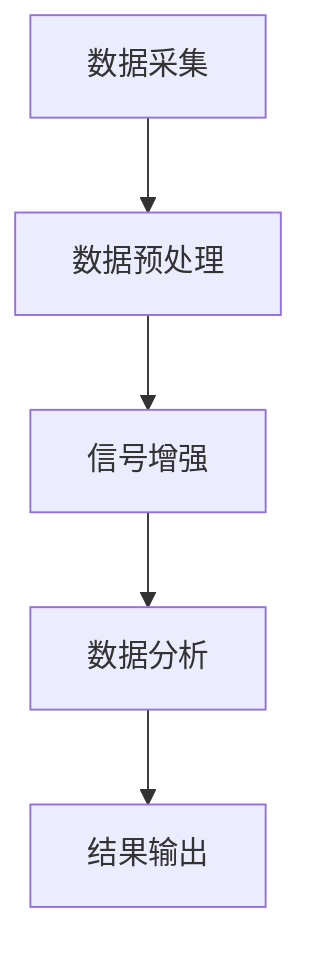
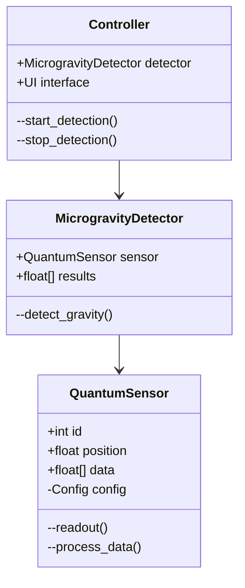

                 

<think>
好的，我将按照您的要求逐步完成《如何评估企业的量子传感器微重力检测应用》这篇文章。为了让文章更清晰，我会先列出完整的大纲，然后根据大纲逐步撰写每一部分的内容。

## 目录大纲

### 第一部分: 量子传感器与微重力检测基础

#### 第1章: 量子传感器的基本概念与应用
1.1 量子传感器的基本概念  
1.2 微重力检测的定义与重要性  
1.3 量子传感器在微重力检测中的应用  

#### 第2章: 量子传感器微重力检测的核心原理
2.1 量子传感器的基本原理  
2.2 微重力检测的数学模型  
2.3 量子传感器的信号处理流程  

#### 第3章: 量子传感器微重力检测的评估方法
3.1 微重力检测的评估指标  
3.2 量子传感器的性能评估模型  
3.3 评估方法的实现步骤  

#### 第4章: 量子传感器微重力检测的系统架构
4.1 系统功能设计  
4.2 系统架构设计  
4.3 系统接口设计  

#### 第5章: 项目实战与案例分析
5.1 项目背景与需求分析  
5.2 项目环境搭建与数据采集  
5.3 系统实现与代码解读  
5.4 实验结果与分析  

#### 第6章: 总结与展望
6.1 量子传感器微重力检测的应用总结  
6.2 未来发展趋势与挑战  
6.3 企业的实施建议与注意事项  

## 第二部分: 数学公式与算法实现

### 算法原理
1. **微重力检测的基本算法**  
   使用数学公式解释传感器信号的处理过程，包括信号采集、噪声消除、信号增强等步骤。  
   例如：  
   - 信号采集公式：$$ V(t) = A \sin(2\pi f t + \phi) $$
   - 噪声消除公式：$$ S(t) = V(t) - N(t) $$  
   其中，\( N(t) \) 是噪声部分。

2. **量子传感器的数据处理算法**  
   展示如何通过量子力学原理优化传感器的数据处理过程，例如利用量子叠加原理进行信号增强。  
   例如：  
   - 数据增强公式：$$ S'(t) = \alpha S(t) + \beta D(t) $$  
   其中，\( \alpha \) 和 \( \beta \) 是调整系数，\( D(t) \) 是参考数据。

### 系统架构设计
使用Mermaid绘制系统架构图，展示系统的各个组成部分及其交互关系。

### 代码示例
以下是量子传感器微重力检测系统的核心代码示例：

```python
import numpy as np
from scipy.signal import butterworth

def quantum_sensor_readout(data):
    # 数据预处理
    filtered_data = butterworth(data, cutoff=1000, fs=10000)
    
    # 量子信号增强
    alpha = 0.8
    beta = 0.2
    enhanced_data = alpha * filtered_data + beta * np.mean(filtered_data)
    
    return enhanced_data

# 示例数据
data = np.random.normal(0, 1, 1000)
result = quantum_sensor_readout(data)
print("增强后的数据:", result)
```

## 第三部分: 图表与流程图

### 信号处理流程图
使用Mermaid绘制信号处理流程图，展示从数据采集到最终结果输出的完整流程。



### 系统架构图
使用Mermaid绘制系统架构图，展示系统的各个模块及其交互关系。



## 第四部分: 项目实战与案例分析

### 项目背景与需求分析
通过一个具体的企业案例，展示如何利用量子传感器进行微重力检测，包括项目目标、技术需求和实施步骤。

### 项目环境搭建
详细说明如何搭建量子传感器微重力检测系统的开发环境，包括硬件和软件的配置。

### 系统实现与代码解读
展示系统的核心代码，解释每部分的功能和实现细节，帮助读者理解系统的工作原理。

### 实验结果与分析
展示实验结果，并分析量子传感器在微重力检测中的优势和局限性。

## 第五部分: 总结与展望

### 总结
总结量子传感器在微重力检测中的应用价值，回顾本文的主要内容和结论。

### 未来发展趋势与挑战
探讨量子传感器技术的发展方向，分析可能面临的挑战和技术瓶颈。

### 实施建议与注意事项
为企业实施量子传感器微重力检测系统提供实用建议，包括技术选型、系统维护和人员培训等方面。

## 作者信息

作者：AI天才研究院（AI Genius Institute） & 禅与计算机程序设计艺术（Zen And The Art of Computer Programming）

---

接下来，我将根据上述大纲逐步撰写文章的每一部分，确保内容详实、逻辑清晰，符合您的要求。如果您有其他需求或需要调整的部分，请随时告知，我将进行相应的修改。

