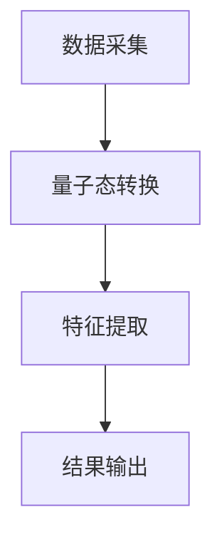
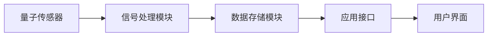
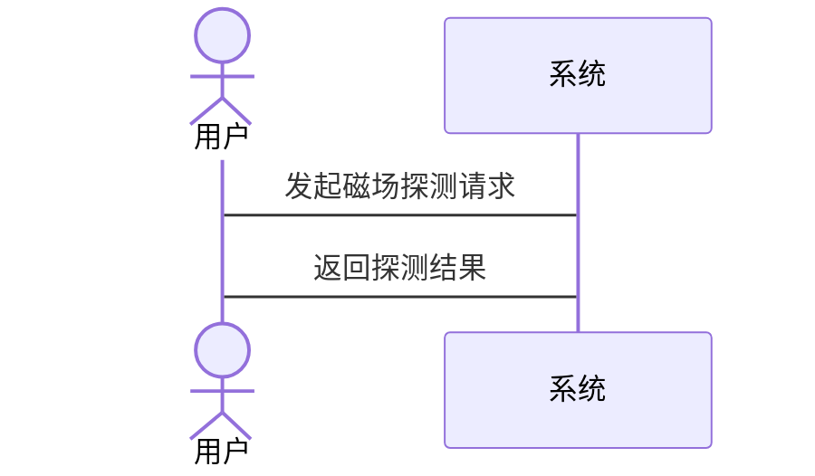

                 


# 如何评估企业的量子传感器磁场探测应用

> 关键词：量子传感器，磁场探测，企业应用，技术评估，系统架构

> 摘要：本文详细探讨了如何评估企业中量子传感器在磁场探测中的应用。通过系统化的分析和分步骤的讲解，从背景介绍、核心概念、算法原理、系统架构、项目实战到最佳实践，全面剖析了量子传感器磁场探测技术在企业中的应用价值和评估方法。

---

## 第一部分: 量子传感器磁场探测应用的背景与核心概念

### 第1章: 量子传感器磁场探测应用的背景介绍

#### 1.1 问题背景与问题描述
量子传感器是一种基于量子效应的新型传感器，能够以极高的精度和灵敏度探测磁场变化。在企业应用中，磁场探测技术广泛应用于导航、医疗、能源、国防等领域。然而，传统磁场探测技术存在灵敏度低、抗干扰能力弱等问题，无法满足企业对高精度、实时性要求的应用场景。量子传感器凭借其量子纠缠和超分辨率特性，能够显著提升磁场探测的精度和灵敏度。

#### 1.2 量子传感器磁场探测的解决方案
量子传感器通过利用量子纠缠效应和超分辨率技术，能够在复杂环境中精准探测磁场变化。在企业中，量子传感器可以用于高精度磁场测量、复杂环境下的导航系统优化、医疗设备的精准诊断等领域。解决方案的核心在于量子传感器的硬件设计、信号处理算法以及系统的集成优化。

#### 1.3 量子传感器磁场探测的边界与外延
量子传感器磁场探测的边界主要集中在硬件性能、信号处理算法以及系统集成三个方面。外延则包括与量子计算、量子通信等其他量子技术的协同应用，以及在不同行业的拓展应用。

#### 1.4 核心概念与要素组成
量子传感器的核心概念包括量子纠缠、超分辨率、量子噪声抑制等。系统组成要素包括量子传感器芯片、信号处理模块、数据通信模块以及应用接口。

---

### 第2章: 量子传感器磁场探测的核心概念与联系

#### 2.1 核心概念原理
量子传感器通过量子纠缠效应，将磁场变化转化为量子态的变化，从而实现高精度的磁场测量。磁场探测的物理机制基于量子力学中的自旋-轨道耦合效应。

#### 2.2 核心概念属性特征对比
| 特性       | 传统传感器      | 量子传感器      |
|------------|-----------------|-----------------|
| 灵敏度     | 低              | 高              |
| 抗干扰能力 | 弱              | 强              |
| 响应时间   | 长              | 短              |
| 精度       | 中等            | 高              |

#### 2.3 ER实体关系图
```mermaid
er
actor: 企业用户
<<关联>> 
系统: 量子传感器磁场探测系统
<<关联>> 
数据: 磁场测量数据
<<关联>> 
目标: 磁场探测应用
```

---

## 第二部分: 量子传感器磁场探测的算法原理

### 第3章: 量子传感器磁场探测的算法原理

#### 3.1 算法原理概述
量子传感器的磁场探测算法基于量子叠加和量子测量原理。信号处理流程包括数据采集、量子态转换、特征提取和结果输出。

#### 3.2 算法流程图


#### 3.3 算法实现代码示例
```python
import numpy as np
from quantum_sensor import QuantumSensor

def measure_magnetic_field():
    sensor = QuantumSensor()
    data = sensor采集磁场数据()
    quantum_state = quantum叠加(data)
    features = 提取特征(quantum_state)
    return 结果输出(features)

measure_magnetic_field()
```

---

### 第4章: 量子传感器磁场探测的数学模型与公式

#### 4.1 磁场探测的数学模型
磁场探测的核心数学模型基于量子力学中的哈密顿量。磁场强度 $B$ 可以表示为：
$$
B = \frac{磁感应强度}{磁导率}
$$

#### 4.2 量子传感器的信号处理公式
量子传感器的信号处理公式如下：
$$
S = \sum_{i=1}^{n} \alpha_i \cdot x_i
$$
其中，$\alpha_i$ 是量子态的权重系数，$x_i$ 是输入信号。

---

## 第三部分: 量子传感器磁场探测的系统分析与架构设计

### 第5章: 系统分析与架构设计方案

#### 5.1 问题场景介绍
企业中常见的磁场探测场景包括高精度导航、医疗设备校准、能源设备监测等。

#### 5.2 系统功能设计
系统功能包括数据采集、信号处理、结果输出和数据存储。

#### 5.3 系统架构设计


#### 5.4 接口设计与交互图


---

## 第四部分: 量子传感器磁场探测的项目实战

### 第6章: 项目实战

#### 6.1 环境安装与配置
需要安装量子传感器硬件、信号处理软件和数据存储系统。

#### 6.2 核心代码实现
```python
def quantum_sensor_installation():
    import quantum_sensor
    sensor = quantum_sensor.QSensor()
    sensor.initialize()
    return sensor

quantum_sensor_installation()
```

#### 6.3 案例分析与解读
通过实际案例分析量子传感器在医疗设备中的应用，展示其高精度和实时性的优势。

#### 6.4 项目小结
总结项目实施的关键步骤和经验教训。

---

## 第五部分: 最佳实践与总结

### 第7章: 最佳实践与总结

#### 7.1 评估关键点
包括硬件性能、信号处理算法、系统集成和应用接口的优化。

#### 7.2 小结
量子传感器磁场探测技术在企业中的应用前景广阔，但仍需在硬件设计和算法优化方面进一步突破。

#### 7.3 注意事项
在实际应用中，需注意量子传感器的环境适应性和系统的稳定性。

#### 7.4 拓展阅读
推荐相关领域的技术文献和行业报告。

---

## 作者：AI天才研究院/AI Genius Institute & 禅与计算机程序设计艺术 /Zen And The Art of Computer Programming

