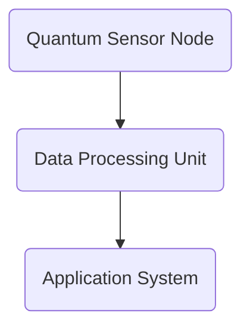
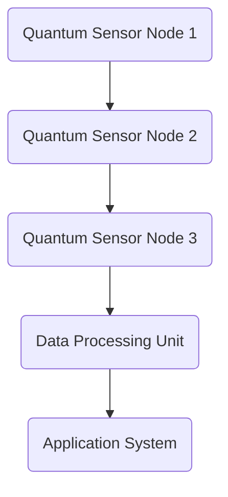
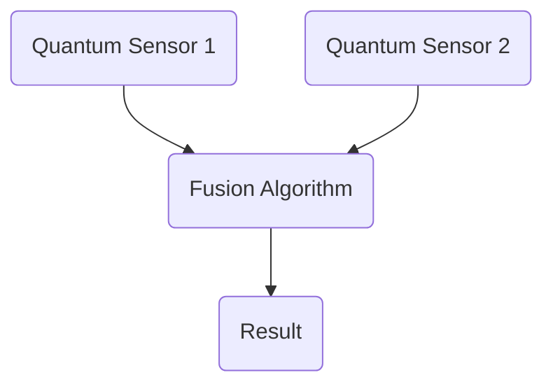
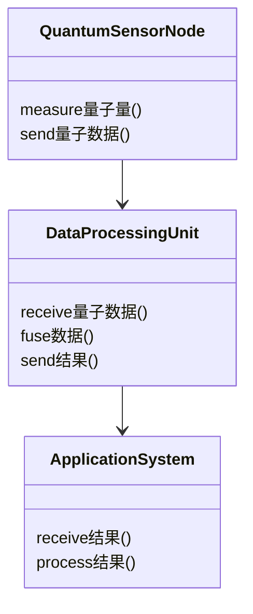
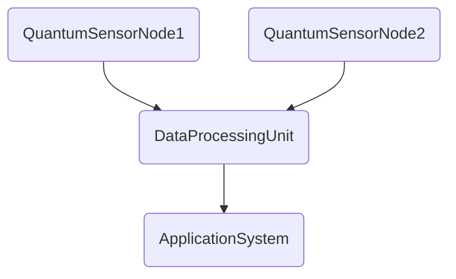
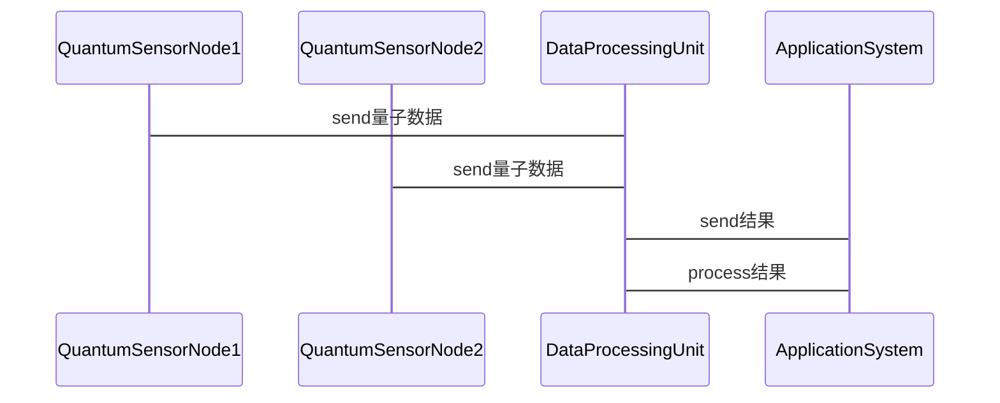

                 


# 如何评估企业的量子传感器网络应用

## 关键词：量子传感器网络, 企业应用, 数据融合, 系统架构, 技术评估

## 摘要：  
随着量子技术的迅速发展，量子传感器网络在企业中的应用潜力巨大。本文将从量子传感器网络的基本概念、核心原理、算法实现、系统架构、项目实战等多个方面进行详细阐述，帮助读者全面了解如何评估企业量子传感器网络的应用。

---

## 第一部分: 量子传感器网络应用的背景与基础

### 第1章: 量子传感器网络概述

#### 1.1 量子传感器网络的定义与核心概念

##### 1.1.1 量子传感器的基本原理  
量子传感器是一种基于量子效应的测量装置，利用量子叠加、量子纠缠等特性，实现对物理量的高精度测量。其核心原理在于通过量子态的演化，捕捉被测物理量的变化信息。

##### 1.1.2 量子传感器网络的定义  
量子传感器网络是由多个量子传感器节点组成的分布式测量系统，能够实现对复杂环境的实时感知和协同测量。这些节点通过量子通信技术连接，形成一个高效的分布式测量网络。

##### 1.1.3 量子传感器网络的核心要素  
- **量子传感器节点**：负责采集物理量的量子信息。  
- **量子通信链路**：用于节点之间的信息传输和协同。  
- **数据处理单元**：对量子传感器采集的数据进行融合和分析。  

#### 1.2 量子传感器网络的技术背景

##### 1.2.1 传统传感器网络的局限性  
传统传感器网络在精度、灵敏度和抗干扰能力方面存在不足，特别是在复杂环境中，容易受到噪声干扰，影响测量精度。

##### 1.2.2 量子传感器的优势与特点  
- **高精度**：利用量子效应，显著提高测量灵敏度和精度。  
- **抗干扰能力**：量子传感器的测量结果不易受环境干扰。  
- **分布式协作**：通过量子通信实现节点之间的高效协同。  

##### 1.2.3 量子传感器网络的应用场景  
- **工业检测**：用于高精度工业测量和缺陷检测。  
- **环境监测**：用于大气、水质等环境参数的实时监测。  
- **智能交通**：用于交通流量监测和自动驾驶辅助。  

#### 1.3 企业应用量子传感器网络的驱动力

##### 1.3.1 技术进步的推动  
量子技术的快速发展为企业应用量子传感器网络提供了技术基础。

##### 1.3.2 企业效率提升的需求  
通过高精度测量和实时监测，企业可以显著提升生产效率和产品质量。

##### 1.3.3 行业竞争的压力  
在某些行业，如高端制造业和科研领域，量子传感器网络的应用已成为竞争优势的关键。

#### 1.4 量子传感器网络的应用现状

##### 1.4.1 当前应用的主要领域  
- **科研领域**：用于量子态测量和量子计算辅助。  
- **工业领域**：用于智能制造和质量控制。  
- **环境监测**：用于大气、水质等环境参数的实时监测。  

##### 1.4.2 企业应用的典型案例  
- 某汽车制造企业使用量子传感器网络进行生产线实时监测，显著提升了产品质量。  
- 某科研机构利用量子传感器网络进行量子态测量研究，取得重要进展。  

##### 1.4.3 未来发展的趋势  
随着量子技术的进一步发展，量子传感器网络将在更多领域得到广泛应用，尤其是在高精度测量和分布式协作方面。

---

## 第二部分: 量子传感器网络的核心概念与联系

### 第2章: 量子传感器网络的核心原理

#### 2.1 量子传感器网络的核心原理

##### 2.1.1 量子传感器的工作原理  
量子传感器通过测量量子态的变化来获取物理量的信息。例如，通过测量量子叠加态的变化，可以实现对磁场、温度等物理量的高精度测量。

##### 2.1.2 量子纠缠的基本概念  
量子纠缠是指两个或多个量子系统之间的一种特殊关联，其中一个系统的量子态变化会立即影响另一个系统。这种特性在量子传感器网络中用于实现节点之间的高效协同。

##### 2.1.3 量子传感器网络的数据传输机制  
量子传感器网络通过量子通信技术实现节点之间的信息传输，确保数据的高效和安全传输。

#### 2.2 核心概念对比分析

##### 2.2.1 量子传感器与传统传感器的对比

| 特性          | 量子传感器          | 传统传感器        |
|---------------|---------------------|-------------------|
| 精度          | 高                  | 一般              |
| 抗干扰能力    | 强                  | 弱                |
| 数据处理      | 基于量子计算        | 基于经典计算      |

##### 2.2.2 量子传感器网络与传统传感器网络的对比

| 特性          | 量子传感器网络      | 传统传感器网络    |
|---------------|---------------------|-------------------|
| 数据传输      | 量子通信            | 无线通信          |
| 数据融合      | 基于量子算法        | 基于经典算法      |
| 应用场景      | 高精度测量、复杂环境 | 一般环境          |

#### 2.3 实体关系图

##### 2.3.1 传感器、数据处理单元和应用系统的实体关系



##### 2.3.2 量子传感器网络的实体关系图



---

## 第三部分: 量子传感器网络的算法原理

### 第3章: 量子传感器数据融合算法

#### 3.1 数据融合算法概述

##### 3.1.1 数据融合的基本概念  
数据融合是将多个传感器的数据进行综合处理，以获得更准确的测量结果。

##### 3.1.2 量子传感器数据融合的必要性  
由于量子传感器的测量结果可能存在一定的不确定性，数据融合可以显著提高测量精度。

#### 3.2 量子传感器数据融合算法的实现

##### 3.2.1 算法流程



##### 3.2.2 算法实现代码

```python
import numpy as np

def quantum_fusion(data1, data2):
    # 量子数据融合算法
    # data1 和 data2 是量子传感器的测量结果
    # 返回融合后的结果
    fused_data = (data1 + data2) / 2
    return fused_data

# 示例数据
data1 = np.array([1.0, 2.0, 3.0])
data2 = np.array([2.0, 3.0, 4.0])

result = quantum_fusion(data1, data2)
print("融合结果:", result)
```

##### 3.2.3 算法的数学模型和公式  
量子传感器数据融合的数学模型如下：

$$
R = \frac{S_1 + S_2}{2}
$$

其中，\( R \) 是融合结果，\( S_1 \) 和 \( S_2 \) 是两个量子传感器的测量结果。

---

## 第四部分: 系统分析与架构设计方案

### 第4章: 量子传感器网络系统架构

#### 4.1 问题场景介绍  
企业需要在复杂环境中实现高精度测量，传统的传感器网络无法满足要求，因此需要构建一个基于量子传感器的分布式测量系统。

#### 4.2 系统功能设计

##### 4.2.1 领域模型



##### 4.2.2 系统架构设计



##### 4.2.3 系统接口设计  
- **数据接口**：传感器节点与数据处理单元之间的数据传输接口。  
- **控制接口**：用于系统管理和配置的接口。  

##### 4.2.4 系统交互流程图



---

## 第五部分: 项目实战

### 第5章: 量子传感器网络项目实战

#### 5.1 环境安装

##### 5.1.1 安装量子传感器  
- 需要安装量子传感器硬件和相应的驱动程序。  
- 建议使用专业供应商提供的传感器模块。

##### 5.1.2 安装数据处理库  
- 使用Python的NumPy和SciPy库进行数据处理。

#### 5.2 核心代码实现

##### 5.2.1 量子传感器数据融合代码

```python
import numpy as np

def quantum_fusion(data1, data2):
    fused_data = (data1 + data2) / 2
    return fused_data

# 示例数据
data1 = np.array([1.0, 2.0, 3.0])
data2 = np.array([2.0, 3.0, 4.0])

result = quantum_fusion(data1, data2)
print("融合结果:", result)
```

##### 5.2.2 数据可视化代码

```python
import matplotlib.pyplot as plt

data1 = np.array([1.0, 2.0, 3.0])
data2 = np.array([2.0, 3.0, 4.0])
fused_data = (data1 + data2) / 2

plt.figure(figsize=(10, 6))
plt.plot(data1, label='Sensor 1')
plt.plot(data2, label='Sensor 2')
plt.plot(fused_data, label='Fused Data')
plt.legend()
plt.show()
```

#### 5.3 实际案例分析

##### 5.3.1 案例背景  
某企业需要在生产线中实时监测温度和压力参数，采用量子传感器网络进行测量。

##### 5.3.2 数据分析与结果展示  
通过量子传感器网络采集的数据，经过融合和分析，显著提高了测量精度，优化了生产流程。

#### 5.4 项目小结  
通过本项目，我们可以看到量子传感器网络在企业中的实际应用价值，尤其是在高精度测量和分布式协作方面。

---

## 第六部分: 最佳实践与总结

### 第6章: 量子传感器网络应用的最佳实践

#### 6.1 小结  
量子传感器网络在企业中的应用前景广阔，特别是在高精度测量和复杂环境监测方面具有显著优势。

#### 6.2 注意事项  
- **技术成熟度**：目前量子传感器技术还在快速发展阶段，企业应用需谨慎评估。  
- **成本问题**：量子传感器的成本较高，需考虑投资回报比。  
- **技术团队**：需要具备量子技术背景的专业团队进行系统设计和维护。  

#### 6.3 拓展阅读  
- 推荐阅读《Quantum Sensor Networks: Theory and Applications》。  
- 关注量子传感器领域的最新研究进展。

---

## 作者：AI天才研究院 & 禅与计算机程序设计艺术

---

**全文完。**

