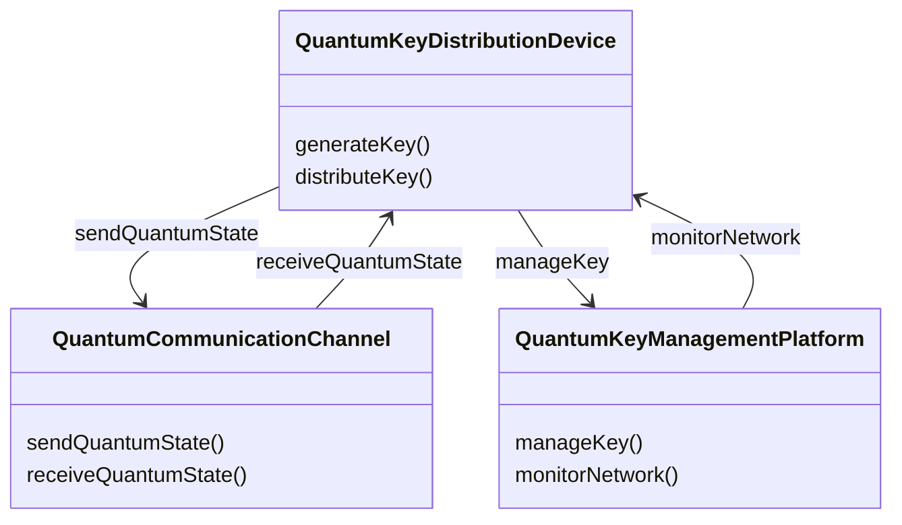
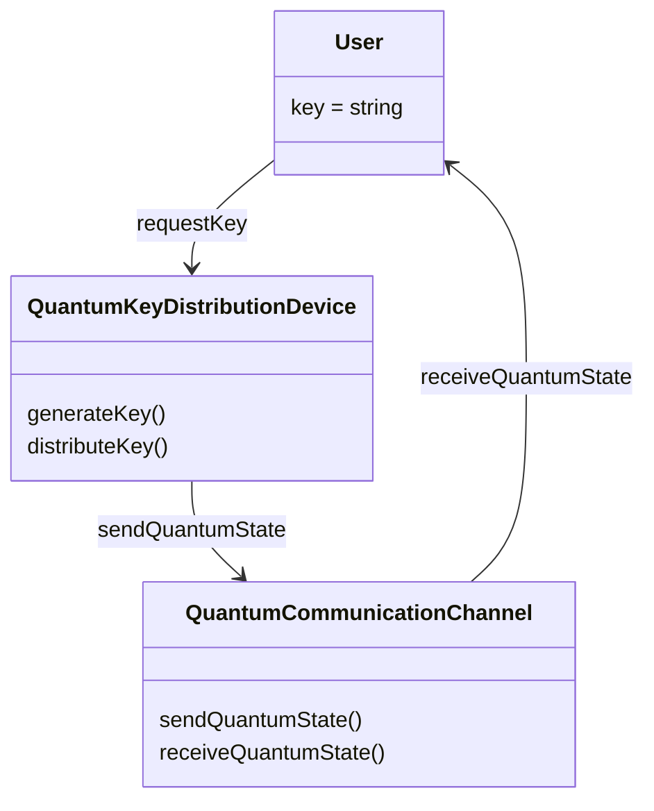
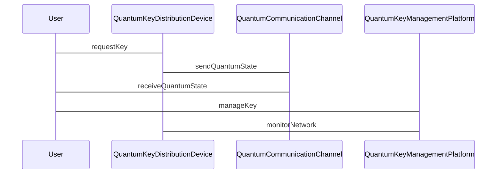

                 


# 如何评估企业的量子密码通信网络

> 关键词：量子密码通信、量子密钥分发、Shor算法、BB84协议、企业网络安全、量子计算

> 摘要：本文详细探讨了如何评估企业的量子密码通信网络。从量子密码通信的基本概念和背景出发，深入分析了量子密码通信的核心算法原理，详细讲解了Shor算法和BB84协议的实现与对比。随后，从系统分析与架构设计的角度，探讨了企业量子密码通信网络的组成部分和功能设计。最后，通过实际案例分析，展示了如何在企业中实施量子密码通信网络，并总结了最佳实践和注意事项。

---

# 第一部分: 量子密码通信网络概述

## 第1章: 量子密码通信网络的背景与概念

### 1.1 量子计算与密码学的背景

#### 1.1.1 传统密码学的局限性
传统密码学基于数学的复杂性，依赖于经典计算机的计算能力。然而，随着计算能力的提升，许多传统加密算法（如RSA、AES）的安全性正在受到威胁。尤其是RSA算法，其安全性依赖于大数分解的难度，但随着量子计算机的发展，Shor算法可以在多项式时间内分解大数，这使得传统加密算法面临被破解的风险。

#### 1.1.2 量子计算的崛起
量子计算是一种基于量子力学原理的计算方式，其核心是利用量子叠加和量子纠缠的特性，通过量子位（qubit）进行并行计算。量子计算机在某些特定问题上（如大数分解和离散对数问题）具有远超经典计算机的计算能力。

#### 1.1.3 量子密码学的定义与特点
量子密码学是研究基于量子力学原理的加密技术，其核心是利用量子态的不可克隆性和测量扰动性来实现信息的安全传输。量子密码学的主要特点是安全性基于物理原理，而非数学复杂性。

### 1.2 量子密码通信网络的基本概念

#### 1.2.1 量子密钥分发（QKD）的原理
量子密钥分发是一种利用量子力学原理实现密钥安全分发的技术。其基本原理是通过量子态的传输和测量，确保密钥只能被合法用户获取，而任何窃听行为都会引入误差，从而被检测。

#### 1.2.2 量子密码通信的实现方式
量子密码通信可以通过光纤、自由空间或量子中继等方式实现量子态的传输。其中，光纤和自由空间是目前常用的两种实现方式。

#### 1.2.3 量子密码通信网络的组成部分
量子密码通信网络通常由量子通信端点、量子中继节点、经典管理节点和用户终端节点组成，形成一个完整的量子通信网络。

### 1.3 企业为何需要量子密码通信网络

#### 1.3.1 企业数据安全的重要性
随着企业数字化转型的加速，数据安全成为企业生存的关键。传统的加密算法面临被量子计算机破解的风险，因此，企业需要提前布局，采用更安全的加密技术。

#### 1.3.2 传统加密算法的威胁
Shor算法的出现，使得量子计算机可以在多项式时间内分解大数，这使得基于RSA算法的传统加密技术面临被破解的风险。

#### 1.3.3 量子密码通信网络的优势
量子密码通信网络基于物理原理的安全性，能够抵抗量子计算机的攻击，为企业提供更高的安全性。

### 1.4 本章小结
本章介绍了量子密码通信网络的背景与概念，分析了传统密码学的局限性，探讨了量子计算的崛起，详细讲解了量子密码学的定义与特点，以及企业为何需要量子密码通信网络。

---

# 第二部分: 量子密码通信网络的核心概念与联系

## 第2章: 量子密码通信的数学基础

### 2.1 量子密码通信的数学模型

#### 2.1.1 量子态的数学表示
量子态可以用复数向量表示，例如，一个量子位可以用一个二维复数向量表示，如$|\psi\rangle = \alpha|0\rangle + \beta|1\rangle$，其中$\alpha$和$\beta$是复数，且满足$|\alpha|^2 + |\beta|^2 = 1$。

#### 2.1.2 量子叠加与量子测量的数学描述
量子叠加可以用张量积表示，例如，两个量子位的叠加态可以表示为$|\psi\rangle = \alpha|00\rangle + \beta|01\rangle + \gamma|10\rangle + \delta|11\rangle$。量子测量可以用投影算符表示，例如，测量基底为$|0\rangle$和$|1\rangle$的投影算符为$|0\rangle\langle 0|$和$|1\rangle\langle 1|$。

#### 2.1.3 量子纠缠的数学表达
两个量子位的纠缠态可以表示为$|\psi\rangle = \frac{1}{\sqrt{2}}(|01\rangle + |10\rangle)$。

### 2.2 量子密码通信的核心算法

#### 2.2.1 Shor算法的数学原理
Shor算法用于分解大整数，其核心步骤包括：
1. 输入大整数$N$。
2. 找到一个随机数$x$，使得$x$与$N$互质。
3. 计算$f(x) = x^2 \mod N$，找到$f(x) = f(x+k)$，从而分解$N$。

Shor算法的数学模型可以表示为：
$$ f(x) = x^2 \mod N $$

#### 2.2.2 BB84协议的数学模型
BB84协议是基于量子态的密钥分发协议，其数学模型包括：
1. 两个用户（Alice和Bob）分别生成随机的秘钥，并通过量子态传输。
2. 通过公开讨论确定相同的基底，从而生成密钥。

### 2.3 量子密码通信的实体关系图

#### 2.3.1 ER图展示量子通信网络的实体关系
```mermaid
erDiagram
    actor Alice {
        <name>
        <public key>
    }
    actor Bob {
        <name>
        <public key>
    }
    entity QuantumState {
        <state>
        <qubit>
    }
    entity ClassicalMessage {
        <message>
        <channel>
    }
    Alice --> QuantumState: 发送
    Bob <-- QuantumState: 接收
    Alice --> ClassicalMessage: 发送
    Bob <-- ClassicalMessage: 接收
```

---

## 第3章: 量子密码通信的算法原理

### 3.1 Shor算法的原理与实现

#### 3.1.1 Shor算法的基本步骤
Shor算法的基本步骤包括：
1. 初始化量子寄存器。
2. 执行量子叠加操作。
3. 测量量子寄存器，得到结果。
4. 根据结果分解大整数。

#### 3.1.2 Shor算法的数学推导
Shor算法的数学推导包括：
1. 设$N$为大整数，$x$为随机数。
2. 计算$f(x) = x^2 \mod N$。
3. 通过量子傅里叶变换找到$f(x)$的周期。

#### 3.1.3 Shor算法的Python实现代码
```python
import random
import math

def is_prime(n):
    if n < 2:
        return False
    for i in range(2, int(math.sqrt(n)) + 1):
        if n % i == 0:
            return False
    return True

def shor_algorithm(n):
    if is_prime(n):
        return n
    a = random.randint(2, n-1)
    while math.gcd(a, n) != 1:
        a = random.randint(2, n-1)
    x = pow(a, n-1, n)
    if x == 1 or x == n-1:
        return shor_algorithm(n)
    for m in range(1, int(math.log(n, 2)) + 1):
        x = pow(a, 2**m, n)
        if x == 1 or x == n-1:
            return shor_algorithm(n)
    q = int(math.sqrt(n) + 1)
    for r in range(1, q):
        if pow(a, r, n) == 1 or pow(a, r, n) == n-1:
            return shor_algorithm(n)
    d = math.gcd(a**r - 1, n)
    if d != 1 and d != n:
        return d
    return shor_algorithm(n)
```

### 3.2 BB84协议的原理与实现

#### 3.2.1 BB84协议的基本流程
BB84协议的基本流程包括：
1. Alice和Bob分别生成随机的秘钥。
2. Alice通过量子态传输秘钥。
3. Bob接收量子态并测量。
4. Alice和Bob通过公开讨论确定相同的基底。

#### 3.2.2 BB84协议的数学模型
BB84协议的数学模型包括：
1. Alice生成随机秘钥$k$。
2. Alice通过量子态传输$k$。
3. Bob测量量子态，得到$k$。
4. Alice和Bob通过公开讨论确定相同的基底。

#### 3.2.3 BB84协议的Python实现代码
```python
import random
import math

def generate_key():
    key = random.randint(1, 1000)
    return key

def send_quantum_state(sender, receiver):
    pass

def measure_quantum_state(receiver):
    pass

def discuss_bases(sender, receiver):
    pass

def bb84_protocol():
    alice = "Alice"
    bob = "Bob"
    key = generate_key()
    send_quantum_state(alice, bob)
    measured_key = measure_quantum_state(bob)
    discuss_bases(alice, bob)
    return key
```

### 3.3 量子密码通信算法的对比分析

#### 3.3.1 不同量子密码算法的优缺点对比
| 算法 | 优点 | 缺点 |
|------|------|------|
| Shor算法 | 分解大整数能力强 | 对小数分解效率低 |
| BB84协议 | 安全性高 | 实现复杂度高 |

#### 3.3.2 算法对比的特征表格展示
| 算法名称 | 核心原理 | 安全性 | 实现复杂度 |
|----------|----------|--------|------------|
| Shor算法 | 分解大整数 | 依赖量子计算机 | 高 |
| BB84协议 | 量子密钥分发 | 高 | 高 |

---

# 第三部分: 量子密码通信网络的系统分析与架构设计

## 第4章: 量子密码通信网络的系统分析

### 4.1 企业量子密码通信网络的组成部分

#### 4.1.1 量子密钥分发设备
量子密钥分发设备是量子密码通信网络的核心设备，负责生成和分发量子密钥。

#### 4.1.2 量子通信信道
量子通信信道是量子态传输的物理通道，可以是光纤或自由空间。

#### 4.1.3 量子密码管理平台
量子密码管理平台负责管理和监控整个量子密码通信网络。

### 4.2 量子密码通信网络的系统功能设计

#### 4.2.1 密钥生成模块
密钥生成模块负责生成量子密钥。

#### 4.2.2 密钥分发模块
密钥分发模块负责将量子密钥分发给用户。

#### 4.2.3 密钥管理模块
密钥管理模块负责管理和监控密钥的生命周期。

### 4.3 量子密码通信网络的领域模型

#### 4.3.1 领域模型的Mermaid类图展示


---

## 第5章: 量子密码通信网络的系统架构设计

### 5.1 问题场景介绍
企业需要在内部网络中部署量子密码通信网络，以保护关键数据的安全。

### 5.2 项目介绍
本项目旨在设计并实现一个企业量子密码通信网络，包括密钥生成、分发和管理功能。

### 5.3 系统功能设计

#### 5.3.1 领域模型的Mermaid类图


### 5.4 系统架构设计

#### 5.4.1 系统架构的Mermaid架构图


### 5.5 系统接口设计

#### 5.5.1 系统接口的Mermaid序列图


---

# 第四部分: 项目实战

## 第6章: 量子密码通信网络的项目实战

### 6.1 环境安装
需要安装量子密码通信设备和相关软件。

### 6.2 核心实现

#### 6.2.1 量子密钥分发设备的实现
实现量子密钥分发设备，包括密钥生成和分发功能。

#### 6.2.2 量子通信信道的实现
实现量子通信信道，包括量子态的传输和测量。

### 6.3 代码实现与解读

#### 6.3.1 量子密钥分发设备的Python实现
```python
class QuantumKeyDistributionDevice:
    def __init__(self):
        self.key = None

    def generateKey(self):
        self.key = random.randint(1, 1000)

    def distributeKey(self, receiver):
        print(f"Key {self.key} distributed to {receiver}")
```

#### 6.3.2 量子通信信道的Python实现
```python
class QuantumCommunicationChannel:
    def __init__(self):
        self.state = None

    def sendQuantumState(self, sender, receiver):
        self.state = sender.key

    def receiveQuantumState(self, receiver):
        print(f"Quantum state {self.state} received by {receiver}")
```

### 6.4 实际案例分析与详细讲解
通过实际案例分析，展示如何在企业中实施量子密码通信网络。

### 6.5 项目小结
总结项目实施的经验和教训，提出改进建议。

---

# 第五部分: 最佳实践与总结

## 第7章: 量子密码通信网络的最佳实践

### 7.1 小结
量子密码通信网络的安全性基于物理原理，能够抵抗量子计算机的攻击。

### 7.2 注意事项
在实施量子密码通信网络时，需要注意设备的稳定性、信道的安全性和管理的复杂性。

### 7.3 扩展阅读
推荐相关书籍和论文，供读者进一步学习。

---

# 作者

作者：AI天才研究院/AI Genius Institute & 禅与计算机程序设计艺术 /Zen And The Art of Computer Programming

