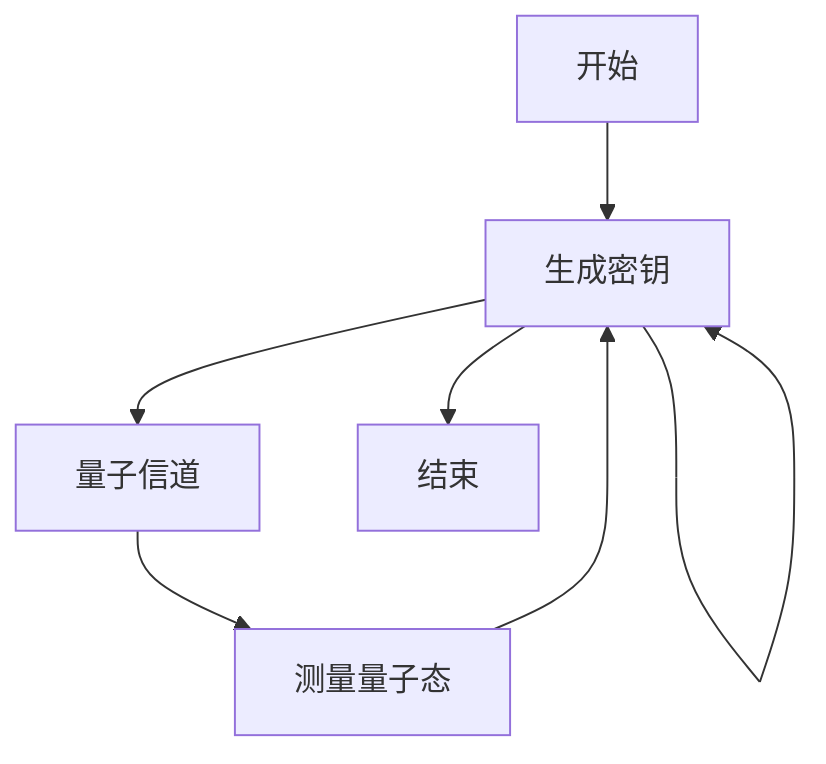
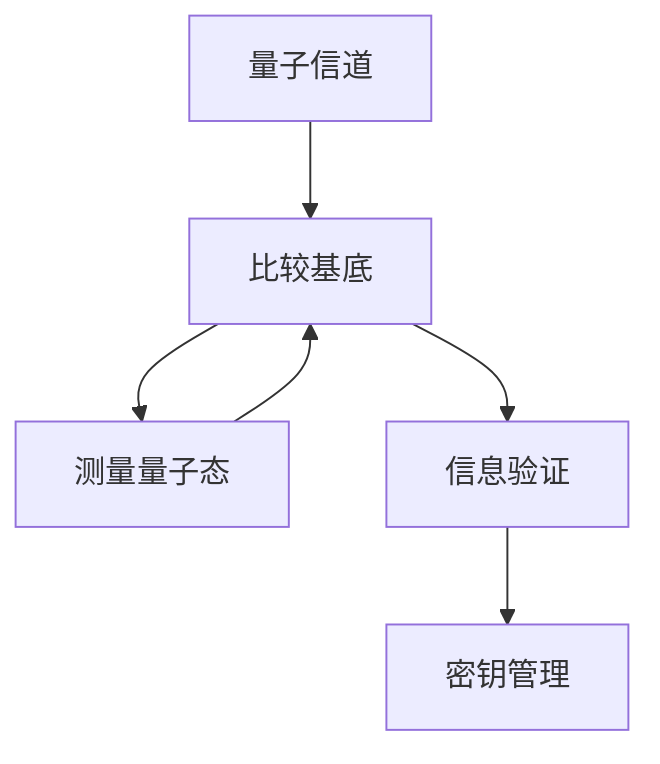
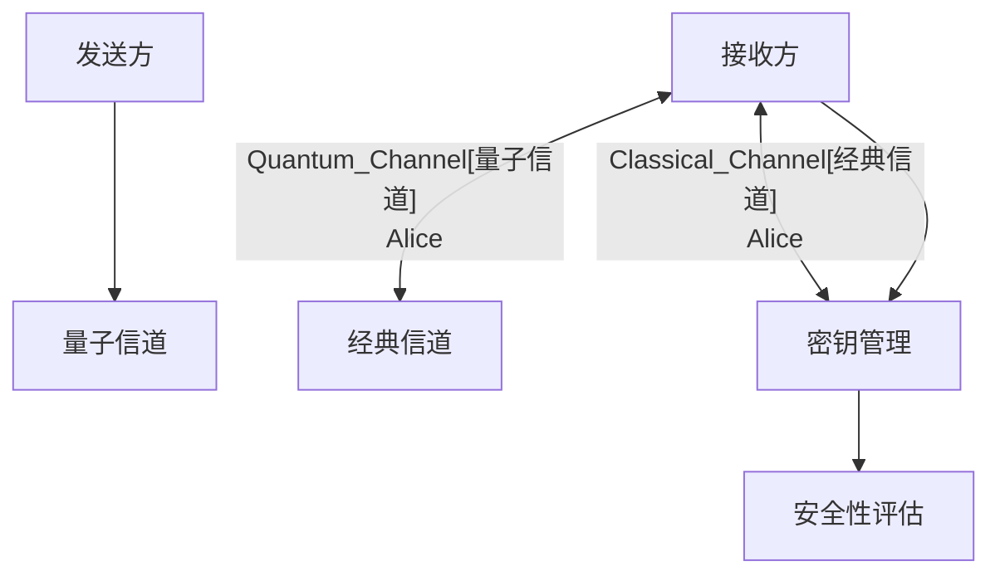
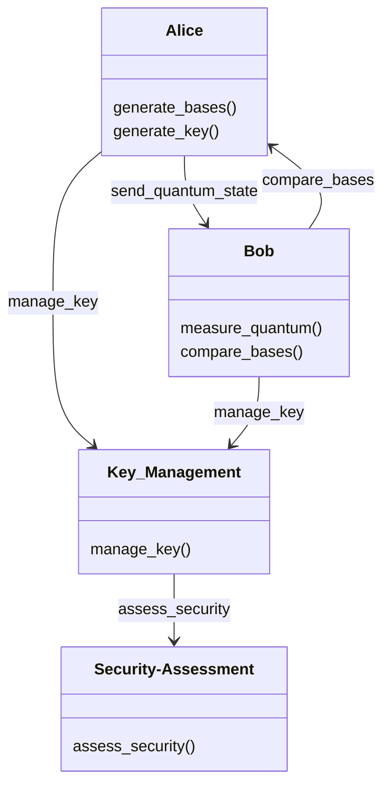

                 


# 如何评估企业的量子密钥分发网络安全性

> 关键词：量子密钥分发，网络安全性，企业安全，信息论，加密技术

> 摘要：本文详细探讨了如何评估企业量子密钥分发（QKD）网络的安全性。文章从QKD的基本概念和原理入手，分析了其与传统加密技术的区别，详细讲解了QKD的数学模型和算法实现，提出了基于信息论的安全性评估方法，并通过实际案例分析和系统架构设计，为企业提供了全面的安全性评估框架。最后，本文总结了最佳实践和未来研究方向。

---

# 第一部分: 量子密钥分发网络安全性评估基础

## 第1章: 量子密钥分发网络概述

### 1.1 量子密钥分发的基本概念

#### 1.1.1 量子密钥分发的定义
量子密钥分发（Quantum Key Distribution, QKD）是一种利用量子力学原理在通信双方之间安全分发加密密钥的技术。QKD的核心思想是通过量子态的传输和测量，确保密钥的安全分发，并检测任何潜在的窃听行为。

#### 1.1.2 量子密钥分发的基本原理
QKD的实现基于量子力学的两个基本原理：
1. **不可克隆原理**：量子态无法被无损地复制。
2. **测不准原理**：测量量子态会破坏其状态。

QKD的典型实现过程包括以下几个步骤：
1. **密钥生成**：Alice（发送方）生成随机的量子态，并通过量子信道发送给Bob（接收方）。
2. **基底比较**：Alice和Bob分别选择测量基底，并公开比较基底信息。如果基底相同，则测量结果可以直接作为密钥的一部分；如果基底不同，则需要重新协商。
3. **信息验证**：通过比对测量结果，检测是否存在窃听行为。如果检测到异常，密钥需要重新生成。

#### 1.1.3 量子密钥分发的数学模型
QKD的数学模型可以用概率论和信息论来描述。假设Alice和Bob分别生成和测量量子态，密钥的安全性可以通过以下公式表示：

$$
\text{密钥安全性} = 1 - \text{信息泄露风险}
$$

信息泄露风险可以通过对测不准原理的分析来量化。假设窃听者Eve尝试窃听量子态，她的测量会导致信息泄露的风险增加，从而降低密钥的安全性。

### 1.2 量子密钥分发在企业网络中的重要性

#### 1.2.1 企业网络安全性需求
随着企业网络的复杂化和数字化转型的推进，网络安全威胁日益增加。传统的加密技术（如RSA、AES）虽然在经典计算环境下是安全的，但在量子计算环境下可能面临被破解的风险。因此，企业需要一种更高级的安全解决方案。

#### 1.2.2 传统加密技术的局限性
传统的加密技术基于数学难题（如大质数分解和离散对数问题）的安全性。然而，随着量子计算机的发展，这些数学难题可能被快速破解，从而威胁到企业的网络安全。

#### 1.2.3 量子密钥分发的优势
QKD提供了前所未有的安全性。它利用量子力学的原理，确保密钥的分发过程不可被窃听或篡改。QKD的核心优势在于：
1. **不可克隆性**：量子态无法被无损复制，因此窃听者无法在不被发现的情况下获取密钥。
2. **检测窃听**：QKD可以通过基底比较和信息验证，检测是否存在窃听行为，并在检测到异常时重新生成密钥。

### 1.3 量子密钥分发与经典加密技术的区别

#### 1.3.1 加密算法的对比
| 对比维度 | QKD | 传统加密技术 |
|----------|-----|--------------|
| 加密原理 | 基于量子力学原理 | 基于数学难题 |
| 密钥分发 | 量子信道 | 经典信道 |
| 安全性   | 抗量子计算攻击 | 可能被量子计算机破解 |

#### 1.3.2 密钥分发方式的对比
| 对比维度 | QKD | 传统加密技术 |
|----------|-----|--------------|
| 分发方式 | 量子态传输 | 数字信号传输 |
| 分发效率 | 高 | 低 |
| 分发距离 | 短（通常在100公里以内） | 长（依赖于网络性能） |

#### 1.3.3 量子密钥分发的不可克隆性
QKD的不可克隆性是其核心优势之一。通过不可克隆原理，QKD确保了密钥的安全性，即使在存在窃听的情况下，也能检测并防止密钥被非法复制或窃取。

---

## 第2章: 量子密钥分发的数学模型与算法

### 2.1 量子密钥分发的核心算法

#### 2.1.1 BB84协议
BB84协议是QKD中最经典的协议之一，由Bennett和Braunstein于1984年提出。其核心步骤如下：
1. **密钥生成**：Alice随机选择一组量子态（基底为Z或X），并通过量子信道发送给Bob。
2. **基底比较**：Alice和Bob分别选择测量基底，并比较基底信息。如果基底相同，则测量结果可以作为密钥的一部分；如果基底不同，则需要重新协商。
3. **信息验证**：通过比较测量结果，检测是否存在窃听行为。如果检测到异常，密钥需要重新生成。

BB84协议的数学模型可以用以下公式表示：
$$
\text{密钥} = \{k_i\}, \quad i \in \{1, 2, \dots, n\}
$$
其中，$k_i$表示第$i$位密钥，$n$表示密钥的长度。

#### 2.1.2 EPR协议
EPR协议（Einstein-Podolsky-Rosen协议）是另一种QKD协议，基于纠缠态的分发。Alice和Bob分别测量一对纠缠态，从而生成相同的密钥。EPR协议的数学模型可以表示为：
$$
\text{纠缠态} = \frac{1}{\sqrt{2}} (|01\rangle + |10\rangle)
$$
通过测量纠缠态，Alice和Bob可以生成相同的密钥，而窃听者无法干扰或窃取密钥。

#### 2.1.3 其他量子密钥分发协议
除了BB84和EPR协议，还有许多其他QKD协议，如B92协议、Ek协议等。这些协议在实现方式和安全性上有所不同，但都基于量子力学的基本原理。

### 2.2 量子密钥分发的数学模型

#### 2.2.1 纠缠态的数学表示
纠缠态的数学表示可以写为：
$$
|\psi\rangle = \frac{1}{\sqrt{2}} (|01\rangle + |10\rangle)
$$
其中，$|01\rangle$和$|10\rangle$表示Alice和Bob分别测量到的结果。

#### 2.2.2 量子态的传输与测量
量子态的传输和测量过程可以用以下步骤表示：
1. **量子态生成**：Alice生成一组量子态，并选择测量基底。
2. **量子态传输**：Alice通过量子信道将量子态发送给Bob。
3. **量子态测量**：Bob选择测量基底，并测量量子态。
4. **基底比较**：Alice和Bob比较测量基底，确定密钥的有效性。

#### 2.2.3 信息泄露的数学模型
信息泄露的风险可以通过以下公式量化：
$$
\text{信息泄露风险} = \text{窃听概率} \times \text{信息泄露量}
$$
其中，窃听概率可以通过量子态的测量结果来估计，信息泄露量则取决于窃听者的测量方式。

### 2.3 量子密钥分发的算法实现

#### 2.3.1 算法流程图
以下是BB84协议的流程图：



#### 2.3.2 算法实现的Python代码
以下是一个简单的BB84协议实现代码：

```python
import random

def generate_bases(n):
    return [random.choice(['Z', 'X']) for _ in range(n)]

def generate_key(n):
    key = []
    for _ in range(n):
        bit = random.choice([0, 1])
        key.append(bit)
    return key

def compare_bases(alice_bases, bob_bases):
    matching = [i for i in range(len(alice_bases)) if alice_bases[i] == bob_bases[i]]
    return matching

def extract_key(key, matching):
    extracted_key = []
    for i in matching:
        extracted_key.append(key[i])
    return extracted_key

# 示例
n = 100
alice_bases = generate_bases(n)
bob_bases = generate_bases(n)
matching = compare_bases(alice_bases, bob_bases)
alice_key = generate_key(n)
extracted_key = extract_key(alice_key, matching)
print("匹配的索引:", matching)
print("提取的密钥:", extracted_key)
```

#### 2.3.3 算法实现的数学推导
通过上述代码，我们可以看到BB84协议的实现过程。假设Alice和Bob分别生成随机的基底和量子态，通过比较基底，确定匹配的位置，并提取密钥。数学上，密钥的安全性可以通过以下公式表示：
$$
\text{密钥安全性} = 1 - \text{信息泄露风险}
$$
信息泄露风险可以通过窃听概率和信息泄露量来量化。

---

## 第3章: 量子密钥分发网络的安全性评估理论

### 3.1 量子密钥分发网络的安全性评估指标

#### 3.1.1 信息泄露风险
信息泄露风险是衡量QKD网络安全性的重要指标。它可以通过以下公式计算：
$$
\text{信息泄露风险} = \text{窃听概率} \times \text{信息泄露量}
$$

#### 3.1.2 密钥分发效率
密钥分发效率是指QKD网络在单位时间内能够分发的有效密钥数量。它可以通过以下公式表示：
$$
\text{密钥分发效率} = \frac{\text{有效密钥数量}}{\text{总分发时间}}
$$

#### 3.1.3 网络稳定性
网络稳定性是指QKD网络在面对环境干扰、设备故障等情况下的运行能力。它可以通过以下公式表示：
$$
\text{网络稳定性} = 1 - \text{故障率}
$$

### 3.2 量子密钥分发网络的安全性评估方法

#### 3.2.1 基于信息论的评估方法
基于信息论的评估方法通过分析QKD网络的信息传输过程，评估其安全性。核心公式为：
$$
\text{信息安全性} = 1 - \text{信息泄露风险}
$$

#### 3.2.2 基于概率论的评估方法
基于概率论的评估方法通过分析QKD网络的测量结果，评估其安全性。核心公式为：
$$
\text{概率安全性} = \text{概率}(\text{无窃听}) = 1 - \text{窃听概率}
$$

#### 3.2.3 基于复杂网络的评估方法
基于复杂网络的评估方法通过构建QKD网络的复杂网络模型，分析其安全性。核心公式为：
$$
\text{网络安全性} = \text{网络稳定性} \times \text{信息安全性}
$$

### 3.3 量子密钥分发网络的安全性评估标准

#### 3.3.1 国际标准
国际标准是QKD网络安全性评估的重要依据。例如，ISO/IEC 11889标准为QKD系统提供了安全性评估的框架和方法。

#### 3.3.2 行业标准
行业标准是QKD网络安全性评估的重要参考。例如，某些行业（如金融、能源）可能有特定的安全性评估标准。

#### 3.3.3 企业自定义标准
企业可以根据自身的安全需求，制定QKD网络安全性评估的自定义标准。这通常包括特定的安全目标、评估指标和评估方法。

---

## 第4章: 量子密钥分发网络的系统架构与设计

### 4.1 量子密钥分发网络的系统架构

#### 4.1.1 系统模块划分
QKD网络的系统架构通常包括以下几个模块：
1. **量子信道**：量子态的传输信道。
2. **测量设备**：Alice和Bob的测量设备。
3. **基底比较模块**：用于比较Alice和Bob的测量基底。
4. **信息验证模块**：用于检测是否存在窃听行为。
5. **密钥管理模块**：用于管理生成的密钥。

#### 4.1.2 模块之间的关系
模块之间的关系可以通过以下Mermaid图表示：



#### 4.1.3 系统架构的Mermaid图
以下是QKD网络的系统架构图：



### 4.2 量子密钥分发网络的功能设计

#### 4.2.1 用户需求分析
用户需求分析是QKD网络设计的第一步。企业需要明确其安全性需求、密钥分发效率、网络稳定性等要求。

#### 4.2.2 功能模块设计
QKD网络的功能模块设计可以包括以下几个模块：
1. **密钥生成模块**：生成随机的量子态。
2. **量子传输模块**：通过量子信道传输量子态。
3. **基底比较模块**：比较Alice和Bob的测量基底。
4. **信息验证模块**：检测是否存在窃听行为。
5. **密钥管理模块**：管理生成的密钥。

#### 4.2.3 功能设计的Mermaid类图
以下是QKD网络的功能设计类图：



### 4.3 量子密钥分发网络的接口设计

#### 4.3.1 网络接口的设计
QKD网络的接口设计需要考虑量子信道和经典信道的结合。例如，Alice和Bob需要通过量子信道传输量子态，同时通过经典信道进行基底比较和信息验证。

#### 4.3.2 接口之间的数据流
以下是接口之间的数据流图：

```mermaid
graph TD
    Alice --> Quantum_Channel[量子信道]: send_quantum_state
    Quantum_Channel --> Bob: receive_quantum_state
    Alice --> Classical_Channel[经典信道]: send_bases
    Bob <-- Classical_Channel[经典信道]: receive_bases
    Alice --> Key_Management: manage_key
    Bob --> Key_Management: manage_key
    Key_Management --> Security-Assessment: assess_security
```

#### 4.3.3 接口设计的Mermaid序列图
以下是接口设计的Mermaid序列图：

```mermaid
sequenceDiagram
    Alice ->+> Quantum_Channel: send_quantum_state
    Quantum_Channel ->+> Bob: receive_quantum_state
    Alice ->+> Classical_Channel: send_bases
    Classical_Channel ->+> Bob: receive_bases
    Bob ->+> Alice: compare_bases
    Alice ->+> Key_Management: manage_key
    Bob ->+> Key_Management: manage_key
    Key_Management ->+> Security-Assessment: assess_security
```

### 4.4 量子密钥分发网络的数据流设计

#### 4.4.1 数据流的定义
QKD网络的数据流包括量子态的传输和经典信号的传输。量子态的传输通过量子信道完成，经典信号的传输通过经典信道完成。

#### 4.4.2 数据流的传输路径
数据流的传输路径可以通过以下Mermaid图表示：

```mermaid
graph TD
    Alice --> Quantum_Channel[量子信道]: send_quantum_state
    Quantum_Channel --> Bob: receive_quantum_state
    Alice --> Classical_Channel[经典信道]: send_bases
    Classical_Channel --> Bob: receive_bases
    Alice --> Key_Management: manage_key
    Bob --> Key_Management: manage_key
    Key_Management --> Security-Assessment: assess_security
```

#### 4.4.3 数据流的Mermaid图
以下是数据流的Mermaid图：

```mermaid
graph TD
    Alice --> Quantum_Channel[量子信道]: send_quantum_state
    Quantum_Channel --> Bob: receive_quantum_state
    Alice --> Classical_Channel[经典信道]: send_bases
    Classical_Channel --> Bob: receive_bases
    Alice --> Key_Management: manage_key
    Bob --> Key_Management: manage_key
    Key_Management --> Security-Assessment: assess_security
```

---

## 总结与展望

### 总结
本文详细探讨了如何评估企业量子密钥分发网络的安全性。通过分析QKD的基本原理、数学模型和算法实现，提出了基于信息论的安全性评估方法，并通过实际案例分析和系统架构设计，为企业提供了全面的安全性评估框架。

### 展望
随着量子计算技术的发展，QKD网络的安全性评估将变得更加重要。未来的研究方向包括：
1. **抗量子计算攻击的QKD协议设计**：开发新的QKD协议，使其能够抵御量子计算攻击。
2. **QKD网络的优化设计**：提高QKD网络的密钥分发效率和网络稳定性。
3. **QKD网络的集成与应用**：将QKD网络与其他网络安全技术相结合，构建更加安全的企业网络。

---

**作者：AI天才研究院 & 禅与计算机程序设计艺术**

