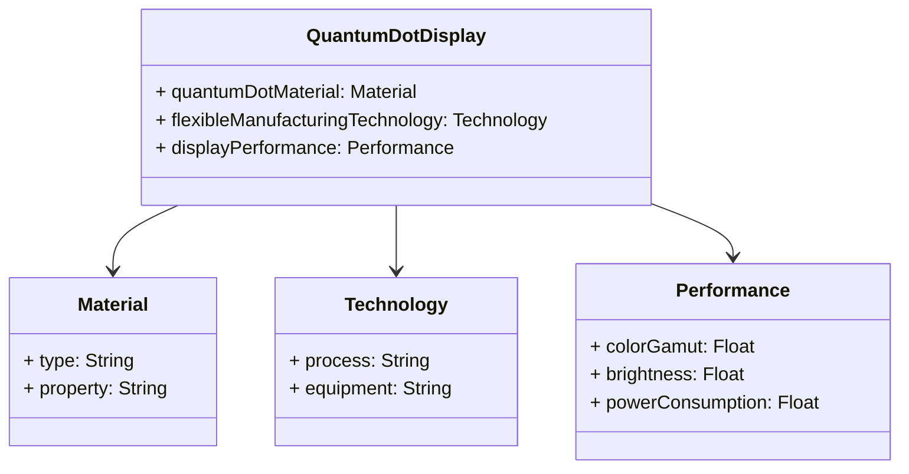

                 


# 如何评估企业的量子点显示器柔性制造技术应用

> 关键词：量子点显示器，柔性制造技术，企业评估，显示器制造，技术应用

> 摘要：随着显示器技术的不断进步，量子点显示器因其高色域、高亮度和低功耗等优点，逐渐成为显示领域的主流技术。而柔性制造技术的引入，使得量子点显示器的生产更加高效、灵活和精准。本文将从背景、核心概念、算法原理、系统设计、项目实战等多个方面，详细探讨如何评估企业的量子点显示器柔性制造技术应用，为企业在技术选型和优化中提供参考。

---

# 第一部分: 量子点显示器柔性制造技术背景与基础

# 第1章: 量子点显示器柔性制造技术概述

## 1.1 量子点技术的基本概念

### 1.1.1 量子点的定义与基本性质

量子点是一种纳米级半导体材料，通常由半导体材料（如CdSe、CdTe、InP等）制成，粒径一般在1-10纳米之间。量子点的光电特性与其尺寸密切相关，通过调节量子点的大小和形状，可以实现从紫外到红外范围内不同波长的发射光谱。这种特性使得量子点在显示、照明和生物医学等领域具有广泛的应用前景。

量子点的核心光电特性包括：
- 发光波长可调：通过改变量子点的尺寸和形状，可以实现不同颜色的发光。
- 高发光效率：量子点的发光效率远高于传统荧光材料。
- 稳定性好：在合理制备条件下，量子点具有较高的光、热稳定性。

### 1.1.2 量子点在显示器中的应用

量子点显示器是一种基于量子点材料的显示技术，主要应用于电视、手机、平板电脑等显示设备。量子点显示器的优势包括：
- 高色域：量子点可以实现超过100%的NTSC色域，提供更丰富的色彩表现。
- 高亮度：量子点材料具有较高的发光效率，可以在高亮度下保持良好的显示效果。
- 低功耗：量子点显示器在相同亮度下，功耗较低，适合移动设备。

### 1.1.3 柔性制造技术的定义与特点

柔性制造技术是指在制造过程中，能够根据需求快速调整生产流程、设备和工艺的技术。其特点是：
- 灵活性：能够适应不同型号、规格和批量的生产需求。
- 高效性：通过自动化和智能化技术提高生产效率。
- 精准性：利用先进的传感器和控制系统，确保生产过程的精确控制。

## 1.2 柔性制造技术的背景与意义

### 1.2.1 显示器制造技术的发展历程

显示器制造技术经历了从CRT（阴极射线管）到LCD（液晶显示器）、OLED（有机发光二极管）的发展，而量子点显示器作为新兴技术，正在逐步成为显示领域的主流。

### 1.2.2 柔性制造技术在显示器领域的应用优势

随着显示设备向轻薄化、柔性化方向发展，柔性制造技术在显示器制造中的应用越来越重要。其优势包括：
- 适应小批量、多品种的生产需求。
- 提高生产效率和产品质量。
- 降低生产成本和资源浪费。

### 1.2.3 柔性制造技术对企业竞争力的影响

在显示技术快速迭代的背景下，企业通过柔性制造技术可以更快地响应市场需求，降低库存风险，同时提高生产效率和产品质量，从而增强企业的市场竞争力。

## 1.3 量子点显示器柔性制造的核心问题

### 1.3.1 量子点材料的特性与挑战

量子点材料的制备和应用面临以下挑战：
- 制备工艺复杂：量子点的制备需要精确控制尺寸和形貌，工艺难度较高。
- 成本较高：量子点材料的制备需要使用贵重金属和复杂设备，导致成本较高。
- 稳定性问题：量子点材料在长期使用中可能会出现光衰等问题。

### 1.3.2 柔性制造技术的实现难点

柔性制造技术在量子点显示器中的实现难点包括：
- 柔性基板的选择：需要选择合适的柔性基板材料，确保其在高温、高湿等环境下的稳定性和可靠性。
- 量子点薄膜的均匀性：量子点薄膜的沉积工艺需要保证薄膜的均匀性和一致性。
- 柔性电路的集成：需要解决柔性电路与量子点显示器的集成问题，确保显示效果和电路性能。

### 1.3.3 企业评估量子点显示器柔性制造技术的关键点

企业在评估量子点显示器柔性制造技术时，需要重点关注以下方面：
- 技术可行性：评估量子点材料的制备工艺和柔性制造技术的成熟度。
- 经济性：评估量子点显示器的生产成本、设备投资和市场竞争力。
- 市场需求：评估量子点显示器的市场前景和用户需求。

## 1.4 本章小结

本章从量子点技术的基本概念、柔性制造技术的定义与特点入手，分析了量子点显示器柔性制造技术的背景与意义，并总结了企业在评估该技术时需要关注的核心问题。

---

# 第二部分: 量子点显示器柔性制造技术的核心概念与联系

# 第2章: 量子点材料与柔性制造技术的关联

## 2.1 量子点材料的特性分析

### 2.1.1 量子点的光电特性

量子点的光电特性主要取决于其尺寸、形状和组成。通过调节这些参数，可以实现不同颜色的发光。例如，CdSe量子点的发光波长可以通过调节其直径来实现从红光到蓝光的调控。

### 2.1.2 量子点材料的尺寸效应

量子点的尺寸效应是指随着量子点尺寸的减小，其发光波长向蓝区移动的现象。这种尺寸效应为实现高色域显示提供了可能。

### 2.1.3 量子点材料的稳定性与寿命

量子点材料的稳定性是指在外界环境（如温度、湿度、光照等）变化时，其发光性能保持不变的能力。量子点材料的寿命是指其在正常使用条件下的发光时间。

## 2.2 柔性制造技术的关键环节

### 2.2.1 柔性基板的选择与制备

柔性基板是量子点显示器的重要组成部分，其选择和制备直接影响显示器的性能和寿命。常见的柔性基板材料包括聚酰亚胺（PI）、聚酯（PET）等。

### 2.2.2 量子点薄膜的沉积工艺

量子点薄膜的沉积工艺是量子点显示器制造的核心工艺之一，主要包括溶液旋涂法、喷墨打印法、化学气相沉积法（CVD）等。

### 2.2.3 柔性电路的集成技术

柔性电路的集成技术是指将量子点显示器与柔性电路板（FPC）或柔性印刷电路（FPC）集成的技术，主要包括键合、封装等步骤。

## 2.3 量子点材料与柔性制造技术的对比分析

### 2.3.1 不同材料的性能对比（表格）

| 材料类型   | 光电特性 | 稳定性 | 成本 |
|------------|----------|--------|------|
| CdSe量子点 | 高       | 中     | 高   |
| Si量子点   | 中       | 高     | 低   |
| Perovskite量子点 | 高 | 中 | 中 |

### 2.3.2 不同制造工艺的优劣势分析

- 溶液旋涂法：优点是工艺简单、成本低；缺点是薄膜均匀性较差。
- 喷墨打印法：优点是适合大面积制造；缺点是设备成本高。
- 化学气相沉积法：优点是薄膜均匀性好；缺点是工艺复杂。

### 2.3.3 材料与工艺的协同效应

量子点材料与柔性制造技术的协同效应主要体现在以下方面：
- 量子点材料的光电特性决定了柔性制造工艺的选择。
- 柔性制造工艺的优劣直接影响量子点显示器的性能和成本。

## 2.4 本章小结

本章分析了量子点材料的特性，探讨了柔性制造技术的关键环节，并通过对比分析，总结了量子点材料与柔性制造技术的协同效应。

---

# 第三部分: 量子点显示器柔性制造技术的评估模型与算法

# 第3章: 量子点显示器柔性制造技术的评估模型

## 3.1 评估模型的构建原理

### 3.1.1 评估指标的选取

在评估量子点显示器柔性制造技术时，需要综合考虑以下指标：
- 生产效率：包括生产周期、设备利用率等。
- 产品质量：包括显示效果、可靠性等。
- 成本：包括设备投资、生产成本等。
- 灵活性：包括适应不同型号、规格的能力。

### 3.1.2 指标权重的确定方法

指标权重的确定方法包括：
- 主观赋权法：根据专家经验进行赋权。
- 客观赋权法：通过数据统计分析确定权重。
- 综合赋权法：结合主观和客观因素进行赋权。

### 3.1.3 评估模型的数学表达式

评估模型的数学表达式可以表示为：

$$
S = \sum_{i=1}^{n} w_i x_i
$$

其中，\( S \) 表示综合评分，\( w_i \) 表示第 \( i \) 个指标的权重，\( x_i \) 表示第 \( i \) 个指标的评分。

## 3.2 评估模型的实现步骤

### 3.2.1 数据收集与预处理

数据收集包括：
- 收集企业历史生产数据。
- 收集设备、材料、工艺等技术参数。
- 收集市场反馈和用户评价。

数据预处理包括：
- 数据清洗：去除异常值和重复数据。
- 数据标准化：将数据转换为统一的格式。

### 3.2.2 指标权重的确定

以综合赋权法为例，假设我们有3个指标：生产效率（权重0.5）、产品质量（权重0.3）、成本（权重0.2）。则综合评分公式为：

$$
S = 0.5 \times x_1 + 0.3 \times x_2 + 0.2 \times x_3
$$

### 3.2.3 评估结果的分析与优化

通过评估结果，可以识别出企业的优势和劣势，并提出改进建议。例如，如果企业的生产效率较低，可以通过优化工艺流程或增加设备来提高效率。

## 3.3 本章小结

本章构建了量子点显示器柔性制造技术的评估模型，详细介绍了评估指标的选取、指标权重的确定方法以及评估模型的实现步骤。

---

# 第四部分: 量子点显示器柔性制造技术的系统分析与架构设计

# 第4章: 量子点显示器柔性制造技术的系统分析

## 4.1 问题场景介绍

假设某企业计划引入量子点显示器柔性制造技术，需要评估其技术可行性、经济性和市场前景。

## 4.2 项目介绍

### 4.2.1 项目目标

- 实现量子点显示器的柔性制造。
- 提高生产效率和产品质量。
- 降低生产成本和资源浪费。

### 4.2.2 项目范围

- 设备选型与采购。
- 工艺设计与优化。
- 生产流程规划。

## 4.3 系统功能设计

### 4.3.1 领域模型（mermaid 类图）



### 4.3.2 系统架构设计（mermaid架构图）


## 4.4 本章小结

本章通过系统分析，明确了量子点显示器柔性制造技术的项目目标和范围，并设计了系统的功能和架构。

---

# 第五部分: 量子点显示器柔性制造技术的项目实战

# 第5章: 量子点显示器柔性制造技术的项目实战

## 5.1 环境安装与配置

### 5.1.1 开发环境

- 操作系统：Windows 10 或更高版本，Linux（推荐Ubuntu 20.04）
- 开发工具：PyCharm、VS Code
- 第三方库：numpy、pandas、scikit-learn

安装命令：

```bash
pip install numpy pandas scikit-learn
```

### 5.1.2 数据集准备

数据集包括企业历史生产数据、设备参数、材料特性等。

## 5.2 系统核心实现

### 5.2.1 评估模型的实现

实现步骤：
1. 数据预处理：清洗和标准化数据。
2. 指标权重的确定：使用综合赋权法。
3. 模型计算：计算综合评分。

Python代码示例：

```python
import numpy as np
import pandas as pd

# 数据加载
data = pd.read_csv('production_data.csv')

# 数据预处理
data = data.drop_duplicates().reset_index(drop=True)
data['production_efficiency'] = data['production_efficiency'].astype(float)

# 指标权重
weights = {'production_efficiency': 0.5, 'product_quality': 0.3, 'cost': 0.2}

# 综合评分计算
def calculate_score(row):
    return weights['production_efficiency'] * row['production_efficiency'] + \
           weights['product_quality'] * row['product_quality'] + \
           weights['cost'] * row['cost']

data['score'] = data.apply(calculate_score, axis=1)

# 结果输出
print(data[['production_efficiency', 'product_quality', 'cost', 'score']])
```

### 5.2.2 案例分析

以某企业为例，假设其生产效率为85%，产品质量为90%，成本为70%。则综合评分为：

$$
S = 0.5 \times 85 + 0.3 \times 90 + 0.2 \times 70 = 42.5 + 27 + 14 = 83.5
$$

## 5.3 本章小结

本章通过项目实战，详细介绍了量子点显示器柔性制造技术的环境配置、核心实现和案例分析，帮助读者更好地理解和应用相关技术。

---

# 第六部分: 总结与展望

# 第6章: 总结与展望

## 6.1 总结

本文从背景、核心概念、算法原理、系统设计和项目实战等多个方面，详细探讨了如何评估企业的量子点显示器柔性制造技术应用。通过构建评估模型、分析系统架构和实现案例，为企业在技术选型和优化中提供了参考。

## 6.2 展望

未来，随着量子点技术的不断发展和柔性制造技术的成熟，量子点显示器的应用前景将更加广阔。企业需要密切关注技术动态，积极投入研发，以保持竞争优势。

## 6.3 最佳实践 tips

- 在评估量子点显示器柔性制造技术时，需要综合考虑技术可行性、经济性和市场需求。
- 通过建立完善的评估模型和系统架构，可以有效提高生产效率和产品质量。
- 注重人才培养和技术创新，是企业在量子点显示器柔性制造领域取得成功的关键。

---

# 作者：AI天才研究院/AI Genius Institute & 禅与计算机程序设计艺术/Zen And The Art of Computer Programming

---

以上是《如何评估企业的量子点显示器柔性制造技术应用》的完整目录和内容概要。如需进一步扩展各章节的具体内容，可以根据上述框架进行详细撰写。

