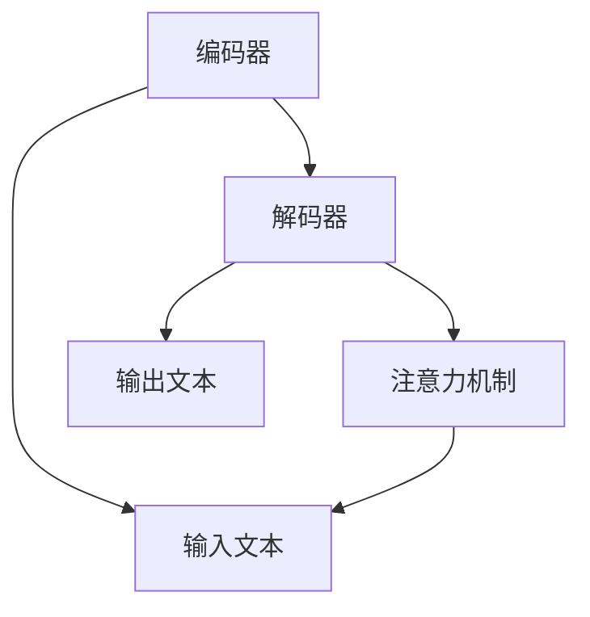
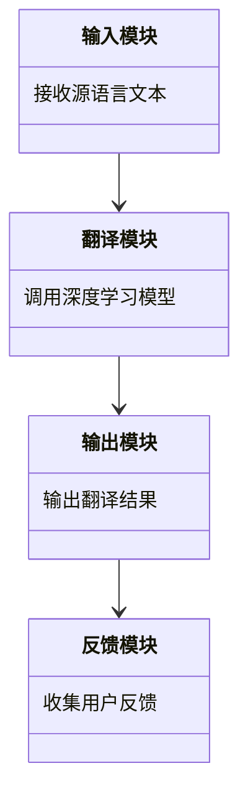
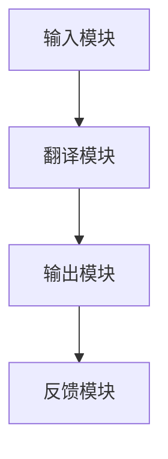

                 


# 如何识别企业的深度学习多语言翻译技术优势

## 关键词：
- 深度学习
- 多语言翻译
- 企业技术优势
- 神经机器翻译
- 系统架构设计

## 摘要：
深度学习在多语言翻译技术中的应用为企业带来了显著的优势，包括高精度翻译、多语言支持和实时交互能力。本文将从背景介绍、核心概念、算法原理、系统架构设计、项目实战以及最佳实践等方面详细阐述如何识别和利用这些技术优势。通过分析模型原理、系统架构和实际案例，本文将为读者提供一个全面的技术视角，帮助企业在多语言翻译领域实现技术突破和业务提升。

---

# 第1章: 深度学习多语言翻译技术背景介绍

## 1.1 深度学习多语言翻译技术的定义与特点
### 1.1.1 深度学习多语言翻译技术的定义
深度学习多语言翻译技术是一种基于神经网络的机器翻译方法，通过深度学习模型（如神经机器翻译模型）实现多种语言之间的自动翻译。与传统基于规则的翻译方法不同，深度学习技术能够通过大量数据训练模型，捕捉语言之间的复杂关系，从而实现更自然、更准确的翻译。

### 1.1.2 深度学习多语言翻译技术的核心特点
- **数据驱动**：依赖于大量标注数据的训练，模型通过学习数据中的模式和特征来生成翻译结果。
- **端到端**：从输入文本到输出翻译直接由模型处理，减少了传统翻译工具中的人工干预。
- **自适应**：模型能够根据上下文和语境进行调整，提供更符合实际场景的翻译结果。

### 1.1.3 与传统机器翻译技术的区别
| 特性                | 基于规则的传统翻译 | 基于深度学习的翻译 |
|---------------------|--------------------|--------------------|
| 翻译质量            | 较低，依赖人工规则  | 较高，基于大量数据训练 |
| 实时性              | 较差，依赖词典匹配 | 较好，支持实时翻译 |
| 语言适应性          | 有限，难以处理复杂语言关系 | 更强，能够处理多种语言之间的复杂关系 |
| 自然流畅性          | 较差，翻译结果生硬 | 较好，翻译更自然流畅 |

---

## 1.2 深度学习多语言翻译技术的应用背景
### 1.2.1 当前企业翻译技术的需求现状
随着全球化的发展，企业对多语言翻译的需求日益增长。企业需要在跨国交流、国际市场拓展、多语言内容生成等方面具备高效的翻译能力，以提升竞争力。

### 1.2.2 多语言翻译技术在企业中的应用场景
- **客户支持**：为多语言客户提供实时支持，提升客户体验。
- **市场推广**：将产品描述、广告文案等多语言内容快速生成，扩大市场覆盖。
- **内部沟通**：支持跨国团队的内部沟通，确保信息准确传递。
- **内容管理**：多语言内容的生成和管理，如网站、文档等。

### 1.2.3 深度学习技术对企业翻译能力的提升作用
深度学习技术通过以下方式显著提升了企业的翻译能力：
- **提高翻译效率**：通过自动化流程减少人工干预，缩短翻译时间。
- **增强翻译质量**：基于大量数据训练的模型能够捕捉语言的细微差别，提供更准确的翻译结果。
- **支持实时交互**：在线翻译工具能够实时处理用户的输入，满足即时需求。

---

## 1.3 企业深度学习多语言翻译技术的优势
### 1.3.1 高精度翻译能力
深度学习模型通过大量数据训练，能够准确理解上下文和语境，生成高质量的翻译结果。例如，神经机器翻译模型可以通过注意力机制捕捉输入文本的关键信息，确保翻译的准确性和流畅性。

### 1.3.2 多语言支持能力
深度学习模型可以通过多任务学习或跨语言迁移学习，支持多种语言的翻译。例如，使用预训练-微调范式，模型可以在一种语言上进行预训练，然后在其他语言上进行微调，从而支持多种语言的翻译任务。

### 1.3.3 实时翻译与交互能力
深度学习技术使得实时翻译成为可能，企业可以开发实时翻译工具或接口，满足用户的即时需求。例如，在线客服系统可以通过实时翻译功能，为多语言客户提供即时支持。

---

## 1.4 本章小结
本章从定义、特点、应用背景和优势等方面介绍了深度学习多语言翻译技术。深度学习技术通过数据驱动、端到端的处理方式，显著提升了翻译的精度和效率，为企业在多语言翻译领域提供了强有力的技术支持。

---

# 第2章: 深度学习多语言翻译技术的核心概念与联系

## 2.1 深度学习模型的基本原理
### 2.1.1 神经机器翻译模型的结构
神经机器翻译模型通常由编码器和解码器组成。编码器负责将输入的源语言文本映射到一个中间表示（如向量），解码器则根据这个中间表示生成目标语言的文本。

### 2.1.2 编码器-解码器模型的工作原理
- **编码器**：将输入的源语言句子转换为一个固定长度的向量，这个向量捕获了句子的主要语义信息。
- **解码器**：根据编码器生成的向量，逐步生成目标语言的句子。解码器通常使用循环神经网络（RNN）或变换器（Transformer）结构。

### 2.1.3 注意力机制的引入与作用
注意力机制通过在解码过程中关注输入文本中的关键部分，帮助模型生成更准确的翻译结果。例如，在翻译长句子时，注意力机制可以确保模型关注到与当前输出相关的输入部分。

---

## 2.2 多语言翻译模型的训练方法
### 2.2.1 多任务学习
多任务学习是一种通过同时学习多种任务来提升模型性能的方法。在多语言翻译中，模型可以在多种语言对上同时进行训练，从而提高对多种语言的理解和生成能力。

### 2.2.2 跨语言迁移学习
跨语言迁移学习是一种通过在一种语言上预训练模型，然后将其迁移到其他语言上的方法。这种方法特别适用于资源有限的语言，可以通过少量微调快速适应目标语言。

### 2.2.3 预训练-微调范式
预训练-微调范式是一种常用的深度学习训练方法。模型首先在大规模通用数据上进行预训练，然后在特定任务（如多语言翻译）上进行微调，以适应具体需求。

---

## 2.3 深度学习模型的对比分析
### 2.3.1 不同模型的优缺点对比
| 模型类型          | 优点                          | 缺点                          |
|-------------------|-------------------------------|-------------------------------|
| 基于规则的翻译    | 实现简单，易于控制            | 翻译质量低，难以处理复杂语境  |
| 统计机器翻译      | 能够利用大量数据              | 需要大量标注数据，计算资源消耗大 |
| 神经机器翻译      | 翻译质量高，支持多种语言        | 训练时间长，计算资源消耗大      |
| 基于Transformer的模型 | 捕捉长距离依赖关系能力强        | 对训练数据质量要求高，需要大量计算资源 |

### 2.3.2 模型性能对比分析
通过实验对比不同模型在多语言翻译任务中的性能，可以得出以下结论：
- 基于Transformer的模型在翻译质量上显著优于基于RNN的模型。
- 多任务学习和跨语言迁移学习能够有效提升模型对多种语言的支持能力。

### 2.3.3 模型复杂度与资源消耗对比
| 模型类型          | 复杂度      | 资源消耗     |
|-------------------|-------------|--------------|
| 基于RNN的模型      | 较低         | 较低          |
| 基于Transformer的模型 | 较高        | 较高          |
| 多任务学习模型      | 较高        | 较高          |

---

## 2.4 深度学习翻译模型的实体关系图
以下是一个简单的实体关系图，展示了深度学习翻译模型的核心组件及其关系：



---

## 2.5 本章小结
本章从模型结构、训练方法和对比分析三个方面，详细阐述了深度学习多语言翻译技术的核心概念。通过理解这些概念，企业可以更好地识别和利用深度学习技术在多语言翻译中的优势。

---

# 第3章: 深度学习多语言翻译技术的算法原理

## 3.1 神经机器翻译模型的数学模型
### 3.1.1 编码器的前向传播
编码器的前向传播过程如下：
$$
x_i = \text{输入的源语言句子}
$$
$$
h_i = \text{编码器的隐藏层输出}
$$
$$
z = \text{编码器的最终输出向量}
$$

### 3.1.2 解码器的条件概率公式
解码器的目标是根据编码器的输出向量生成目标语言的句子。条件概率公式如下：
$$
P(y_1, y_2, ..., y_n | x_1, x_2, ..., x_m) = \prod_{i=1}^{n} P(y_i | y_1, ..., y_{i-1}, z)
$$

### 3.1.3 注意力机制的数学表达
注意力机制的核心是计算输入文本中每个词对当前输出词的相关性权重：
$$
a_i = \text{注意力权重}
$$
$$
\text{加权和} = \sum_{j=1}^{m} a_j x_j
$$

---

## 3.2 深度学习翻译算法的实现代码
以下是一个简单的神经机器翻译模型的Python代码示例：

```python
import torch
import torch.nn as nn

class Encoder(nn.Module):
    def __init__(self, input_size, hidden_size):
        super(Encoder, self).__init__()
        self.lstm = nn.LSTM(input_size, hidden_size, batch_first=True)
    
    def forward(self, input_seq):
        output, (hidden, cell) = self.lstm(input_seq)
        return hidden

class Decoder(nn.Module):
    def __init__(self, hidden_size, output_size):
        super(Decoder, self).__init__()
        self.lstm = nn.LSTM(hidden_size, hidden_size, batch_first=True)
        self.fc = nn.Linear(hidden_size, output_size)
    
    def forward(self, input_seq, hidden):
        output, _ = self.lstm(input_seq, (hidden, None))
        output = self.fc(output)
        return output

class Translator(nn.Module):
    def __init__(self, encoder, decoder):
        super(Translator, self).__init__()
        self.encoder = encoder
        self.decoder = decoder
    
    def forward(self, input_seq, target_seq):
        hidden = self.encoder(input_seq)
        output = self.decoder(hidden.unsqueeze(1), hidden)
        return output
```

---

## 3.3 算法实现的优化与改进
### 3.3.1 使用Transformer结构
基于Transformer的模型（如Bert、GPT）在翻译任务中表现出色，主要原因是其能够有效捕捉长距离依赖关系。

### 3.3.2 引入注意力机制
注意力机制的引入能够帮助模型更好地理解输入文本的语义关系，从而生成更准确的翻译结果。

### 3.3.3 使用多任务学习
通过在多种语言对上同时进行训练，模型可以更好地泛化，提升对多种语言的支持能力。

---

## 3.4 本章小结
本章详细讲解了深度学习多语言翻译技术的算法原理，包括数学模型、代码实现和优化方法。通过理解这些内容，读者可以更好地掌握深度学习技术在翻译任务中的应用。

---

# 第4章: 深度学习多语言翻译技术的系统分析与架构设计

## 4.1 企业多语言翻译系统的应用场景
企业多语言翻译系统通常应用于以下场景：
- **客户支持**：为多语言客户提供实时翻译支持。
- **市场推广**：将产品描述、广告文案等多语言内容快速生成。
- **内部沟通**：支持跨国团队的内部沟通，确保信息准确传递。

---

## 4.2 多语言翻译系统的功能设计
### 4.2.1 系统功能模块
- **输入模块**：接收源语言文本。
- **翻译模块**：基于深度学习模型生成目标语言翻译。
- **输出模块**：输出翻译结果。
- **反馈模块**：收集用户反馈，优化翻译质量。

### 4.2.2 领域模型设计


---

## 4.3 系统架构设计
### 4.3.1 系统架构图


### 4.3.2 接口设计
- **输入接口**：接收源语言文本。
- **输出接口**：返回目标语言翻译结果。
- **反馈接口**：收集用户对翻译结果的反馈。

### 4.3.3 交互流程
1. 用户输入源语言文本。
2. 翻译模块调用深度学习模型生成翻译结果。
3. 输出模块将翻译结果返回给用户。
4. 用户提供反馈，系统优化翻译模型。

---

## 4.4 本章小结
本章从系统架构和功能设计的角度，详细分析了深度学习多语言翻译技术在企业中的应用。通过合理设计系统架构和功能模块，企业可以更好地实现多语言翻译技术的优势。

---

# 第5章: 深度学习多语言翻译技术的项目实战

## 5.1 项目环境搭建
### 5.1.1 安装Python和相关库
```bash
pip install torch
pip install transformers
```

### 5.1.2 安装深度学习框架
```bash
pip install pytorch
pip install torch-transformers
```

---

## 5.2 翻译模型的核心代码实现
### 5.2.1 数据预处理
```python
def preprocess(data):
    # 数据清洗和格式转换
    pass
```

### 5.2.2 模型训练
```python
def train_model(model, optimizer, criterion, train_loader):
    for epoch in range(num_epochs):
        for inputs, labels in train_loader:
            outputs = model(inputs)
            loss = criterion(outputs, labels)
            loss.backward()
            optimizer.step()
```

### 5.2.3 翻译接口开发
```python
def translate(model, input_text):
    # 使用模型生成翻译结果
    pass
```

---

## 5.3 项目实战中的注意事项
### 5.3.1 数据质量
翻译模型的性能很大程度上依赖于训练数据的质量。企业需要确保数据标注准确，避免噪声数据对模型的干扰。

### 5.3.2 模型调优
通过超参数调整、学习率优化等方法，可以进一步提升模型的翻译性能。

### 5.3.3 系统性能优化
企业可以通过并行计算、模型压缩等方法，优化系统的运行效率，降低资源消耗。

---

## 5.4 本章小结
本章通过一个实际的项目案例，详细讲解了深度学习多语言翻译技术的环境搭建、模型实现和系统开发。通过这些内容，读者可以更好地理解如何将理论应用于实际项目中。

---

# 第6章: 深度学习多语言翻译技术的最佳实践与小结

## 6.1 最佳实践
### 6.1.1 数据质量管理
- 确保训练数据的多样性和代表性。
- 对数据进行清洗和标注，减少噪声。

### 6.1.2 模型优化
- 使用预训练模型，减少训练时间。
- 通过多任务学习和跨语言迁移学习，提升模型的泛化能力。

### 6.1.3 系统优化
- 优化系统的响应速度，提升用户体验。
- 通过并行计算和分布式训练，提高系统的处理能力。

---

## 6.2 小结与展望
深度学习多语言翻译技术为企业带来了显著的优势，包括高精度翻译、多语言支持和实时交互能力。随着技术的不断发展，未来深度学习翻译技术将在更多领域得到应用，为企业创造更大的价值。

---

# 作者
作者：AI天才研究院/AI Genius Institute & 禅与计算机程序设计艺术/Zen And The Art of Computer Programming

---

通过以上内容，我们系统地分析了深度学习多语言翻译技术的优势，并通过实际案例展示了其在企业中的应用。希望本文能够为企业在多语言翻译技术的选择和应用上提供有价值的参考。

