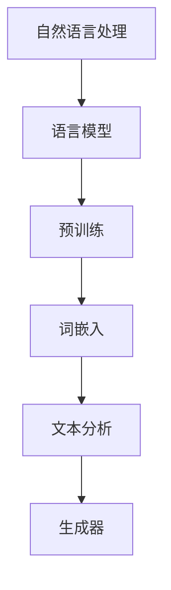
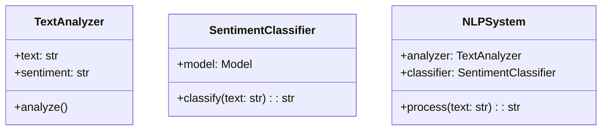
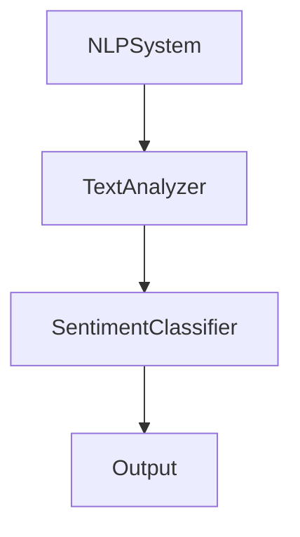
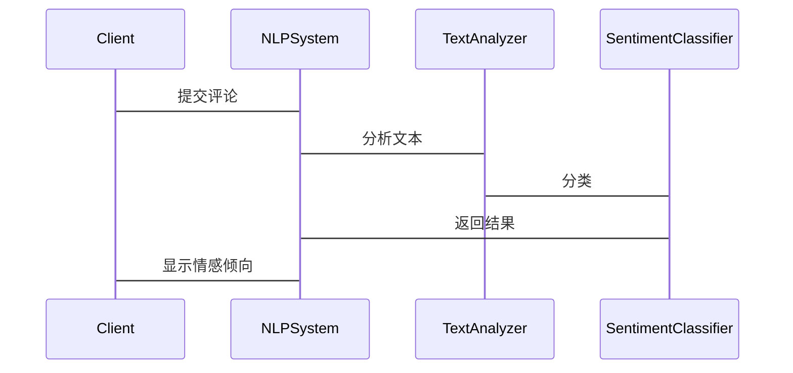

                 


# 如何识别企业的深度学习自然语言处理优势

> 关键词：深度学习，自然语言处理，企业优势，NLP模型，技术应用

> 摘要：本文将详细探讨如何识别企业在深度学习自然语言处理（NLP）方面的优势，从核心概念、算法原理、系统架构到项目实战，系统地分析企业在NLP领域的技术应用和竞争优势。通过本文，读者将能够深入了解NLP的关键技术，掌握识别和提升企业NLP能力的方法。

---

## 第一部分：深度学习自然语言处理背景与核心概念

### 第1章：深度学习自然语言处理概述

#### 1.1 深度学习自然语言处理的背景

##### 1.1.1 自然语言处理的定义与目标
自然语言处理（Natural Language Processing, NLP）是人工智能领域的重要分支，旨在让计算机能够理解和处理人类语言。其目标是实现人机交互的自然语言理解与生成，使计算机能够像人类一样处理文本。

##### 1.1.2 深度学习在NLP中的应用
深度学习的兴起极大地推动了NLP的发展，尤其是在以下方面：
- **文本分类**：情感分析、垃圾邮件检测。
- **机器翻译**：使用神经机器翻译（NMT）实现高质量的跨语言转换。
- **问答系统**：如智能客服、聊天机器人。
- **文本生成**：如自动摘要、内容生成。

##### 1.1.3 企业中的NLP应用现状与优势
企业在NLP领域的优势主要体现在：
- **数据资源**：企业通常拥有大量结构化和非结构化数据，为NLP模型提供了丰富的训练材料。
- **业务场景**：NLP可以应用于客户关系管理、市场分析、舆情监控等领域，提升企业效率和决策能力。
- **技术积累**：通过长期的技术研发和应用，企业积累了大量的NLP相关经验和资源。

#### 1.2 企业深度学习NLP的核心概念

##### 1.2.1 语言模型与预训练
语言模型通过预测文本中的下一个词来生成连贯的文本。预训练技术（如BERT）通过大规模数据训练，使模型具备通用的语言理解能力。

##### 1.2.2 分析器与生成器
- **分析器**：用于理解文本，如分词、句法分析。
- **生成器**：用于生成文本，如机器翻译、对话生成。

##### 1.2.3 企业级NLP的场景与应用
企业在NLP中的应用场景包括：
- **客户支持**：通过聊天机器人提供即时服务。
- **市场分析**：分析客户评论以了解市场趋势。
- **内部管理**：利用NLP进行文档分析和员工反馈处理。

### 第2章：深度学习NLP的核心概念与联系

#### 2.1 核心概念原理

##### 2.1.1 词嵌入与上下文表示
词嵌入（如Word2Vec、GloVe）将词语转化为低维向量，捕捉词语的语义信息。上下文表示（如BERT）则考虑词语在上下文中的语义。

##### 2.1.2 神经网络结构与模型
深度学习模型（如RNN、LSTM、Transformer）通过多层神经网络处理文本，捕捉复杂的语义信息。

##### 2.1.3 深度学习NLP的关键技术
- **注意力机制**：用于捕捉文本中重要的信息。
- **序列建模**：处理文本序列，预测后续内容。

#### 2.2 核心概念对比表格

| 模型       | 优点                     | 缺点                     |
|------------|--------------------------|--------------------------|
| 词袋模型    | 简单，计算高效            | 无法捕捉词语顺序信息      |
| n-gram模型  | 可捕捉序列信息            | 计算复杂，内存消耗大      |
| RNN        | 可处理序列数据            | 长序列训练效果差          |
| LSTM       | 解决RNN梯度消失问题        | 训练复杂度较高            |
| Transformer | 并行计算效率高            | 需大量计算资源            |

#### 2.3 实体关系图架构



---

## 第二部分：深度学习NLP算法原理

### 第3章：深度学习NLP算法原理

#### 3.1 常用NLP算法介绍

##### 3.1.1 词袋模型与TF-IDF

**词袋模型**将文本表示为词语的集合，不考虑顺序。例如，文本“我爱自然语言处理”可以表示为 `{我:1, 爱:1, 自然语言处理:1}`。

**TF-IDF（词频-逆文档频率）**通过加权计算词语的重要性，公式为：
$$ TF-IDF(t) = TF(t) \times IDF(t) $$

##### 3.1.2 n-gram模型
n-gram模型通过考虑上下文中的n-1个词来预测下一个词。例如，2-gram模型预测下一个词时会考虑前一个词。

##### 3.1.3 RNN与LSTM

**RNN（循环神经网络）**适用于序列数据，通过循环结构处理词序。但存在梯度消失问题，难以处理长序列。

**LSTM（长短期记忆网络）**通过引入记忆单元和门控机制，解决RNN的梯度消失问题。

##### 3.1.4 Transformer与BERT

**Transformer**由编码器和解码器组成，采用自注意力机制，计算每个词与其他词的相关性。

**BERT（双向Transformer）**通过预训练，使模型同时理解词的上下文信息。

#### 3.2 算法原理流程图

##### 词袋模型流程图

```mermaid
graph TD
    Start --> Tokenization
    Tokenization --> Bag-of-Words
    Bag-of-Wows --> Vector Representation
    Vector Representation --> Output
```

---

### 第4章：数学模型与公式

#### 4.1 词嵌入与相似度计算

词嵌入通过矩阵将词语映射为低维向量，计算余弦相似度：
$$ \text{相似度} = \frac{\vec{w_1} \cdot \vec{w_2}}{|\vec{w_1}| |\vec{w_2}|} $$

#### 4.2 矩阵运算与变换

矩阵乘法：
$$ Y = A \times B $$

矩阵转置：
$$ A^T $$

#### 4.3 梯度下降与优化

梯度下降公式：
$$ \theta = \theta - \eta \cdot \nabla J(\theta) $$

---

### 第5章：系统分析与架构设计

#### 5.1 项目介绍

项目目标：构建一个情感分析系统，识别客户评论的情感倾向。

#### 5.2 系统功能设计

领域模型类图：



#### 5.3 系统架构设计

系统架构图：



#### 5.4 接口设计与交互流程

交互流程图：



---

### 第6章：项目实战

#### 6.1 环境安装

安装Python和相关库：
```bash
pip install numpy pandas tensorflow
```

#### 6.2 核心代码实现

情感分析代码示例：

```python
import tensorflow as tf
from tensorflow.keras import layers

model = tf.keras.Sequential([
    layers.Embedding(input_dim=10000, output_dim=16),
    layers.GlobalAveragePooling1D(),
    layers.Dense(1, activation='sigmoid')
])

model.compile(optimizer='adam', loss='binary_crossentropy', metrics=['accuracy'])
```

#### 6.3 案例分析与总结

案例分析：客户评论的情感分析，训练模型并评估准确率。

---

## 第7章：最佳实践与小结

### 7.1 总结

本文详细介绍了如何识别企业在深度学习NLP方面的优势，从核心概念、算法原理到系统设计和项目实战，全面解析了NLP技术的应用。

### 7.2 最佳实践

- **数据质量**：确保数据清洗和预处理，提升模型性能。
- **模型选择**：根据任务需求选择合适的模型（如BERT用于复杂任务）。
- **计算资源**：合理配置硬件资源，优化训练效率。

### 7.3 注意事项

- **数据隐私**：遵守数据保护法规，确保数据安全。
- **模型可解释性**：提升模型的透明度，便于调试和优化。

### 7.4 拓展阅读

建议阅读《Deep Learning》和《自然语言处理实战》等书籍，深入理解NLP技术。

---

## 作者

作者：AI天才研究院/AI Genius Institute & 禅与计算机程序设计艺术/Zen And The Art of Computer Programming

