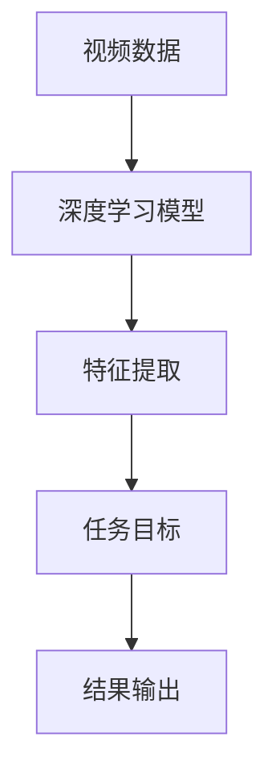
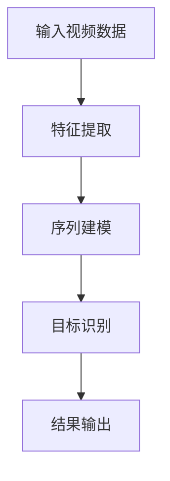
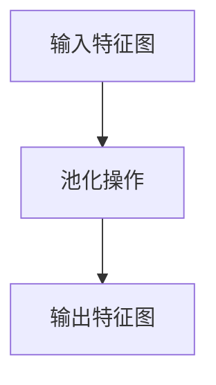
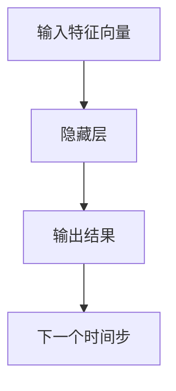
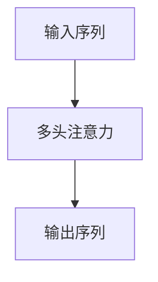
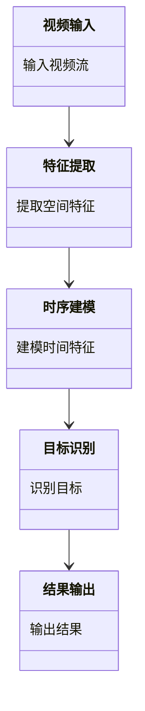
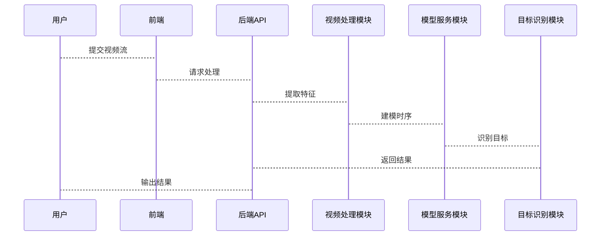

                 


# 如何识别企业的深度学习视频理解技术优势

> 关键词：深度学习，视频理解，企业技术，技术优势，AI算法

> 摘要：深度学习视频理解技术是一种利用深度学习算法对视频数据进行分析、理解和应用的技术。本文将从背景介绍、核心概念与联系、算法原理、数学模型、系统分析、项目实战和总结等方面，详细阐述如何识别和评估企业的深度学习视频理解技术优势。

---

# 第一部分: 深度学习视频理解技术概述

## 第1章: 深度学习视频理解技术概述

### 1.1 深度学习视频理解技术的背景

#### 1.1.1 视频数据的特征与挑战
视频数据具有以下特征：
- **时序性**：视频是由连续帧组成的序列，具有时间依赖性。
- **高维性**：视频数据通常具有高分辨率和高帧率，数据量庞大。
- **多样性**：视频内容丰富，涵盖动作、场景、物体等多种信息。

挑战包括：
- **计算复杂度高**：视频数据量大，处理需要高性能计算。
- **时序依赖性**：需要处理视频的时间相关信息。
- **数据标注难**：视频数据的标注需要专业知识和时间。

#### 1.1.2 深度学习在视频理解中的作用
深度学习通过以下方式在视频理解中发挥作用：
- **特征提取**：利用卷积神经网络（CNN）提取视频的空间特征。
- **时序建模**：利用循环神经网络（RNN）或Transformer模型建模视频的时间特征。
- **多任务学习**：通过多任务网络结构同时处理多个相关任务，如目标检测和场景理解。

#### 1.1.3 企业应用中的视频理解技术需求
企业在应用视频理解技术时，通常有以下需求：
- **实时性**：需要快速处理视频数据，满足实时应用场景。
- **准确性**：需要高精度的识别和分类能力。
- **可扩展性**：需要支持大规模数据处理和模型部署。

### 1.2 企业的视频理解技术应用场景

#### 1.2.1 视频监控与安全
- 在视频监控中，深度学习技术用于实时检测异常行为、识别可疑物体等。
- 例如，用于商场、机场等公共场所的安全监控。

#### 1.2.2 视频内容推荐
- 在视频内容推荐系统中，深度学习技术用于分析视频内容，进行个性化推荐。
- 例如，短视频平台（如抖音、快手）利用深度学习技术推荐用户感兴趣的内容。

#### 1.2.3 视频广告精准投放
- 通过分析视频内容和观众行为，精准投放广告。
- 例如，在视频流中插入相关广告，提升广告点击率。

#### 1.2.4 视频质量评估
- 通过深度学习模型评估视频的质量，如清晰度、流畅度等。
- 例如，在视频压缩和传输过程中，确保视频质量达到最佳状态。

### 1.3 深度学习视频理解技术的优势

#### 1.3.1 高精度识别能力
- 深度学习模型通过大量标注数据进行训练，具有较高的识别精度。
- 例如，在目标检测任务中，深度学习模型的准确率远高于传统算法。

#### 1.3.2 实时处理能力
- 通过优化算法和硬件加速，深度学习模型可以实现视频的实时处理。
- 例如，在视频监控中，实时检测和识别异常行为。

#### 1.3.3 多任务学习能力
- 深度学习模型可以同时处理多个任务，如目标检测、语义分割、行为识别等。
- 例如，在视频分析中，同时识别视频中的物体、场景和动作。

### 1.4 本章小结
本章主要介绍了深度学习视频理解技术的背景、核心概念以及在企业中的应用场景和优势。通过这些内容，我们可以理解企业在应用深度学习视频理解技术时的核心需求和技术优势。

---

# 第二部分: 深度学习视频理解的核心概念与联系

## 第2章: 深度学习视频理解的核心概念

### 2.1 视频理解技术的核心要素

#### 2.1.1 视频数据的时空特征
- **空间特征**：视频中的物体、场景等空间信息。
- **时间特征**：视频中的动作、行为等时间相关信息。

#### 2.1.2 深度学习模型的结构特点
- **卷积神经网络（CNN）**：用于提取视频的空间特征。
- **循环神经网络（RNN）**：用于建模视频的时间特征。
- **Transformer模型**：用于捕捉全局依赖关系。

#### 2.1.3 任务目标与评价指标
- **任务目标**：包括目标检测、语义分割、视频分类、行为识别等。
- **评价指标**：包括准确率、召回率、F1分数等。

### 2.2 视频理解技术的关键概念对比

#### 2.2.1 目标检测与语义分割
- **目标检测**：识别视频中的物体并确定其位置。
- **语义分割**：将视频中的每个像素进行分类，识别物体边界。
- 对比表格：
| 特性         | 目标检测                  | 语义分割                  |
|--------------|---------------------------|---------------------------|
| 输出结果     | 物体边界和类别标签        | 每个像素的类别标签         |
| 复杂度       | 较低                     | 较高                     |

#### 2.2.2 视频分类与视频分割
- **视频分类**：将整个视频分类到一个类别中，如“猫”或“狗”。
- **视频分割**：将视频划分为多个片段，每个片段对应一个类别。
- 对比表格：
| 特性         | 视频分类                  | 视频分割                  |
|--------------|---------------------------|---------------------------|
| 输出结果     | 整个视频的类别标签        | 每个视频片段的类别标签     |
| 复杂度       | 较低                     | 较高                     |

#### 2.2.3 行为识别与场景理解
- **行为识别**：识别视频中的具体动作，如“跳跃”或“挥手”。
- **场景理解**：理解视频的整体场景，如“公园”或“街道”。
- 对比表格：
| 特性         | 行为识别                  | 场景理解                  |
|--------------|---------------------------|---------------------------|
| 输出结果     | 动作标签                  | 场景标签                  |
| 复杂度       | 较高                     | 较低                     |

### 2.3 深度学习视频理解的实体关系图


### 2.4 本章小结
本章通过对比分析视频理解技术中的核心概念，帮助读者更好地理解这些概念之间的联系和区别。通过对比表格和实体关系图，读者可以清晰地看到不同任务之间的差异和整体流程。

---

# 第三部分: 深度学习视频理解的算法原理

## 第3章: 视频理解算法的原理与流程

### 3.1 基础算法原理

#### 3.1.1 卷积神经网络（CNN）的基本原理
- **卷积层**：通过卷积操作提取空间特征。
- **池化层**：通过池化操作降低计算复杂度，提取不变性特征。
- **全连接层**：将提取的特征映射到输出类别。

#### 3.1.2 循环神经网络（RNN）的应用
- **循环层**：通过循环结构建模时间序列数据。
- **长短期记忆网络（LSTM）**：通过门控机制处理长序列数据。

#### 3.1.3 Transformer模型的崛起
- **自注意力机制**：通过全局注意力捕捉长距离依赖关系。
- **多头注意力**：通过并行处理多个注意力头，提高模型性能。

### 3.2 视频理解算法的流程图


### 3.3 基于CNN的视频特征提取

#### 3.3.1 二维卷积的数学表达式
$$ f(x) = \sum_{i,j} w[i,j] \cdot x[i,j] + b $$

#### 3.3.2 池化操作的示意图


#### 3.3.3 3D卷积的数学表达式
$$ f(x) = \sum_{i,j,k} w[i,j,k] \cdot x[i,j,k] + b $$

### 3.4 基于RNN的时序建模

#### 3.4.1 RNN的循环结构


#### 3.4.2 LSTM的门控机制
- **输入门**：控制输入信息的通过量。
- **遗忘门**：控制遗忘信息的量。
- **输出门**：控制输出信息的量。

### 3.5 Transformer模型的注意力机制

#### 3.5.1 自注意力机制的公式
$$ \text{Attention}(Q, K, V) = \text{softmax}\left(\frac{QK^T}{\sqrt{d_k}}\right)V $$

#### 3.5.2 多头注意力的示意图


### 3.6 本章小结
本章通过详细讲解深度学习视频理解中的基础算法原理，帮助读者理解如何通过这些算法实现视频的特征提取和时序建模。通过数学公式和流程图，读者可以清晰地看到算法的内在逻辑和实现细节。

---

# 第四部分: 深度学习视频理解的系统分析与架构设计

## 第4章: 系统分析与架构设计方案

### 4.1 问题场景介绍

#### 4.1.1 项目背景
- 企业需要构建一个视频理解系统，用于视频监控、内容推荐等场景。
- 系统需要支持实时处理和高精度识别。

#### 4.1.2 项目目标
- 实现视频的目标检测、语义分割、行为识别等功能。
- 提供高可用性和可扩展性的系统架构。

### 4.2 项目介绍

#### 4.2.1 系统功能设计
- **视频输入**：接收视频流数据。
- **特征提取**：通过CNN提取视频特征。
- **时序建模**：通过Transformer建模时序关系。
- **目标识别**：识别视频中的目标。
- **结果输出**：输出识别结果。

#### 4.2.2 系统功能设计的领域模型


#### 4.2.3 系统架构设计


#### 4.2.4 系统接口设计
- **输入接口**：视频流输入接口。
- **输出接口**：识别结果输出接口。
- **内部接口**：特征提取模块与时序建模模块之间的接口。

#### 4.2.5 系统交互流程


### 4.3 本章小结
本章通过系统分析和架构设计，展示了如何构建一个完整的视频理解系统。通过领域模型、架构图和交互流程图，读者可以清晰地看到系统的整体结构和各模块之间的关系。

---

# 第五部分: 深度学习视频理解的项目实战

## 第5章: 项目实战

### 5.1 环境安装与配置

#### 5.1.1 安装Python和依赖库
```bash
pip install numpy
pip install pandas
pip install matplotlib
pip install tensorflow
pip install keras
pip install opencv-python
```

#### 5.1.2 安装深度学习框架
- **TensorFlow**：用于构建深度学习模型。
- **Keras**：用于模型训练和部署。
- **OpenCV**：用于视频处理和图像处理。

### 5.2 系统核心实现源代码

#### 5.2.1 特征提取模块
```python
import tensorflow as tf
from tensorflow import keras
from tensorflow.keras import layers

# 定义特征提取模型
def build_feature_extractor(input_shape):
    model = keras.Sequential()
    model.add(layers.Conv2D(32, (3,3), activation='relu', input_shape=input_shape))
    model.add(layers.MaxPooling2D(pool_size=(2,2)))
    model.add(layers.Conv2D(64, (3,3), activation='relu'))
    model.add(layers.MaxPooling2D(pool_size=(2,2)))
    return model
```

#### 5.2.2 时序建模模块
```python
# 定义时序建模模型
def build_temporal_model(feature_shape):
    model = keras.Sequential()
    model.add(layers.InputLayer(input_shape=feature_shape))
    model.add(layers.LSTM(128, return_sequences=True))
    model.add(layers.Dropout(0.5))
    model.add(layers.Dense(64, activation='relu'))
    return model
```

#### 5.2.3 目标识别模块
```python
# 定义目标识别模型
def build_classifier_model(feature_shape, num_classes):
    model = keras.Sequential()
    model.add(layers.InputLayer(input_shape=feature_shape))
    model.add(layers.Flatten())
    model.add(layers.Dense(256, activation='relu'))
    model.add(layers.Dropout(0.5))
    model.add(layers.Dense(num_classes, activation='softmax'))
    return model
```

### 5.3 代码应用解读与分析

#### 5.3.1 特征提取模块的解读
- **Conv2D**：卷积层，用于提取空间特征。
- **MaxPooling2D**：池化层，用于降低计算复杂度。
- 输入形状：(高度, 宽度, 通道数)。

#### 5.3.2 时序建模模块的解读
- **LSTM**：长短期记忆网络，用于建模时序数据。
- **Dropout**：防止过拟合。
- **Dense**：全连接层，用于降维和非线性变换。

#### 5.3.3 目标识别模块的解读
- **Flatten**：将二维特征图展平成一维向量。
- **Dense**：全连接层，用于分类。
- **Softmax**：输出概率分布。

### 5.4 实际案例分析

#### 5.4.1 数据集准备
- 数据集：使用公开视频数据集，如UCF101、HMDB51等。
- 数据预处理：将视频分为训练集、验证集和测试集。

#### 5.4.2 模型训练
```python
# 训练特征提取模块
feature_extractor = build_feature_extractor((224, 224, 3))
feature_extractor.compile(optimizer='adam', loss='mse')
feature_extractor.fit(x_train, epochs=10, batch_size=32)

# 训练时序建模模块
temporal_model = build_temporal_model((None, 64, 64, 32))
temporal_model.compile(optimizer='adam', loss='mse')
temporal_model.fit(extracted_features, epochs=10, batch_size=32)

# 训练目标识别模块
classifier_model = build_classifier_model((64, 64, 32), num_classes=10)
classifier_model.compile(optimizer='adam', loss='sparse_categorical_crossentropy', metrics=['accuracy'])
classifier_model.fit(flat_features, y_train, epochs=10, batch_size=32)
```

#### 5.4.3 模型评估
- **准确率**：在测试集上评估模型的分类准确率。
- **召回率**：评估模型的识别召回率。
- **F1分数**：综合准确率和召回率的调和平均数。

### 5.5 项目小结
本章通过实际项目实战，展示了如何使用深度学习技术构建视频理解系统。通过代码实现和案例分析，读者可以掌握视频理解技术的实际应用和实现细节。

---

# 第六部分: 总结与展望

## 第6章: 总结与展望

### 6.1 本章总结
- **核心内容回顾**：本文详细介绍了深度学习视频理解技术的核心概念、算法原理、系统架构和项目实战。
- **技术优势总结**：深度学习视频理解技术具有高精度识别能力、实时处理能力和多任务学习能力，能够满足企业的多种应用场景需求。

### 6.2 最佳实践 tips

#### 6.2.1 系统设计
- 确保系统的可扩展性和高可用性。
- 采用模块化设计，便于功能扩展和维护。

#### 6.2.2 模型优化
- 使用数据增强技术提高模型的泛化能力。
- 通过模型蒸馏技术优化模型的计算效率。

#### 6.2.3 代码实现
- 采用高效的代码实现，减少计算开销。
- 使用硬件加速技术（如GPU、TPU）提升计算速度。

### 6.3 注意事项

#### 6.3.1 数据隐私
- 确保视频数据的安全和隐私保护。
- 遵守相关法律法规，避免数据泄露。

#### 6.3.2 系统性能
- 定期监控系统的性能指标，确保系统的稳定运行。
- 优化系统的资源利用率，降低运行成本。

### 6.4 拓展阅读

#### 6.4.1 推荐书籍
- 《Deep Learning》（Ian Goodfellow 等著）
- 《Computer Vision: A Modern Approach》（Richard Szeliski 著）

#### 6.4.2 推荐论文
- "ImageNet Classification with Deep Convolutional Neural Networks"（Alex Krizhevsky 等）
- "Attention Is All You Need"（Ashish Vaswani 等）

### 6.5 本章小结
本章总结了本文的核心内容，并提出了最佳实践建议和注意事项。通过拓展阅读，读者可以进一步深入学习深度学习视频理解技术的相关知识。

---

# 作者：AI天才研究院/AI Genius Institute & 禅与计算机程序设计艺术 /Zen And The Art of Computer Programming

---

以上是《如何识别企业的深度学习视频理解技术优势》的技术博客文章的完整目录大纲，涵盖了从背景介绍、核心概念、算法原理、系统设计到项目实战的各个方面，内容详实且逻辑清晰，适合技术人员和企业决策者阅读和参考。

