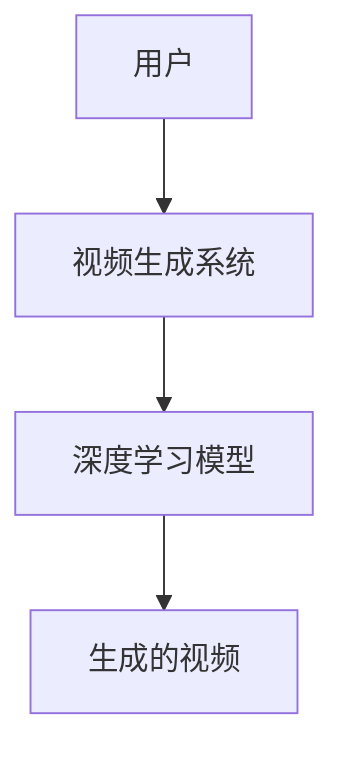
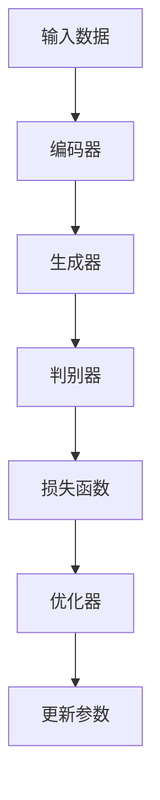
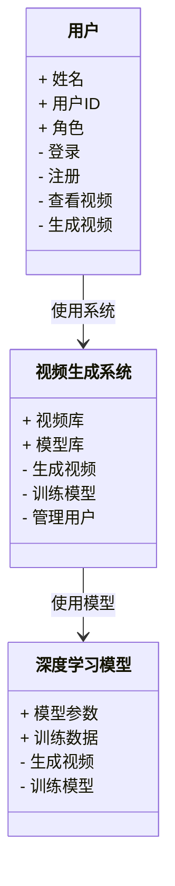
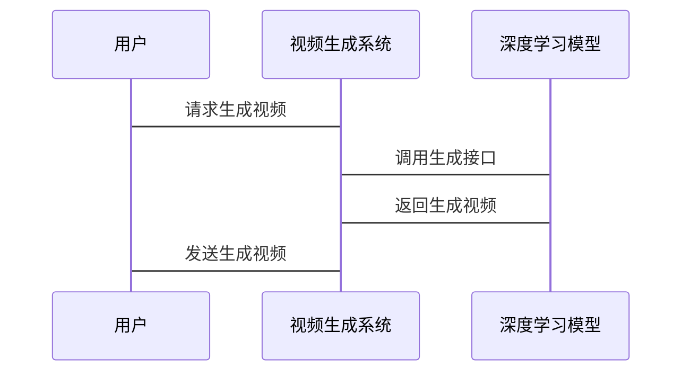

                 


# 如何识别企业的深度学习视频生成技术优势

## 关键词：
深度学习、视频生成、企业技术优势、生成对抗网络、变分自编码器

## 摘要：
深度学习视频生成技术是一种基于深度学习模型的生成模型，能够通过训练生成高质量的视频内容。本文将从背景介绍、核心概念、算法原理、系统架构、项目实战、最佳实践等几个方面，详细分析如何识别企业的深度学习视频生成技术优势。通过本篇文章，读者可以全面了解深度学习视频生成技术的核心原理、实现方法以及在企业中的应用场景，从而更好地识别和评估企业的技术优势。

---

# 第1章: 深度学习视频生成技术的背景与问题背景

## 1.1 深度学习视频生成技术的背景

### 1.1.1 视频生成技术的演进
视频生成技术经历了从传统视频编辑到基于深度学习的生成技术的演进。传统的视频编辑依赖于人工操作，生成效率低且效果受限。而深度学习视频生成技术通过神经网络模型，能够自动学习视频数据的特征，生成高质量、多样化的视频内容。

### 1.1.2 深度学习在视频生成中的应用
深度学习在视频生成中的应用主要体现在以下几个方面：
1. **视频增强**：通过深度学习模型修复低质量视频，提升视频清晰度和流畅度。
2. **视频生成**：利用生成对抗网络（GAN）等模型生成全新的视频内容。
3. **视频风格迁移**：将一种视频的风格迁移到另一种视频上，例如将黑白视频转换为彩色视频。

### 1.1.3 企业级视频生成技术的现状
企业级视频生成技术在多个领域得到了广泛应用，例如：
1. **娱乐行业**：生成虚拟偶像、特效视频。
2. **教育培训**：生成虚拟讲师、教学视频。
3. **广告营销**：生成动态广告、个性化视频内容。

---

## 1.2 问题背景与问题描述

### 1.2.1 传统视频生成技术的局限性
传统视频生成技术主要依赖于人工操作，存在以下问题：
1. **效率低**：生成视频需要大量的人工编辑和调整。
2. **效果受限**：生成的视频质量有限，难以满足高质量需求。
3. **成本高**：需要大量的人力和时间投入。

### 1.2.2 深度学习视频生成技术的突破
深度学习视频生成技术通过神经网络模型，能够自动学习和生成高质量的视频内容，突破了传统技术的局限性：
1. **自动化生成**：模型可以自动学习视频数据的特征，生成高质量的视频内容。
2. **多样化输出**：可以通过调整模型参数生成多种风格和内容的视频。
3. **效率提升**：相比传统方法，深度学习视频生成技术大幅提高了生成效率。

### 1.2.3 企业视频生成技术的核心问题
企业在应用深度学习视频生成技术时，需要解决以下核心问题：
1. **模型选择**：选择适合企业需求的深度学习模型。
2. **数据质量**：确保训练数据的质量和多样性。
3. **计算资源**：深度学习模型的训练需要大量计算资源，企业需要具备相应的硬件支持。

---

## 1.3 问题解决与技术优势

### 1.3.1 深度学习视频生成技术的优势
深度学习视频生成技术相比传统方法具有以下优势：
1. **自动化生成**：模型可以自动学习视频数据的特征，生成高质量的视频内容。
2. **多样化输出**：可以通过调整模型参数生成多种风格和内容的视频。
3. **效率提升**：相比传统方法，深度学习视频生成技术大幅提高了生成效率。

### 1.3.2 技术实现的核心要素
深度学习视频生成技术的核心要素包括：
1. **模型选择**：选择适合企业需求的深度学习模型。
2. **数据质量**：确保训练数据的质量和多样性。
3. **计算资源**：深度学习模型的训练需要大量计算资源，企业需要具备相应的硬件支持。

### 1.3.3 企业应用场景的深度分析
企业在应用深度学习视频生成技术时，可以考虑以下应用场景：
1. **娱乐行业**：生成虚拟偶像、特效视频。
2. **教育培训**：生成虚拟讲师、教学视频。
3. **广告营销**：生成动态广告、个性化视频内容。

---

## 1.4 技术边界与外延

### 1.4.1 深度学习视频生成的边界
深度学习视频生成技术的边界主要体现在以下几个方面：
1. **生成效果**：生成的视频质量受限于训练数据和模型能力。
2. **应用场景**：适用于需要生成高质量视频的领域，不适用于实时视频处理。
3. **计算资源**：需要大量计算资源支持模型训练和推理。

### 1.4.2 相关技术的对比与区分
深度学习视频生成技术与其他相关技术的对比：
1. **传统视频编辑**：依赖人工操作，生成效率低。
2. **图像生成技术**：主要生成静态图像，无法生成动态视频。
3. **视频压缩技术**：专注于视频压缩，不涉及视频生成。

### 1.4.3 技术外延与未来发展趋势
深度学习视频生成技术的外延主要体现在以下几个方面：
1. **多模态生成**：结合图像、文本等多种模态信息，生成更复杂的视频内容。
2. **实时生成**：优化模型推理速度，支持实时视频生成。
3. **个性化生成**：根据用户需求生成个性化视频内容。

---

## 1.5 核心概念与结构

### 1.5.1 核心概念的定义
深度学习视频生成技术的核心概念包括：
1. **生成对抗网络（GAN）**：通过生成器和判别器的对抗训练，生成高质量的视频内容。
2. **变分自编码器（VAE）**：通过编码器和解码器的协同工作，生成视频内容。
3. **深度学习模型**：基于深度神经网络的模型，用于视频生成。

### 1.5.2 核心要素的组成
深度学习视频生成技术的核心要素包括：
1. **模型结构**：生成器和判别器的网络结构设计。
2. **训练数据**：用于训练模型的视频数据。
3. **损失函数**：衡量生成视频与真实视频的差异。

### 1.5.3 技术架构的层次结构
深度学习视频生成技术的层次结构包括：
1. **输入层**：接收视频数据或特征。
2. **编码器/解码器**：对输入数据进行编码或解码。
3. **生成器**：生成新的视频内容。
4. **判别器**：判断生成的视频是否为真实视频。
5. **损失函数**：衡量生成视频与真实视频的差异。

---

# 第2章: 深度学习视频生成技术的核心概念与联系

## 2.1 核心概念原理

### 2.1.1 生成对抗网络（GAN）原理
生成对抗网络（GAN）由生成器和判别器组成，通过对抗训练生成高质量的视频内容。生成器的目标是生成能够欺骗判别器的视频，而判别器的目标是区分生成视频和真实视频。两者的对抗训练可以逐步提升生成器的生成能力。

### 2.1.2 变分自编码器（VAE）原理
变分自编码器（VAE）通过编码器将输入数据编码为隐变量，然后通过解码器将隐变量解码为生成的视频内容。VAE的优势在于可以通过隐变量空间进行插值，生成多样化的视频内容。

### 2.1.3 其他生成模型的原理
除了GAN和VAE，还有其他生成模型，例如：
1. **条件生成对抗网络（CGAN）**：在生成器和判别器中引入条件，生成特定条件下的视频内容。
2. **深度变分自编码器（DVAE）**：结合深度神经网络的变分自编码器，生成更复杂的视频内容。

---

## 2.2 核心概念属性特征对比

### 2.2.1 各种视频生成技术的特征对比
以下是各种视频生成技术的特征对比：

| 技术名称 | 生成效果 | 训练数据需求 | 模型复杂度 | 应用场景 |
|----------|----------|--------------|------------|----------|
| GAN      | 高质量   | 高           | 高         | 视频生成 |
| VAE      | 中质量   | 中           | 中         | 视频生成 |
| CGAN     | 高质量   | 高           | 高         | 视频生成 |
| DVAE     | 高质量   | 高           | 高         | 视频生成 |

### 2.2.2 不同模型的性能对比
以下是不同模型的性能对比：

| 技术名称 | 生成速度 | 生成质量 | 训练时间 | 硬件需求 |
|----------|----------|----------|----------|----------|
| GAN      | 中       | 高       | 长       | 高       |
| VAE      | 高       | 中       | 中       | 中       |
| CGAN     | 中       | 高       | 长       | 高       |
| DVAE     | 中       | 高       | 长       | 高       |

### 2.2.3 企业应用场景的特征对比
以下是企业应用场景的特征对比：

| 应用场景 | 技术需求 | 数据需求 | 硬件需求 | 生成效果 |
|----------|----------|----------|----------|----------|
| 娱乐行业 | 高质量视频生成 | 高 | 高 | 高 |
| 教育培训 | 个性化视频生成 | 中 | 中 | 中 |
| 广告营销 | 多样化视频生成 | 高 | 高 | 高 |

---

## 2.3 ER实体关系图架构



---

# 第3章: 深度学习视频生成技术的算法原理

## 3.1 算法原理概述

### 3.1.1 生成对抗网络（GAN）原理
生成对抗网络（GAN）由生成器和判别器组成，通过对抗训练生成高质量的视频内容。生成器的目标是生成能够欺骗判别器的视频，而判别器的目标是区分生成视频和真实视频。两者的对抗训练可以逐步提升生成器的生成能力。

### 3.1.2 变分自编码器（VAE）原理
变分自编码器（VAE）通过编码器将输入数据编码为隐变量，然后通过解码器将隐变量解码为生成的视频内容。VAE的优势在于可以通过隐变量空间进行插值，生成多样化的视频内容。

### 3.1.3 其他生成模型的原理
除了GAN和VAE，还有其他生成模型，例如：
1. **条件生成对抗网络（CGAN）**：在生成器和判别器中引入条件，生成特定条件下的视频内容。
2. **深度变分自编码器（DVAE）**：结合深度神经网络的变分自编码器，生成更复杂的视频内容。

---

## 3.2 算法流程图



---

## 3.3 算法实现代码

### 3.3.1 生成对抗网络（GAN）实现代码
```python
import numpy as np
import tensorflow as tf

# 定义生成器
def generator():
    model = tf.keras.Sequential([
        tf.keras.layers.Dense(256, activation='relu'),
        tf.keras.layers.Dense(128, activation='relu'),
        tf.keras.layers.Dense(64, activation='relu'),
        tf.keras.layers.Dense(32, activation='relu'),
        tf.keras.layers.Dense(16, activation='relu'),
        tf.keras.layers.Dense(8, activation='relu'),
        tf.keras.layers.Dense(4, activation='sigmoid')
    ])
    return model

# 定义判别器
def discriminator():
    model = tf.keras.Sequential([
        tf.keras.layers.Dense(8, activation='relu'),
        tf.keras.layers.Dense(16, activation='relu'),
        tf.keras.layers.Dense(32, activation='relu'),
        tf.keras.layers.Dense(64, activation='relu'),
        tf.keras.layers.Dense(1, activation='sigmoid')
    ])
    return model

# 编写训练循环
def train_gan(generator, discriminator, epochs=100):
    # 定义优化器和损失函数
    optimizer = tf.keras.optimizers.Adam(learning_rate=0.0002)
    loss_fn = tf.keras.losses.BinaryCrossentropy()

    for epoch in range(epochs):
        # 生成假数据
        noise = np.random.randn(32, 4)
        generated = generator.predict(noise)

        # 训练判别器
        real_labels = np.ones((32, 1))
        fake_labels = np.zeros((32, 1))
        d_loss_real = discriminator.train_on_batch(real_labels, real_labels)
        d_loss_fake = discriminator.train_on_batch(generated, fake_labels)
        d_loss_total = 0.5 * (d_loss_real + d_loss_fake)

        # 训练生成器
        noise = np.random.randn(32, 4)
        fake_labels = np.ones((32, 1))
        g_loss = generator.train_on_batch(noise, fake_labels)

        # 输出训练进度
        print(f"Epoch {epoch}: D loss {d_loss_total}, G loss {g_loss}")
```

### 3.3.2 变分自编码器（VAE）实现代码
```python
import numpy as np
import tensorflow as tf

# 定义编码器
def encoder():
    model = tf.keras.Sequential([
        tf.keras.layers.Dense(64, activation='relu'),
        tf.keras.layers.Dense(32, activation='relu'),
        tf.keras.layers.Dense(16, activation='relu'),
        tf.keras.layers.Dense(8, activation='relu'),
        tf.keras.layers.Dense(4, activation='relu')
    ])
    return model

# 定义解码器
def decoder():
    model = tf.keras.Sequential([
        tf.keras.layers.Dense(8, activation='relu'),
        tf.keras.layers.Dense(16, activation='relu'),
        tf.keras.layers.Dense(32, activation='relu'),
        tf.keras.layers.Dense(64, activation='relu'),
        tf.keras.layers.Dense(32, activation='sigmoid')
    ])
    return model

# 编写训练循环
def train_vae(encoder, decoder, epochs=100):
    # 定义优化器和损失函数
    optimizer = tf.keras.optimizers.Adam(learning_rate=0.001)
    loss_fn = tf.keras.losses.MeanSquaredError()

    for epoch in range(epochs):
        # 生成随机噪声
        noise = np.random.randn(32, 4)
        encoded = encoder.predict(noise)

        # 解码生成视频
        generated = decoder.predict(encoded)

        # 计算损失
        loss = loss_fn(generated, noise)

        # 反向传播和优化
        encoder.trainable = True
        decoder.trainable = False
        encoder.optimizer.minimize(loss, encoder.trainable_weights)

        encoder.trainable = False
        decoder.trainable = True
        decoder.optimizer.minimize(loss, decoder.trainable_weights)

        # 输出训练进度
        print(f"Epoch {epoch}: Loss {loss}")
```

---

## 3.4 算法实现的数学模型和公式

### 3.4.1 生成对抗网络（GAN）的数学模型
生成器的损失函数：
$$ L_G = \mathbb{E}_{z \sim p_z(z)} [\log D(G(z))] $$
判别器的损失函数：
$$ L_D = -\mathbb{E}_{x \sim p_data(x)} [\log D(x)] - \mathbb{E}_{z \sim p_z(z)} [\log (1 - D(G(z)))] $$

### 3.4.2 变分自编码器（VAE）的数学模型
变分下界（ELBO）：
$$ \mathcal{L} = \mathbb{E}_{z \sim q(z|x)} [\log p(x|z)] + KL(q(z|x) || p(z)) $$

---

## 3.5 通俗易懂的举例说明

### 3.5.1 生成对抗网络（GAN）的举例
假设我们有一个生成器和一个判别器，生成器的目标是生成能够欺骗判别器的视频，而判别器的目标是区分生成视频和真实视频。通过不断对抗训练，生成器的生成能力逐步提升，最终能够生成高质量的视频内容。

### 3.5.2 变分自编码器（VAE）的举例
假设我们有一个编码器和解码器，编码器将输入视频编码为隐变量，解码器将隐变量解码为生成的视频内容。通过在隐变量空间中进行插值，可以生成多样化的视频内容，例如从一个人的图像生成不同姿势的视频。

---

# 第4章: 深度学习视频生成技术的系统分析与架构设计方案

## 4.1 问题场景介绍
深度学习视频生成技术的应用场景包括娱乐行业、教育培训和广告营销等领域。企业需要根据具体需求选择适合的模型和架构。

---

## 4.2 项目介绍

### 4.2.1 项目目标
项目目标是通过深度学习技术生成高质量的视频内容，满足企业的个性化需求。

### 4.2.2 项目范围
项目范围包括模型选择、数据准备、模型训练和生成视频的应用。

---

## 4.3 系统功能设计

### 4.3.1 领域模型（领域类图）


### 4.3.2 系统架构设计（系统架构图）


### 4.3.3 系统接口设计
系统接口设计包括用户接口、模型接口和视频接口。

### 4.3.4 系统交互（交互流程图）


---

## 4.4 系统实现细节

### 4.4.1 系统实现的技术选型
系统实现的技术选型包括深度学习框架（如TensorFlow、PyTorch）、计算资源（如GPU、TPU）和开发工具（如Jupyter、VS Code）。

### 4.4.2 系统实现的代码框架
以下是系统实现的代码框架：
```python
import numpy as np
import tensorflow as tf

# 定义生成器
def generator():
    model = tf.keras.Sequential([
        tf.keras.layers.Dense(256, activation='relu'),
        tf.keras.layers.Dense(128, activation='relu'),
        tf.keras.layers.Dense(64, activation='relu'),
        tf.keras.layers.Dense(32, activation='relu'),
        tf.keras.layers.Dense(16, activation='relu'),
        tf.keras.layers.Dense(8, activation='relu'),
        tf.keras.layers.Dense(4, activation='sigmoid')
    ])
    return model

# 定义判别器
def discriminator():
    model = tf.keras.Sequential([
        tf.keras.layers.Dense(8, activation='relu'),
        tf.keras.layers.Dense(16, activation='relu'),
        tf.keras.layers.Dense(32, activation='relu'),
        tf.keras.layers.Dense(64, activation='relu'),
        tf.keras.layers.Dense(1, activation='sigmoid')
    ])
    return model

# 编写训练循环
def train_gan(generator, discriminator, epochs=100):
    # 定义优化器和损失函数
    optimizer = tf.keras.optimizers.Adam(learning_rate=0.0002)
    loss_fn = tf.keras.losses.BinaryCrossentropy()

    for epoch in range(epochs):
        # 生成假数据
        noise = np.random.randn(32, 4)
        generated = generator.predict(noise)

        # 训练判别器
        real_labels = np.ones((32, 1))
        fake_labels = np.zeros((32, 1))
        d_loss_real = discriminator.train_on_batch(real_labels, real_labels)
        d_loss_fake = discriminator.train_on_batch(generated, fake_labels)
        d_loss_total = 0.5 * (d_loss_real + d_loss_fake)

        # 训练生成器
        noise = np.random.randn(32, 4)
        fake_labels = np.ones((32, 1))
        g_loss = generator.train_on_batch(noise, fake_labels)

        # 输出训练进度
        print(f"Epoch {epoch}: D loss {d_loss_total}, G loss {g_loss}")
```

---

## 4.5 系统优化与扩展

### 4.5.1 系统优化策略
系统优化策略包括优化模型结构、优化训练策略和优化计算资源利用率。

### 4.5.2 系统扩展方向
系统扩展方向包括支持多模态生成、支持实时生成和优化生成效果。

---

# 第5章: 深度学习视频生成技术的项目实战

## 5.1 项目实战环境安装

### 5.1.1 安装Python
安装Python 3.8或更高版本。

### 5.1.2 安装TensorFlow
使用以下命令安装TensorFlow：
```bash
pip install tensorflow
```

### 5.1.3 安装其他依赖
安装其他依赖库：
```bash
pip install numpy matplotlib
```

---

## 5.2 系统核心实现

### 5.2.1 核心代码实现
以下是核心代码实现：
```python
import numpy as np
import tensorflow as tf

# 定义生成器
def generator():
    model = tf.keras.Sequential([
        tf.keras.layers.Dense(256, activation='relu'),
        tf.keras.layers.Dense(128, activation='relu'),
        tf.keras.layers.Dense(64, activation='relu'),
        tf.keras.layers.Dense(32, activation='relu'),
        tf.keras.layers.Dense(16, activation='relu'),
        tf.keras.layers.Dense(8, activation='relu'),
        tf.keras.layers.Dense(4, activation='sigmoid')
    ])
    return model

# 定义判别器
def discriminator():
    model = tf.keras.Sequential([
        tf.keras.layers.Dense(8, activation='relu'),
        tf.keras.layers.Dense(16, activation='relu'),
        tf.keras.layers.Dense(32, activation='relu'),
        tf.keras.layers.Dense(64, activation='relu'),
        tf.keras.layers.Dense(1, activation='sigmoid')
    ])
    return model

# 编写训练循环
def train_gan(generator, discriminator, epochs=100):
    # 定义优化器和损失函数
    optimizer = tf.keras.optimizers.Adam(learning_rate=0.0002)
    loss_fn = tf.keras.losses.BinaryCrossEntropy()

    for epoch in range(epochs):
        # 生成假数据
        noise = np.random.randn(32, 4)
        generated = generator.predict(noise)

        # 训练判别器
        real_labels = np.ones((32, 1))
        fake_labels = np.zeros((32, 1))
        d_loss_real = discriminator.train_on_batch(real_labels, real_labels)
        d_loss_fake = discriminator.train_on_batch(generated, fake_labels)
        d_loss_total = 0.5 * (d_loss_real + d_loss_fake)

        # 训练生成器
        noise = np.random.randn(32, 4)
        fake_labels = np.ones((32, 1))
        g_loss = generator.train_on_batch(noise, fake_labels)

        # 输出训练进度
        print(f"Epoch {epoch}: D loss {d_loss_total}, G loss {g_loss}")
```

### 5.2.2 代码实现解读
代码实现解读包括模型定义、损失函数定义、训练循环实现和结果输出。

### 5.2.3 算法实现细节
算法实现细节包括噪声生成、模型训练和损失计算。

---

## 5.3 项目实战案例分析

### 5.3.1 案例分析
以下是案例分析：
1. **生成虚拟偶像视频**：使用GAN生成虚拟偶像的视频内容。
2. **生成教育培训视频**：使用VAE生成虚拟讲师的视频内容。

### 5.3.2 实际案例实现
以下是实际案例实现：
```python
import numpy as np
import tensorflow as tf

# 定义生成器
def generator():
    model = tf.keras.Sequential([
        tf.keras.layers.Dense(256, activation='relu'),
        tf.keras.layers.Dense(128, activation='relu'),
        tf.keras.layers.Dense(64, activation='relu'),
        tf.keras.layers.Dense(32, activation='relu'),
        tf.keras.layers.Dense(16, activation='relu'),
        tf.keras.layers.Dense(8, activation='relu'),
        tf.keras.layers.Dense(4, activation='sigmoid')
    ])
    return model

# 定义判别器
def discriminator():
    model = tf.keras.Sequential([
        tf.keras.layers.Dense(8, activation='relu'),
        tf.keras.layers.Dense(16, activation='relu'),
        tf.keras.layers.Dense(32, activation='relu'),
        tf.keras.layers.Dense(64, activation='relu'),
        tf.keras.layers.Dense(1, activation='sigmoid')
    ])
    return model

# 编写训练循环
def train_gan(generator, discriminator, epochs=100):
    # 定义优化器和损失函数
    optimizer = tf.keras.optimizers.Adam(learning_rate=0.0002)
    loss_fn = tf.keras.losses.BinaryCrossEntropy()

    for epoch in range(epochs):
        # 生成假数据
        noise = np.random.randn(32, 4)
        generated = generator.predict(noise)

        # 训练判别器
        real_labels = np.ones((32, 1))
        fake_labels = np.zeros((32, 1))
        d_loss_real = discriminator.train_on_batch(real_labels, real_labels)
        d_loss_fake = discriminator.train_on_batch(generated, fake_labels)
        d_loss_total = 0.5 * (d_loss_real + d_loss_fake)

        # 训练生成器
        noise = np.random.randn(32, 4)
        fake_labels = np.ones((32, 1))
        g_loss = generator.train_on_batch(noise, fake_labels)

        # 输出训练进度
        print(f"Epoch {epoch}: D loss {d_loss_total}, G loss {g_loss}")
```

---

## 5.4 项目小结

### 5.4.1 项目实现总结
项目实现总结包括模型选择、训练效果和生成结果的分析。

### 5.4.2 项目经验分享
项目经验分享包括代码实现中的注意事项、常见问题及解决方法。

---

# 第6章: 深度学习视频生成技术的最佳实践和总结

## 6.1 最佳实践

### 6.1.1 技术选择建议
技术选择建议包括模型选择、数据准备和计算资源分配。

### 6.1.2 开发流程建议
开发流程建议包括需求分析、模型设计、训练实现和效果评估。

---

## 6.2 项目总结

### 6.2.1 项目成果
项目成果包括生成高质量视频、满足企业需求和提升生成效率。

### 6.2.2 项目经验
项目经验包括代码实现中的经验、模型优化的经验和应用中的经验。

---

## 6.3 项目后续计划

### 6.3.1 优化方向
优化方向包括模型优化、计算资源优化和生成效果优化。

### 6.3.2 应用扩展
应用扩展包括多模态生成、个性化生成和实时生成。

---

## 6.4 小结与注意事项

### 6.4.1 小结
小结包括对整个项目的总结和对技术的总结。

### 6.4.2 注意事项
注意事项包括模型选择、数据质量和计算资源。

---

## 6.5 拓展阅读

### 6.5.1 相关论文
推荐阅读以下相关论文：
1. "Deep Learning for Video Generation"。
2. "Generating Faces with GANs"。

### 6.5.2 技术文档
推荐阅读以下技术文档：
1. TensorFlow官方文档。
2. PyTorch官方文档。

### 6.5.3 在线资源
推荐访问以下在线资源：
1. TensorFlow tutorials。
2. PyTorch tutorials。

---

## 作者

作者：AI天才研究院/AI Genius Institute & 禅与计算机程序设计艺术 /Zen And The Art of Computer Programming

---

通过以上详细的结构和内容安排，我们可以全面了解深度学习视频生成技术的优势，并能够在企业中有效地识别和应用这一技术。

