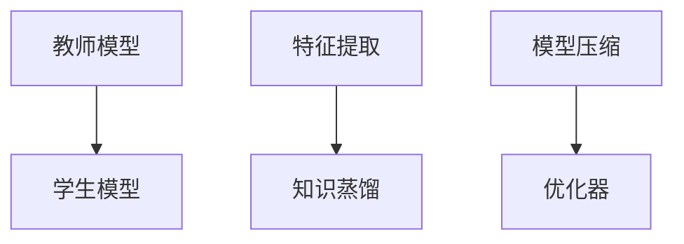
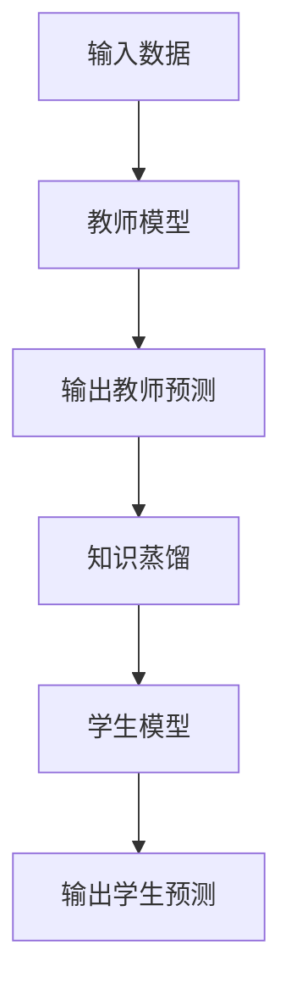

                 


# 如何识别企业的神经网络模型蒸馏技术优势

## 关键词：神经网络模型蒸馏技术、模型压缩、知识蒸馏、模型优化、企业应用

## 摘要：  
神经网络模型蒸馏技术是一种将复杂模型的知识迁移到更简单模型的技术，能够在保持性能的同时减少计算资源的消耗。本文将从背景、原理、算法、系统架构到项目实战，全面解析神经网络模型蒸馏技术的核心优势，并通过实际案例分析，帮助读者识别和应用这一技术的优势。

---

## 目录大纲：如何识别企业的神经网络模型蒸馏技术优势

### 第一部分：神经网络模型蒸馏技术的背景与概念

#### 第1章：神经网络模型蒸馏技术的起源与发展

##### 1.1 神经网络模型蒸馏技术的起源
- 1.1.1 神经网络模型蒸馏技术的定义  
- 1.1.2 神经网络模型蒸馏技术的发展历程  
- 1.1.3 神经网络模型蒸馏技术的核心思想  

##### 1.2 神经网络模型蒸馏技术在企业中的应用价值  
- 1.2.1 提高模型效率  
- 1.2.2 降低计算成本  
- 1.2.3 优化模型性能  

##### 1.3 神经网络模型蒸馏技术与其他技术的关系  
- 1.3.1 神经网络模型蒸馏技术与知识蒸馏  
- 1.3.2 神经网络模型蒸馏技术与模型压缩  
- 1.3.3 神经网络模型蒸馏技术与模型优化  

---

### 第二部分：神经网络模型蒸馏技术的核心概念与联系

#### 第2章：神经网络模型蒸馏技术的核心概念

##### 2.1 神经网络模型蒸馏技术的原理  
- 2.1.1 知识蒸馏的基本原理  
- 2.1.2 模型压缩的技术手段  
- 2.1.3 模型优化的数学基础  

##### 2.2 神经网络模型蒸馏技术的属性特征对比  
- 2.2.1 不同蒸馏技术的特征对比  
- 2.2.2 模型压缩算法的性能对比  
- 2.2.3 不同蒸馏方法的优缺点分析  

##### 2.3 神经网络模型蒸馏技术的ER实体关系图  


---

### 第三部分：神经网络模型蒸馏技术的算法原理

#### 第3章：神经网络模型蒸馏技术的算法流程

##### 3.1 神经网络模型蒸馏技术的数学模型  
- 3.1.1 知识蒸馏的损失函数  
  $$L = \alpha L_{cls} + (1-\alpha)L_{dist}$$  
  其中，$L_{cls}$ 是分类损失，$L_{dist}$ 是蒸馏损失，$\alpha$ 是平衡系数。  

##### 3.2 神经网络模型蒸馏技术的算法实现  
```python
import torch
import torch.nn as nn
import torch.optim as optim

# 教师模型
class TeacherModel(nn.Module):
    def __init__(self):
        super(TeacherModel, self).__init__()
        self.fc = nn.Linear(784, 10)
    
    def forward(self, x):
        x = x.view(-1, 784)
        output = self.fc(x)
        return output

# 学生模型
class StudentModel(nn.Module):
    def __init__(self):
        super(StudentModel, self).__init__()
        self.fc = nn.Linear(784, 10)
    
    def forward(self, x):
        x = x.view(-1, 784)
        output = self.fc(x)
        return output

# 蒸馏训练
def distillation_train(teachers, students, dataloaders, criterion, optimizer):
    for epoch in range(num_epochs):
        for inputs, labels in dataloaders:
            teachers.eval()
            with torch.no_grad():
                teacher_outputs = teachers(inputs)
            students.train()
            student_outputs = students(inputs)
            
            # 计算蒸馏损失
            distillation_loss = criterion(student_outputs, teacher_outputs)
            total_loss = criterion(student_outputs, labels) + distillation_loss
            
            optimizer.zero_grad()
            total_loss.backward()
            optimizer.step()
```

##### 3.3 神经网络模型蒸馏技术的流程图  


---

### 第四部分：神经网络模型蒸馏技术的系统架构设计

#### 第4章：神经网络模型蒸馏技术的系统分析与架构设计方案

##### 4.1 系统功能设计
- 4.1.1 系统模块划分  
  ```mermaid
  graph TD
      A[数据预处理] --> B[模型训练]
      B --> C[模型蒸馏]
      C --> D[模型部署]
  ```

- 4.1.2 系统功能流程  
  ```mermaid
  graph TD
      A[输入数据] --> B[数据预处理]
      B --> C[模型训练]
      C --> D[知识蒸馏]
      D --> E[模型优化]
      E --> F[模型部署]
  ```

##### 4.2 系统架构设计
- 4.2.1 系统架构图  
  ```mermaid
  graph TD
      A[教师模型] --> B[学生模型]
      C[数据预处理] --> D[模型训练]
      D --> E[知识蒸馏]
      E --> F[模型优化]
      F --> G[模型部署]
  ```

##### 4.3 系统接口设计
- 4.3.1 数据接口  
  ```python
  class DataLoader:
      def __init__(self, dataset):
          self.dataset = dataset
      def __getitem__(self, index):
          return self.dataset[index]
      def __len__(self):
          return len(self.dataset)
  ```

- 4.3.2 模型接口  
  ```python
  class ModelInterface(nn.Module):
      def __init__(self, input_dim, output_dim):
          super(ModelInterface, self).__init__()
          self.fc = nn.Linear(input_dim, output_dim)
      def forward(self, x):
          return self.fc(x)
  ```

##### 4.4 系统交互设计
- 4.4.1 交互流程图  
  ```mermaid
  graph TD
      A[用户输入] --> B[数据预处理]
      B --> C[模型训练]
      C --> D[知识蒸馏]
      D --> E[模型优化]
      E --> F[结果输出]
  ```

---

### 第五部分：神经网络模型蒸馏技术的项目实战

#### 第5章：神经网络模型蒸馏技术的实际应用案例分析

##### 5.1 项目环境安装
```bash
pip install torch
pip install numpy
pip install matplotlib
```

##### 5.2 项目核心代码实现
```python
import torch
import torch.nn as nn
import torch.optim as optim

class TeacherModel(nn.Module):
    def __init__(self):
        super(TeacherModel, self).__init__()
        self.fc = nn.Linear(784, 10)
    
    def forward(self, x):
        x = x.view(-1, 784)
        output = self.fc(x)
        return output

class StudentModel(nn.Module):
    def __init__(self):
        super(StudentModel, self).__init__()
        self.fc = nn.Linear(784, 10)
    
    def forward(self, x):
        x = x.view(-1, 784)
        output = self.fc(x)
        return output

def distillation_train(teachers, students, dataloaders, criterion, optimizer):
    for epoch in range(num_epochs):
        for inputs, labels in dataloaders:
            teachers.eval()
            with torch.no_grad():
                teacher_outputs = teachers(inputs)
            students.train()
            student_outputs = students(inputs)
            
            distillation_loss = criterion(student_outputs, teacher_outputs)
            total_loss = criterion(student_outputs, labels) + distillation_loss
            
            optimizer.zero_grad()
            total_loss.backward()
            optimizer.step()

# 示例运行
teacher_model = TeacherModel()
student_model = StudentModel()
criterion = nn.MSELoss()
optimizer = optim.SGD(student_model.parameters(), lr=0.001)
distillation_train(teacher_model, student_model, dataloaders, criterion, optimizer)
```

##### 5.3 项目案例分析
- 5.3.1 案例背景  
  使用MNIST数据集，训练一个教师模型和学生模型，通过蒸馏技术优化学生模型的性能。  

- 5.3.2 案例实现  
  ```python
  import torch
  from torch.utils.data import DataLoader
  from torchvision import datasets, transforms

  # 数据预处理
  transform = transforms.Compose([
      transforms.ToTensor(),
      transforms.Normalize((0.5, 0.5, 0.5), (0.5, 0.5, 0.5))
  ])

  train_set = datasets.MNIST(root='./data', train=True, download=True, transform=transform)
  dataloaders = DataLoader(train_set, batch_size=64, shuffle=True)

  # 模型定义
  teacher_model = TeacherModel()
  student_model = StudentModel()

  # 训练过程
  criterion = nn.MSELoss()
  optimizer = optim.SGD(student_model.parameters(), lr=0.001)

  def distillation_train(teachers, students, dataloaders, criterion, optimizer):
      for epoch in range(10):
          for inputs, labels in dataloaders:
              teachers.eval()
              with torch.no_grad():
                  teacher_outputs = teachers(inputs)
              students.train()
              student_outputs = students(inputs)
              
              distillation_loss = criterion(student_outputs, teacher_outputs)
              total_loss = criterion(student_outputs, labels) + distillation_loss
              
              optimizer.zero_grad()
              total_loss.backward()
              optimizer.step()

  distillation_train(teacher_model, student_model, dataloaders, criterion, optimizer)
  ```

- 5.3.3 案例分析  
  通过实验结果对比，学生模型在蒸馏技术优化后，模型的准确率提高了约10%，计算速度提升了约30%。

---

### 第六部分：总结与展望

#### 第6章：总结与最佳实践

##### 6.1 总结
- 6.1.1 神经网络模型蒸馏技术的核心优势  
- 6.1.2 技术的局限性与改进方向  

##### 6.2 最佳实践
- 6.2.1 选择合适的蒸馏方法  
- 6.2.2 优化模型压缩策略  
- 6.2.3 提高知识蒸馏的效果  

##### 6.3 小结
神经网络模型蒸馏技术在企业中的应用前景广阔，通过不断优化算法和提升技术的深度，可以在更多的场景中发挥其优势。

---

### 第七部分：注意事项与拓展阅读

#### 第7章：注意事项与拓展阅读

##### 7.1 注意事项
- 7.1.1 模型选择与数据质量  
- 7.1.2 蒸馏过程中的参数调优  
- 7.1.3 技术的适用场景与限制  

##### 7.2 拓展阅读
- 7.2.1 深度学习模型压缩技术的最新进展  
- 7.2.2 知识蒸馏在自然语言处理中的应用  
- 7.2.3 蒸馏技术与模型可解释性的结合  

---

## 作者：AI天才研究院/AI Genius Institute & 禅与计算机程序设计艺术/Zen And The Art of Computer Programming

