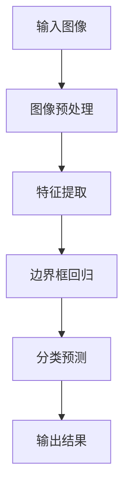
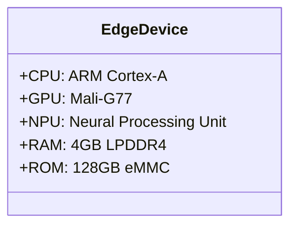
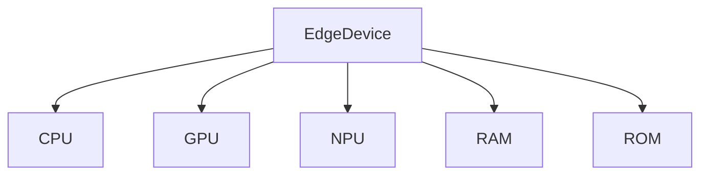
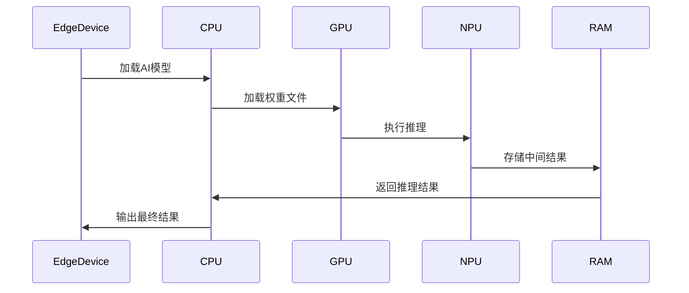

                 


# 如何识别企业的边缘AI芯片优势

## 关键词：边缘AI芯片，人工智能，边缘计算，芯片对比，技术优势

## 摘要：边缘AI芯片在企业中的应用日益广泛，本文将深入分析边缘AI芯片的核心优势、技术特点、算法原理和系统架构，并通过实际案例和最佳实践，帮助企业识别和选择适合的边缘AI芯片。

---

# 第一部分：背景介绍

## 第1章：边缘AI芯片的背景与现状

### 1.1 边缘计算与AI芯片的定义

#### 1.1.1 边缘计算的基本概念

边缘计算是一种分布式计算范式，将数据处理和存储从云端转移到靠近数据源的边缘设备。这种模式减少了数据传输的延迟，提高了实时性和响应速度。

#### 1.1.2 AI芯片的核心定义

AI芯片是专门用于加速人工智能任务（如机器学习、深度学习）的硬件。边缘AI芯片将AI处理能力集成到边缘设备中，实现本地化的智能分析和决策。

---

### 1.2 边缘AI芯片的发展现状

#### 1.2.1 全球边缘AI芯片市场分析

全球边缘AI芯片市场快速增长，主要驱动力来自物联网、自动驾驶、智能安防等领域的广泛应用。预计未来几年，边缘AI芯片的市场规模将稳步扩大。

#### 1.2.2 国内边缘AI芯片市场的崛起

中国在边缘AI芯片领域迅速崛起，政府政策支持和企业研发投入推动了本土芯片厂商的发展。国产芯片在性能和成本方面具备竞争力。

---

### 1.3 边缘AI芯片的优势与挑战

#### 1.3.1 边缘AI芯片的优势

- **低延迟**：边缘计算减少了数据传输到云端的延迟，提升了实时性。
- **高能效**：边缘AI芯片通常设计为低功耗，适合移动设备和物联网环境。
- **数据隐私**：本地处理数据减少了传输过程中的隐私风险。

#### 1.3.2 边缘AI芯片面临的挑战

- **散热问题**：边缘设备通常功耗较高，散热成为难题。
- **兼容性**：不同芯片架构和操作系统的兼容性可能影响应用的广泛性。
- **安全性**：边缘设备面临更多的物理和网络安全威胁。

---

## 1.4 本章小结

边缘AI芯片通过将AI处理能力部署在边缘设备中，解决了传统云计算的延迟和隐私问题。然而，其发展仍面临技术挑战和市场适应的问题。

---

# 第二部分：核心概念与联系

## 第2章：边缘AI芯片的核心概念

### 2.1 边缘AI芯片的特点与属性

#### 2.1.1 低延迟与实时性

边缘AI芯片的设计目标是减少延迟，提高实时响应能力，适用于需要快速决策的应用场景，如自动驾驶和工业自动化。

#### 2.1.2 高能效与低功耗

边缘设备通常依赖电池供电，因此芯片必须具备高能效，以延长设备的续航时间。

---

### 2.2 边缘AI芯片与其他芯片的对比

#### 2.2.1 对比分析

| 芯片类型       | 处理能力 | 功耗 | 延迟 | 适用场景                     |
|----------------|----------|------|------|-----------------------------|
| CPU            | 通用     | 较高  | 高    | 数据中心、服务器             |
| GPU            | 图形/计算| 较高  | 中    | 图形渲染、科学计算             |
| FPGA           | 可编程   | 中等  | 中    | 专用计算                     |
| ASIC（如边缘AI芯片） | 专用AI | 低    | 低    | 边缘计算、智能设备             |

#### 2.2.2 ER实体关系图

```mermaid
er
    title 边缘AI芯片核心要素
    CustomerBase(cust_id, name, industry, location)
    ChipType(chip_id, type_name, compute_power, power_consumption)
    EdgeAICHip(chip_id, cust_id, type_id, features)
    CustomerBase -o EdgeAICHip: 部署的芯片
```

---

## 2.3 边缘AI芯片的核心要素

### 2.3.1 计算能力

边缘AI芯片通常采用专用的AI指令集，如TensorFlow Lite，以加速神经网络的推理过程。

### 2.3.2 硬件架构

主流的边缘AI芯片架构包括ASIC（专用集成电路）和FPGA（现场可编程门阵列）。ASIC在性能和功耗上更具优势，而FPGA则提供更高的灵活性。

---

# 第三部分：算法原理

## 第3章：边缘AI芯片的算法实现

### 3.1 边缘计算中的关键算法

#### 3.1.1 目标检测算法

边缘AI芯片通常采用YOLO、Faster R-CNN等目标检测算法，用于实时检测图像中的物体。

#### 3.1.2 数据压缩算法

为减少数据传输量，边缘AI芯片常使用JPEG压缩、Huffman编码等数据压缩算法。

---

### 3.2 算法实现步骤

#### 3.2.1 边缘AI芯片的目标检测流程



#### 3.2.2 Python实现示例

```python
import cv2
import tensorflow as tf

# 图像预处理
def preprocess_image(image_path):
    image = cv2.imread(image_path)
    image = cv2.resize(image, (224, 224))
    image = image / 255.0
    return image

# 加载预训练模型
model = tf.keras.models.load_model('edge_ai_model.h5')

# 推理
def predict(image):
    prediction = model.predict(tf.expand_dims(image, axis=0))
    return prediction

# 示例
image = preprocess_image('input.jpg')
result = predict(image)
print(result)
```

---

### 3.3 数学模型与公式

#### 3.3.1 目标检测算法的数学模型

目标检测模型通常涉及卷积操作和损失函数的计算。例如，YOLO算法使用以下损失函数：

$$\text{损失} = \lambda_{\text{xy}} (x - \hat{x})^2 + \lambda_{wh} (w - \hat{w})^2 + \lambda_{\text{conf}} (p - \hat{p})^2$$

---

# 第四部分：系统架构

## 第4章：边缘AI芯片的系统架构

### 4.1 系统功能设计

#### 4.1.1 领域模型



---

### 4.2 系统架构设计



---

### 4.3 系统接口设计

边缘AI芯片通常通过以下接口与外部设备交互：

- **PCIe接口**：连接到其他计算单元。
- **I2C/SPI接口**：连接传感器和外设。
- **以太网接口**：连接到网络设备。

---

### 4.4 系统交互流程



---

# 第五部分：项目实战

## 第5章：边缘AI芯片的实际应用

### 5.1 项目背景

本项目旨在设计一个基于边缘AI芯片的实时图像识别系统，用于智能安防监控。

---

### 5.2 项目环境安装

```bash
# 安装依赖
pip install tensorflow-cpu==2.5.0
pip install opencv-python==4.5.5.56
```

---

### 5.3 项目核心代码实现

```python
import cv2
import tensorflow as tf

# 加载预训练模型
model = tf.keras.models.load_model('edge_model.h5')

# 视频流处理
cap = cv2.VideoCapture(0)

while cap.isOpened():
    ret, frame = cap.read()
    if not ret:
        break
    # 预处理
    image = cv2.resize(frame, (224, 224))
    image = image / 255.0
    # 推理
    prediction = model.predict(tf.expand_dims(image, axis=0))
    # 显示结果
    cv2.imshow('Edge AI Detection', frame)
    if cv2.waitKey(1) & 0xFF == ord('q'):
        break

cap.release()
cv2.destroyAllWindows()
```

---

### 5.4 项目案例分析

通过上述代码，我们可以实时检测视频流中的目标物体。系统在边缘设备上运行，减少了数据传输到云端的延迟，提升了实时响应速度。

---

## 5.5 项目小结

本项目展示了如何在边缘设备上部署AI模型，实现实时图像识别。通过优化硬件配置和算法模型，可以进一步提升系统的性能和效率。

---

# 第六部分：最佳实践

## 第6章：识别边缘AI芯片优势的策略

### 6.1 最佳实践

- **选择芯片时，考虑计算能力、功耗和延迟。**
- **在部署前，评估企业的实际需求和预算。**
- **定期监控和优化系统性能。**

---

## 6.2 小结

边缘AI芯片的优势在于低延迟和高能效，但选择和部署需要综合考虑多个因素。通过本文的分析和案例，读者可以更好地识别和利用边缘AI芯片的优势。

---

## 6.3 注意事项

- **散热设计**：边缘设备需要良好的散热方案，以避免高温导致的性能下降。
- **电源管理**：优化电源管理策略，延长设备续航时间。
- **安全性**：加强边缘设备的安全防护，防止数据泄露和网络攻击。

---

## 6.4 拓展阅读

- **书籍推荐**：《边缘计算：原理与实践》
- **技术博客**：https://www.edgeaichip.com/

---

# 结语

边缘AI芯片为企业提供了强大的计算能力和灵活性，但选择和部署需要仔细评估和规划。希望本文能为企业识别边缘AI芯片的优势提供有价值的参考。

---

# 作者

作者：AI天才研究院/AI Genius Institute  
联系方式：https://www.aigenius.org  
邮箱：contact@aigenius.org  

---

# 结语

边缘AI芯片为企业提供了强大的计算能力和灵活性，但选择和部署需要仔细评估和规划。希望本文能为企业识别边缘AI芯片的优势提供有价值的参考。

---

