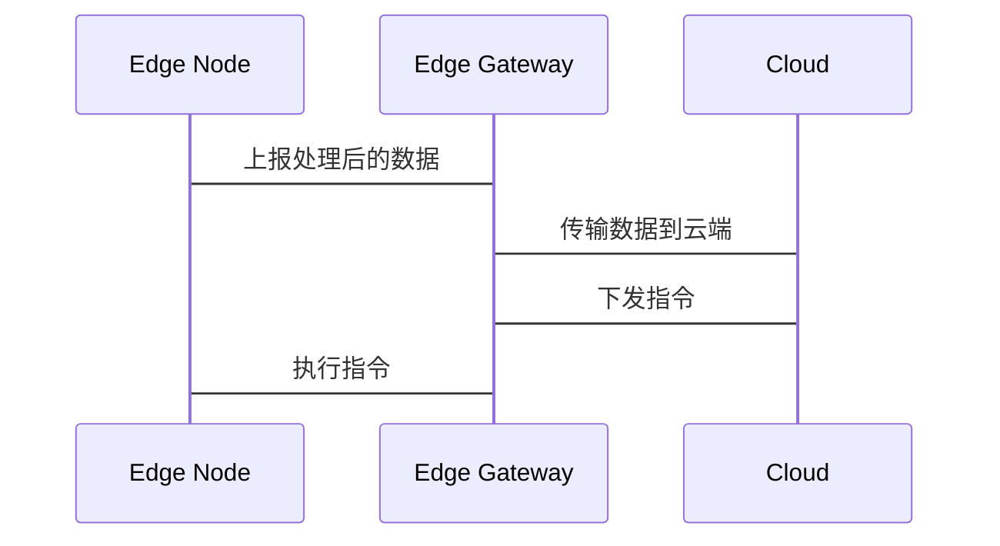

                 


# 如何识别企业的边缘计算实时决策系统优势

> 关键词：边缘计算、实时决策系统、企业优势、系统架构、数据处理、通信协议

> 摘要：边缘计算实时决策系统是一种新兴的企业级技术，能够在靠近数据源的地方快速做出决策，显著提升企业的运营效率和竞争力。本文从边缘计算的基本概念出发，详细分析了实时决策系统的核心技术、系统架构、数据处理方法和实际应用场景。通过案例分析和代码示例，帮助读者识别企业在采用边缘计算实时决策系统时的优势，并提供最佳实践和未来发展的建议。

---

# 第一部分: 边缘计算实时决策系统概述

## 第1章: 边缘计算与实时决策系统背景

### 1.1 边缘计算的基本概念

#### 1.1.1 边缘计算的定义
边缘计算是一种分布式计算范式，将计算能力从中心化的云端转移到靠近数据源的边缘设备上。这种计算方式能够在数据生成的位置直接进行处理、分析和决策，减少数据传输延迟。

#### 1.1.2 边缘计算的核心特点
边缘计算具有以下核心特点：
1. **分布式架构**：数据在边缘节点处理，减少对云端的依赖。
2. **低延迟**：实时处理数据，响应速度快。
3. **高可用性**：边缘节点独立运行，具备容错能力强的特点。
4. **隐私与安全**：数据在本地处理，减少数据泄露风险。

#### 1.1.3 实时决策系统的重要性
实时决策系统能够在数据生成的瞬间做出响应，这对于需要快速决策的企业场景至关重要。例如，在制造业中，实时决策系统可以在生产线出现问题时立即触发报警并采取纠正措施。

### 1.2 边缘计算与云计算的区别

#### 1.2.1 云计算的局限性
云计算虽然提供了强大的计算能力和数据存储，但存在以下局限性：
1. **延迟高**：数据需要传输到云端处理，导致延迟。
2. **成本高**：大量数据传输和存储会产生高昂成本。
3. **带宽受限**：在某些场景下，网络带宽不足以支持实时数据传输。

#### 1.2.2 边缘计算的优势
边缘计算通过在边缘节点处理数据，弥补了云计算的不足：
1. **低延迟**：边缘计算能够在数据源附近快速响应。
2. **降低成本**：减少数据传输量，降低带宽和存储成本。
3. **高可用性**：边缘节点独立运行，具备容错能力。

#### 1.2.3 边缘计算与云计算的协同工作
边缘计算和云计算并不是互斥的，而是可以协同工作。边缘节点负责实时处理和初步分析，云端则用于长期存储和深度分析。这种协同模式能够充分发挥两者的优势。

### 1.3 边缘计算在企业中的应用场景

#### 1.3.1 制造业中的边缘计算
在制造业中，边缘计算可以用于实时监控生产线设备状态，预测设备故障，并在发生问题时立即采取纠正措施。

#### 1.3.2 零售业中的边缘计算
在零售业中，边缘计算可以用于实时分析顾客行为数据，优化库存管理和销售策略。

#### 1.3.3 智慧城市中的边缘计算
在智慧城市建设中，边缘计算可以用于实时监控交通流量、环境监测等，提升城市管理效率。

---

## 第2章: 边缘计算实时决策系统的背景与问题分析

### 2.1 传统企业决策系统的局限性

#### 2.1.1 数据延迟的问题
传统决策系统依赖于中心化的云端处理，数据传输和处理延迟较高，难以满足实时决策的需求。

#### 2.1.2 高昂的云服务成本
传统决策系统需要大量数据传输和存储，导致成本高昂，尤其是在带宽和存储资源有限的场景下。

#### 2.1.3 中心化决策系统的不足
中心化决策系统在数据处理时，容易成为单点故障，存在较高的风险。

### 2.2 边缘计算实时决策系统的提出

#### 2.2.1 问题背景的描述
随着企业对实时决策需求的增加，传统的中心化决策系统已经无法满足需求。边缘计算的出现为企业提供了一种新的解决方案。

#### 2.2.2 问题解决的思路
通过在边缘节点部署计算能力，实时处理数据，减少延迟和成本，提升决策效率。

#### 2.2.3 边缘计算实时决策系统的边界与外延
边缘计算实时决策系统的边界包括边缘节点的数据处理、实时决策和与云端的协同工作。外延则包括与企业现有系统的集成和优化。

### 2.3 边缘计算实时决策系统的概念结构

#### 2.3.1 核心要素组成
边缘计算实时决策系统的核心要素包括边缘节点、数据采集、实时处理、决策引擎和反馈机制。

#### 2.3.2 系统架构的初步分析
系统架构通常包括边缘节点、边缘网关和云端三个层次。边缘节点负责数据采集和初步处理，边缘网关负责数据汇总和传输，云端负责深度分析和存储。

#### 2.3.3 与企业现有系统的关联性
边缘计算实时决策系统可以与企业现有的ERP、CRM等系统集成，提供实时数据支持，优化企业运营。

---

## 第3章: 边缘计算实时决策系统的数据处理技术

### 3.1 数据采集与预处理

#### 3.1.1 数据采集的多样性
边缘计算需要处理多种类型的数据，包括传感器数据、视频流、日志等。

#### 3.1.2 数据预处理的方法
数据预处理包括数据清洗、标准化和转换，确保数据质量。

#### 3.1.3 数据清洗与标准化
通过去除噪声数据和标准化处理，确保数据的一致性和可比性。

### 3.2 数据压缩与高效传输

#### 3.2.1 数据压缩算法的选择
常用的数据压缩算法包括Gzip和Snappy，能够在保证数据压缩率的同时，快速解压。

#### 3.2.2 数据传输的优化策略
通过分片传输和优先级调度，优化数据传输效率。

#### 3.2.3 边缘节点的数据存储优化
使用本地缓存和分布式存储技术，提升数据存储效率。

---

## 第4章: 边缘计算实时决策系统的通信协议

### 4.1 边缘节点间的通信协议

#### 4.1.1 MQTT协议的使用
MQTT是一种轻量级的物联网通信协议，适合低带宽和高延迟的网络环境。

#### 4.1.2 HTTP协议的局限性
HTTP协议的请求响应模式不适合实时性要求高的场景。

#### 4.1.3 CoAP协议的特点
CoAP协议适用于资源受限的设备，支持RESTful风格的通信。

### 4.2 边缘节点与云端的通信

#### 4.2.1 边缘网关的作用
边缘网关负责将边缘节点的数据汇总后传输到云端，同时处理来自云端的指令。

#### 4.2.2 安全通信的实现
通过SSL/TLS加密和认证机制，确保通信的安全性。

#### 4.2.3 通信带宽的优化
通过数据压缩和分批传输，减少通信带宽的占用。

---

## 第5章: 边缘计算实时决策系统的计算模型

### 5.1 边缘计算中的机器学习模型

#### 5.1.1 机器学习模型的选择
在边缘计算中，通常选择轻量级的机器学习模型，如线性回归、决策树等，以适应边缘设备的计算能力限制。

#### 5.1.2 模型训练与部署
模型训练在云端完成，部署到边缘节点时进行量化和剪枝优化，减少模型大小和计算量。

### 5.2 边缘计算中的实时推理

#### 5.2.1 实时推理的流程
数据采集 -> 数据预处理 -> 模型推理 -> 决策输出。

#### 5.2.2 模型推理的优化
通过并行计算和缓存技术，提升模型推理效率。

---

## 第6章: 边缘计算实时决策系统的系统架构

### 6.1 系统架构设计

#### 6.1.1 分层架构
边缘计算实时决策系统的架构通常分为边缘节点、边缘网关和云端三个层次。

#### 6.1.2 边缘节点的功能
边缘节点负责数据采集、预处理和实时推理。

#### 6.1.3 边缘网关的功能
边缘网关负责数据汇总、路由和与云端的通信。

### 6.2 系统交互设计

#### 6.2.1 边缘节点与边缘网关的交互
边缘节点将处理后的数据上报到边缘网关，边缘网关将数据传输到云端。

#### 6.2.2 边缘网关与云端的交互
边缘网关负责接收云端的指令，并将指令下发到边缘节点。

#### 6.2.3 系统交互的Mermaid序列图


---

## 第7章: 边缘计算实时决策系统的项目实战

### 7.1 环境安装

#### 7.1.1 操作系统选择
推荐使用Linux系统，如Ubuntu，安装轻量级的虚拟化环境，如Docker。

#### 7.1.2 开发工具安装
安装Python、Pandas、NumPy等开发工具，以及MQTT客户端Mosquitto。

#### 7.1.3 依赖库安装
安装必要的依赖库，如Paho-MQTT用于与MQTT服务器通信。

### 7.2 核心代码实现

#### 7.2.1 数据采集代码
```python
import paho.mqtt.client as mqtt
import time

def on_connect(client, userdata, rc):
    print("Connected with result code " + str(rc))

client = mqtt.Client()
client.on_connect = on_connect
client.connect("localhost", 1883, 60)

client.loop_start()
```

#### 7.2.2 数据预处理代码
```python
import pandas as pd

data = pd.read_csv('sensor_data.csv')
data_clean = data.dropna()
data_normalized = (data_clean - data_clean.mean()) / data_clean.std()
```

#### 7.2.3 实时推理代码
```python
import numpy as np
from sklearn.linear_model import LinearRegression

model = LinearRegression()
model.fit(X_train, y_train)

def predict(X_new):
    return model.predict(X_new)
```

### 7.3 案例分析与优化

#### 7.3.1 制造业案例
在制造业中，边缘计算实时决策系统可以用于预测设备故障，优化维护计划。

#### 7.3.2 系统优化
通过优化数据压缩算法和通信协议，进一步降低延迟和成本。

---

## 第8章: 边缘计算实时决策系统的最佳实践与小结

### 8.1 最佳实践 tips

1. **选择合适的边缘计算平台**：根据企业需求选择适合的平台，如Kubernetes、Docker等。
2. **优化数据处理流程**：通过数据压缩和预处理减少数据传输量。
3. **确保安全性**：采用加密和认证机制，保障通信安全。

### 8.2 小结

边缘计算实时决策系统通过在边缘节点处理数据，显著降低了延迟和成本，提升了企业的决策效率。随着技术的不断进步，边缘计算将在更多领域得到广泛应用。

### 8.3 注意事项

1. **数据隐私**：在边缘计算中，需要特别注意数据隐私和安全问题。
2. **系统维护**：定期更新边缘节点的软件和模型，确保系统安全和性能。
3. **扩展性**：设计时考虑系统的扩展性，便于未来的升级和优化。

### 8.4 拓展阅读

建议读者进一步阅读《边缘计算实战指南》和《实时决策系统的优化与设计》，深入了解边缘计算的实际应用和技术细节。

---

# 作者：AI天才研究院/AI Genius Institute & 禅与计算机程序设计艺术 /Zen And The Art of Computer Programming

