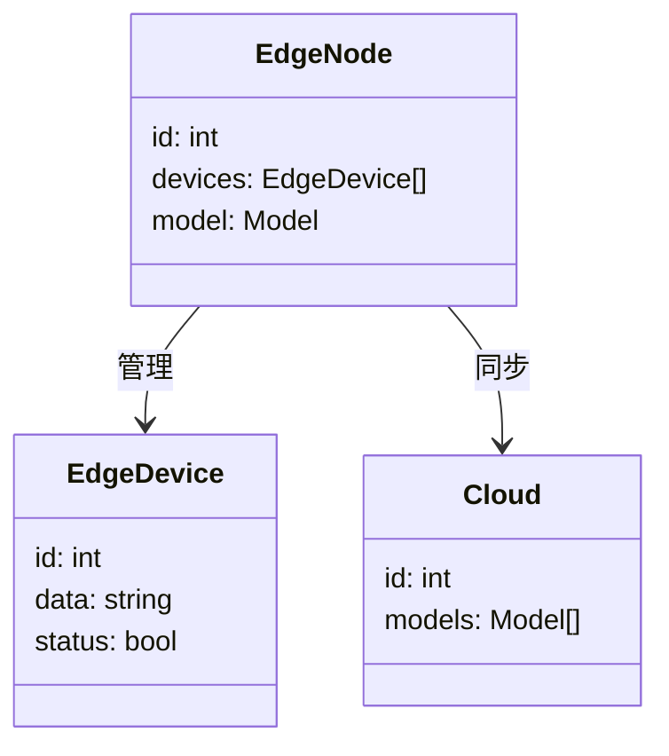
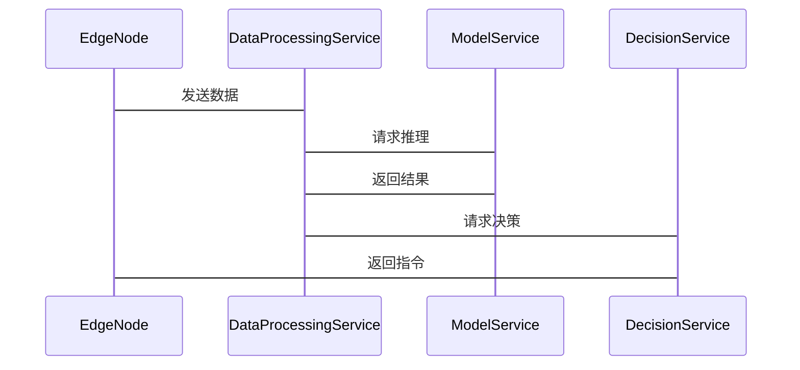

                 


# 如何识别企业的边缘计算实时推理优势

## 关键词：
边缘计算, 实时推理, 企业应用, 技术优势, 系统架构, 算法原理, 项目实战

## 摘要：
本文系统地分析了边缘计算与实时推理的核心概念、算法原理、系统架构及实际应用场景，通过详细的技术分析和项目实战，帮助读者识别和理解企业在边缘计算实时推理中的优势。文章从背景介绍、核心原理到具体实现，层层深入，结合实际案例，总结了企业在采用边缘计算实时推理技术时的关键优势及实践中的注意事项。

---

# 第一部分: 边缘计算与实时推理的背景介绍

## 第1章: 边缘计算与实时推理的背景介绍

### 1.1 边缘计算的基本概念
#### 1.1.1 什么是边缘计算
边缘计算（Edge Computing）是一种分布式计算范式，将数据处理和计算能力从云端转移到靠近数据源的边缘设备。与传统的云计算模式不同，边缘计算强调数据的实时处理和局部决策。

#### 1.1.2 边缘计算的核心特点
- **分布式架构**：数据在边缘端进行处理，减少对云端的依赖。
- **实时性**：边缘设备能够快速响应，满足实时性要求。
- **低延迟**：边缘计算能够显著降低数据传输和处理的延迟。
- **安全性**：数据在边缘端处理，减少了数据传输过程中的安全风险。

#### 1.1.3 边缘计算与云计算的区别
| 特性         | 边缘计算               | 云计算                 |
|--------------|-----------------------|-----------------------|
| 数据处理位置 | 边缘设备               | 云端                   |
| 延迟          | 低延迟                 | 高延迟                 |
| 网络依赖      | 边缘设备依赖本地网络     | 依赖于高速网络           |
| 适用场景      | 实时性要求高的场景       | 非实时性要求的场景       |

### 1.2 实时推理的重要性
#### 1.2.1 什么是实时推理
实时推理是指在数据生成的瞬间，利用模型快速做出决策的过程。实时推理的核心在于“实时”，即在毫秒级别内完成数据的处理和决策。

#### 1.2.2 边缘计算中的实时推理应用场景
- **工业自动化**：实时监控生产线状态，快速响应异常。
- **智能交通**：实时处理交通数据，优化交通流量。
- **智能家居**：实时响应用户的指令，提供个性化服务。

#### 1.2.3 实时推理的核心优势
- **快速响应**：实时处理数据，减少延迟。
- **本地决策**：边缘设备能够独立做出决策，减少对云端的依赖。
- **带宽优化**：仅将关键数据传输到云端，减少网络带宽的占用。

### 1.3 企业边缘计算实时推理的优势
#### 1.3.1 边缘计算在企业中的应用价值
- **提升效率**：边缘计算能够快速响应，提高企业运营效率。
- **降低成本**：通过减少数据传输到云端的次数，降低带宽成本。
- **增强安全性**：数据在边缘端处理，减少数据泄露的风险。

#### 1.3.2 实时推理对企业业务的提升作用
- **提高客户满意度**：实时响应客户需求，提升客户体验。
- **优化业务流程**：通过实时数据分析，优化业务流程，提高效率。
- **增强竞争力**：快速响应市场变化，提高企业的市场竞争力。

#### 1.3.3 边缘计算与实时推理的结合优势
- **协同工作**：边缘计算提供计算资源，实时推理提供快速决策能力。
- **灵活性**：边缘计算可以根据企业的实际需求进行灵活部署。
- **可扩展性**：实时推理可以在边缘设备上扩展，满足企业规模化的需要。

## 1.4 本章小结
- 本章介绍了边缘计算的基本概念和核心特点，分析了边缘计算与云计算的区别。
- 探讨了实时推理的重要性及其在边缘计算中的应用场景。
- 总结了企业边缘计算实时推理的优势，包括提升效率、降低成本和增强安全性等方面。

---

# 第二部分: 边缘计算与实时推理的核心概念

## 第2章: 边缘计算的核心原理

### 2.1 边缘计算的架构分析
#### 2.1.1 边缘计算的分层架构
边缘计算的分层架构包括以下几层：
1. **边缘设备层**：包括传感器、摄像头等数据采集设备。
2. **边缘计算层**：包括边缘计算节点，负责数据的预处理和初步分析。
3. **云端层**：负责数据的长期存储和全局性分析。

#### 2.1.2 边缘节点的功能与特点
- **功能**：数据采集、预处理、本地存储、计算和决策。
- **特点**：低功耗、高性能、本地化、安全性高。

#### 2.1.3 边缘计算与云计算的协同工作
- 数据在边缘端进行初步处理后，将关键数据传输到云端进行深度分析。
- 云端负责全局性决策，边缘设备负责局部性决策。

### 2.2 实时推理的算法原理
#### 2.2.1 实时推理的算法特点
- **快速性**：算法能够在短时间内完成数据处理和决策。
- **准确性**：算法需要保证在实时环境下的决策准确性。
- **可扩展性**：算法能够适应不同规模的数据处理需求。

#### 2.2.2 基于模型的实时推理流程
实时推理的流程包括以下步骤：
1. **数据采集**：从边缘设备获取数据。
2. **数据预处理**：对数据进行清洗和标准化处理。
3. **模型推理**：利用训练好的模型进行预测。
4. **决策输出**：根据推理结果做出决策。

#### 2.2.3 实时推理的性能优化方法
- **模型优化**：使用轻量级模型，减少计算资源的消耗。
- **并行计算**：利用多核处理器进行并行计算，提高处理速度。
- **缓存机制**：利用缓存技术减少数据访问的延迟。

### 2.3 边缘计算与实时推理的关联
#### 2.3.1 边缘计算如何支持实时推理
- 边缘计算提供了计算资源，支持实时推理的快速响应。
- 边缘设备能够本地化处理数据，减少对云端的依赖。

#### 2.3.2 实时推理在边缘计算中的应用场景
- **智能制造**：实时监控生产线状态，快速响应异常。
- **智慧城市**：实时处理交通数据，优化交通流量。
- **智能家居**：实时响应用户的指令，提供个性化服务。

#### 2.3.3 边缘计算与实时推理的协同发展
- 边缘计算为实时推理提供计算资源，实时推理为边缘计算提供决策能力。
- 两者的结合能够实现数据的快速处理和高效利用。

## 2.4 本章小结
- 本章分析了边缘计算的核心原理，包括分层架构和边缘节点的功能与特点。
- 探讨了实时推理的算法原理及其在边缘计算中的应用场景。
- 总结了边缘计算与实时推理的关联和协同发展。

---

# 第三部分: 边缘计算实时推理的算法原理

## 第3章: 基于模型的实时推理算法

### 3.1 算法原理概述
#### 3.1.1 基于模型的实时推理算法特点
- 基于模型的实时推理算法具有准确性高、可解释性强等特点。
- 算法能够快速处理数据，满足实时性要求。

#### 3.1.2 算法的输入输出流程
- 输入：传感器数据、图像数据等。
- 输出：预测结果、决策指令等。

#### 3.1.3 算法的性能优化方法
- 使用轻量级模型，减少计算资源的消耗。
- 优化算法的执行流程，提高处理速度。

### 3.2 算法实现细节
#### 3.2.1 算法实现的数学模型
实时推理算法的核心是模型的训练和推理。常用的模型包括线性回归模型、支持向量机（SVM）和神经网络模型。

#### 3.2.2 线性回归模型的数学公式
线性回归模型的数学公式为：
$$ y = \beta_0 + \beta_1 x + \epsilon $$
其中，$y$ 是目标变量，$x$ 是自变量，$\beta_0$ 是截距，$\beta_1$ 是回归系数，$\epsilon$ 是误差项。

#### 3.2.3 算法实现的Python代码
```python
import numpy as np
from sklearn.linear_model import LinearRegression

# 数据准备
X = np.array([[1], [2], [3], [4], [5]])
y = np.array([2, 4, 5, 4, 5])

# 模型训练
model = LinearRegression()
model.fit(X, y)

# 模型推理
new_X = np.array([[6]])
prediction = model.predict(new_X)
print("预测结果为:", prediction)
```

#### 3.2.4 算法实现的详细解释
- 数据准备：将数据集划分为训练集和测试集。
- 模型训练：使用训练数据对模型进行训练，得到回归系数。
- 模型推理：利用训练好的模型对新数据进行预测。

### 3.3 本章小结
- 本章介绍了基于模型的实时推理算法，包括算法的特点和实现流程。
- 详细讲解了线性回归模型的数学公式和Python代码实现。
- 总结了算法实现的优化方法和注意事项。

---

# 第四部分: 边缘计算实时推理的系统架构设计

## 第4章: 边缘计算实时推理的系统架构

### 4.1 系统功能设计
#### 4.1.1 领域模型
领域模型描述了系统中的核心实体及其关系。以下是领域模型的类图：


#### 4.1.2 系统架构
系统架构采用微服务架构，包括以下组件：
- 边缘设备管理服务
- 数据处理服务
- 模型管理服务
- 决策服务

系统架构图如下：
```mermaid
graph TD
    EdgeDevice --> EdgeNode: 发送数据
    EdgeNode --> DataProcessingService: 处理数据
    DataProcessingService --> ModelService: 推理
    ModelService --> DecisionService: 决策
    DecisionService --> EdgeNode: 输出指令
```

#### 4.1.3 接口设计
系统接口包括以下部分：
- 数据接口：负责数据的采集和传输。
- 模型接口：负责模型的加载和推理。
- 决策接口：负责决策结果的输出。

接口交互流程图如下：


### 4.2 本章小结
- 本章设计了边缘计算实时推理系统的功能需求和系统架构。
- 绘制了领域模型类图和系统架构图，展示了各组件之间的关系。
- 描述了系统接口的设计和交互流程。

---

# 第五部分: 边缘计算实时推理的项目实战

## 第5章: 项目实战

### 5.1 项目背景与需求分析
#### 5.1.1 项目背景
本项目旨在通过边缘计算实时推理技术，实现对工业生产线的实时监控和异常检测。

#### 5.1.2 项目需求
- 实时采集生产线上的传感器数据。
- 对数据进行实时分析，检测异常情况。
- 输出决策指令，指导生产线的运行。

### 5.2 项目环境与工具安装
#### 5.2.1 环境要求
- 操作系统：Linux或Windows。
- Python版本：3.6以上。
- 额外工具：Docker、Jupyter Notebook。

#### 5.2.2 环境安装
```bash
# 安装Python依赖
pip install numpy scikit-learn matplotlib

# 安装Docker
# （根据具体操作系统安装）
```

### 5.3 核心代码实现
#### 5.3.1 数据采集模块
```python
import serial
import time

# 配置串口
ser = serial.Serial('COM1', 9600)
while True:
    data = ser.readline().decode()
    print("接收数据:", data)
    time.sleep(1)
```

#### 5.3.2 数据处理模块
```python
import numpy as np
from sklearn.linear_model import LinearRegression

# 数据预处理
X = np.array([[1], [2], [3], [4], [5]])
y = np.array([2, 4, 5, 4, 5])

# 模型训练
model = LinearRegression()
model.fit(X, y)

# 模型推理
new_X = np.array([[6]])
prediction = model.predict(new_X)
print("预测结果为:", prediction)
```

#### 5.3.3 决策模块
```python
# 决策逻辑
if prediction > threshold:
    print("异常情况，需要采取措施")
else:
    print("正常情况，继续运行")
```

### 5.4 项目实现与测试
#### 5.4.1 项目实现
- 配置边缘设备，采集传感器数据。
- 数据预处理，训练模型。
- 模型推理，输出决策指令。

#### 5.4.2 项目测试
- 测试数据采集模块的实时性。
- 测试模型推理的准确性。
- 测试决策模块的响应速度。

### 5.5 项目总结
- 本项目成功实现了边缘计算实时推理技术在工业生产线中的应用。
- 通过边缘设备的实时数据采集和本地推理，提高了系统的响应速度和准确性。
- 项目中使用的模型和算法可以根据实际需求进行调整和优化。

## 5.6 本章小结
- 本章通过一个实际项目，展示了边缘计算实时推理技术的应用场景。
- 描述了项目的环境配置、核心代码实现和测试过程。
- 总结了项目中的经验和教训，为后续的优化提供了参考。

---

# 第六部分: 边缘计算实时推理的最佳实践与小结

## 第6章: 最佳实践与小结

### 6.1 最佳实践
#### 6.1.1 选择合适的边缘设备
- 根据实际需求选择性能合适的边缘设备。
- 确保边缘设备的计算能力和存储空间满足实时推理的要求。

#### 6.1.2 优化模型的性能
- 使用轻量级模型，减少计算资源的消耗。
- 优化模型的推理速度，提高实时性。

#### 6.1.3 确保数据的安全性
- 在边缘设备上进行数据加密，防止数据泄露。
- 定期更新模型和设备固件，确保系统安全性。

### 6.2 小结
- 本文系统地分析了边缘计算实时推理的核心概念、算法原理和系统架构。
- 通过实际项目展示了边缘计算实时推理技术的应用场景和实现方法。
- 总结了企业在采用边缘计算实时推理技术时的关键优势和注意事项。

---

# 作者：AI天才研究院 & 禅与计算机程序设计艺术

---

希望这篇文章能够帮助您理解如何识别企业的边缘计算实时推理优势，并为企业在实际应用中提供有价值的参考。

