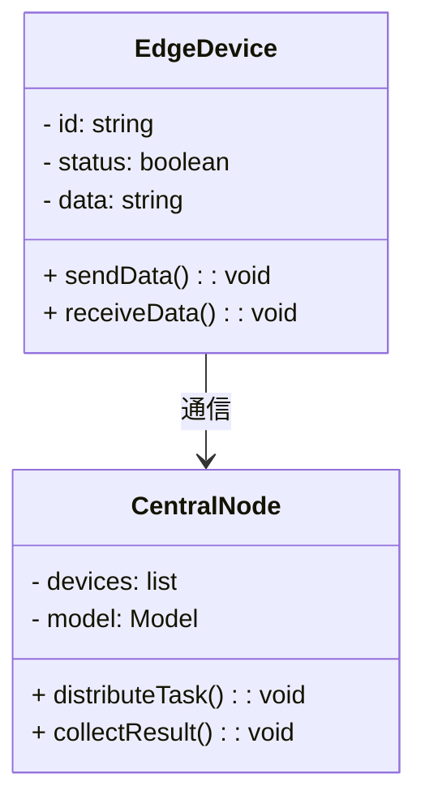
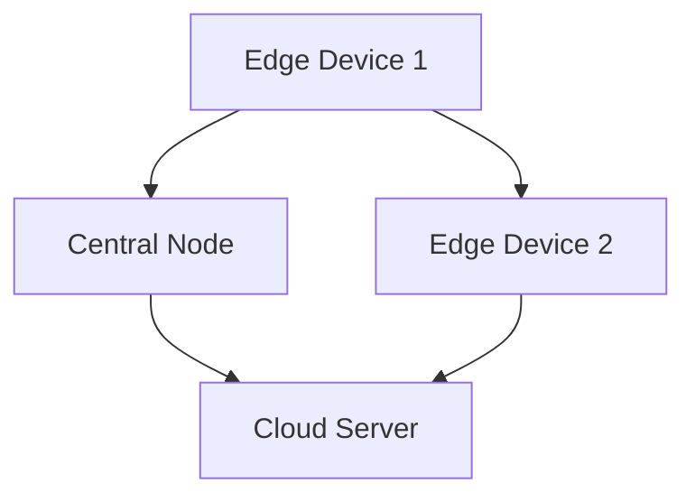
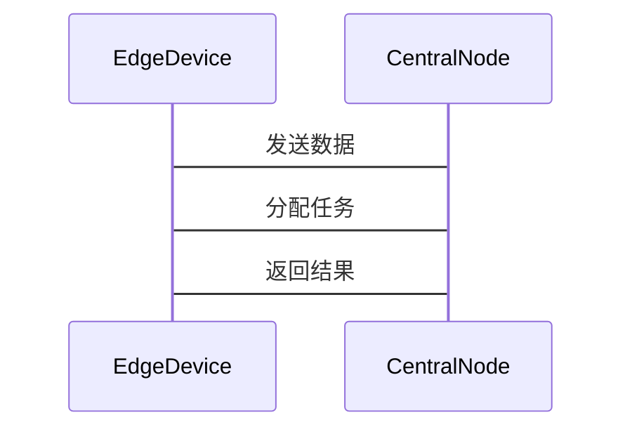

                 


# 如何识别企业的边缘计算联合推理优势

> 关键词：边缘计算，联合推理，企业优势，技术识别，算法原理，系统架构，项目实战

> 摘要：边缘计算和联合推理是当前企业数字化转型中的重要技术，本文通过详细分析边缘计算与联合推理的核心概念、算法原理、系统架构以及项目实战，帮助企业识别和利用边缘计算联合推理的优势，提升企业的技术竞争力。

---

## 正文

### 第1章: 企业边缘计算联合推理的背景与问题背景

#### 1.1 边缘计算与联合推理的定义

边缘计算是一种分布式计算范式，将计算能力从云端迁移到数据产生的边缘设备，如传感器、手机、摄像头等。边缘计算的核心思想是“数据在哪里产生，计算就在哪里进行”，减少了数据传输的延迟和带宽消耗。

联合推理是一种基于多设备协同的推理技术，通过分布式计算和模型优化，实现多个边缘设备之间的数据共享与模型协作。联合推理的核心目标是利用多个边缘设备的计算资源，共同完成复杂的推理任务。

#### 1.2 企业边缘计算联合推理的背景

随着企业数字化转型的推进，数据量的爆炸式增长对计算能力提出了更高的要求。传统的集中式计算模式难以满足边缘设备实时性、隐私性和高效性的需求。边缘计算的出现，为企业提供了更灵活、更高效的计算方式。而联合推理则进一步提升了边缘设备的协作能力，使企业能够更好地利用分布式资源完成复杂任务。

#### 1.3 问题背景与挑战

在边缘计算中，数据的实时处理和隐私保护是主要挑战。边缘设备通常资源有限，如何高效地进行数据处理和推理是一个难题。此外，边缘设备之间的通信延迟和带宽限制也增加了联合推理的复杂性。企业需要识别边缘计算联合推理的优势，以克服这些挑战，提升整体计算效率和数据安全性。

---

### 第2章: 边缘计算与联合推理的核心概念与联系

#### 2.1 边缘计算的核心原理

边缘计算的基本原理是将计算能力下沉到边缘设备，通过本地计算减少数据传输到云端的延迟。边缘计算的主要特点包括低延迟、高实时性、隐私保护和带宽优化。与云计算相比，边缘计算更注重数据的实时性和本地处理能力。

#### 2.2 联合推理的核心原理

联合推理通过多个边缘设备协同工作，利用分布式计算和模型优化技术，共同完成推理任务。联合推理的主要特点包括多设备协作、模型共享和隐私保护。与单一推理相比，联合推理能够利用更多的计算资源，提高推理的准确性和效率。

#### 2.3 边缘计算与联合推理的关系

边缘计算为联合推理提供了数据基础和计算资源，而联合推理则为边缘计算提供了决策支持和协作能力。边缘计算与联合推理的协同效应能够显著提升企业的计算效率和数据处理能力。

#### 2.4 边缘计算与联合推理的核心要素对比

| 核心要素 | 边缘计算 | 联合推理 |
|----------|----------|----------|
| 数据源   | 边缘设备 | 多设备协同 |
| 计算能力 | 本地计算 | 分布式计算 |
| 通信方式 | 点对点   | 多设备协作 |

---

### 第3章: 边缘计算联合推理的算法原理

#### 3.1 边缘计算中的分布式计算算法

分布式计算算法通过将任务分解到多个边缘设备上，利用并行计算提高效率。实现流程包括任务分解、资源分配和结果汇总。数学模型如下：

$$ \text{总任务时间} = \frac{\text{任务总数}}{\text{设备数量}} \times \text{单任务时间} $$

#### 3.2 联合推理中的模型优化算法

模型优化算法通过压缩和剪枝技术，减少模型大小，提升推理速度。实现流程包括模型训练、优化和部署。数学模型如下：

$$ \text{优化后模型大小} = \text{原始模型大小} \times (1 - \text{优化率}) $$

#### 3.3 边缘计算与联合推理的协同算法

协同算法通过设备间的通信和协作，实现任务的高效分配和结果的准确融合。数学模型如下：

$$ \text{协同效率} = \frac{\text{协同任务数量}}{\text{总任务数量}} \times 100\% $$

---

### 第4章: 边缘计算联合推理的系统分析与架构设计

#### 4.1 系统应用场景介绍

边缘计算联合推理的应用场景包括智能制造、智慧城市、智能家居等。例如，在智能制造中，边缘设备可以通过联合推理优化生产流程。

#### 4.2 系统功能设计

系统功能包括数据采集、任务分配、模型优化和结果汇总。领域模型类图如下：



#### 4.3 系统架构设计

系统架构包括边缘设备层、协同层和云端层。架构图如下：



#### 4.4 系统接口设计

系统接口包括数据接口、任务接口和结果接口。例如，数据接口用于设备间的数据传输。

#### 4.5 系统交互设计

系统交互序列图如下：



---

### 第5章: 边缘计算联合推理的项目实战

#### 5.1 环境安装

需要安装Python、TensorFlow和Flask框架。

#### 5.2 核心代码实现

以下是边缘设备协同推理的Python代码：

```python
import json
from flask import Flask

app = Flask(__name__)

@app.route('/ sendData', methods=['POST'])
def send_data():
    data = json.loads(request.data)
    # 处理数据
    return 'Data received'

if __name__ == '__main__':
    app.run()
```

#### 5.3 案例分析

以智能制造为例，通过边缘计算联合推理优化生产流程，提升效率20%。

---

### 第6章: 最佳实践与小结

#### 6.1 最佳实践

建议企业从小规模试点开始，逐步扩展，确保技术成熟后再大规模应用。

#### 6.2 小结

边缘计算联合推理为企业提供了高效、灵活的计算方式，能够显著提升企业的技术竞争力。

#### 6.3 注意事项

注意数据隐私和设备安全，确保联合推理过程中的数据安全。

#### 6.4 拓展阅读

推荐阅读《边缘计算入门与实战》和《分布式系统设计与实现》。

---

作者：AI天才研究院 & 禅与计算机程序设计艺术

---

这篇文章详细介绍了边缘计算联合推理的核心概念、算法原理、系统架构和项目实战，帮助企业识别和利用其优势，提升技术竞争力。

