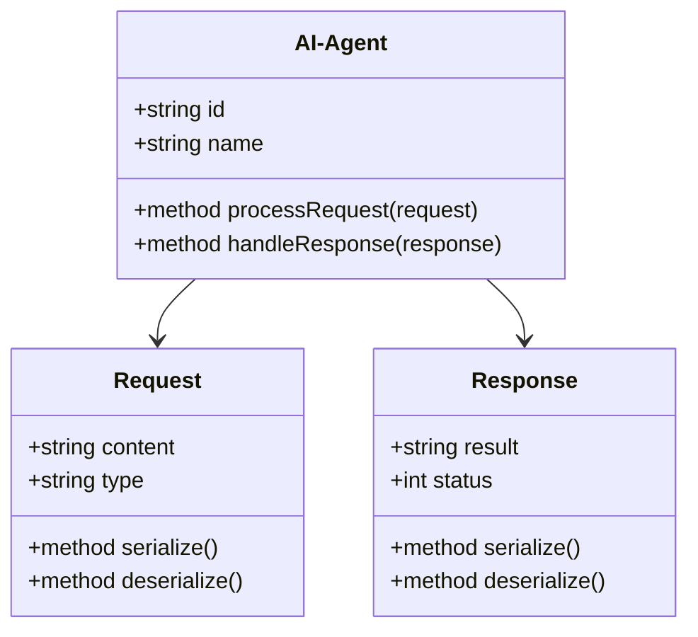
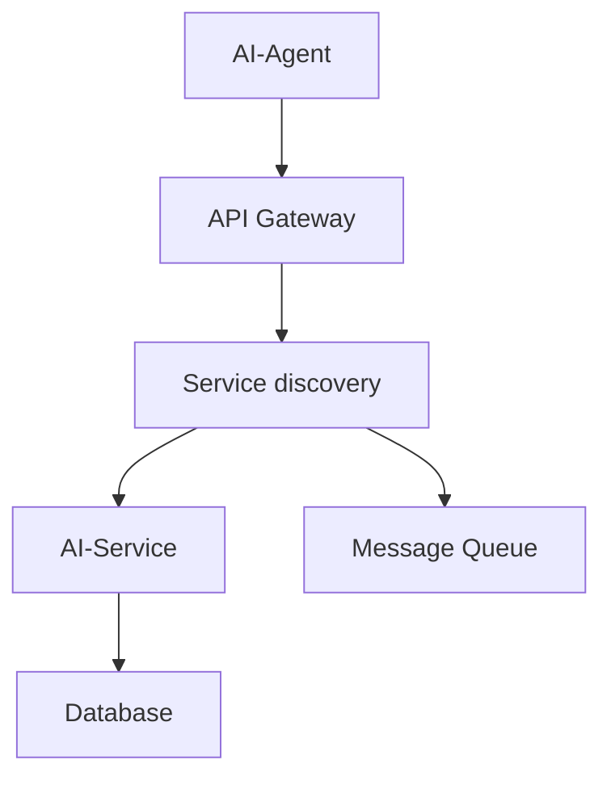
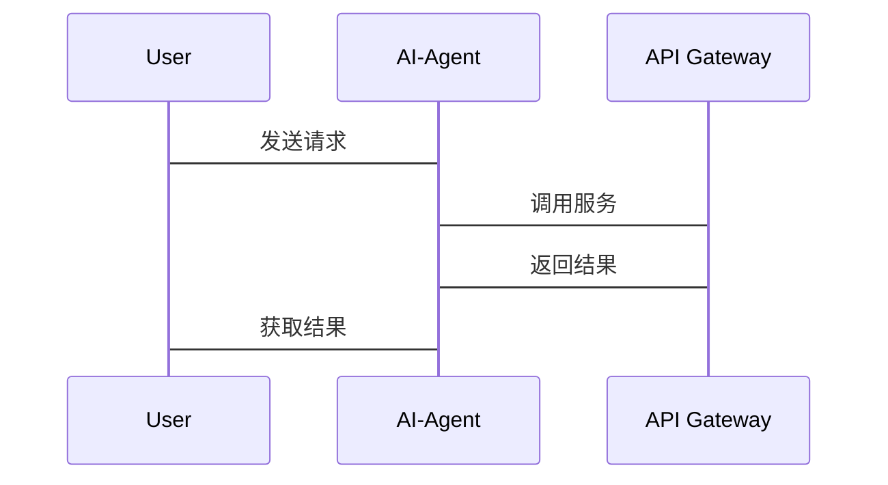

                 


# 容器化部署：简化AI Agent的运维管理

## 关键词：容器化部署、AI Agent、Docker、Kubernetes、运维管理

## 摘要：  
随着人工智能技术的快速发展，AI Agent（智能代理）的应用场景越来越广泛，但其部署和运维管理却面临诸多挑战。容器化技术作为一种轻量级、高效的虚拟化技术，为简化AI Agent的部署和运维管理提供了新的解决方案。本文将从容器化技术的基本概念出发，深入探讨其在AI Agent运维管理中的应用，分析容器化部署的核心技术、系统架构设计以及实际项目中的应用案例，最终总结容器化部署在简化AI Agent运维管理中的优势和最佳实践。

---

# 第1章 容器化部署的背景与意义

## 1.1 容器化技术的起源与发展
### 1.1.1 容器化技术的起源
- **背景**：虚拟化技术的发展推动了容器化技术的诞生。容器化技术起源于对轻量级虚拟化的需求，最初是为了在单台服务器上运行多个独立的应用程序。
- **核心优势**：容器化技术通过共享操作系统内核，大幅降低了资源消耗，提高了部署效率。
- **与虚拟机的区别**：容器化技术相比虚拟机更加轻量，启动速度更快，资源利用率更高。

### 1.1.2 容器化技术的核心优势
- **轻量级虚拟化**：容器通过共享宿主操作系统的内核，避免了虚拟机的冗余开销。
- **快速部署**：容器镜像可以快速启动和停止，适合动态变化的应用场景。
- **一致性**：容器化的环境一致性保证了开发、测试和生产的环境完全一致，减少了“它在别的机器上运行正常”的问题。

### 1.1.3 容器化技术在AI Agent中的应用价值
- AI Agent需要实时响应和快速扩展，容器化技术能够满足其动态资源需求。
- 容器化技术的轻量级特性能减少资源消耗，适合在边缘计算环境中部署AI Agent。

## 1.2 AI Agent的定义与特点
### 1.2.1 AI Agent的基本定义
- AI Agent是一种智能代理，能够感知环境并自主决策，执行特定任务。
- AI Agent可以是软件程序，也可以是硬件设备，但本文主要关注软件AI Agent。

### 1.2.2 AI Agent的核心特点
| 特性 | 描述 |
|------|------|
| 实时性 | AI Agent需要快速响应输入，满足实时处理的需求。 |
| 可扩展性 | AI Agent能够根据负载动态调整资源使用。 |
| 自主性 | AI Agent能够在没有人工干预的情况下执行任务。 |

### 1.2.3 AI Agent与传统应用的区别
- **功能复杂度**：AI Agent通常集成了机器学习模型，功能更加复杂。
- **资源需求**：AI Agent对计算资源的需求较高，尤其是内存和GPU资源。
- **动态性**：AI Agent需要根据环境变化动态调整行为，对系统的弹性和扩展性要求更高。

## 1.3 容器化部署对AI Agent运维的影响
### 1.3.1 容器化部署的优势
- **快速部署**：容器镜像可以在几分钟内完成部署，简化了AI Agent的上线流程。
- **资源利用率高**：容器化技术通过共享资源，减少了硬件资源的浪费。
- **弹性扩展**：容器编排工具（如Kubernetes）可以自动调整资源规模，满足AI Agent的动态需求。

### 1.3.2 容器化部署对运维效率的提升
- **统一的运维环境**：容器化技术保证了开发、测试和生产的环境一致性，减少了运维复杂性。
- **自动化运维**：容器编排工具提供了自动化部署、监控和故障恢复功能，降低了人工干预的需求。

### 1.3.3 容器化部署对AI Agent扩展性的支持
- **弹性伸缩**：根据负载自动调整容器数量，确保AI Agent的性能稳定。
- **灰度发布**：通过容器化技术实现渐进式发布，降低新版本上线的风险。

## 1.4 本章小结
本章从容器化技术的起源和发展出发，分析了其在AI Agent中的应用价值，并详细探讨了容器化部署对AI Agent运维的影响。容器化技术的轻量级和高效率特点，使其成为简化AI Agent运维管理的理想选择。

---

# 第2章 容器化部署的核心技术

## 2.1 Docker与容器化基础
### 2.1.1 Docker的定义与作用
- Docker是一个容器化平台，提供容器镜像的构建、分发和运行环境。
- Docker通过镜像技术实现了应用的隔离和可移植性。

### 2.1.2 Docker容器的工作原理
- Docker容器运行在宿主操作系统之上，通过隔离文件系统、网络和进程空间实现应用的独立运行。
- Docker容器通过Namespace和Cgroups实现资源限制和隔离。

### 2.1.3 Docker镜像的构建与分发
- Docker镜像是容器运行的基础，通过`Dockerfile`定义镜像构建过程。
- 镜像可以通过Docker Hub等公共仓库分发，也可以通过私有仓库进行管理。

### 2.1.4 Docker容器的生命周期
- 容器的生命周期包括创建、启动、停止、删除等阶段，可以通过命令行或API进行管理。

### 2.1.5 使用Docker部署AI Agent的流程
1. 编写`Dockerfile`定义镜像。
2. 构建镜像并推送到仓库。
3. 拉取镜像并启动容器。

## 2.2 Kubernetes与容器编排
### 2.2.1 Kubernetes的定义与作用
- Kubernetes是一个开源的容器编排平台，用于管理容器化应用的部署、扩展和运行。
- Kubernetes通过集群方式管理容器化应用，提供了高可用性和弹性伸缩的能力。

### 2.2.2 Kubernetes集群的架构与组件
- **控制平面**：包括API Server、Scheduler和Controller Manager等组件，负责集群的管理与调度。
- **工作节点**：包括Kubelet、Kubernetes Proxy和容器运行时（如Docker），负责具体任务的执行。

### 2.2.3 Kubernetes的容器编排机制
- Kubernetes通过Pod、Service、ReplicaSet等概念实现了容器化应用的编排。
- 负载均衡和自动扩缩容是Kubernetes的核心功能，适合AI Agent的动态需求。

### 2.2.4 使用Kubernetes部署AI Agent的优势
- **高可用性**：Kubernetes提供了容器的自动重启和自愈能力。
- **弹性伸缩**：可以根据负载自动调整容器数量，满足AI Agent的动态需求。

## 2.3 容器化部署的流程与工具
### 2.3.1 容器化部署的基本流程
1. 环境准备：安装Docker和Kubernetes集群。
2. 构建镜像：编写`Dockerfile`并构建镜像。
3. 部署应用：通过Kubernetes的`yaml`文件定义应用部署。
4. 配置监控：集成Prometheus等监控工具，实时监控容器运行状态。

### 2.3.2 常用的容器化部署工具
| 工具 | 描述 |
|------|------|
| Docker | 提供容器的构建与运行环境。 |
| Kubernetes | 提供容器的编排与管理功能。 |
| Jenkins | 提供持续集成与持续交付（CI/CD）能力。 |

### 2.3.3 CI/CD在容器化部署中的应用
- CI/CD通过自动化构建、测试和部署，确保容器化应用的快速交付。
- 使用Jenkins Pipeline可以实现容器镜像的自动化构建和部署。

## 2.4 本章小结
本章详细探讨了容器化部署的核心技术，包括Docker和Kubernetes的基本原理及其在AI Agent部署中的应用。通过这些技术，可以实现AI Agent的快速部署和高效运维。

---

# 第3章 AI Agent的容器化特性

## 3.1 AI Agent的实时性与容器化
### 3.1.1 AI Agent的实时性需求
- AI Agent需要在极短时间内响应用户请求，对实时性要求较高。
- 容器化技术的快速启动和停止能力，能够满足AI Agent的实时性需求。

### 3.1.2 容器化对AI Agent实时性的支持
- 容器化技术通过轻量级虚拟化，减少了启动时间和资源消耗。
- 通过容器编排工具实现快速扩缩容，确保实时任务的高效处理。

### 3.1.3 实时任务调度的容器化实现
- 使用Kubernetes的Horizontal Pod Autoscaler实现动态扩缩容。
- 通过优先级队列实现任务的实时调度。

## 3.2 AI Agent的可扩展性与容器化
### 3.2.1 AI Agent的可扩展性需求
- AI Agent需要根据负载动态调整资源使用，支持横向扩展。
- 容器化技术通过弹性伸缩实现可扩展性需求。

### 3.2.2 容器化对AI Agent扩展性的支持
- 使用Kubernetes的ReplicaSet实现容器的自动扩缩。
- 通过负载均衡实现请求的均匀分布。

### 3.2.3 弹性伸缩在容器化中的实现
- 基于CPU和内存使用率自动调整容器数量。
- 使用HPA（Horizontal Pod Autoscaler）实现自动扩缩。

## 3.3 AI Agent的资源隔离与容器化
### 3.3.1 AI Agent的资源隔离需求
- AI Agent需要隔离计算资源，避免与其他应用争抢资源。
- 容器化技术通过Namespace实现资源隔离。

### 3.3.2 容器化对资源隔离的支持
- 使用Docker的Cgroups实现资源限制。
- 通过Kubernetes的资源配额实现资源隔离。

### 3.3.3 资源配额与限制在容器化中的实现
- 使用Kubernetes的Resource Quota实现资源配额。
- 使用Limit Range实现资源限制。

## 3.4 本章小结
本章分析了AI Agent的实时性、可扩展性和资源隔离需求，并探讨了容器化技术如何满足这些需求。容器化技术通过轻量级虚拟化和弹性伸缩，为AI Agent提供了高效的运行环境。

---

# 第4章 容器化部署的系统架构设计

## 4.1 系统功能需求分析
### 4.1.1 AI Agent的功能需求
- AI Agent需要提供特定功能，如自然语言处理、图像识别等。
- 功能需求需要与容器化部署相结合，确保实时性和可扩展性。

### 4.1.2 容器化部署的功能需求
- 快速部署和启动。
- 自动扩缩和负载均衡。
- 监控和日志管理。

### 4.1.3 系统边界与外延
- 系统边界：容器化部署的范围包括AI Agent的应用、数据库和API网关。
- 外延：与第三方服务（如云存储、消息队列）的集成。

## 4.2 系统架构设计
### 4.2.1 领域模型设计
- **领域模型**：AI Agent的领域模型包括用户请求、任务处理、结果返回等模块。
- **类图设计**：通过Mermaid图展示领域模型的类及其关系。



### 4.2.2 系统架构设计
- **分层架构**：包括数据层、业务逻辑层和 presentation 层。
- **微服务架构**：AI Agent的功能模块化，每个模块独立部署。

### 4.2.3 系统架构图
通过Mermaid图展示系统架构的组件及其关系。



### 4.2.4 系统接口设计
- API接口定义：使用OpenAPI规范定义接口。
- 接口文档：详细描述接口的请求和返回格式。

### 4.2.5 系统交互设计
通过Mermaid序列图展示系统交互流程。



## 4.3 本章小结
本章通过领域模型和系统架构设计，详细探讨了AI Agent容器化部署的系统架构。通过分层和微服务架构，结合容器化技术，实现了系统的高效管理和灵活扩展。

---

# 第5章 项目实战：容器化部署AI Agent

## 5.1 项目介绍
### 5.1.1 项目目标
- 实现一个基于容器化的AI Agent，具备自然语言处理功能。
- 部署在Kubernetes集群上，实现高可用性和弹性伸缩。

### 5.1.2 项目环境
- 操作系统：Ubuntu 20.04
- 容器运行时：Docker 20.10
- 容器编排工具：Kubernetes 1.21

## 5.2 环境安装与配置
### 5.2.1 安装Docker
```bash
# 安装Docker
sudo apt-get update
sudo apt-get install docker.io
sudo systemctl enable docker
sudo systemctl start docker
```

### 5.2.2 安装Kubernetes
```bash
# 安装Kubernetes组件
sudo apt-get install kubeadm kubectl
```

## 5.3 系统核心实现
### 5.3.1 编写Dockerfile
```dockerfile
# Dockerfile
FROM python:3.9-slim
WORKDIR /app
COPY requirements.txt .
RUN pip install --no-cache-dir -r requirements.txt
COPY . .
CMD ["python", "app.py"]
```

### 5.3.2 编写Kubernetes部署文件
```yaml
# deployment.yaml
apiVersion: apps/v1
kind: Deployment
metadata:
  name: aigent-deployment
  labels:
    app: aigent
spec:
  replicas: 3
  selector:
    matchLabels:
      app: aigent
  template:
    metadata:
      labels:
        app: aigent
    spec:
      containers:
      - name: aigent-container
        image: aigent-image:latest
        ports:
        - containerPort: 5000
```

### 5.3.3 应用实现与解读
- **Dockerfile**：定义了镜像的构建过程，包括依赖安装和启动命令。
- **Kubernetes deployment.yaml**：定义了容器化应用的部署策略，包括副本数量和自动扩缩。

## 5.4 项目实战：AI Agent的部署与测试
### 5.4.1 部署步骤
1. 构建镜像：`docker build -t aigent-image:latest .`
2. 推送到仓库：`docker push aigent-image:latest`
3. 应用部署：`kubectl apply -f deployment.yaml`
4. 测试：通过curl命令发送请求，验证AI Agent的功能。

### 5.4.2 部署结果与分析
- 验证容器是否正常运行：`kubectl get pods`
- 检查服务是否可用：`kubectl get services`

## 5.5 实际案例分析与详细讲解
### 5.5.1 案例背景
- 某企业需要部署一个自然语言处理的AI Agent，要求支持高并发请求。
- 使用容器化部署，确保系统的高可用性和弹性伸缩。

### 5.5.2 实施过程
1. 编写Dockerfile和Kubernetes deployment.yaml。
2. 构建镜像并部署到Kubernetes集群。
3. 配置监控工具（如Prometheus）实时监控容器运行状态。
4. 设置自动扩缩策略，根据CPU和内存使用率自动调整容器数量。

### 5.5.3 部署效果
- 系统具备高可用性，故障自愈能力。
- 能够自动扩缩容器数量，满足动态负载需求。
- 监控工具实时反馈系统状态，便于运维管理。

## 5.6 项目小结
通过本章的项目实战，详细展示了容器化部署AI Agent的具体步骤和实现方法。通过Docker和Kubernetes的结合，实现了AI Agent的高效部署和运维管理。

---

# 第6章 最佳实践与注意事项

## 6.1 容器化部署的注意事项
### 6.1.1 容器镜像管理
- 使用镜像构建工具（如Jenkins）实现镜像的自动化构建和分发。
- 定期清理旧镜像，减少存储空间占用。

### 6.1.2 容器资源管理
- 使用资源配额和限制，避免资源争抢。
- 定期监控资源使用情况，优化资源分配。

### 6.1.3 容器日志与监控
- 集成日志管理工具（如ELK），实现日志的集中管理和分析。
- 使用监控工具（如Prometheus）实时监控容器运行状态。

## 6.2 容器化部署的最佳实践
### 6.2.1 使用版本控制工具
- 使用Git进行代码版本控制，确保代码的可追溯性和协作效率。
- 使用Docker标签实现镜像的版本管理。

### 6.2.2 实施灰度发布
- 通过Kubernetes的Rolling Update策略实现灰度发布。
- 在发布过程中，逐步替换旧版本容器，降低风险。

### 6.2.3 定期进行压力测试
- 使用工具（如JMeter）模拟高并发请求，验证系统的弹性伸缩能力。
- 根据测试结果优化系统架构和资源分配。

## 6.3 容器化部署的注意事项
### 6.3.1 安全性问题
- 容器逃逸攻击是容器化部署的主要安全风险。
- 使用安全扫描工具（如Docker Scan）检查镜像的安全漏洞。

### 6.3.2 性能优化
- 优化镜像大小，减少不必要的依赖。
- 使用共享存储实现数据持久化，提高系统的读写效率。

### 6.3.3 故障恢复
- 设计完善的故障恢复机制，确保系统在故障时能够快速恢复。
- 使用自动备份工具实现数据的定期备份。

## 6.4 拓展阅读
- 容器安全：深入理解容器安全模型，防止容器逃逸攻击。
- 容器性能优化：探索镜像优化和资源利用率提升的方法。
- 容器化与AI结合：研究容器化技术在AI模型训练和推理中的应用。

## 6.5 本章小结
本章总结了容器化部署的注意事项和最佳实践，强调了安全性、资源管理、监控和日志的重要性。通过这些实践，可以进一步提升AI Agent的运维效率和系统稳定性。

---

# 第7章 附录

## 7.1 参考文献
1. Docker官方文档：[https://docs.docker.com](https://docs.docker.com)
2. Kubernetes官方文档：[https://kubernetes.io](https://kubernetes.io)
3. 容器化部署最佳实践：[https://github.com/containers/](https://github.com/containers/)

## 7.2 工具与资源
1. Docker Hub：[https://hub.docker.com](https://hub.docker.com)
2. Kubernetes社区：[https://kubernetes.io/community/](https://kubernetes.io/community/)
3. 监控工具：Prometheus、Grafana等。

## 7.3 术语表
- **容器**：轻量级虚拟化技术，运行在宿主操作系统之上。
- **容器编排**：通过工具（如Kubernetes）管理容器的部署、扩展和运行。
- **弹性伸缩**：根据负载自动调整容器数量，满足动态需求。

## 7.4 本章小结
附录部分提供了本书所需的参考文献和工具资源，帮助读者进一步深入学习和实践容器化部署。

---

# 作者：AI天才研究院/AI Genius Institute & 禅与计算机程序设计艺术 /Zen And The Art of Computer Programming

