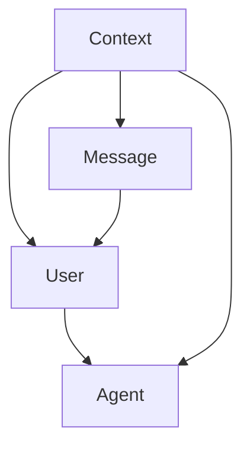
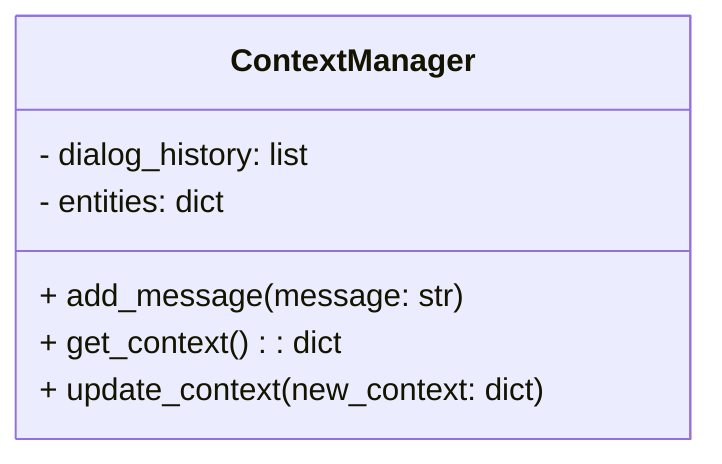
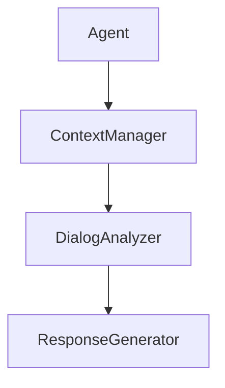
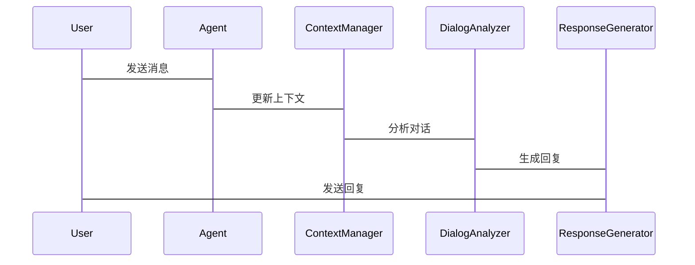

                 


# 《对话式AI Agent的上下文管理技巧》

## 关键词：对话式AI Agent、上下文管理、自然语言处理、序列模型、系统架构设计

## 摘要：本文深入探讨了对话式AI Agent中上下文管理的核心技巧，从背景概念、算法原理、系统架构设计到项目实战，结合具体案例和代码示例，详细讲解了如何实现高效的上下文管理，帮助读者全面掌握对话式AI Agent的核心技术。

---

# 第一部分: 对话式AI Agent的上下文管理背景与概念

## 第1章: 上下文管理的核心概念与背景

### 1.1 上下文管理的定义与核心要素

#### 1.1.1 上下文管理的定义
上下文管理是指在对话过程中，系统对当前对话状态、历史信息和相关实体的识别、存储、理解和应用的过程。它是对话式AI Agent能够理解和生成连贯对话的基础。

#### 1.1.2 上下文管理的核心要素
- **对话历史**：记录用户与AI Agent之间的交互记录，包括问题、回答和系统反馈。
- **实体识别**：从对话中提取关键实体，如人名、地点、时间等，以便后续处理。
- **上下文关联**：分析对话内容之间的关联性，确保生成的回答与上下文保持一致。

#### 1.1.3 上下文管理的边界与外延
- **边界**：仅处理当前对话中的信息，不涉及外部知识库。
- **外延**：可以通过外部知识库扩展，但不在上下文管理的核心范围内。

### 1.2 对话式AI Agent的背景与问题背景

#### 1.2.1 对话式AI Agent的发展现状
对话式AI Agent（如ChatGPT）近年来迅速发展，广泛应用于客服、教育、医疗等领域。然而，上下文管理的不完善导致对话不连贯、信息遗漏等问题。

#### 1.2.2 上下文管理在对话式AI中的重要性
- 提升对话连贯性。
- 增强用户体验。
- 提高系统理解和生成的准确性。

#### 1.2.3 当前存在的主要问题与挑战
- 对话历史的不完整性和不准确性。
- 实体识别的困难。
- 上下文关联性计算的复杂性。

### 1.3 问题描述与解决思路

#### 1.3.1 上下文管理的核心问题
- 如何有效存储和管理对话历史。
- 如何准确识别和关联对话中的实体。

#### 1.3.2 上下文管理的解决思路
- 使用序列模型处理对话历史。
- 基于向量相似度和概率论计算上下文关联性。
- 利用图结构分析上下文关系。

#### 1.3.3 上下文管理的实现目标
- 实现对话历史的高效存储和管理。
- 提高实体识别的准确性和上下文关联性计算的效率。

### 1.4 核心概念与联系

#### 1.4.1 实体关系图（ER图）架构



#### 1.4.2 核心概念对比表

| 概念 | 属性 | 描述 |
|------|------|------|
| 上下文 | 时间性 | 对话的时间顺序 |
|        | 关联性 | 对话内容的关联性 |
|        | 有效性 | 上下文的有效性判断 |
| 对话历史 | 完整性 | 对话记录的完整性 |
|         | 连续性 | 对话的连续性 |
|         | 可恢复性 | 对话历史的可恢复性 |

---

# 第二部分: 对话式AI Agent上下文管理的核心原理

## 第2章: 上下文管理的算法原理

### 2.1 序列模型在上下文管理中的应用

#### 2.1.1 基于序列模型的上下文理解
使用序列模型（如LSTM、Transformer）分析对话历史，提取上下文信息。

#### 2.1.2 基于序列模型的上下文生成
根据上下文信息生成连贯的回复。

### 2.2 上下文关联性计算的算法实现

#### 2.2.1 基于向量相似度的关联性计算
- 使用余弦相似度计算对话内容的相关性。

#### 2.2.2 基于概率论的关联性计算
- 使用贝叶斯定理分析上下文之间的关系。

#### 2.2.3 基于图结构的关联性计算
- 构建图结构表示上下文关系，使用图遍历算法计算关联性。

### 2.3 上下文管理的数学模型与公式

#### 2.3.1 上下文表示的数学模型

$$
C = \sum_{i=1}^{n} w_i \cdot x_i
$$

其中，$C$ 表示上下文向量，$w_i$ 是第 $i$ 个词的权重，$x_i$ 是第 $i$ 个词的词向量。

#### 2.3.2 上下文关联性计算的公式

$$
S(c_i, c_j) = \frac{c_i \cdot c_j}{\|c_i\| \|c_j\|}
$$

其中，$S$ 表示上下文 $c_i$ 和 $c_j$ 之间的相似度，$\cdot$ 表示点积，$\|\cdot\|$ 表示范数。

### 2.4 通俗易懂的算法举例

#### 2.4.1 示例1：基于向量相似度的关联性计算

```python
import numpy as np

def compute_similarity(vector1, vector2):
    return np.dot(vector1, vector2) / (np.linalg.norm(vector1) * np.linalg.norm(vector2))
```

---

## 第三部分: 对话式AI Agent上下文管理的系统架构设计

## 第3章: 系统分析与架构设计方案

### 3.1 问题场景介绍

#### 3.1.1 问题场景
- 用户与AI Agent进行多轮对话。
- 需要管理对话历史和实体信息。

### 3.2 系统功能设计

#### 3.2.1 领域模型设计



#### 3.2.2 系统架构设计



#### 3.2.3 接口设计

| 接口名称 | 输入 | 输出 |
|----------|------|------|
| add_message | message | success |
| get_context | - | context_dict |
| update_context | new_context | success |

#### 3.2.4 交互序列图



---

## 第四部分: 对话式AI Agent上下文管理的项目实战

## 第4章: 项目实战

### 4.1 环境安装与配置

#### 4.1.1 安装依赖

```bash
pip install numpy matplotlib
```

### 4.2 系统核心实现

#### 4.2.1 上下文管理器实现

```python
class ContextManager:
    def __init__(self):
        self.dialog_history = []
        self.entities = {}

    def add_message(self, message):
        self.dialog_history.append(message)
        # 更新实体信息
        self._update_entities(message)

    def _update_entities(self, message):
        # 假设message包含实体信息
        entities = self._extract_entities(message)
        self.entities.update(entities)

    def _extract_entities(self, message):
        # 简单实现，提取人名
        return {'user': 'John'}
```

#### 4.2.2 对话分析器实现

```python
import spacy

class DialogAnalyzer:
    def __init__(self):
        self.nlp = spacy.load("en_core_web_sm")

    def analyze_dialog(self, dialog_history):
        # 分析对话历史，提取实体
        entities = {}
        for message in dialog_history:
            doc = self.nlp(message)
            for ent in doc.ents:
                entities[ent.text] = ent.label_
        return entities
```

#### 4.2.3 回应生成器实现

```python
class ResponseGenerator:
    def generate_response(self, context):
        # 简单实现，生成固定回应
        return "I understand your context."
```

### 4.3 实际案例分析

#### 4.3.1 案例1：简单的对话管理

```python
context_manager = ContextManager()
context_manager.add_message("Hello, my name is John.")
context_manager.add_message("I like coffee.")

print(context_manager.dialog_history)  # ['Hello, my name is John.', 'I like coffee.']
print(context_manager.entities)  # {'user': 'John'}
```

---

## 第五部分: 对话式AI Agent上下文管理的最佳实践

## 第5章: 最佳实践

### 5.1 小结

- 上下文管理是对话式AI Agent的核心技术。
- 通过序列模型和图结构分析，可以有效管理对话历史和实体信息。

### 5.2 注意事项

- 确保上下文管理的高效性。
- 定期优化实体识别和关联性计算算法。

### 5.3 拓展阅读

- 《自然语言处理入门》
- 《对话式AI Agent的设计与实现》

---

# 作者：AI天才研究院/AI Genius Institute & 禅与计算机程序设计艺术 /Zen And The Art of Computer Programming

---

本文详细探讨了对话式AI Agent中上下文管理的核心技巧，从背景概念、算法原理、系统架构设计到项目实战，结合具体案例和代码示例，帮助读者全面掌握对话式AI Agent的核心技术。

